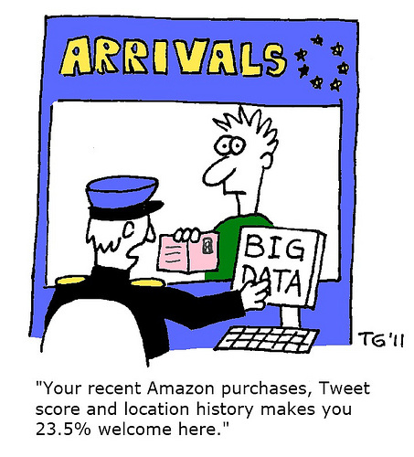
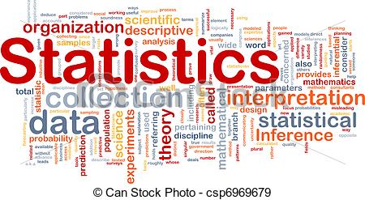
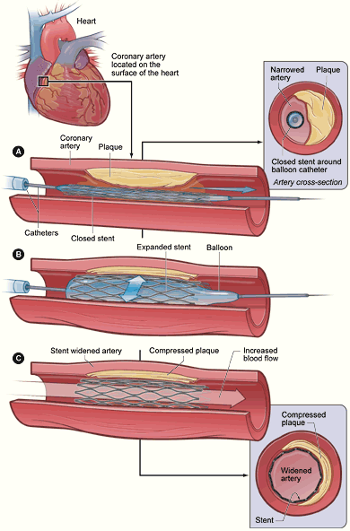
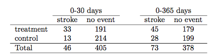
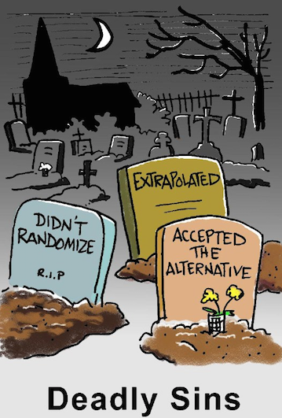
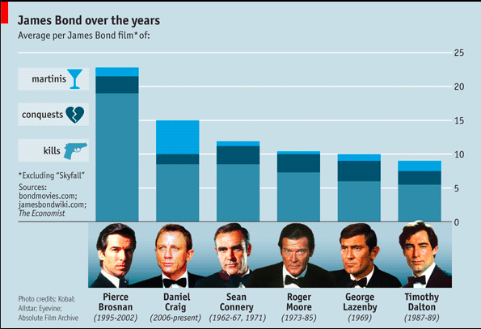
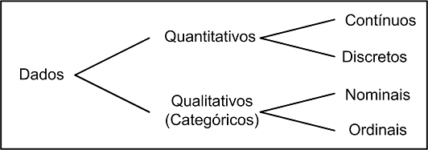
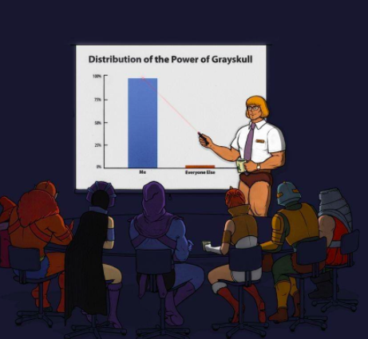

# Introdução

## 

<center>

</center>

[Chaves e as Estatísticas](https://www.youtube.com/watch?v=VC1NmtmF4zE)

## 

<center>

</center>


## Entendendo sobre Variabilidade

<center>
 
</center>


## Entendendo sobre Variabilidade

<center>

</center>


## Introdução {.build}

 No livro [Mankind in the Making](http://www.goodreads.com/book/show/1940169.Mankind_in_the_Making), de 1903, [H.G. Wells](http://pt.wikipedia.org/wiki/H._G._Wells) [escreveu](http://www.statschat.org.nz/2012/08/13/what-wells-actually-said-in-context/):   

>... e não estamos muito longe do tempo em que se entenderá que, para exercermos a cidadania de maneira eficiente, será tão necessário saber calcular e pensar em médias, máximos e mínimos, quanto é agora necessário saber ler e escrever.


## Introdução{.build}

Jornais e revistas estão repletos de informações obtidas através de pesquisas de opinião, pesquisas médicas, estudos econômicos, estudos ambientais.

> Números e conclusões tiradas a partir deles são cada vez mais comuns no dia-a-dia.

> No meio de tantos dados e informações, o que levar em conta e o que descartar?

## Introdução{.build}

* Como avaliar evidências sobre aquecimento global?

> * Celulares fazem mal à saúde?

> * Qual sua chance de ganhar a loteria?

> * Há preconceito contra as mulheres para cargos de chefia?

> * Como analisar se um tratamento  está realmente funcionando?

> * Como predizer o valor de venda de uma casa?

> Na era da internet e do "Big Data", entender estatística é essencial.


## Introdução

<center>

</center>


## Introdução {.build}

> * Em 1920, estudando dados de produtividade de cultivo, [Ronald Fisher](http://en.wikipedia.org/wiki/Ronald_Fisher) formou a base da estatística moderna.

> * Em 1925, Fisher escreveu o livro [Statistical Methods for Research Workers](http://en.wikipedia.org/wiki/Statistical_Methods_for_Research_Workers) para biólogos com problemas estatísticos similares aos que ele encontrou trabalhando com experimentos agrícolas em [Rothamsted](http://www.rothamsted.ac.uk).

> * Tópicos do livro: teste-t, correlação, teste qui-quadrado, análise de variância e regressão. 

* Ainda hoje, estes são os principais tópicos de cursos de metodologia estatística. 

## Introdução {.build}

<center>

</center>

A estatística é um conjunto de técnicas que permite, de forma sistemática, organizar, descrever, analisar e interpretar dados oriundos de estudos ou experimentos, realizados em qualquer área do conhecimento.
            
            
Estatística é a arte do aprendizado através de dados. 


## Por que usar métodos estatísticos? {.build}


> Três aspectos principais da estatística:


> * **Planejamento**: planejar como obter os dados para responder às perguntas de interesse.

> * **Descrição**: resumir os dados obtidos.

> * **Inferência**: tomar decisões e fazer predições baseando-se nos dados.

 
## Por que usar métodos estatísticos? {.build}
   
> Os tópicos de estudo de um certo pesquisador são tão diversos quanto as perguntas de interesse.

> No entanto, muitas vezes esses estudos podem ser realizados com técnicas simples de amostragem, análise de dados e conceitos fundamentais de inferência estatística.

## Estudo de Caso: stents e prevenção de infarto {.build}

> Problema comum em medicina: como avaliar a eficácia de um procedimento médico?

> [Estudo](http://www.nejm.org/doi/full/10.1056/NEJMoa1105335): [stents](http://www.nhlbi.nih.gov/health/health-topics/topics/stents) são eficazes no tratamento de pacientes com risco de infarto?

> Stents são usados para a recuperação de pacientes que já sofreram infarto.

<center>
> 
</center>

## Estudo de Caso: stents e prevenção de infarto {.build}

> Os pesquisadores do estudo investigaram se havia benefícios também para pacientes com risco de infarto.

> * Pergunta de interesse: 

> O uso de stent reduz o risco de infarto?

> * Os pesquisadores coletaram dados de 451 pacientes com risco de infarto que se voluntariaram para o estudo.

> Cada paciente foi alocado aleatoriamente em um dos grupos:

> * **Grupo de Tratamento** - paciente recebe stent e medicação.

> * **Grupo Controle** - paciente recebe a mesma medicação do grupo tratamento, mas não recebe stent.

## Estudo de Caso: stents e prevenção de infarto {.build}

> Cada paciente foi avaliado em duas ocasiões: primeiros 30 dias e após 1 ano.

<center></center>

> Avaliar cada paciente individualmente desta planilha de dados é eficaz?

> Como poderíamos resumir?

## Estudo de Caso: stents e prevenção de infarto {.build}

<center></center>

> 33 pacientes do grupo tratamento tiveram um infarto durante os primeiros 30 dias.

> Dentre os 224 pacientes do grupo tratamento, 45 sofreram infarto durante o primeiro ano.

> Qual a proporção de pacientes do grupo tratamento que sofreram infarto durante o primeiro ano?

> $45/224=`r round(45/224,2)` = `r round(45/224,2)*100`\%$


```{r,echo=FALSE,message=FALSE,eval=FALSE}

trinta <- data.frame(Grupo=c("Tratamento","Controle","Tratamento","Controle"),Infarto=c("sim","sim","não","não"),Freq=c(33,13,191,214))
trintaLong <- data.frame(Grupo=rep(c("Tratamento","Tratamento","Controle","Controle"),times=c(33,191,13,214)),Infarto=rep(c("sim","não","sim","não"),times=c(33,191,13,214)))


library(ggplot2)

g<-ggplot(trintaLong,aes(x = Grupo,fill=Infarto)) + 
  geom_bar(position=position_dodge(),aes(y = ..count..)) + 
  ylab("Número de Pacientes")+
  scale_x_discrete("Grupo") +
  scale_fill_discrete(name ="Infartou?")+theme(axis.text.x = element_text(face="bold", hjust = 1,size=12,color="black"),axis.text.y = element_text(face="bold", hjust = 1,size=12,color="black"))
print(g)

g<-ggplot(trintaLong,aes(x = Grupo,fill=Infarto)) + 
  geom_bar(position="fill") + 
  ylab("Proporção de Pacientes")+
  scale_x_discrete("Grupo") +
  scale_fill_discrete(name ="Infartou?")+theme(axis.text.x = element_text(face="bold", hjust = 1,size=12,color="black"),axis.text.y = element_text(face="bold", hjust = 1,size=12,color="black"))
print(g)
```


  
## Estudo de Caso: stents e prevenção de infarto {.build}

<center></center>

> Podemos calcular **estatísticas sumárias** a partir da tabela.

> **Estatística Sumária**: número obtido a partir de informações dos dados coletados para resumi-los.

> Proporção de pacientes do grupo tratamento que sofreram infarto: $45/224=`r round(45/224,2)` = `r round(45/224,2)*100`\%$

> Proporção de pacientes do grupo controle que sofreram infarto: $28/227=`r round(28/227,2)` = `r round(28/227,2)*100`\%$

## Estudo de Caso: uso de stents e prevenção de infarto {.build}

> No grupo tratamento, temos 8% a mais de pacientes que sofreram de infarto.

> Isto está de acordo com a expectativa dos pesquisadores do estudo? (relembre a pergunta de interesse)

> 8% é uma diferença *considerável*? 

> Uma diferença de 8% poderia acontecer ao acaso, mesmo que os dois tratamentos na verdade oferecessem o mesmo risco de infarto?

> Utilizando metodologia estatística, os pesquisadores chegaram à conclusão de que stents são prejudiciais para pacientes com risco de infarto.

## Estudo de Caso: stents e prevenção de infarto {.build}
<div class="red2">
**CUIDADO!**

</div>


> Não podemos generalizar os resultados do estudo para todo tipo de paciente e todo tipo de stent.

<center></center>

# Estatística Descritiva: Introdução

##  {.build}
> Estatística descritiva se refere a métodos para resumir dados.

> Gráficos, tabelas, médias, porcentagens,...

<center></center>


## Exemplo: Dados do Censo

É mais simples olharmos gráficos ou 35.723.254 questionários?


[http://www.censo2010.ibge.gov.br](http://www.censo2010.ibge.gov.br)

# Estatística Descritiva: Estrutura básica de dados

## Estrutura dos dados

Para que possamos resumir os dados, é importante primeiramente entender como eles são organizados e também os diversos tipos de cada variável.

<center>

</center>

## Exemplo: spam

<center>

</center>

Conjunto de dados: informação de 50 emails recebidos.

## Exemplo: spam

Primeiras linhas do conjunto de dados (ou matriz de dados):

```{r,echo=FALSE}
dados <- read.delim("email50.txt",header=TRUE)
dados <- dados[,c("spam","num_char","line_breaks","format","number")]
library(knitr)
kable(dados)
```

## Exemplo: spam {.build}

> Cada linha representa um email recebido.

> Colunas:

> * `r colnames(dados)[1]`: 1 se spam e 0 caso contrário.

> * `r colnames(dados)[2]`: número de caracteres no email.

> * `r colnames(dados)[3]`: número de quebras de linha no email.

> * `r colnames(dados)[4]`: 1 se formato é HTML, 0 caso contrário.

> * `r colnames(dados)[5]`: indica se o email não continha nenhum número (none), um número pequeno (small) ou um número grande (big).

## Tipos de variável

* Variável é uma condição ou característica de um elemento de estudo.

* Pode assumir valores diferentes em diferentes elementos.

* Peso, altura, curso, são exemplos de variáveis: para cada
pessoa, os valores mudam.


## Tipos de variável



## Tipos de variável{.build}

> * **Qualitativa**
>      + Nominal: Não existe ordenação (ex: sexo, estado civil, profissão)
>      + Ordinal: Existe uma certa ordem (ex: escolaridade, estágio da doença, classe social)

> * **Quantitativa**
>      + Discreta: os valores possíveis formam um conjunto finito ou enumerável (ex: número de filhos)
>      + Contínua: os valores possíveis estão dentro de um intervalo, aberto ou fechado, dos números reais (ex: peso, altura, salário)

## Tipos de variável {.build}

Coletamos três variáveis entre os alunos da classe:

* Número de irmãos
* Altura
* Se já fez algum curso de estatística anteriormente

> Qual o tipo de cada variável?


# Resumindo Dados Categóricos: Frequências e Proporções

## Dados categóricos{.build}

> O primeiro passo para resumir numericamente os dados de uma variável é olhar para todos os valores possíveis e contar quantas vezes cada um aparece.

> **Exemplo**: No conjunto de dados `spam`, temos a variável categórica `number` que indica se no conteúdo do email encontramos números e se eles eram grandes ou pequenos.


> Podemos fazer uma **Tabela de frequência**, ou seja, simplesmente contar quantos foram os emails em cada categoria da variável `number`:

> 

```{r,echo=FALSE}
dados <- read.delim("email.txt",header=TRUE)
dados <- dados[,c("spam","num_char","line_breaks","format","number")]
dados$spam1 <- ifelse(dados$spam==0,"not spam","spam")

addmargins(table(dados$number))

#addmargins(table(dados$spam1,dados$number))

```


## Exemplo: Doctor Who
Qual ator atuou no maior número de episódios da série [Doctor Who](https://pt.wikipedia.org/wiki/Doctor_Who)?

<center></center> 

## Exemplo: Doctor Who
Informações do site IMDB ([1963-1989](http://www.imdb.com/title/tt0056751/fullcredits?ref_=tt_cl_sm#cast), [2005-2015](http://www.imdb.com/title/tt0436992/fullcredits?ref_=tt_cl_sm#cast)): tabela de frequências e proporções:
```{r,echo=FALSE}
# http://4dpiecharts.com/2013/08/03/the-tenure-of-doctor-who-incarnations/
# http://www.imdb.com/title/tt0436992/fullcredits?ref_=tt_cl_sm#cast

whos <- data.frame(
  doctor = c(
    "William Hartnell",
    "Patrick Troughton",
    "Jon Pertwee",
    "Tom Baker",
    "Peter Davison",
    "Colin Baker",
    "Sylvester McCoy",
    "Christopher Ecclestone",
    "David Tennant",
    "Matt Smith",
    "Peter Capaldi"
  ),
  n_episodes = c(
    136,
    127,
    129,
    173,
    70,
    35,
    42,
    20,
    52,
    51,
    29
  ),
  stringsAsFactors = FALSE
)
whos$doctor <- factor(whos$doctor, levels = whos$doctor)

whos$prop <- round(whos$n_episodes/sum(whos$n_episodes),2)

rownames(whos) <- NULL
colnames(whos) <- c("Ator","Frequência","Proporção")
whos

```

# Resumindo Dados Categóricos: Representação Gráfica

## Gráfico de Barras



## Exemplo: Doctor Who

Gráfico de barras das frequências

```{r,echo=FALSE}

library(ggplot2)
colnames(whos) <- c("doctor","n_episodes","prop")

ggplot(whos, aes(doctor, n_episodes)) +
  geom_bar(stat = "identity") +
  coord_flip() + ylab("Número de episódios") +xlab("Atores")+theme(axis.text.x = element_text(face="bold", hjust = 1,size=12,color="black"),axis.text.y = element_text(face="bold", hjust = 1,size=12,color="black"))
```

## Exemplo: Doctor Who

Gráfico de barras das proporções

```{r,echo=FALSE}

ggplot(whos, aes(doctor, prop)) +
  geom_bar(stat = "identity") +
  coord_flip() + ylab("Proporção") + xlab("Atores")+theme(axis.text.x = element_text(face="bold", hjust = 1,size=12,color="black"),axis.text.y = element_text(face="bold", hjust = 1,size=12,color="black"))

```


# Resumindo Dados Quantitativos

## Descrevendo Dados Quantitativos{.build}

> Como estudar a distribuição de frequências de uma variável quantitativa?

> **Quantitativa Discreta:** listar todos os valores possíveis nos dados e contar quantas vezes cada valor ocorre.

> **Exemplo: Licença Médica**

> Os dados a seguir representam o número de dias de licença médica de 50 funcionários de uma fábrica nas últimas 6 semanas:

```{r,echo=FALSE}
dias <- c(2,2,0,0,5,8,3,4,1,0,0,7,1,7,1,5,4,0,4,0,1,8,9,7,0, 1,7,2,5,5,4,3,3,0,0,2,5,1,3,0,1,0,2,4,5,0,5,7,5,1)

dias
```

## Exemplo: Licença Médica

Como o número de valores distintos nos dados é pequeno, podemos usar uma tabela para apresentar a frequência de cada valor:

```{r,echo=FALSE}

freq <- as.data.frame(table(dias))
freq$prop <- round(freq$Freq/length(dias),2)
freq1 <- freq
colnames(freq1) <- c("Dias de licença","Frequência","Proporção")
rownames(freq1)<- NULL
freq1
```

## Exemplo: Licença Médica

```{r,echo=FALSE}
#barplot(freq$Freq, main="Licença Médica", xlab="Dias",  
#   ylab="Frequência",names.arg=freq$dias,col="lightblue")

#http://docs.ggplot2.org/0.9.3.1/geom_bar.html
ggplot(freq, aes(dias, Freq)) +
  geom_bar(stat = "identity",fill="blue") + ylab("Frequência") + xlab("Dias de Licença")+theme(axis.text.x = element_text(face="bold", hjust = 1,size=12,color="black"),axis.text.y = element_text(face="bold", hjust = 1,size=12,color="black"))
```

## Exemplo: Licença Médica

```{r,echo=FALSE}
#Prop <- freq$Freq/length(dias)
#barplot(Prop, main="Licença Médica", xlab="Dias",  
#   ylab="Proporção",names.arg=freq$dias,col="lightblue")

ggplot(freq, aes(dias, prop)) +
  geom_bar(stat = "identity",fill="blue") + ylab("Proporção") + xlab("Dias de Licença")+theme(axis.text.x = element_text(face="bold", hjust = 1,size=12,color="black"),axis.text.y = element_text(face="bold", hjust = 1,size=12,color="black"))

```

## Descrevendo Dados Quantitativos{.build}

Como estudar a distribuição de frequências de uma variável quantitativa?

> **Quantitativa Contínua:** listar todos os valores possíveis nos dados e contar quantas vezes cada valor ocorre??? É eficiente?


## Histograma{.build}

> * Ordene os dados do menor para o maior.
> * Escolha intervalos de maneira que cada observação possa ser incluída em exatamente um deles.
> * Neste curso: os intervalos são abertos à esquerda e fechados à direita $(a,b]$.
> * Construa uma tabela de frequências
> * Desenhe o gráfico: a altura corresponde à frequência do intervalo.

## Exemplo: QI{.build}

Os dados a seguir representam o QI de 40 crianças de 12 anos de idade:

```{r,echo=FALSE}
QI <- c(114, 122, 103, 118, 99, 105, 134, 125, 117, 106, 109, 104, 111, 127, 133, 111, 117, 103, 120, 98, 100, 130, 141, 119, 128, 106, 109, 115, 113, 121, 100, 130, 125, 117, 119, 113, 104, 108, 110, 102)

QI
```

> Ordenando:

```{r,echo=FALSE}
sort(QI)
```

## Exemplo: QI{.build}

Dados ordenados:

```{r,echo=FALSE}
sort(QI)
```

> Intervalos:

 * $(95,100]$: `r sum(QI>95 & QI<=100)`  $\;\;\;\;\;$ $(100,105]$: `r sum(QI>100 & QI<=105)`
 * $(105,110]$: `r sum(QI>105 & QI<=110)` $\;\;\;\;\;$ $(110,115]$: `r sum(QI>110 & QI<=115)`
 * $(115,120]$: `r sum(QI>115 & QI<=120)` $\;\;\;\;\;$ $(120,125]$: `r sum(QI>120 & QI<=125)`
 * $(125,130]$: `r sum(QI>125 & QI<=130)` $\;\;\;\;\;$ $(130,135]$: `r sum(QI>130 & QI<=135)`
 * $(135,140]$: `r sum(QI>135 & QI<=140)` $\;\;\;\;\;$ $(140,145]$: `r sum(QI>140 & QI<=145)`

## Exemplo: QI

```{r,echo=FALSE}
dadosQI <- data.frame(QI = QI)
hist(QI, col="lightblue", xlab="QI", ylab="Frequência", main=" ", cex.lab=1.5, cex.axis=1.5)
```


## Ramo-e-folhas {.build}

> O ramo-e-folhas representa graficamente os dados sem perder nenhuma informação

> Cada valor é dividido em duas partes: a primeira (ramo) é colocada à esquerda da linha vertical, e a segunda (folhas) à direita.

## Exemplo: QI {.smaller}
Dados:
```{r,echo=FALSE}
QI
```

Ramo-e-folhas: 
```{r,echo=FALSE}
stem(QI)
```

## Exemplo: Notas dos Alunos{.build}

Um professor apresenta à classe as notas do exame usando um gráfico de ramo-e-folhas.

```{r,echo=FALSE}
notas <- c(65,68,68,70,71,71,73,76,77,77,79,81,82,82,83,83,83,84,86,87,87,87,88,89,90,91,91,92,93,94,94,95,98)
stem(notas,scale=0.5)
```

> Qual o total de alunos?

> Qual a menor nota?

> Qual a maior nota?

## Exemplo: Notas dos Alunos

```{r,echo=FALSE}
hist(notas, col="lightblue",xlab="Notas",ylab="Frequência",main=" ",nclass=4,cex.axis=1.5,cex.lab=1.5)
```

## Ramos-e-Folhas x Histograma

Qual o tipo de informação você obtém através de um gráfico de ramo-e-folhas mas não não através de um histograma?

## Dados do seu Facebook

No link [http://wolfr.am/OvitOo](http://wolfr.am/OvitOo) você pode obter diversos gráficos descritivos usando informações do seu perfil do Facebook.

## Leitura

* [OpenIntro](https://www.openintro.org/stat/textbook.php): seções 1.1, 1.2, 1.6, 1.7
* [Ross](http://www.sciencedirect.com/science/book/9780123743886): seções 1.1, 1.2, 1.3, 1.4, 2.1, 2.2, 2.3, 2.4

##

Slides produzidos pelos professores:

* Samara Kiihl

* Tatiana Benaglia

* Benilton Carvalho