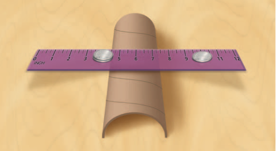
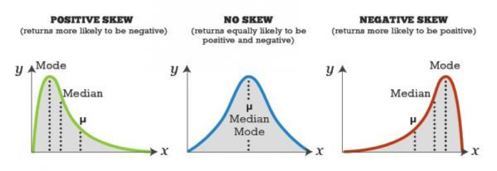

# Estatísticas Sumárias: resumindo dados

## Introdução{.build}

> Vimos na aula anterior como usar gráficos e tabelas para resumir os dados.

> Podemos também usar **estatísticas**: quantidades numéricas calculadas a partir dos dados.

> Por exemplo, podemos estar interessados em encontrar qual seria um valor "típico"  do conjunto de dados.

> Podemos então usar uma estatística que descreva o centro da distribuição dos dados.

> **Objetivo**: resumir os dados, através de valores que representem o conjunto de dados em relação à alguma característica (posição, dispersão).


# Medidas de Posição Central

## Média Aritmética{.build}

> Se $x_1, x_2, \ldots, x_n$ são as $n$ observações, a média é:

$$\bar{x}=\frac{1}{n}\sum_{i=1}^nx_i\,.$$

> A média pode ser interpretada como o ponto de equilíbrio de uma distribuição.

<center></center>


## Exemplo: Cereais matinais
<center>

</center>

## Exemplo: Cereais matinais
 
Porção de 30g:
```{r,echo=FALSE}
# library(printr)
# 30 gramas
cereais <- data.frame(Cereal=c("Sucrilhos","All Bran","Nesfit","Nescau","Snow","Crunch","Moça","Fibra Mais","Froot Loops"),Calorias=c(109,81,102,115,113,119,113,84,113),Carboidratos=c(26,13.5,21,23,25,23,25,15,25))
cereais
```

## Exemplo: Cereais matinais
<center>
```{r, echo=FALSE, fig.height=4, fig.width=8}
stripchart(cereais$Calorias, xlab="Calorias (porção 30g)", method="stack", col="blue", pch=19)
media <- mean(cereais$Calorias)
```
</center>

## Exemplo: Cereais matinais{.build}

> $x_i$: calorias do cereal $i$.

> $$\bar{x}=\frac{1}{n}\sum_{i=1}^nx_i=\frac{1}{9}\sum_{i=1}^9x_i=`r round(mean(cereais$Calorias),2)`$$
> <center>
```{r,echo=FALSE, fig.height=3.3, fig.width=8}
stripchart(cereais$Calorias,xlab="Calorias (porção 30g)", method="stack", col="blue", 
lwd=2, pch=19)
media <- mean(cereais$Calorias)
abline(v=media, col="red", lwd=2)
```
</center>

## Mediana{.build}

A mediana é o valor que deixa 50% das observações abaixo dele e 50% acima.

> Determinando a mediana:

> * Ordene as $n$ observações.

> * Se $n$ é ímpar, a mediana é o valor do meio, na sequência ordenada.

> * Se $n$ é par, a mediana é a média aritmética das duas observações  que caem no meio da sequência ordenada.


## Exemplo: Cereais matinais{.build}

Calorias dos 9 cereais:
```{r,echo=FALSE}
cereais$Calorias
```

> Ordenando:
```{r,echo=FALSE}
sort(cereais$Calorias)
```
> Mediana é `r median(cereais$Calorias)`.

## Moda{.build}

A moda é o valor mais frequente.

> Calorias dos 9 cereais:
```{r, echo=FALSE}
cereais$Calorias
```

> Tabela de frequências:
```{r, echo=FALSE}
table(cereais$Calorias)
```

Portanto a moda de calorias dos cereias é 113.

## Exemplo: Emissão de $CO_2$ {.smaller}

Emissão per capita (em toneladas) para 8 países, em 2009 ([http://data.worldbank.org](http://data.worldbank.org)):

País | Emissão $CO_2$ | País | Emissão $CO_2$   
---- | -------------- | ---- | --------------
China | 5,8 | Brazil | 1,9
Índia | 1,7 | Rússia | 11,1 
EUA   | 17,3 | Paquistão | 0,9
Indonésia | 1,9 | Bangaladesh | 0,3

<center>
```{r, echo=FALSE, fig.height=2.5, fig.width=8}
par(mar=c(5.1,4.1,1.1,2.1))
co2 <- c(5.8,1.7,17.3,1.9,1.9,11.1,0.9,0.3)
stripchart(co2, xlab="Emissão de CO2 per capita (em toneladas)", col="blue", pch=19)
```
</center>

## Exemplo: Emissão de $CO_2${.build}

$\bar{x}=\frac{1}{8}(5,8+1,7+17,3+1,9+1,9+11,1+0,9+0,3)\approx`r round(mean(co2),2)`$

> Ordenando:
```{r,echo=FALSE}
sort(co2)
```

> Mediana é `r median(co2)`.

## Exemplo: Emissão de $CO_2${.build}

A mediana é bem menor do que a média.

> Se desconsiderarmos os EUA:

```{r,echo=FALSE}
co2 <- c(5.8,1.7,1.9,1.9,11.1,0.9,0.3)
co2
```


$\bar{x}=\frac{1}{7}(5,8+1,7+1,9+1,9+11,1+0,9+0,3)\approx `r  round(mean(co2),2)`$

> Ordenando:
```{r,echo=FALSE}
sort(co2)
```

> Mediana é `r median(co2)`.

> Mediana é menos afetada por valores muito extremos (muito diferentes do resto das observações).


## Exemplo: número de casamentos

Total de vezes que casou ($x_{i}$) | Freq. (mulheres) | Freq. (homens) 
---------------------------------- | ---------------- | --------------
0 | 5861 | 7074
1 | 2773 | 1561
2 | 105 | 43
Total | 8739 | 8678

Qual medida de posição você usaria para apresentar a diferença entre homens e mulheres?


Fonte: [http://www.census.gov/prod/2002pubs/p70-80.pdf](http://www.census.gov/prod/2002pubs/p70-80.pdf)


## Exemplo: número de casamentos{.build}

A moda entre os homens é:

> $0$.

A moda entre as mulheres é:

> $0$. 

> Para as mulheres, a amostra ordenada é:
$$\underbrace{0\,0\,0\,\ldots0}_{\mbox{5861 0's}}\quad \underbrace{1\,1\,1\,\ldots1}_{\mbox{2773 1's}} \quad \underbrace{2\,2\,2\,\ldots2}_{\mbox{105 2's}}$$

> Como $n=8739$ é ímpar, a observaçãoo central está na posição $(1+8739)/2=4370$. A observação 4370 é 0, portanto a mediana é 0 para as mulheres.  Similarmente, para os homens, a mediana é 0.


## Exemplo: número de casamentos{.build}

Média entre as mulheres:


$$\bar{x}=\frac{0\times 5861+1\times 2773+2\times 105}{8739}=0,34$$

Média entre os homens: $\bar{x}=0,19$.

Para dados discretos com poucos valores diferentes, a mediana ignora muita informação.

## Exemplo: número de casamentos{.build}

No entanto, como neste caso temos apenas os valores 0, 1 e 2, podemos apresentar os dados usando gráficos de barra.


```{r,echo=FALSE,message=FALSE}
casamento <- data.frame(Sexo=rep(c("Feminino","Masculino"),times=c(8739,8678)),Vezes=rep(c(0,1,2,0,1,2),times=c(5861,2773,105,7074,1561,43)))
casamento$Vezes <- as.factor(casamento$Vezes)

library(ggplot2)

g<-ggplot(casamento,aes(x = Sexo,fill=Vezes)) + 
  geom_bar(position=position_dodge(),aes(y = ..count..)) + 
  ylab("Número de Pessoas")+
  scale_x_discrete("Sexo") +
  scale_fill_discrete(name ="Vezes que casou")+theme(axis.text.x = element_text(face="bold", hjust = 1,size=12,color="black"),axis.text.y = element_text(face="bold", hjust = 1,size=12,color="black"))
print(g)
```

## Exemplo: número de casamentos

```{r,echo=FALSE}
#g<-ggplot(casamento,aes(x = Sexo,fill=Vezes)) + 
#  geom_bar(position="fill") + 
#  ylab("Proporção de Pessoas")+
#  scale_x_discrete("Sexo") +
#  scale_fill_discrete(name ="Vezes que casou")+theme(axis.text.x = element_text(face="bold", hjust = 1,size=12,color="black"),axis.text.y = element_text(face="bold", hjust = 1,size=12,color="black"))
#print(g)

casamento1 <- as.data.frame(prop.table(table(casamento$Sexo,casamento$Vezes),1))
colnames(casamento1) <- c("Sexo","Vezes","Prop")
g<-ggplot(casamento1,aes(x = Sexo,y=Prop,fill=Vezes)) + 
  geom_bar(stat="identity",position='dodge') + 
  ylab("Proporção de Pessoas")+
  scale_x_discrete("Sexo") +
  scale_fill_discrete(name ="Vezes que casou")+theme(axis.text.x = element_text(face="bold", hjust = 1,size=12,color="black"),axis.text.y = element_text(face="bold", hjust = 1,size=12,color="black"))
print(g)

```

## Mediana é resistente a observações discrepantes{.build}

Considere os três conjuntos de dados abaixo:

$$A: 8,9,10,11,12$$

$$B: 8,9,10,11,100$$

$$C: 8,9,10,11,1000$$

>
Média de $A$: 10.
Mediana de $A$: 10.

> 
Média de $B$: 27,6.
Mediana de $B$: 10.

>
Média de $C$: 207,6.
Mediana de $C$: 10.

## Exemplo: Transporte{.build}

Uma empresária cuja empresa está localizada na Av. Paulista, em São Paulo, está preocupada com a quantidade de gasolina gasta pelos seus funcionários. Ela quer promover o uso de transporte público entre seus funcionários. Ela decide investigar a extensão, em km, do trajeto percorrido por cada funcionário caso usassem transporte público durante um dia típico.

> Para seus 10 funcionários, os valores são:

$$1,1,4,1,1,1,10,1,6,1$$

> Encontre a média, a mediana e a moda.

> Média é 2,7. 

> Ordenando: 1,1,1,1,__1,1__,1,4,6,10.

> Mediana é 1.
> Moda é 1.

##  Exemplo: Transporte{.build}

A empresária acabou de contratar um novo funcionário. Ele percorre 90 km em transporte público. Recalcule a média e a mediana.

$$1,1,4,1,1,1,10,1,6,1,90$$

> Ordenada: 1,1,1,1,1,**1**,1,4,6,10,90.

> Mediana é 1.

> Média é 10,64

> Qual medida de posição representa melhor a distância do grupo de funcionários?


## Exemplo: Acidentes com Moto{.build}

> **Dados**: entrevistas com 60 pessoas, em que cada uma relata o número de acidentes com moto que sofreu no último ano.


> Por que a média seria provavelmente mais útil do que a mediana para resumir os dados?


## Exemplo: Salários {.build}

> A **média** salarial anual em 1998 nos EUA para pessoas com ensino superior era \$528.200. 

> A **mediana** do salário anual em 1998 nos EUA para pessoas com ensino superior era \$146.400. 

> Por que a média e a mediana diferem tanto?

> Qual medida de posição você acredita que retrata de maneira mais realística um salário típico de pessoas com ensino superior nos EUA em 1998?


## Exemplo: Sindicato {.build}

> O sindicato dos trabalhadores está reivindicando aumento de salário em uma certa fábrica.

> Explique por que o sindicato poderia usar a mediana dos salários de todos os empregados para justificar um aumento, enquanto que o gerente da fábrica poderia usar a média para argumentar que um aumento não é necessário?


## Média, mediana e a distribuição dos dados{.build}

A figura a seguir mostra gráficos para três conjuntos de dados: A, B e C.
```{r,echo=FALSE}
### Ex 2.34 pag 55 Agresti
A <- c(rep(1,4),rep(2,10),rep(3,9),rep(4,6),rep(5,2),rep(6,2),7,8,9)
B <- c(rep(1,2),rep(2,9),rep(3,5),rep(4,2),rep(5,1),rep(6,2),rep(7,5),rep(8,9),rep(9,2))
C <- c(rep(1,1),rep(2,2),rep(3,5),rep(4,8),rep(5,11),rep(6,8),rep(7,5),rep(8,2),rep(9,1))
```

```{r, fig.height=5,fig.width=10,echo=FALSE}
par(mfrow=c(1,3))
stripchart(A,method="stack",offset=1,at=0,ylim=c(0,5),cex=1.7,cex.axis=2,xlab="A",cex.lab=4,pch=15)
stripchart(B,method="stack",offset=1,at=0,ylim=c(0,5),cex=1.7,cex.axis=2,xlab="B",cex.lab=4,pch=15)
stripchart(C,method="stack",offset=1,at=0,ylim=c(0,11),cex=1.7,cex.axis=2,xlab="C",cex.lab=4,pch=15)
```

## Média, mediana e a distribuição dos dados{.build}


> Para quais conjuntos de dados, você esperaria que a média e a mediana tivessem o mesmo valor?

> Para quais conjuntos de dados, você esperaria que a média e a mediana tivessem valores diferentes? 

> Qual valor seria maior: a média ou a mediana?

> Gráfico A: média é `r round(mean(A),2)`, mediana é `r round(median(A),2)`.

> Gráfico B: média é `r round(mean(B),2)`, mediana é `r round(median(B),2)`.

> Gráfico C: média é `r round(mean(C),2)`, mediana é `r round(median(C),2)`.

## Assimetria {.build}

<center></center>

> Se os dados são simétricos, a média coincide com a mediana e a moda

> Assimetria à direita (positiva): Média > Mediana > Moda

> Assimetria à esquerda (negativa): Média < Mediana < Moda


# Medidas de Dispersão

## Exemplo: Salário professor de música{.build}

Salário anual hipotético de professores de música na Dinamarca (esquerda) e nos EUA (direita).

```{r,echo=FALSE}
set.seed(3)
usa <- rnorm(800,mean=40,sd=10)
den <- rnorm(800,mean=40,sd=4)
```

```{r,echo=FALSE,fig.height=3.5, fig.width=8}
par(mfrow=c(1,2), mar=c(5.1,4.1,1.1,2.1))
hist(den,freq=FALSE,xlab="Salário anual (mil dólares)",ylab="Densidade",main=" ",xlim=c(0,80),ylim=c(0,.1),cex.axis=1.5,cex.lab=1.5, col="lightblue")
hist(usa,freq=FALSE,xlab="Salário anual (mil dólares)",ylab="Densidade",main=" ",xlim=c(0,80),ylim=c(0,.1),cex.axis=1.5,cex.lab=1.5, col="lightblue")
```

> Média salarial EUA: `r round(mean(usa),2)`. Média salarial Dinamarca: `r round(mean(den),2)`.


## Amplitude {.build}

Uma medida de dispersão é **amplitude**: a diferença entre o maior e o menor valor observado na amostra.

> Nos EUA, os salários variam de `r round(min(usa),0)` a `r round(max(usa),0)`.

> Amplitude dos salários nos EUA: $`r round(max(usa),0)`-`r round(min(usa),0)` = `r round(max(usa),0)-round(min(usa),0)`$.

> Na Dinamarca, variam de `r round(min(den),0)` a `r round(max(den),0)`.

> Amplitude dos salários na Dinamarca: $`r round(max(den),0)`-`r round(min(den),0)`=`r round(max(den),0)-round(min(den),0)`$.

> Problema com a amplitude: utiliza apenas duas observações (a máxima e a mínima).

## Medidas de dispersão {.build}

Considere dois conjuntos de dados:

$A=\{1,2,5,6,6\}$ e $B=\{ -40,0,5,20,35\}$ 

> Ambos com média 4  e mediana 5. 

> No entanto, claramente temos que os valores de $B$ são mais dispersos do que em $A$. 

> Que medida podemos usar para considerar essa característica dos dados?

## Medidas de dispersão {.build}

> Podemos observar quão afastadas de uma determinada medida de posição estão as observações.

> * **Desvio** de uma observação $x_i$ da média $\bar{x}$ é a diferença entre a observação e a média dos dados: $(x_i-\bar{x})$.

> * O desvio é negativo quando a observação tem valor menor do que a média.

> * O desvio é positivo quando a observação tem valor maior do que a média.

> * Estamos interessados nos desvios de todos os pontos $x_i$'s, então poderia-se propor a seguinte medida de dispersão: $\sum_{i=1}^n(x_i-\bar{x})$.

> * Qual o problema? 

> * A média representa o ponto de balanço dos dados, então os desvios irão se contrabalancear, ou seja: $\sum_{i=1}^n(x_i-\bar{x})=0$.


## Medidas de dispersão {.build}

> Além do mais, uma medida de dispersão onde os desvios positivos e negativos se cancelam, não seria útil.

> Queremos que se leve em conta cada desvio, independente do sinal.

> Alternativas:

*  $\sum_{i=1}^n\mid x_i-\bar{x}\mid$
*  $\sum_{i=1}^n(x_i-\bar{x})^2$

Ambas alternativas evitam que desvios iguais em módulo, mas com sinais opostos, se anulem.


## Variância e Desvio-padrão {.build}

> A média dos desvios ao quadrado é denominada **variância**:
$$s^2=\frac{1}{n-1}\sum_{i=1}^n(x_i-\bar{x})^2\,.$$

> **Desvio padrão** é a raiz da variância:

$$s=\sqrt{\frac{\sum_{i=1}^n(x_i-\bar{x})^2}{n-1}}$$

> Interpretação: distância típica entre uma observação e a média dos dados.

> Quanto maior $s$, maior a dispersão dos dados.

> Para facilitar cálculos: $\sum_{i=1}^n(x_i-\bar{x})^2=\sum_{i=1}^nx_i^2-n\bar{x}^2$.


## Exemplo{.build}

Conjunto de dados $A: \{1,2,5,6,6\}$.

> $x_i$: $\quad 1 \quad 2 \quad 5 \quad 6 \quad 6$

> $\bar{x}$: $\quad 4$

> $x_i-\bar{x}$:  $\quad -3\quad -2\quad 1 \quad 2 \quad 2$

> $(x_i-\bar{x})^2$:  $\quad 9 \quad 4 \quad 1 \quad 4 \quad 4$

> $$s^2=\frac{9+4+1+4+4}{5-1}=5,5$$

## Exemplo{.build}

Conjunto de dados $B: \{-40,0,5,20,35\}$.

> $x_i$: $\quad -40 \quad 0 \quad 5 \quad 20 \quad 35$

> $\bar{x}$: $\quad 4$

> $x_i-\bar{x}$:  $\quad -44\quad -4\quad 1 \quad 16 \quad 31$

> $(x_i-\bar{x})^2$:  $\quad 1936 \quad 16 \quad 1 \quad 256 \quad 961$

> $$s^2=\frac{1936+16+1+256+961}{5-1}=792,5$$


## Exemplo: "Qual o número ideal de filhos?"{.build}

```{r,echo=FALSE,fig.width=10,fig.height=4}
### Ex 13 pag 58 Agresti
homens <- c(rep(0,3),rep(4,3),2)
mulheres <- c(0,rep(2,5),4)
par(mfrow=c(1,2))
stripchart(homens,method="stack",offset=1,at=0.1,ylim=c(0,5),cex=1.7,cex.axis=2,xlab="Homens",cex.lab=2,pch=15)
stripchart(mulheres,method="stack",offset=1,at=0.1,ylim=c(0,5),cex=1.7,cex.axis=2,xlab="Mulheres",cex.lab=2,pch=15)
```

> Média: 2 (para ambos os sexos).

> Amplitude: 4 (para ambos os sexos).

## {.build}
```{r,echo=FALSE,fig.width=7,fig.height=3}
par(mfrow=c(1,2), mar=c(5.1,4.1,1.1,2.1))
stripchart(homens,method="stack",offset=1,at=0.1,ylim=c(0,5),cex=1.7,cex.axis=2,xlab="Homens",cex.lab=2,pch=15)
stripchart(mulheres,method="stack",offset=1,at=0.1,ylim=c(0,5),cex=1.7,cex.axis=2,xlab="Mulheres",cex.lab=2,pch=15)
```

> * Para homens: desvio típico da média parece estar em torno de 2.
 
> * Para mulheres: desvio típico da média é menor do que o dos homens, pois a grande maioria das observações coincide com a própria média.

> * Desvio-padrão entre homens: $s=\sqrt{\frac{\sum_{i=1}^n(x_i-\bar{x})^2}{n-1}}=`r round(sd(homens),2)`\,.$

> * Desvio-padrão entre mulheres: $s=`r round(sd(mulheres),2)`$.

## Exemplo: P1 de ME414{.build}

> A primeira prova de ME414 teve um total de 100 pontos. Suponha que a média tenha sido 80.
 
> Qual seria um valor plausível para o desvio padrão das notas da classe? $s$: 0, 10 ou 50.
 
> * $s=0$: todos os alunos tiraram a mesma nota.
> * $s=50$: uma nota típica da classe estaria 50 pontos distante da média, ou seja, 30 ou 130 pontos.
> * $s=10$: notas típicas seriam de 70 ou 90.

## Leitura

* [Ross](http://www.sciencedirect.com/science/book/9780123743886): seções 3.1, 3.2, 3.3, 3.4, 3.5

##

Slides produzidos pelos professores:

* Samara Kiihl

* Tatiana Benaglia

* Benilton Carvalho