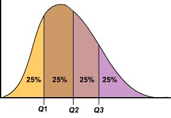
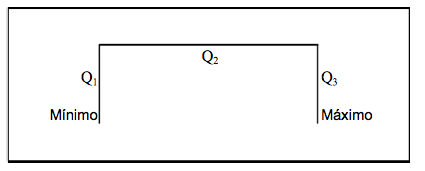
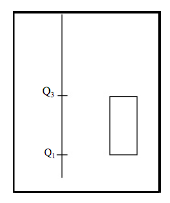
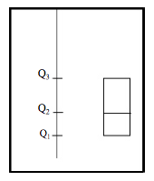
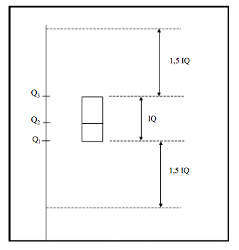
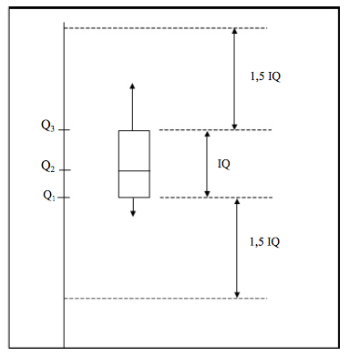
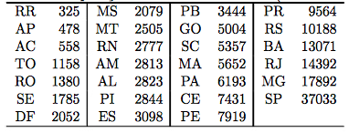
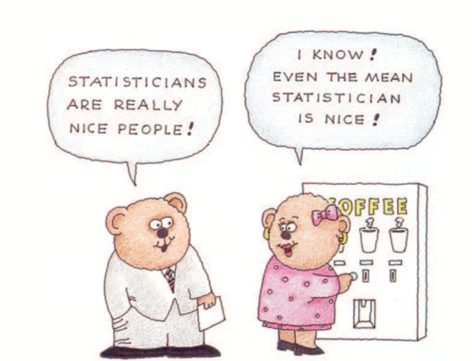

## Simetria e Assimetria da Distribuição {.build}

> O formato da distribuição influencia se a média será maior ou menor do que a mediana.

> Um valor extremamente grande na cauda direita, puxa a média para a direita.
> Em geral, se o formato é: 

> * perfeitamente simétrico: média = mediana.

> * assimétrica à direita: média $>$ mediana.

> * assimétrica à esquerda: média $<$ mediana.

---

```{r,echo=FALSE,fig.height=4,fig.width=10}
par(mfrow=c(1,3))
set.seed(44)
sym <- rnorm(10000)
plot(density(sym),ylab="",main="Média=Mediana",xlab="",axes=FALSE,xlim=c(-3,3),cex.lab=1.5,lwd=3)
abline(v=0,col="red",lty=2,lwd=3)
abline(v=0,col="blue",lty=2,lwd=3)
legend("topright",legend=c("Média","Mediana"),col=c("blue","red"),lty=2,border="white",lwd=3)

set.seed(44)
asymDir <- c(rchisq(1000,df=15))
plot(density(asymDir),ylab="",main="Média > Mediana",xlim=c(4,35),axes=FALSE,xlab="",cex.lab=1.5,lwd=3)
abline(v=14,col="red",lty=2,lwd=3)
abline(v=18,col="blue",lty=2,lwd=3)

asymEsq <- -asymDir
plot(density(asymEsq),ylab="",main="Média < Mediana",xlim=c(-35,-4),axes=FALSE,xlab="",cex.lab=1.5,lwd=3)
abline(v=-14,col="red",lty=2,lwd=3)
abline(v=-18,col="blue",lty=2,lwd=3)
#legend("topright",legend=c("Média","Mediana"),col=c("blue","red"),lty=2,border="white",lwd=3)
```


## Dispersão dos Dados {.build}

Considere dois conjuntos de dados: 
 
 $A = \{10,20,30\}$,  $\overline{x}_A = 20$, $s_A= 10$.
 
 $B = \{10000,10010,10020\}$,  $\overline{x}_B = 10010$, $s_B= 10$. 
 
> Ambos têm o mesmo desvio padrão. 

> Se compararmos as escalas de cada conjunto de dados, poderíamos dizer que o segundo conjunto tem menor dispersão.


> Por exemplo, a maior observação do conjunto $B$, 10020, é 0,2\% maior do que  a menor observação, 10000.

> A maior observação do conjunto $A$, 30, é  3 vezes maior do que a menor observação, 10.

## Exemplo {.build}
Considere notas de 2 provas:

> * Prova 1: 0 a 100. Média da turma: 70. Desvio padrão 1.
> * Prova 2: 0 a 10. Média da turma: 7. Desvio padrão 1.
```{r,echo=FALSE,fig.height=3,fig.width=9}
set.seed(3)
prova1 <- rnorm(50,mean=70,sd=1)
prova2 <- rnorm(50,mean=7,sd=1)
par(mfrow=c(1,2))
hist(prova1,freq=FALSE,xlab="Notas da Prova 1",ylab="Densidade",main=" ",xlim=c(0,100),ylim=c(0,.5),cex.axis=1.5,cex.lab=1.5)
hist(prova2,freq=FALSE,xlab="Notas da Prova 2",ylab="Densidade",main=" ",xlim=c(0,10),ylim=c(0,.5),cex.axis=1.5,cex.lab=1.5)
```

> Neste caso, como as escalas são diferentes, não podemos tirar conclusões usando apenas o desvio padrão.

## Coeficiente de Variação{.build}
$$\mbox{Coeficiente de Variação (CV)}= \frac{s}{\bar{x}}$$

> **Exemplo:** 
$A = \{10,20,30\}$,  $\overline{x}_A = 20$, $s_A= 10$.

$B = \{10000,10010,10020\}$,  $\overline{x}_B = 10010$, $s_B= 10$. 

> $CV_A = \frac{s_A}{\overline{x}_A} = 0.5$ e $CV_B = \frac{s_B}{\overline{x}_B} \approx 0,0009$.

> **Exemplo:** 
Prova 1: 0 a 100. Média da turma: 70. Desvio padrão 1.

Prova 2: 0 a 10. Média da turma: 7. Desvio padrão 1.
  
> $CV_1 = \frac{s_1}{\overline{x}_1} = 0,014$ e $CV_2 = \frac{s_2}{\overline{x}_2} \approx 0,14$.

## Usando medidas de posição para descrever dispersão {.build}

> Média e mediana: medidas de posição **central**.

> Amplitude e desvio padrão: medidas de dispersão.

> Há outros tipos de medida de posição para descrever a distribuição dos dados: **quartis** e **percentis**.

> **Quartis** dividem os dados em 4 partes iguais: primeiro quartil ($Q_1$), segundo quartil ($Q_2$) e o terceiro quartil ($Q_3$).

> O **p-ésimo percentil** é o valor tal que uma porcentagem **p** dos dados ficam abaixo dele.

## Quartis {.build}

<center>

</center>

> Para obter os quartis:

> * Ordene os dados em ordem crescente.
> * Encontre a mediana: $Q_2$=mediana.
> * Considere o subconjunto de dados abaixo da mediana. $Q_1$ é a mediana deste subconjunto de dados.

> * Considere o subconjunto de dados acima da mediana. $Q_3$ é a mediana deste subconjunto de dados.


## Exemplo: Quantidade de sódio (mg) em 20 cereais matinais{.build}

 0, 70, 125, 125, 140, 150, 170, 170, 180, **200**
 
**200**, 210, 210, 220, 220, 230, 250, 260, 290, 290
 
> Para calcular $Q1$: calcula-se a mediana considerando apenas as 10 primeiras observações ordenadas: 0, 70, 125, 125, $\underbrace{140, 150}_{Q_1=145}$, 170, 170, 180, **200**

 Para calcular $Q3$: calcula-se a mediana considerando apenas as 10 últimas observações ordenadas:
 **200**, 210, 210, 220, $\underbrace{220, 230}_{Q_3=225}$, 250, 260, 290, 290

## Quartis e Assimetria

 Os quartis também fornecem informação sobre o formato da distribuição.
```{r,echo=FALSE,fig.height=4}
set.seed(2015)
asymDir <- round(c(rchisq(1000,df=15)),0)
a <- boxplot(asymDir,plot=FALSE)
q1 <- round(a$stats[2],0)
q2 <- round(a$stats[3],0)
q3 <- round(a$stats[4],0)
plot(density(asymDir),ylab="",main=" ",xlim=c(4,35),axes=FALSE,xlab="",cex.lab=1.5,lwd=3)
abline(v=q1,col="red",lty=2,lwd=3)
abline(v=q2,col="red",lty=2,lwd=3)
abline(v=q3,col="red",lty=2,lwd=3)
axis(side=1, at=c(q1,q2,q3), labels=c(paste0("Q1=",q1),paste0("Q2=",q2),paste0("Q3=",q3)))
```

A distância entre $Q_1$ e $Q_2$ é `r q2-q1`, enquanto que a distância entre $Q_2$ e $Q_3$ é `r q3-q2`, indicando que a distribuição é assimétrica à direita.
 
## Usando quartis para medir dispersão {.build}

> A vantagem do uso de quartis sobre o desvio padrão ou a amplitude, é que os quartis são mais resistentes a dados extremos.
 
> **Intervalo interquartílico (IQ)** = $Q_3-Q_1$.

> Representa 50\% dos dados localizados na parte central da distribuição.
```{r,echo=FALSE,fig.height=3.5}
dens <- density(asymDir)
plot(dens,ylab="",main=" ",xlim=c(4,35),axes=FALSE,xlab="",cex.lab=1.5,lwd=3)
axis(side=1, at=c(q1,q2,q3), labels=c("Q1","Q2","Q3"))
x1 <- min(which(dens$x >= q1))  
x2 <- max(which(dens$x <  q3))
with(dens, polygon(x=c(x[c(x1,x1:x2,x2)]), y= c(0, y[x1:x2], 0), col="lightpink"))
#abline(v=q1,col="red",lty=2,lwd=3)
#abline(v=q3,col="red",lty=2,lwd=3)
```

# Esquema dos 5 números

##

<center>

</center>

Notação:  $x_{(1)}$ = mínimo, $x_{(n)}$ = máximo, onde $x_{(k)}$ é a $k$-ésima observação depois de ordenar os dados.


$$
Q_2= \begin{cases}
   x_{\left(\frac{n+1}{2}\right)} \,,& \mbox{se  $n$ é ímpar} \\ 
    \frac{x_{\left(\frac{n}{2}\right)}+x_{\left(\frac{n}{2}+1\right)}}{2}\,, & \mbox{se  $n$ é par}
  \end{cases}
$$

## Quartis e simetria da distribuição {.build}

<center>

</center>

Para uma distribuição simétrica ou aproximadamente simétrica:

> * $Q_2-x_{(1)}\approx x_{(n)}-Q_2$

> * $Q_2-Q_1\approx Q_3-Q_2$

> * $Q_1-x_{(1)} \approx x_{(n)}-Q_3$

> * distâncias entre a mediana e $Q_1$, $Q_3$ menores do que as distâncias entre os extremos e $Q_1$, $Q_3$.

## Dados discrepantes (*outliers*) {.build}

Importante: examinar os dados para verificar se há observações discrepantes.

> * Média e desvio padrão são muito afetados por observações discrepantes.

> * Após detectar a observação discrepante, verificar se não é um erro de digitação ou um caso especial da sua amostra.

> * Com poucos dados, podemos detectar um dados discrepante facilmente, apenas observando a sequência ordenada.

> * Podemos usar o IQ como um critério mais geral de detecção de dados discrepantes.

## {.build}

> Uma observação é um potencial *outlier* se está abaixo de $Q_1-1,5\times IQ$ ou se está acima de $Q_3+1,5 \times IQ$.

```{r,echo=FALSE,fig.height=3,fig.width=10}
par(mfrow=c(1,4))
set.seed(44)
asymDir <- c(rchisq(1000,df=15))
asymEsq <- c(-asymDir,rep(-30,30))
plot(density(asymEsq),ylab="",main=" ",xlim=c(-35,-4),axes=FALSE,xlab="",cex.lab=1.5,lwd=3)
a <- boxplot(asymEsq,plot=FALSE)
IQ <- a$stats[4]-a$stats[2]
LI <- a$stats[2]-1.5*IQ
abline(v=LI,col="red",lty=2,lwd=3)
axis(side=1,at=c(LI),labels=c("Q1 - 1,5 IQ"),cex.axis=1.5,cex.lab=1.5)

set.seed(44)
asymDir <- c(rchisq(1000,df=15))
asymEsq <- c(-asymDir)
plot(density(asymEsq),ylab="",main=" ",xlim=c(-35,-4),axes=FALSE,xlab="",cex.lab=1.5,lwd=3)
a <- boxplot(asymEsq,plot=FALSE)
IQ <- a$stats[4]-a$stats[2]
LI <- a$stats[2]-1.5*IQ
abline(v=LI,col="red",lty=2,lwd=3)
axis(side=1,at=c(LI),labels=c("Q1 - 1,5 IQ"),cex.axis=1.5,cex.lab=1.5)

set.seed(44)
asymDir <- c(rchisq(1000,df=15))
a <- boxplot(asymDir,plot=FALSE)
IQ <- a$stats[4]-a$stats[2]
LS <- a$stats[4]+1.5*IQ
plot(density(asymDir),ylab="",main=" ",xlim=c(4,35),axes=FALSE,xlab="",cex.lab=1.5,lwd=3)
abline(v=LS,col="red",lty=2,lwd=3)
axis(side=1,at=c(LS),labels=c("Q3 + 1,5 IQ"),cex.axis=1.5,cex.lab=1.5)

set.seed(44)
asymDir <- c(rchisq(1000,df=15),rep(30,30))
plot(density(asymDir),ylab="",main=" ",xlim=c(4,35),axes=FALSE,xlab="",cex.lab=1.5,lwd=3)
a <- boxplot(asymDir,plot=FALSE)
IQ <- a$stats[4]-a$stats[2]
LS <- a$stats[4]+1.5*IQ
abline(v=LS,col="red",lty=2,lwd=3)
axis(side=1,at=c(LS),labels=c("Q3 + 1,5 IQ"),cex.axis=1.5,cex.lab=1.5)
```

> Dizemos *potencial outlier*, pois se a distribuição tem cauda longa (à direita ou à esquerda), algumas observações irão cair no critério, apesar de não serem outliers.

## Boxplot {.build}

> O esquema dos 5 números forma a base do grafico denominado **boxplot**.
 

Primeiro passo: construir uma caixa que vai do primeiro ao terceiro quartil.

<center>
 
</center>

## 

Segundo passo: construir uma linha no meio da caixa, na altura da mediana ($Q_2$).

<center></center>


## 

Terceiro passo: definir os limites para que uma observação seja considerada *outlier*.

<center></center>

##  


Quarto passo: desenhar uma linha que saia da parte inferior da caixa e desça até o menor valor dos dados, mas que não ultrapasse os limites do critério de outliers. Desenhar uma linha que saia da parte superior da caixa e suba até o maior valor dos dados, mas que não ultrapasse os limites do critério de outliers. Outliers, quando existem, aparecem indicados separadamente no gráfico.

<center></center>

##  Exemplo: População, em 1000 habitantes, dos estados brasileiros {.build}

```{r,echo=FALSE}
estados <- c(325,478,558,1158,1380,1785,2052,2079,2505,2777,2813,2823,2844,3098,
             3444,5004,5357,5652,6193,7431,7919,9564,10188,13071,14392,17892,37033)

med <- median(estados) # Q2
Q1 <- quantile(estados,prob=.25,type=2) # Q1
Q3 <- quantile(estados,prob=.75,type=2) # Q3
IQ <- IQR(estados,type=2) # IQ
```

<center></center>

> 27 estados, $n$ é ímpar, mediana é $x_{\left(\frac{n+1}{2}\right)}= x_{\frac{27+1}{2}}=x_{14}=3098$ (ES).

> A metade inferior dos dados: 13 observações. A mediana deste subconjunto é $Q_1=x_7=
2052$(DF).


> A metade superior dos dados: 13 observações. A mediana deste subconjunto é $Q_3=x_{21}=7919$(PE).

## {.build}

> $IQ=Q_3-Q_1=7919-2052=5867$


> $Q_1-1,5\times IQ=-6748,5$

> $Q_3+1,5\times IQ=16720$


> Temos outliers?

>

```{r,echo=FALSE,fig.width=5,fig.height=4}
boxplot(estados,ylab="População, em 1000 habitantes",type=2)
```


## Exemplo: Quantidade de sódio (mg) em 20 cereais matinais{.build}

 0, 70, 125, 125, $\underbrace{140, 150}_{Q_1=145}$, 170, 170, 180, **200**
 
**200**, 210, 210, 220, $\underbrace{220, 230}_{Q_3=225}$, 250, 260, 290, 290


$$IQ=Q_3-Q_1=225-145=80$$
 
$$Q_1-1,5\times IQ=145-1,5\times 80=25$$
 
$$Q_3+1,5\times IQ=145+1,5\times 80=345$$

```{r,echo=FALSE}
cereais <- c(0, 70, 125, 125, 140, 150, 170, 170, 180, 200,
             200, 210, 210, 220, 220, 230, 250, 260, 290, 290)
```

## {.build .smaller}

```{r,echo=FALSE,fig.width=6,fig.height=3}
#par(mfrow=c(2,1))
#nf <- layout(mat = matrix(c(1,2),2,1, byrow=TRUE),  height = c(1,2))
#    par(mar=c(4, 4, .5, .5))
boxplot(cereais, horizontal=TRUE,  outline=TRUE,ylim=c(-1,330),col="lightblue",type=3)
#hist(cereais,xlim=c(-1,330),breaks=c(0,40,80,120,160,200,240,280,320),main="",col="lightblue",xlab="Sódio (mg)",ylab="Frequência")
```

> Outlier: observação menor do que 25 ou maior do que 345. 

> As linhas pontilhadas denotam o mínimo/máximo dos dados que estão na região entre $Q_1-1,5\times IQ$ e $Q_3+1,5\times IQ$.

> A observação máxima dos dados, 290, está no intervalo, então a linha do lado direito vai até 290.

> A observação mínima dos dados, 0, está fora do intervalo (outlier=0). 

> Desconsiderando o outlier, o valor mínimo dos dados é 70, que está no intervalo. Portanto, a linha do lado direito vai até 70.

## 

```{r,echo=FALSE,fig.width=6,fig.height=5}
par(mfrow=c(2,1))
nf <- layout(mat = matrix(c(1,2),2,1, byrow=TRUE),  height = c(1,2))
    par(mar=c(4, 4, .5, .5))
boxplot(cereais, horizontal=TRUE,  outline=TRUE,ylim=c(-1,330),col="lightblue",type=3)
hist(cereais,xlim=c(-1,330),breaks=c(0,40,80,120,160,200,240,280,320),main="",col="lightblue",xlab="Sódio (mg)",ylab="Frequência")
```

## {.build}

> Boxplot não substitui o histograma e vice-versa. 

> Por exemplo, se a distribuição é bimodal, não observamos isso pelo boxplot.


```{r,echo=FALSE,fig.width=6,fig.height=5}
mu1 <- log(1)   
mu2 <- log(50)
sig1 <- log(3)
sig2 <- log(3)
cpct <- 0.4   

bimodalDistFunc <- function (n,cpct, mu1, mu2, sig1, sig2) {
    set.seed(4)
  y0 <- rlnorm(n,mean=mu1, sd = sig1)
    set.seed(5)
  y1 <- rlnorm(n,mean=mu2, sd = sig2)

  flag <- rbinom(n,size=1,prob=cpct)
  y <- y0*(1 - flag) + y1*flag 
}

bimodalData <- bimodalDistFunc(n=10000,cpct,mu1,mu2, sig1,sig2)

nf <- layout(mat = matrix(c(1,2),2,1, byrow=TRUE),  height = c(1,1.5))
    par(mar=c(3, 3, .2, .2))
boxplot(log(bimodalData), horizontal=TRUE,  outline=TRUE,ylim=c(-5,10),col="lightblue",type=3)
hist(log(bimodalData),nclass=20,xlab="",ylab="Frequência",col="lightblue",main="",xlim=c(-5,10))
```

## Exemplo: Peso (em libras) de 64 alunas de educação física {.smaller .build}

> $\bar{x}=133$, $Q_1=119$, mediana=131,5, $Q_3=144$.

> Como interpretar os quartis?

> * 25\% das alunas pesa até 119 libras.

> * 25\% das alunas pesa mais do que 144 libras.

> * 75\% das alunas pesa até 144 libras.

> Você acredita que a distribuição seja simétrica?

> $$
Q_2-Q_1\approx Q_3-Q_2\quad(?)$$

> $$\underbrace{Q_2-Q_1}_{131,5-119=12,5}=\underbrace{Q_3-Q_2}_{144-131,5=12,5}
$$

## Exemplo: Taxa de desemprego na UE em 2003 {.smaller .build}
```{r,echo=FALSE}
desemprego <- c(8.3,6,9.2,9.3,11.2,9.5,6.7,4.4,3.9,4.6,8.5,8.9,4.5,6,4.8)
des <- data.frame(Taxa=desemprego,Pais=c("Bélgica","Dinamarca","Alemanha","Grécia","Espanha","França","Portugal","Holanda","Luxemburgo","Irlanda","Itália","Finlândia","Áustria","Suécia","Reino Unido"))
des
```
> Qual a amplitude?
> $Q_1$, $Q_3$, mediana?

> Desenhe um boxplot.

## Exemplo: Taxa de desemprego na UE em 2003 {.smaller .build}

```{r,echo=FALSE}
Q1 <- quantile(desemprego,prob=.25,type=2)
Q3 <- quantile(desemprego,prob=.75,type=2)
IQ <- IQR(desemprego,type=2)
LI <- Q1-1.5*IQ
LS <- Q3+1.5*IQ
```

> Ordenando os dados:

3,9  4,4  4,5  **4,6**  4,8  6,0  6,0  **6,7**  8,3  8,5  8,9  **9,2**  9,3  9,5 11,2

> Qual a amplitude? 

> $11,2-3,9=7,3$

> $Q_1=4,6$, $Q_3=9,2$, mediana=6,7.

> $IQ=Q_3-Q_1=4,6$

> $Q_1-1,5\times IQ=-2,3$

> $Q_3+1,5\times IQ=16,1$

O mínimo e o máximo pertencem ao intervalo $(-2,3;16,1)$, portanto as linhas pontilhadas terminam no máximo (11,2) e no mínimo (3,9).

##

```{r,echo=FALSE,fig.height=5,fig.width=8}
boxplot(desemprego,type=2,horizontal=TRUE,col="lightblue")
```


##

<center></center>

##

Slides produzidos pelos professores:

* Samara Kiihl

* Tatiana Benaglia

* Benilton Carvalho