# Análise Bivariada

## Associação entre duas variáveis {.build}

> Sua opinião sobre o comportamento de uma variável muda na presença de informação de uma segunda variável?

> A **distribuição conjunta** das duas variáveis descreve a associação existente entre elas.

> Grau de dependência: como uma variável "explica" ou se "associa" a outra.


> Temos três casos:

> * as duas variáveis são quantitativas

> * as duas variáveis são qualitativas

> * uma variável é quantitativa e a outra qualitativa

# Associação entre duas variáveis qualitativas

## Exemplo: Grau de instrução X Procedência {.smaller .build}

Queremos estudar o comportamento conjunto de duas variáveis:  Grau de Instrução ($X$)
e Região de Procedência ($Y$).

```{r,echo=FALSE}

x = matrix(c(4,5,2,3,7,2,5,6,2),nrow=3,byrow=TRUE)
 rownames(x) = c("Capital","Interior","Outra")
 colnames(x) = c("Ensino Fundamental","Ensino Médio","Ensino Superior")

y <- rbind(x,c(12,18,6))
y <- cbind(y,c(11,12,13,36))
rownames(y) <- c("Capital","Interior","Outra","Total")
colnames(y) <- c("Ensino Fundamental","Ensino Médio","Ensino Superior","Total")
#library(printr)
library(knitr)
kable(y)
```

> * 4 pessoas da capital com ensino fundamental.
> * Na última coluna: frequência de cada nível da variável $Y$.
> * Na última linha:  frequência de cada nível da variável $X$.
> * Parte interna da tabela: frequências conjuntas entre $X$ e $Y$.


## Frequências Relativas {.build}


Podemos considerar também proporções condicionais (frequências relativas):

> * em relação ao total de elementos;

> * em relação ao total de cada linha;

> * em relação ao total de cada coluna.

> A proporção condicional escolhida depende do estudo que pretendemos fazer.

## Frequências Relativas {.build}

Distribuição das frequências relativas ao total da amostra.

Total da amostra é 36.


```{r,echo=FALSE}
kable(addmargins(prop.table(x)), digits=3)
```


11\% dos funcionários são da capital e possuem ensino fundamental.

## Frequências relativas ao total das colunas  {.build .smaller}

Distribuição das frequências relativas ao total de cada coluna.

```{r,echo=FALSE}
kable(addmargins(prop.table(x, 2), 1), digits=3)
```

Entre os funcionários com ensino médio:

* $28\%$ são da capital.
 
* $39\%$ são do interior.

* $33\%$ são de outros locais.


Permite comparar a distribuição de $Y$ (procedência) conforme o grau de instrução ($X$).

## Procedência conforme o grau de instrução {.build}

```{r,echo=FALSE,fig.width=8,fig.height=5}
barplot(prop.table(x,2),xlab=" ", main=" ", beside=TRUE,legend.text=TRUE,ylim=c(0,.8),col=c("lightgreen","lightyellow","lightpink"),cex.axis=1.5,cex.lab=1.5) 
```

> Observando o gráfico e a tabela de proporções  parece haver evidências de associação entre o grau de instrução e a procedência do funcionário.


## Frequências relativas ao total das linhas {.build .smaller}

Distribuição das frequências relativas ao total de cada linha.

```{r,echo=FALSE}
kable(addmargins(prop.table(x,1),2), digits = 3)
```

Entre os funcionários do interior:

* $25\%$ possuem Ensino Fundamental
 
* $58\%$ possuem Ensino Médio.

* $17\%$ possuem Ensino Superior.


Permite comparar a distribuição do grau de instrução ($X$) conforme a procedência ($Y$).

## Grau de instrução conforme a procedência {.build}

```{r,echo=FALSE,fig.width=8,fig.height=5}
barplot(t(prop.table(x,1)),xlab=" ", main=" ", beside=TRUE,legend.text=TRUE,ylim=c(0,.8),col=c("lightgreen","lightyellow","lightpink"),cex.axis=1.5,cex.lab=1.5) 
```


## Exemplo: Escolha da carreira {.build}
Existe dependência entre o sexo ($X$) e a carreira escolhida ($Y$) por 200 alunos de Economia e Administração?

```{r,echo=FALSE}
x = matrix(c(85,35,55,25),nrow=2,byrow=TRUE)
 rownames(x) = c("Economia","Administração")
 colnames(x) = c("Masculino","Feminino")
 
y <- rbind(x,c(85+55,35+25))
y <- cbind(y,c(85+35,55+25,sum(x)))
rownames(y) <- c("Economia","Administração","Total")
colnames(y) <- c("Masculino","Feminino","Total")
kable(y)
```

> Se quisermos estudar se a proporção de mulheres escolhendo Economia é similar à proporção de homens que escolhem Economia, devemos avaliar: 

* Distribuição das frequências relativas ao total de cada coluna?

* Distribuição das frequências relativas ao total de cada linha?


 
## Exemplo: Escolha da carreira {.build} 

> * A proporção de alunos em Economia é similar para cada sexo?

> * Ser similar em cada sexo não quer dizer que seja 50% na Economia e 50% na Administração em cada sexo.

> * Queremos saber se o padrão das proporções dos cursos é parecido ou não entre os sexos.

> * Usaremos a distribuição das frequências relativas ao total de cada coluna.

## Exemplo: Escolha da carreira {.smaller .build} 

```{r,echo=FALSE}
kable(addmargins(round(prop.table(y[-3,],2),2),1))
```

> * No geral (última coluna), sem considerar os sexos, temos que $60\%$ dos estudantes preferem economia e $40\%$ administração.

> * Se sexo e carreira escolhida forem independentes (sem associação), espera-se que, para cada sexo, a escolha das carreiras tenha essas mesmas proporções.

> * Sexo masculino: $61\%$ dos estudantes na carreira de economia e $39\%$ na de administração.

> * Sexo feminino: $58\%$ dos estudantes na carreira de economia e $42\%$ na de administração.

> * Os dados indicam que não há associação entre as variáveis.

## Exemplo: Escolha da carreira conforme gênero


```{r,echo=FALSE,fig.width=8,fig.height=5}
barplot(prop.table(x,2),xlab=" ", main=" ", beside=TRUE,legend.text=TRUE,ylim=c(0,1),col=c("lightblue","lightpink"),cex.axis=1.5,cex.lab=1.5) 
```

Observando o gráfico e a tabela de proporções condicionais  parece não haver evidências de associação entre gênero e escolha da carreira.

## Exemplo: Pesticidas{.smaller .build}
> Uma [pesquisa](http://www.tandfonline.com/doi/abs/10.1080/02652030110113799#.VbOlP-hVhBA) foi feita para investigar a presença de pesticidas em alimentos orgânicos e convencionais.

```{r,echo=FALSE}
# A tabela a seguir apresenta a distribuição conjunta das frequências do tipo de alimento e presença de pesticida.
x = matrix(c(29,98,19485,7086),nrow=2,byrow=TRUE)
 rownames(x) = c("Orgânico","Convencional")
 colnames(x) = c("Pesticida Presente","Pesticida Ausente") 

y <- rbind(x,c(29+19485,98+7086))
y <- cbind(y,c(29+98,19485+7086,sum(x)))
rownames(y) <- c("Orgânico","Convencional","Total")
colnames(y) <- c("Pesticida Presente","Pesticida Ausente","Total")
kable(y)
``` 

> Qual a proporção de alimentos com pesticida?

> $19514/26698=`r round(19514/26698,3)`$.

> Qual a proporção de alimentos com pesticidas dentre os orgânicos?

> $29/127=`r round(29/127,3)`$.

> Qual a proporção de alimentos com pesticidas dentre os convencionais?

> $19484/26571=`r round(19484/26571,3)`$.

## Proporção Condicional {.build}

**Proporção condicional**: condicionalmente à informação de uma variável, observamos a proporção da outra variável.

> - Qual a proporção de pesticidas entre alimentos orgânicos?

- Qual a proporção de pesticidas entre alimentos convencionais?

```{r,echo=FALSE}
a <- addmargins(round(prop.table(x,1),2),2)
#kable(a)
```

|             | Pesticida Presente| Pesticida Ausente| Sum|
|:------------|------------------:|-----------------:|---:|
|Orgânico     |               0.23|              0.77|   1|
|Convencional |               0.73|              0.27|   1|

## Presença de pesticida por tipo de alimento
<center>
```{r, echo=FALSE, fig.width=7, fig.height=4.5}
par(mar=c(5.1,4.1,1.1,2.1))
barplot(t(prop.table(x,1)), xlab="Tipo de Alimento", ylab="frequência relativa", main=" ", beside=TRUE, legend.text=TRUE, ylim=c(0,1.1), col=c("lightpink","lightblue"), cex.axis=1.5, cex.lab=1.5)
```
</center>

Observando o gráfico e a tabela de proporções condicionais parece haver evidências de associação entre presença de pesticida e tipo de alimento.

## Exemplo: Renda e Felicidade

 Pesquisa da [GSS](http://www3.norc.org/GSS+Website/) de 2002.
 
  - Você se considera feliz?
  
  - Comparando com as demais famílias dos EUA, como você considera  sua renda familiar?
  
```{r,echo=FALSE}

x = matrix(c(17,90,51,45,265,143,31,139,71),nrow=3,byrow=TRUE)
 rownames(x) = c("Acima da média","Na média","Abaixo da média")
 colnames(x) = c("Não muito feliz","Feliz","Muito feliz")


y <- rbind(x,colSums(x))
y <- cbind(y,as.vector(rowSums(y)))
rownames(y) <- c("Acima da média","Na média","Abaixo da média","Total")
colnames(y) <- c("Não muito feliz","Feliz","Muito feliz","Total")
#kable(y)
```


|      Renda     | Não muito feliz| Feliz| Muito feliz| Total|
|:---------------|---------------:|-----:|-----------:|-----:|
|Acima da média  |              17|    90|          51|   158|
|Na média        |              45|   265|         143|   453|
|Abaixo da média |              31|   139|          71|   241|
|Total           |              93|   494|         265|   852|


## Exemplo: Renda e Felicidade {.build}
```{r,echo=FALSE}
kable(y)
```

No geral, qual a proporção de pessoas diz que está **Muito feliz**?
 
> $$\frac{265}{852}=`r round(265/852,2)`$$
 
> Será que o nível de felicidade muda para cada tipo de renda? Como comparar?

## Exemplo: Renda e Felicidade

Proporções condicionais do nível de felicidade para cada nível de renda:

```{r,echo=FALSE}
a <- addmargins(round(prop.table(x,1),2),2)
kable(a)
```


## Nível de felicidade por cada nível de renda


```{r,echo=FALSE,fig.width=8,fig.height=5}
barplot(t(prop.table(x,1)),xlab="Renda", main=" ", beside=TRUE,legend.text=TRUE,ylim=c(0,1.1),col=c("lightgreen","lightyellow","lightpink"),cex.axis=1.5,cex.lab=1.5) 
```

Observando o gráfico e a tabela de proporções condicionais parece não haver evidências de associação entre nível de felicidade e nível de renda.

## Exemplo: Bebidas alcoólicas {.build}

A Escola de Saúde Pública da Harvard fez uma pesquisa com 200 cursos de graduação em 2001.

> A pesquisa pergunta aos alunos sobre hábitos relacionados à bebida. 

<div class="columns-2">

> * 4 drinks seguidos, entre mulheres, é classificado como bebida em excesso.

> * 5 drinks seguidos, entre homens, é classificado como bebida em excesso.

> <center></center>

</div>


## Exemplo: Bebidas alcoólicas {.build}

```{r,echo=FALSE}


x = matrix(c(1908,2017,2854,4125),nrow=2,byrow=TRUE)
 rownames(x) = c("Masculino","Feminino")
 colnames(x) = c("Bebida em excesso - Sim","Bebida em excesso - Não")

y <- rbind(x,colSums(x))
y <- cbind(y,as.vector(rowSums(y)))
rownames(y) <- c("Masculino","Feminino","Total")
colnames(y) <- c("Bebida em excesso - Sim","Bebida em excesso - Não","Total")
#kable(y)
```
|          | Bebida em excesso - Sim| Bebida em excesso - Não| Total|
|:---------|-----------------------:|-----------------------:|-----:|
|Masculino |                    1908|                    2017|  3925|
|Feminino  |                    2854|                    4125|  6979|
|Total     |                    4762|                    6142| 10904|

Qual o número de alunos:

* do sexo masculino e beberam em excesso?

* do sexo feminino e beberam em excesso?


Usando diretamente a tabela, podemos responder à pergunta:
**Há diferença entre homens e mulheres na proporção de ocorrência de bebida em excesso?**

## Exemplo: Bebidas alcoólicas

Proporções condicionais de ocorrência de bebida em excesso por gênero:


```{r,echo=FALSE}
a <- addmargins(round(prop.table(x,1),2),2)
kable(a)
```

Proporção de ocorrência de bebida em excesso entre homens: $\frac{1908}{3925}=0,49$.

Proporção de ocorrência de bebida em excesso entre mulheres: $\frac{2854}{4125}=0,41$.

## Ocorrência de bebida em excesso por gênero
<center>
```{r, echo=FALSE, fig.width=7, fig.height=4.5}
par(mar=c(5.1,4.1,1.1,2.1))
barplot(t(prop.table(x,1)), xlab="Gênero", ylab="frequência relativa", main=" ", beside=TRUE, legend.text=TRUE, ylim=c(0,1.1), col=c("lightpink","lightblue"), cex.axis=1.5, cex.lab=1.5)
```
</center>

Observando o gráfico e a tabela de proporções condicionais parece haver evidências de associação entre gênero e bebida em excesso.

## Exemplo: Tipo de risada e gênero

<center>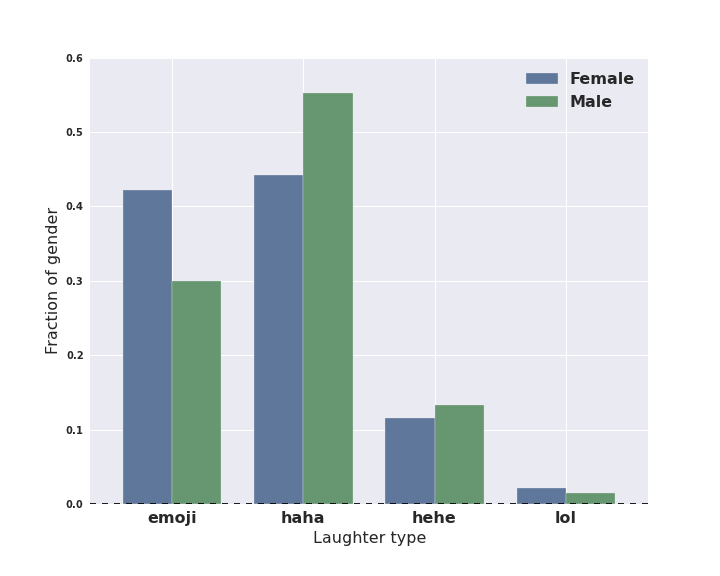</center>

[Fonte](https://research.facebook.com/blog/1605690073053884/the-not-so-universal-language-of-laughter/)

## Exemplo: Tipo de risada e cidade

<center>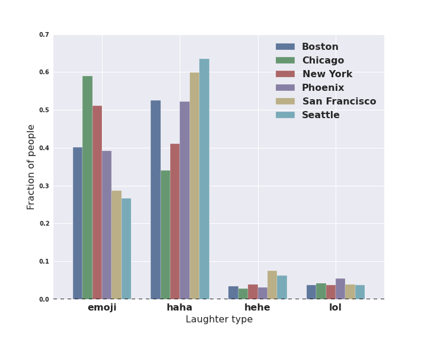</center>

[Fonte](https://research.facebook.com/blog/1605690073053884/the-not-so-universal-language-of-laughter/)


# Associação entre duas variáveis quantitativas

## Associação entre duas variáveis quantitativas

Associação entre duas variáveis **qualitativas**: comparar proporções condicionais.


Associação entre duas variáveis **quantitativas**: comparamos como a mudança de uma variável afeta a outra variável.

# Diagrama de dispersão

## Exemplo: Tempo de serviço e total de clientes

Agente | Anos de Serviço ($X$) | $N^{o}$ de Clientes ($Y$)
-------|-----------------------|--------------------------
A | 2 | 48 
B | 4 | 56 
C | 5 | 64 
D | 6 | 60 
E | 8 | 72 
Total | 25 | 300 

## Exemplo: Tempo de serviço e total de clientes
<center>
```{r, echo=FALSE, fig.height=4.5, fig.width=7}
x <- c(2,4,5,6,8)
y <- c(48,56,54,60,72)
par(mar=c(5.1,4.1,1.1,2.1))
plot(x=x, y=y, xlab="Tempo de serviço (anos)", ylab="Número de clientes", main=" " , pch=19, cex.axis=1.2, cex.lab=1.2, col="blue", lwd=2)
```
</center>

O gráfico indica uma possível dependência linear positiva entre as variáveis anos de serviço e número de clientes.

## Exemplo: Renda e gasto com assistência médica

* Renda Mensal Bruta ($X$)

* $\%$ da Renda gasta com Assistência Médica ($Y$)


```{r,echo=FALSE}
x <- c(12,16,18,20,28,30,40,48,50,54)
y <- c(7.2,7.4,7,6.5,6.6,6.7,6,5.6,6,5.5)

data <- data.frame(Familia=c("A","B","C","D","E","F","G","H","I","J"),X=x,Y=y)

data
```

## Exemplo: Renda e gasto com assistência médica
<center>
```{r, echo=FALSE, fig.height=4.5, fig.width=7}
par(mar=c(5.1,4.1,1.1,2.1))
plot(x=x, y=y, xlab="Renda bruta", ylab=" % da Renda gasta com Assistência", main=" ", pch=19, cex.axis=1.2, cex.lab=1, col="blue", lwd=2)
```
</center>

Nesse caso, a dependência entre $X$ e $Y$ parece ser linear negativa.


## Coeficiente de Correlação {.build}

> * Objetivo: obter uma medida que permita quantificar a dependência que pode existir entre duas variáveis (positiva, negativa, muita ou pouca).

> * Dado $n$ pares de observações $(x_{1},y_{1}),(x_{2},y_{2}),...,(x_{n},y_{n})$: 
$$Corr(X,Y)=\frac{1}{n-1}\sum_{i=1}^{n}\left(\frac{x_{i}-\bar{x}}{s_x}\right)\left(\frac{y_{i}-\bar{y}}{s_y}\right)$$
onde $s_x$ é o desvio padrão de $X$ e $s_y$ é o desvio padrão de $Y$.

* Essa medida leva em consideração todos os desvios $(x_{i}-\bar{x})$ e $(y_{i}-\bar{y})$ padronizados da forma $\frac{x_{i}-\bar{x}}{s_x}$ e $\frac{y_{i}-\bar{y}}{s_y}$.


> * $z_{x_i}=\frac{x_i-\bar{x}}{s_x}$. Interpretação: $z_{x_i}$ indica o número de desvios-padrão que a observação $x_i$ está afastada da média de X.

## Propriedades {.build}

> * $-1 \leq Corr(X,Y) \leq 1$

> * $Corr(X,Y)$ próxima de 1: $X$ e $Y$ estão positivamente associadas e o tipo de associação entre as variáveis é linear.

> * $Corr(X,Y)$ próxima de -1: $X$ e $Y$ estão negativamente associadas e o tipo de associação entre as variáveis é linear.

> Se $z_{x}$ e $z_y$ têm o mesmo sinal, estamos somando um termo positivo na expressão da correlação. 

>  Se $z_{x}$ e $z_y$ têm sinais opostos, estamos somando um termo negativo na expressão da correlação. 

>  Correlação é a média dos produtos de $z_x$ e $z_y$.

## Exemplo: Tempo de serviço e total de clientes {.smaller}

Agente | Anos de Serviço ($X$) | $N^{o}$ de Clientes ($Y$)
-------|-----------------------|--------------------------
A | 2 | 48 
B | 4 | 56 
C | 5 | 64 
D | 6 | 60 
E | 8 | 72 
Total | 25 | 300 


* $\bar{x}=5$
* $s_x=2,24$
* $\bar{y}=60$
* $s_y=8,94$

## Exemplo: Tempo de serviço e total de clientes {.build}


Agente | $X$ | $Y$ | $z_x=\frac{x_{i}-\bar{x}}{s_x}$ | $z_y=\frac{y_{i}-\bar{y}}{s_y}$ | $z_x\times z_y$
-------|-----|-----|---------------------------------|---------------------------------|----------------
A | 2 | 48 | -1.34 | -1.34 | 1.8
B | 4 | 56 | -0.45 | -0.45 | 0.2 
C | 5 | 64 | 0 | 0.45 | 0 
D | 6 | 60 | 0.45 | 0 | 0 
E | 8 | 72  | 1.34 | 1.34 | 1.8 


$$Corr(X,Y)=\frac{1}{n-1}\sum_{i=1}^{n}z_{x_i}z_{y_i}=\frac{3.8}{5-1}=0.95$$

## Exemplo: Fitbit {.build}

Número de passos diários foram coletados para uma pessoa usando um \href{http://en.wikipedia.org/wiki/Fitbit}{Fitbit} durante 297 dias.

```{r,echo=FALSE,fig.height=3,fig.width=5}
fitbit <- read.csv("Fitbit.csv",sep=";")
fitbit <- fitbit[-which(fitbit$steps<300),] # removendo os dias em que não usou Fitbit
nf <- layout(mat = matrix(c(1,2),2,1, byrow=TRUE),  height = c(1,1.5))
    par(mar=c(3, 3, .2, .2))
boxplot(fitbit$steps, horizontal=TRUE,  outline=TRUE,ylim=c(0,31000),col="lightblue",type=3)
hist(fitbit$steps,nclass=20,xlab="",ylab="Frequência",col="lightblue",main="",xlim=c(0,31000))
```

> Qual é maior? Média ou mediana?

> Média é `r round(mean(fitbit$steps),0)` e mediana é `r round(median(fitbit$steps),0)`.

## Exemplo: Fitbit  {.build .smaller}

> Além do total de passos, Fitbit também registra o tempo gasto em cada tipo de atividade.

> Há relação entre o total de passos e o tempo gasto em ativiade intensa?

>

<center>
```{r, echo=FALSE, fig.height=4, fig.width=6}
par(mar=c(5.1,4.1,1.1,2.1))
plot(x=fitbit$steps, y=fitbit$minutesVeryActive, xlab="Passos", ylab="Tempo (min) de atividade intensa", cex.axis=1.2, cex.lab=1.2, col="blue")
```
</center>

> Correlação: `r round(cor(x=fitbit$steps,y=fitbit$minutesVeryActive),2)`.

## Exemplo: Fitbit {.build}

Diagrama de dispersão: número de passos e tempo de sedentarismo.
<center>
```{r, echo=FALSE, fig.height=4, fig.width=6}
par(mar=c(5.1,4.1,1.1,2.1))
plot(x=fitbit$steps[fitbit$minutesSedentary>1000], y=fitbit$minutesSedentary[fitbit$minutesSedentary>1000], xlab="Passos", ylab="Tempo (min) sedentário", cex.axis=1.2, cex.lab=1.2, col="blue")
```
</center>

> Correlação: `r round(cor(x=fitbit$steps[fitbit$minutesSedentary>1000],y=fitbit$minutesSedentary[fitbit$minutesSedentary>1000]),2)`.

## Exemplo: Fitbit {.build}


Baseado na altura, peso e gênero, o Fitbit estima o comprimento de cada passo.

Diagrama de dispersão: número de passos e distância percorrida.

<center>
```{r, echo=FALSE, fig.height=3.7, fig.width=6}
par(mar=c(5.1,4.1,1.1,2.1))
plot(x=fitbit$steps, y=fitbit$distance, xlab="Passos", ylab="Distância (km)", cex.axis=1.2, cex.lab=1.2, col="blue")
```
</center>

> Correlação: `r round(cor(x=fitbit$steps,y=fitbit$distance),2)`.


## Compartilhei, pois li e achei legal! {.build}

> Recebemos, na timeline do Facebook, diversas notícias compartilhadas pelos amigos. 


> Imagina-se que uma notícia com grande número de compartilhamentos seja uma leitura interessante, fazendo com que o leitor leia até o final.


> Mas será que seu amigo de fato leu a notícia toda, antes de sair compartilhando? 

> Você lê a notícia toda para só depois compartilhar?

## {.build}

[Dados](http://flowingdata.com/2014/03/12/how-people-really-read-and-share-online/): 10 mil notícias. Para cada notícia calcula-se o **número de compartilhamentos** e o **tempo médio gasto pelo leitor** naquela notícia.

<center>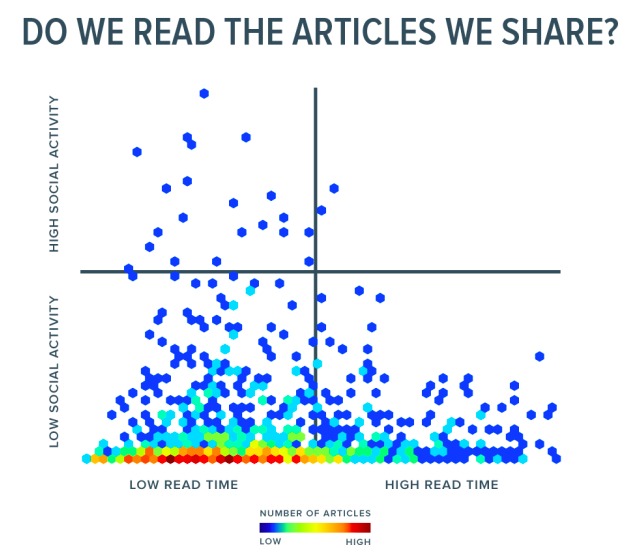</center>

> Você fica surpreso com este gráfico? O que ele está mostrando?


## Correlação


<center>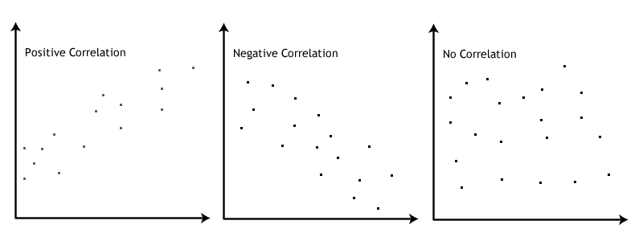</center>

## Correlação


<center>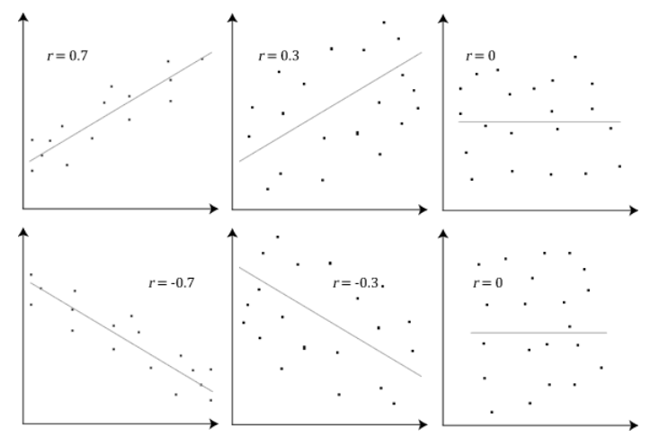</center>

## Cuidado: correlação e *outliers*

<center></center>

[Fonte](http://simplystatistics.org/2015/08/12/correlation-is-not-a-measure-of-reproducibility/)


## Cuidado: correlação não implica causa!

<center>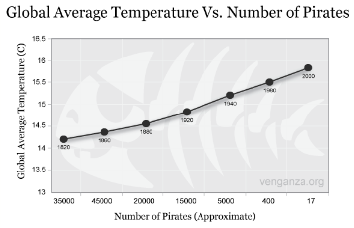</center>

## Taxa de analfabetismo e mortalidade infantil

<center>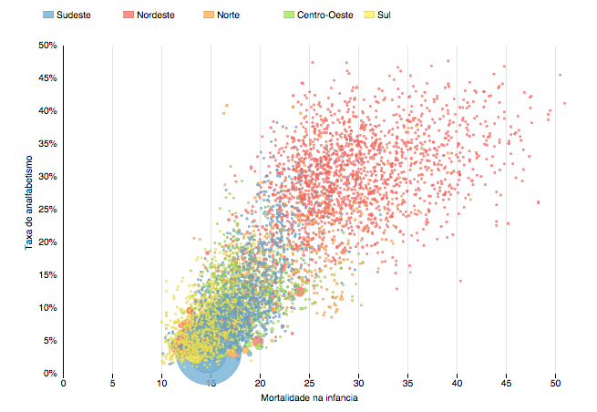</center>

Mortalidade: número de mortes de crianças de até 5 anos por mil nascidos vivos. 

Analfabetismo: % de analfabetos na população de 18 anos ou mais.

[Fonte](http://blog.estadaodados.com/analfabetismo-mortalidade/)


## Google Correlate

Quais os termos de busca mais se correlacionam a outros?

[Exemplo](http://blog.estadaodados.com/nas-buscas-do-google-brasil-agua-se-correlaciona-com-falta/):

<center>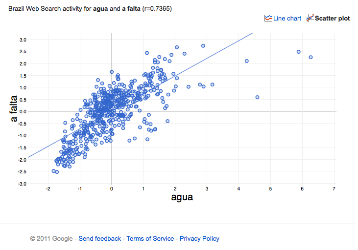</center>


##
<center></center>


# Associação entre qualitativa e quantitativa

## Exemplo: Acidentes de carro em NY {.smaller}
**Variável quantitativa:** número de acidentes de carro diários

**Variável qualitativa:** região de NY

<center>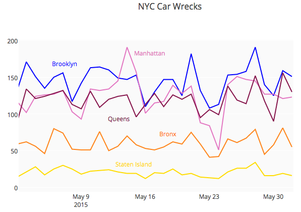</center> 

## Histogramas dos acidentes de carro diários por região de NY

<center>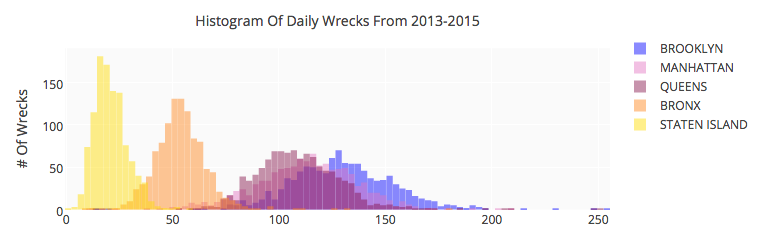</center> 

## Boxplots dos acidentes de carro diários por região de NY

<center>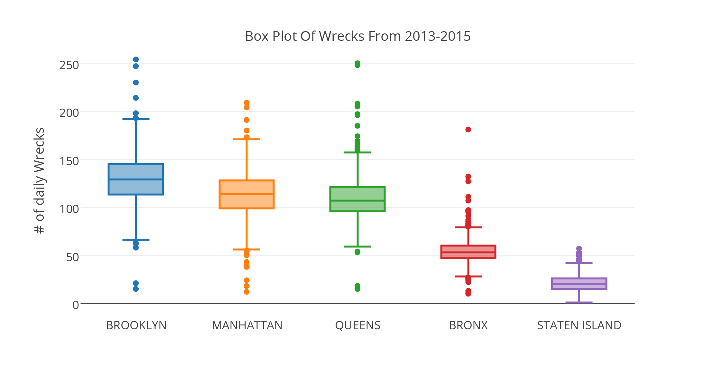</center> 

[Fonte](https://plot.ly/4916/~etpinard/)


## Exemplo: Tipo de risada e idade

<center>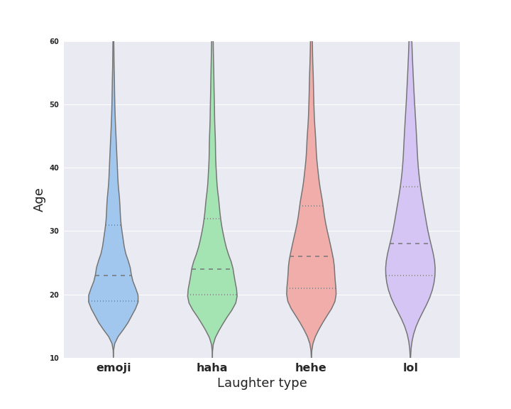</center>

[Fonte](https://research.facebook.com/blog/1605690073053884/the-not-so-universal-language-of-laughter/)

## Leituras

* [OpenIntro](https://www.openintro.org/stat/textbook.php): seções 1.6, 1.7
* [Ross](http://www.sciencedirect.com/science/book/9780123743886): seções 2.5, 3.7

Leitura complementar: [Online Dashboards: Eight Helpful Tips You Should Hear From Visualization Experts](http://blog.plot.ly/post/123617968702/online-dashboards-eight-helpful-tips-you-should)

<center>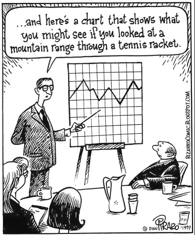</center>

##

Slides produzidos pelos professores:

* Samara Kiihl

* Tatiana Benaglia

* Benilton Carvalho
