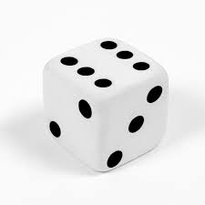
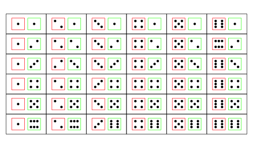
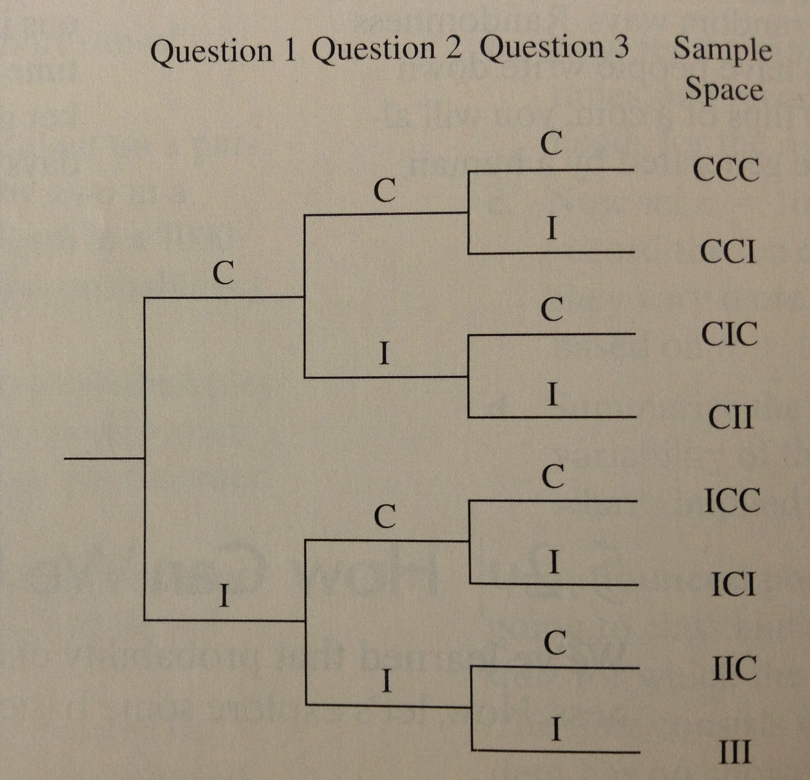
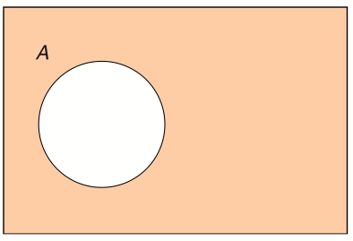

# Probabilidade

## Introdução {.build}

Diariamente, tomamos decisões com relação a eventos incertos:

> Devo investir na bolsa?

> Vale a pena fazer um plano odontológico?

> Devo contratar um seguro para o meu carro?

> Devo levar um guarda-chuva?

> Devo me matricular numa disciplina eletiva com baixa taxa de aprovação?

## Experimentos Aleatórios {.build}
**Experimento:** qualquer processo que produza uma observação ou resultado

**Experimento Determinístico:** é aquele que, dada uma ação controlada, sabemos exatamente qual será o resultado obtido

Exemplo: lançamento de um dado com todas as faces iguais a 6 

<div class="columns-2">

Único resultado possível? 6 


</div>

**Experimento Aleatório:** é aquele em que não se tem certeza sobre seus resultados, a prior. Mútiplos resultados podem ser obtidos a partir de uma única ação. Cada vez que se repete o experimento, o resultado pode ser diferente. 

Exemplo: lançamento de um dado de seis faces 

<div class="columns-2">

Resultados possíveis: {1, 2, 3, 4, 5, 6} 


</div>


## Probabilidade {.build}

**Probabilidade**: medida de incerteza sobre certos eventos ou características de interesse.

Tais eventos, em geral, estão associados a **experimentos aleatórios**.

> **Aleatorização:**

> * Jogar um dado.

> * Jogar uma moeda.

> * Girar uma roleta.


> Ex: para aleatorizar dois tratamentos entre pacientes, pode-se lançar uma moeda. Se sair "cara" o paciente recebe a droga A, se sair "coroa", recebe a droga B.


## Exemplo: Lançamento de dado {.build}

<center></center> 

 Você está jogando Ludo: um dado é usado para movimentar as peças.
 
> Em certo ponto do jogo, durante a sua vez, o 6 sai 3 vezes seguidas e você vence o jogo!


>  Dentre os de **100 lançamentos** do dado durante a sua vez, seu oponente no jogo comenta que o **6 saiu 23 vezes**.


> Seu oponente então reclama que o dado estava te favorecendo com tantos 6, portanto o dado não era "justo".

## Exemplo: Lançamento de dado {.build}

> Se o dado é "justo", quantos 6 você espera que ocorram em 100 lançamentos?

> Se um dado "justo" é lançado diversas vezes, esperamos que o 6 ocorra $1/6$ das vezes.

> 100 lançamentos: $100/6\approx 17$ vezes.

> É muito improvável que o 6 saia 23 vezes em 100 lançamentos? Como verificar?

>  + Lance o dado 100 vezes.
>  + Conte o número de 6 que aparecem.
>  + Repita várias vezes esse processo.

> Você obtém assim a distribuição de frequências do 6 em 100 lançamentos do dado.


## Simulação 1: lançamento de um dado 100 vezes {.smaller .build}

<center>
```{r, echo=FALSE, message=FALSE, fig.height=4}
library(TeachingDemos)
set.seed(1234)
x1 <- dice(rolls=100, ndice=1)
plot.dice(x1, layout=c(15, 7))
```
</center>

```{r,echo=FALSE}
library(knitr)

a <- as.data.frame(table(x1))

d <- data.frame(Freq=a$Freq)
d <- t(d)
colnames(d) <- c(" 1"," 2"," 3"," 4"," 5"," 6")
rownames(d) <- c("Freq")
kable(d)

cum1 <- matrix(NA,ncol=1,nrow=length(x1$Red))
for (i in 1:length(x1$Red))
  {
    cum1[i] <- length(which(x1$Red[1:i]==6))/i
  }
```

## Simulação 2: lançamento de um dado 100 vezes {.smaller }

<center>
```{r, echo=FALSE, message=FALSE, fig.height=4}
set.seed(12345)
x2 <- dice(rolls=100, ndice=1)
plot.dice(x2)
```
</center>

```{r,echo=FALSE}
a <- as.data.frame(table(x2))

d <- data.frame(Freq=a$Freq)
d <- t(d)
colnames(d) <- c(" 1"," 2"," 3"," 4"," 5"," 6")
rownames(d) <- c("Freq")
kable(d)

cum2 <- matrix(NA,ncol=1,nrow=length(x2$Red))
for (i in 1:length(x2$Red))
  {
    cum2[i] <- length(which(x2$Red[1:i]==6))/i
  }
```


## Simulação 3: lançamento de um dado 100 vezes {.smaller }

<center>
```{r,echo=FALSE,message=FALSE,fig.height=4}
set.seed(12347)
x <- dice(rolls=100,ndice=1)
plot.dice(x)
```
</center>

```{r,echo=FALSE}
a <- as.data.frame(table(x))

d <- data.frame(Freq=a$Freq)
d <- t(d)
colnames(d) <- c(" 1"," 2"," 3"," 4"," 5"," 6")
rownames(d) <- c("Freq")
kable(d)
```

## Simulação 3: lançamento de um dado 100 vezes {.smaller }

```{r,echo=FALSE}
cum <- matrix(NA,ncol=1,nrow=length(x$Red))
for (i in 1:length(x$Red))
  {
    cum[i] <- length(which(x$Red[1:i]==6))/i
  }

ocorre6 <- ifelse(x$Red==6,"sim","não")
dd <- data.frame(v1=1:100,v2=ocorre6,v3=round(cum,2))
colnames(dd)=c("Lançamento","6 ocorre?","Proporção Acumulada de 6")
kable(dd[c(1:4,96:100),])

```

## Simulação 3: lançamento de um dado 100 vezes {.smaller }

<center>
```{r,echo=FALSE,fig.height=5}
plot(x=1:length(x$Red), y=cum, ylim=c(0,1), type="l", xlab="Número de Lançamentos", ylab="Proporção Acumulada de 6", cex.axis=1.3, cex.lab=1.3, lwd=2, col="blue")
abline(h=1/6, col="red", lwd=2, lty=2)
```
</center>


## Simulação 2: lançamento de um dado 100 vezes {.smaller }

<center>
```{r,echo=FALSE,fig.height=5}
plot(x=1:length(x2$Red), y=cum2, ylim=c(0,1), type="l", xlab="Número de Lançamentos", ylab="Proporção Acumulada de 6", cex.axis=1.3, cex.lab=1.3, lwd=2, col="blue")
abline(h=1/6, col="red", lwd=2, lty=2)
```
</center>


## Simulação 1: lançamento de um dado 100 vezes {.smaller }

<center>
```{r,echo=FALSE,fig.height=5}
plot(x=1:length(x1$Red), y=cum1,ylim=c(0,1), type="l", xlab="Número de Lançamentos", ylab="Proporção Acumulada de 6", cex.axis=1.3, cex.lab=1.3, lwd=2, col="blue")
abline(h=1/6,col="red", lwd=2, lty=2)
```
</center>


## Simulação: lançamento de um dado 100 vezes {.smaller .build}

> A cada simulação  (100 lançamentos e anotando o total de 6) obtivemos um resultado diferente: `r length(which(x1$Red[1:i]==6))`, `r length(which(x2$Red[1:i]==6))` e `r length(which(x$Red[1:i]==6))`.

> Se repetirmos as simulação 1000 vezes, temos uma idéia da distribuição de frequências da proporção de 6 em 100 lançamentos.

```{r,echo=FALSE,fig.height=3.5}
B=1000
X=100
propSix <- matrix(NA,ncol=1,nrow=B)
for (i in 1:B)
  {
    x <- dice(rolls=X,ndice=1)
    propSix[i] <- length(which(x$Red==6))/100
  }

hist(propSix,xlab="Proporção Acumulada de 6 em 100 lançamentos",ylab="Frequência",main="",col="lightblue",cex.axis=1.5,cex.lab=1.5)
```

   Média: `r round(mean(propSix),3)`. Mediana: `r round(median(propSix),3)`.


## Simulação 4: lançamento de um dado 1000 vezes {.smaller }

<center>
```{r,echo=FALSE,fig.height=4}
set.seed(12347)
x <- dice(rolls=10000,ndice=1)

#a <- as.data.frame(table(x))

#d <- data.frame(Freq=a$Freq)
#d <- t(d)
#colnames(d) <- c(" 1"," 2"," 3"," 4"," 5"," 6")
#rownames(d) <- c("Freq")
#kable(d)

##### Propocao acumulada de 6
cum <- matrix(NA,ncol=1,nrow=length(x$Red))
for (i in 1:length(x$Red))
  {
    cum[i] <- length(which(x$Red[1:i]==6))/i
  }

par(mar=c(5.1,4.1,1.1,2.1))
plot(x=1:length(x$Red), y=cum, ylim=c(0, 0.4), type="l", xlab="Número de Lançamentos", ylab="Proporção Acumulada de 6", cex.axis=1.3, cex.lab=1.3, col="blue", lwd=2)
abline(h=1/6, col="red", lty=2, lwd=2)
```
</center>

> Com poucos lançamentos, a proporção de 6 pode flutuar bastante, mas com o aumento do número de lançamentos, a proporção acumulada de 6 estabiliza em $1/6$.

## Lei dos Grandes Números {.build}

O resultado da simulação é um caso particular da [Lei dos Grandes Números](https://pt.wikipedia.org/wiki/Lei_dos_grandes_n%C3%BAmeros), resultado provado em 1689 pelo matemático suíço Jacob Bernoulli.
  
<center></center> 

> *Se um evento de probabilidade p é observado repetidamente em ocasiões independentes, a proporção da frequência observada deste evento em relação ao total número de repetições converge em direção a p à medida que o número de repetições se torna arbitrariamente grande.*


## Probabilidade {.build}

Em um fenômeno aleatório, a **probabilidade** de um resultado acontecer é a proporção de vezes que o resultado ocorreu quando consideramos muitas observações do fenômeno em questão.

> * Quando dizemos que a probabilidade do $6$ sair no dado é $1/6$, estamos dizendo que a proporção esperada de $6$ em **vários lançamentos** (observações) do dado é $1/6$.

> * Quando a previsão do tempo diz que a chance de chuva para hoje é 70\%, quer dizer que para **vários dias** observados no passado com condições atmosféricas equivalentes ao dia de hoje a proporção observada de dias de chuva foi $0.7$.


## Como calcular probabilidades?

*Em um fenômeno aleatório, a **probabilidade** de um resultado acontecer é a proporção de vezes que o resultado ocorreu quando consideramos muitas observações do fenômeno em questão.*

<div class="columns-2">

> * Esta definição nem sempre é útil.

> * Quando a NASA lançou o primeiro ônibus espacial, como os cientistas sabiam a probabilidade de sucesso? Não havia nenhum dado sobre lançamentos no passado para que se pudesse calcular a probabilidade de sucesso.

> <center> 
<figure>

<figcaption> <font size="4">Ônibus espacial Columbia </font></figcaption>
</figure>
</center>
</div>

## Probabilidade {.build}

> Algumas vezes, é possível fazer alguma suposição sobre o fenômeno aleatório considerado.

> * Ao lançar um dado, podemos assumir que cada valor de $1$ a $6$ tenha a mesma chance de ocorrer: $1/6$.

> * Ao lançar uma moeda, podemos assumir que ela pode cair de um lado ou de outro com a mesma chance: $1/2$.


> Outras vezes, podemos utilizar a distribuição de frequências observadas como uma estimativa das probabilidades.


## Exemplo: dado {.build}

Estudar as probabilidades de ocorrência das faces de um dado.

> **Procedimento Empírico**: lançar o dado um certo número $n$ de vezes e contar o número de vezes, $n_i$, que a face $i=1,2,3,4,5,6$ ocorre. 

> Distribuição empírica das probabilidades:

$$f_{i}=\frac{n_{i}}{n}\,.$$


> Para diferentes vezes que esse experimento for realizado, 
a distribuição de frequência terá resultados diferentes 
(exemplo anterior, lançamento de 100 dados, várias vezes).

No entanto, espera-se que esses resultados, apesar de distintos, sejam semelhantes.


## Distribuição de Probabilidade {.build}

**Procedimento Teórico**: construir a distribuição de frequências populacionais (probabilidades) através de suposições teóricas.

> Suposições:

> * só podem ocorrer 6 faces: $\{1,2,3,4,5,6\}$;

> * o dado é perfeitamente equilibrado;

> * então, cada face deve ocorrer o mesmo número de vezes, ou seja $f_{i}=\frac{1}{6}$.


Face  | 1  | 2  | 3  | 4  | 5 | 6 | Total
------|----|----|----|----|---|---|------
Freq. Teórica | $\frac{1}{6}$ | $\frac{1}{6}$ | $\frac{1}{6}$ | $\frac{1}{6}$ | $\frac{1}{6}$ | $\frac{1}{6}$ | 1 

## Espaço Amostral {.build}

Para quantificar incerteza em fenômenos aleatórios usando probabilidades, precisamos primeiro especificar o conjunto de todos os  possíveis resultados do fenômeno em questão.


> * **Espaço Amostral**: todos os resultados possíveis do experimento (aleatório), denotado por $\Omega=\{\omega_{1},\omega_{2},... \}$.

> * **Probabilidade**: $P(\omega)$, para cada "ponto amostral"  $\omega$.


## Exemplos de Espaço amostral {.build}

1. Se o fenômeno considerado é observar o sexo de uma criança ao nascer:
<center>
$\Omega=\{F, M\}$ 
</center>

2. Se o experimento consiste em observar os resultados ao lançar uma moeda duas vezes:

$$\Omega=\{\omega_{1},\omega_{2},\omega_{3},\omega_{4}\}$$

$\omega_{1}=(C,C)$; $\omega_{2}=(C,X)$; $\omega_{3}=(X,C)$; $\omega_{4}=(X,X)$

$C=cara \quad \mbox{e} \quad X=coroa$


## Exemplo: dois dados {.build}

Experimento é lançar dois dados (1 vermelho e 1 azul) e anotar os valores:
<div class="columns-2">
<font size="4">
$$\Omega = \{(1,1),(1,2),(1,3),(1,4),(1,5),(1,6), \\ 
(2,1),(2,2),(2,3),(2,4), (2, 5), (2, 6), \\ 
(3, 1), (3, 2), (3, 3), (3, 4), (3, 5), (3, 6), \\
(4, 1), (4, 2), (4, 3), (4, 4), (4, 5), (4, 6), \\
(5, 1), (5, 2), (5, 3), (5, 4), (5, 5), (5, 6), \\
(6, 1), (6, 2), (6, 3), (6, 4), (6, 5), (6, 6)\}
$$
</font>

<center></center>

</div>

## Exemplo: testinho surpresa {.smaller .build}

Testinho surpresa com três questões de múltipla escolha.

> Em cada questão há 5 alternativas, apenas 1 é correta. 

> Experimento: anotar o resultado do aluno no testinho. 

> Ex: $CCI$ significa que o aluno acertou as duas primeiras questões e errou a última.

<div class="columns-2">

> $$\Omega=\{CCC,CCI,CIC,CII, \\
ICC,ICI,IIC,III\}$$

<center></center>
</div>

## Evento {.build}

**Evento** é um subconjunto do espaço amostral. Denotamos eventos pelas letras $A$, $B$, $C$, etc...

> Dizemos que o evento $A$ ocorreu sempre que o resultado observado pertencer ao subconjunto de elementos do evento $A$.


> * Experimento é lançar dois dados (1 vermelho e 1 verde) e anotar os valores:
<font size="4">
$$\Omega = \{(1,1),(1,2),(1,3),(1,4),(1,5),(1,6), \\ 
(2,1),(2,2),(2,3),(2,4), (2, 5), (2, 6), \\ 
(3, 1), (3, 2), (3, 3), (3, 4), (3, 5), (3, 6), \\
(4, 1), (4, 2), (4, 3), (4, 4), (4, 5), (4, 6), \\
(5, 1), (5, 2), (5, 3), (5, 4), (5, 5), (5, 6), \\
(6, 1), (6, 2), (6, 3), (6, 4), (6, 5), (6, 6)\}
$$
</font>

> **Evento:** soma dos valores é igual a 3.

> $$A=\{ (1,2),(2,1)\}$$

## Exemplo: testinho surpresa {.build }

<center></center>

$$\Omega=\{CCC,CCI,CIC,CII,ICC,ICI,IIC,III\}$$


Evento: o aluno acertou pelo menos duas questões e foi aprovado.

$$A=\{CCC,CCI,CIC,ICC\}$$

## Probabilidade de um evento {.build}

> Cada elemento do espaço amostral tem uma probabilidade de ocorrer.

> Portanto, cada evento (subconjunto do espaço amostral) também tem uma probabilidade.


> Duas regras:


> * A probabilidade de cada elemento do espaço amostral deve estar entre 0 e 1.


> * A soma das probabilidades de cada elemento do espaço amostral deve ser igual a 1.


## Exemplo: lançar uma moeda duas vezes {.build}

$C=cara$ 


$X=coroa$

 $\Omega=\{\omega_{1},\omega_{2},\omega_{3},\omega_{4}\}$ 
 
$\omega_{1}=(C,C)$; $\omega_{2}=(C,X)$; $\omega_{3}=(X,C)$; $\omega_{4}=(X,X)$.

> * considerando que a moeda é honesta: $$P(\omega_{i})=\frac{1}{4}\,,\quad\forall i=1,2,3,4\,.$$


> * seja o evento $A=\{\omega_{1},\omega_{4}\}=$ obter duas faces iguais:

$P(A)=P(\{\omega_{1},\omega_{4}\})=P(\omega_{1})+P(\omega_{4})=\frac{1}{4}+\frac{1}{4}=\frac{2}{4}=\frac{1}{2}$


## Equiprobabilidade {.build}


> $\Omega=\{\omega_{1},...,\omega_{n}\}$ finito.

> $P(\omega_{i})=\frac{1}{n}$, $\forall$ $i=1,2,...,n$.

> $A=\{\omega_{A_1},...,\omega_{A_m}\}$ evento em $\Omega$ com $m\leq n$ pontos amostrais

> então $P(A)=\frac{m}{n}$.

## Probabilidade de um evento {.build}


A probabilidade de um evento $A$, denotada por $P(A)$, é obtida somando as probabilidades de cada elemento do espaço amostral que pertence ao evento $A$.

> Quando cada elemento do espaço amostral tem a mesma probabilidade de ocorrer:
$$P(A)=\frac{\mbox{número de elementos no evento $A$}}{\mbox{número de elementos do espaço amostral}}$$

## Exemplos {.build}

**Exemplo 1:** moeda honesta é lançada uma vez
$\Omega= \{C,X\}$

$P(C)=P(X)=\frac{1}{2}$

$A=\{C\} \qquad \rightarrow \qquad P(A)=\frac{1}{2}$

**Exemplo 2:** moeda honesta é lançada duas vezes

$\Omega=\{(C,C), (X,C), (C,X), (X,X)\}$

 $P(C,C)=P(X,C)=P(C,X)=P(X,X)=\frac{1}{4}$

 $A=\{(X,X), (C,C)\} \qquad \rightarrow \qquad P(A)=\frac{2}{4}=\frac{1}{2}$
 

## Exemplo: dado honesto é lançado uma vez {.build}
 
$\Omega=\{\omega_{1},\omega_{2},\omega_{3},\omega_{4},\omega_{5},\omega_{6}\}$

em que $\omega_{i}=$ face $i$, $\forall$ $i=1,2,3,4,5,6\,.$

<center></center>

Como o dado é honesto, $P(\omega_{i})=\frac{1}{6}\,.$
 
Seja o evento $A=\{\mbox{a face é um número par}\}=\{\omega_{2},\omega_{4},\omega_{6}\}=\{2,4,6\}$ 
 
$$P(A)=P(\{2\},\{4\},\{6\})=P(2)+P(4)+P(6)=\frac{3}{6}=\frac{1}{2}$$


## Propriedades: Modelo Teórico {.build}
<div class="columns-2">
$(\Omega,P)$:

>    + $\Omega$ é o espaço amostral.

>    + $P$ é probabilidade em $\Omega$.

>    + Seja $A$ um evento em $\Omega$.

>    + $\varnothing$ é um conjunto vazio ou evento impossível.

Propriedades:

>   * $0\leq P(A) \leq 1$, $\forall$ evento $A$ em $\Omega$.

>   * $P(\Omega)=1$.

>   * $P(\varnothing)=0$.

</div> 


## Exemplo: Alunos de um Instituto {.smaller .build}

  Curso  | Masculino (Ma)  |  Feminino (Fe) | Total 
  --|-----------------|----------------|-------
  Matemática Pura (M) | 70 | 40| 110
  Matemática Aplicada (A) | 15 | 15| 30
  Estatística (E) | 10 | 20 | 30
  Computação (C) | 20 | 10 | 30
  Total|115|85|200

> Escolhendo um aluno ao acaso:

$$P(MP)=\frac{110}{200}=0.550 \qquad \qquad P(E)=\frac{30}{200}=0.150$$

$$P(M)=\frac{115}{200}=0.575 \qquad \qquad P(F)=\frac{85}{200}=0.425$$

##  Exemplo: Alunos de um Instituto {.smaller .build}

  Curso  | Masculino (Ma)  |  Feminino (Fe) | Total 
  --|-----------------|----------------|-------
  Matemática Pura (M) | 70 | 40| 110
  Matemática Aplicada (A) | 15 | 15| 30
  Estatística (E) | 10 | 20 | 30
  Computação (C) | 20 | 10 | 30
  Total|115|85|200

Seja o evento $I$: escolher ao acaso um aluno e ele ser estudante de estatística e do sexo masculino.

>  $I=E\cap Ma$, o evento $I$ é a interseção dos eventos $E$ e $Ma$.

> $P(E\cap Ma)=\frac{10}{200}=0.05$


## Interseção de Eventos

A interseção de $A$ e $B$ consiste de elementos do espaço amostral que pertencem tanto ao evento $A$ quanto ao evento $B$.

Denotamos $A\cap B$:

<center></center> 


## União de Eventos {.build}

A união de $A$ e $B$ consiste de elementos do espaço amostral que pertencem ao evento $A$ ou ao evento $B$.

Denotamos $A\cup B$:

<center> ou </center> 

Na figura da direita, $A$ e $B$ são denominados **disjuntos**, pois $A\cap B=\varnothing$.


## Probabilidade de União de Eventos {.smaller .build}

> $A\cup B$ contém elementos dos eventos $A$ ou $B$.

> Para calcular a probabilidade de $A\cup B$, podemos então somar a probabilidade de $A$ ocorrer e a probabilidade de $B$ ocorrer.

> Problema: ao fazer isso, estamos somando a probabilidade de $A\cap B$ duas vezes.


> Forma correta: $P(A\cup B)=P(A)+P(B)-P(A\cap B)$.

<center></center> 


## Exemplo: Alunos de um Instituto {.smaller .build}

  Curso  | Masculino (Ma)  |  Feminino (Fe) | Total 
  --|-----------------|----------------|-------
  Matemática Pura (M) | 70 | 40| 110
  Matemática Aplicada (A) | 15 | 15| 30
  Estatística (E) | 10 | 20 | 30
  Computação (C) | 20 | 10 | 30
  Total|115|85|200

  
  Seja $U$ o evento: escolher um aluno ao acaso e ele ser estudante de estatística ou do sexo masculino.
  
> $U=E\cup Ma$, o evento $U$ é uma união dos eventos $E$ e $Ma$.

 $P(E\cup Ma)= P(E)+P(Ma)-P(E\cap Ma)$ 

$$P(E)=\frac{10+20}{200}=0.150\quad\quad P(Ma)= \frac{70+15+10+20}{200}=0.575$$

$$P(E\cap Ma)=\frac{10}{200}=0.050$$

$$P(E\cup Ma)=0.150+0.575-0.050=0.675$$


## Exemplo: Alunos de um Instituto {.smaller .build}

  Curso  | Masculino (Ma)  |  Feminino (Fe) | Total 
  --|-----------------|----------------|-------
  Matemática Pura (M) | 70 | 40| 110
  Matemática Aplicada (A) | 15 | 15| 30
  Estatística (E) | 10 | 20 | 30
  Computação (C) | 20 | 10 | 30
  Total|115|85|200

No caso de eventos mutuamente exclusivos ou disjuntos, a interseção é vazia ($\varnothing$).

> Probabilidade de escolher um aluno ao acaso e ele ser estudante da matemática pura **e** da computação:
 
 $$P(M\cap C)=P(\varnothing)=0$$

> Probabilidade de escolher um aluno ao acaso e ele ser estudante da matemática pura **ou** da computação:

$$P(M\cup C)=P(M)+P(C)-P(M\cap C)=P(M)+P(C)=\frac{140}{200}=0.700$$


## Exemplo: Qual a chance de cair na malha fina? {.smaller .build}

80.2 milhões de declarações (2002).

(para simplificar, uma frequência de 90 representa 90.000).


Renda    | Caiu na malha fina | Não caiu na malha fina | Total
---------|--------------------|------------------------|-------
D - abaixo de 25000 | 90 | 14010 | 14100
C - 25000 a 49999 | 71 | 30629 | 30700
B - 50000 a 99999 | 69 | 24631 | 24700
A - acima de 100000 | 80 | 10620 | 10700
Total | 310 |79890 | 80200


Qual o espaço amostral?

> $$\Omega=\{\mbox{(A, sim), (B,sim),(C, sim),(D,sim),(A,não),(B,não),(C,não),(D,não)} \}$$

> É um fenômeno equiprovável?


## Exemplo: Qual a chance de cair na malha fina? {.smaller .build}

Renda    | Caiu na malha fina | Não caiu na malha fina | Total
---------|--------------------|------------------------|-------
D - abaixo de 25000 | 90 | 14010 | 14100
C - 25000 a 49999 | 71 | 30629 | 30700
B - 50000 a 99999 | 69 | 24631 | 24700
A - acima de 100000 | 80 | 10620 | 10700
Total | 310 |79890 | 80200

Se escolhermos uma declaração de 2002 aleatoriamente, qual a probabilidade dela ter caído na malha fina (evento $Z$)? 

> $$Z=\{\mbox{(A, sim), (B,sim),(C, sim),(D,sim)}\}$$

> $$P(Z)=\frac{310}{80200}=0.004$$

> Qual a probabilidade dela ter renda acima de 100.000 (evento $Y$)?

> $$Y=\{\mbox{(A, sim), (A,não)}\}$$

> $$P(Y)=\frac{10700}{80200}=0.133$$

## Exemplo: Qual a chance de cair na malha fina? {.smaller .build}

Renda    | Caiu na malha fina | Não caiu na malha fina | Total
---------|--------------------|------------------------|-------
D - abaixo de 25000 | 90 | 14010 | 14100
C - 25000 a 49999 | 71 | 30629 | 30700
B - 50000 a 99999 | 69 | 24631 | 24700
A - acima de 100000 | 80 | 10620 | 10700
Total | 310 |79890 | 80200

Se escolhermos uma declaração de 2002 aleatoriamente, qual a probabilidade dela ter renda acima de 100.000 e ter caído na malha fina (evento $W$)? 

$$W=Z\cap Y=\{\mbox{(A, sim)}\}$$

$$P(W)= P(Z\cap Y)=\frac{80}{80200}=0.001$$


## Evento complementar {.build .smaller}

No caso geral, sejam $A$ e $B$ subconjuntos de $\Omega$:

> * $A\cap B=$ evento em que $A$ e $B$ ocorrem simultaneamente.

> * $A\cup B=$ evento em que $A$ ou $B$ ocorrem.

> * $P(A\cup B)=P(A) + P(B) - P(A\cap B)$.

> * se $\{A\cap B\}=\varnothing$, então $P(A\cup B)=P(A) + P(B)$.

> * $A$ e $B$ são **complementares** se $A\cap B = \varnothing$ e $A\cup B=\Omega$.

>  * como $P(A) + P(B)=1$, então $P(B)=1-P(A)$

>  * $B$ é denotado por $B=A^{C}$ (indicado na cor laranja).

<center></center> 

## Exemplo: Cartões de Crédito {.build}

<center></center> 


Um estabelecimento aceita Visa ou Mastercard. Dentre os clientes, 22\% possuem Mastercard, 58\% possuem Visa e 14\% possuem os dois. Qual a probabilidade de que um cliente tenha pelo menos um destes cartões?


## Exemplo: Cartões de Crédito {.build}

Um estabelecimento aceita Visa ou Mastercard. Dentre os clientes, 22\% possuem Mastercard, 58\% possuem Visa e 14\% possuem os dois. Qual a probabilidade de que um cliente tenha pelo menos um destes cartões?


> Espaço amostral: $\Omega=\{V,M,VM,N\}$, onde V="tem só Visa", M="tem só Matercard", VM="tem Visa e Mastercard", N="não tem Visa nem Mastercard".

> Evento A: cliente possui Mastercard. $A=\{M,VM\}$.

> Evento B: cliente possui Visa.  $B=\{V,VM\}$.

> $P(A)=0.22$

> $P(B)=0.58$.

> $P(A\cap B)=0.14$. 

## Exemplo: Cartões de Crédito {.build}

>  $A\cup B$: cliente possui pelo menos um dos cartões. $A\cup B=\{ V,M,VM\}$.

> $P(A\cup B)=P(A)+P(B)-P(A\cap B)=0.22+0.58-0.14=0.66$.

> Evento C: cliente não possui nenhum dos cartões. $C=\{ N\}$.

> $C$ é complementar de $A\cup B$, pois: $C\cup (A\cup B)=\Omega$ e $C\cap (A\cup B)=\varnothing$. 

> Então $P(C)=1-P(A\cup B)=0.34$.


## Exemplo: Cinto de segurança e acidentes {.build}

Usava cinto  | Sobreviveu ($S$) | Não sobreviveu ($\bar{S}$) | Total
------------- | ----------------| ---------------------------| ------
Sim ($C$)      | 414368 | 510 | 412878
Não ($\bar{C}$) | 162527 | 1601 | 164128
Total | 574895 | 2111 | 577006


$$\Omega=\{(C,S),(C,\bar{S}),(\bar{C},S),(\bar{C},\bar{S}) \} $$ 

Se selecionarmos um registro ao acaso, qual a probabilidade dele conter uma morte registrada?

$P(M)=\frac{2111}{577006}=0.004$


## Exemplo: Cinto de segurança e acidentes {.build}

Usava cinto  | Sobreviveu ($S$) | Não sobreviveu ($\bar{S}$) | Total
------------- | ----------------| ---------------------------| ------
Sim ($C$)      | 414368 | 510 | 412878
Não ($\bar{C}$) | 162527 | 1601 | 164128
Total | 574895 | 2111 | 577006


$$\Omega=\{(C,S),(C,\bar{S}),(\bar{C},S),(\bar{C},\bar{S}) \} $$ 


 Se selecionarmos um registro ao acaso, qual a probabilidade de constar que o cinto não foi usado?

$P(\bar{C})=\frac{164128}{577006}=0.284$

## Leituras

* [OpenIntro](https://www.openintro.org/stat/textbook.php): seção 2.1.
* [Ross](http://www.sciencedirect.com/science/book/9780123743886): seções 4.1, 4.2, 4.3, 4.4.

##

Slides produzidos pelos professores:

* Samara Kiihl

* Tatiana Benaglia

* Benilton Carvalho