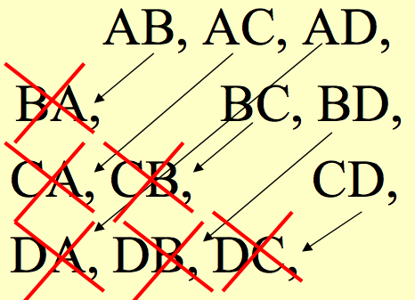

# Probabilidade

## Experimento: Lançamento de 3 moedas {.build}

 Lançar 3 moedas honestas simultaneamente, e observar a face voltada para cima. 

 > $$\Omega= \{ (CCC), (CCX),(CXC),(XCC),(XXC),(XCX),(CXX),(XXX)\}$$

 > Moedas honestas, então cada elemento do espaço amostral tem igual probabilidade de ocorrer: 1/8

 > Qual é a probabilidade de obtermos 3 caras?  
 
 > $A=\{(CCC)\}$
 
 > $$P(A)=\frac{\mbox{número de elementos em A}}{\mbox{número de elementos em $\Omega$}}= \frac{1}{8}$$

## Experimento: Lançamento de 3 moedas {.build}
> Qual a probabilidade de obtermos pelo menos 2 caras?
 
 > $B=\{(CCC),(CCX),(CXC),(XCC)\}$
 
 > $$P(B)=\frac{\mbox{número de elementos em B}}{\mbox{número de elementos em $\Omega$}}= \frac{4}{8}=\frac{1}{2}$$

## Jogo de dados {.build}
Dois dados honestos são lançados simultaneamente

 <center></center> 

> O jogador deve escolher uma das duas opções antes do lançamento dos dados. Caso a opção escolhida ocorra, ele será o vencedor.

> As duas opções são:

> + Soma das duas faces é igual a 7

> + Maior valor obtido nos dois dados seja no máximo 3

> Qual das duas possibilidades ele deve escolher? 

## Jogo de dados {.build}
Espaço amostral:

> <center></center> 

> Dados honestos, então cada elemento do espaço amostral tem igual probabilidade de ocorrer: 1/36

## Jogo de dados {.build}
$A=\{\mbox{conjunto dos pares  (i,j) tais que i+j=7}\}$

> <center></center>

> $A=\{(1,6),(2,5),(3,4),(4,3),(5,2),(6,1)\}$
 
> $$P(A)=\frac{\mbox{número de elementos em A}}{\mbox{número de elementos em $\Omega$}}=\frac{6}{36}$$
 
## Jogo de dados {.build}

$B=\{\mbox{conjunto dos pares (i,j) tais que } i \leq 3 \mbox{ e } j \leq 3 \}$

> <center></center>

> $B=\{(1,1),(1,2),(1,3),(2,1),(2,2),(2,3),(3,1),(3,2),(3,3)\}$
 
> $$P(B)=\frac{\mbox{número de elementos em B}}{\mbox{número de elementos em $\Omega$}}=\frac{9}{36}=\frac{1}{4}$$

> Como $P(A)<P(B)$ é mais vantajoso escolher a opção "maior valor seja no máximo 3"
 
# Regras de Contagem

## Regras de contagem {.build}
* Espaço amostral finito $\Omega=\{\omega_1,\ldots,\omega_n\}$ com elementos equiprováveis, então:

> $$P(A)=\frac{\mbox{número de elementos no evento A}}{\mbox{número de elementos no espaço amostral}}\,.$$
 
> * Precisamos conhecer regras de contagem para calcular probabilidade de eventos.

> **Exemplo:** Em um grupo de 100 pessoas, 2 são daltônicas. Dez pessoas são escolhidas ao acaso e sem reposição. Qual a probabilidade de escolhermos apenas uma pessoa daltônica?

>  De quantas maneiras podemos selecionar 10 pessoas a partir de um grupo de 100 pessoas, sem reposição?

## Regra da adição {.build}

* **Regra da adição:**  suponha que temos dois procedimentos possíveis para executarmos uma tarefa, ou seja, basta executarmos um dos dois procedimentos para que a tarefa tenha sido executada.

> O procedimento $P_1$ tem $n_1$ formas de ser executado e o procedimento $P_2$ tem $n_2$  formas de ser executado. 

> O total de maneiras para executarmos a tarefa é então dado por $n_1+n_2$.

* **Exemplo:** Entre as opções de sobremesa de um restaurante, você pode escolher entre sorvete e torta. Há dois sabores de torta: baunilha ou cereja.  Há três sabores de sorvete: morango, chocolate e creme.

> Portanto, há $2+3= `r 2+3`$ opções de sobremesa no restaurante.

## Regra da multiplicação {.build}

* **Regra da multiplicação:**  suponha que para realizarmos uma tarefa temos que executar dois procedimentos, denotados por $P_1$ e $P_2$. 

> O procedimento $P_1$ tem $n_1$ formas de ser executado e o procedimento $P_2$ tem $n_2$ formas de ser executado. 

> O total de maneiras para executarmos a tarefa é dado por $n_1 \times  n_2$.

* **Exemplo:** Uma peça manufaturada deve passar por três estações de controle.

> Em cada estação a peça é inspecionada com relação a uma determinada característica e marcada adequadamente. 

## Regras de contagem {.build}
Na primeira estação, três classificações são possíveis (ok, excelente, retrabalho), enquanto que nas duas últimas, duas classificações são possíveis (ok, retrabalho). 

> De quantas maneiras uma peça pode ser marcada?

1. Primeira estação: 3 maneiras diferentes.

2. Segunda estação: 2 maneiras diferentes.

3. Terceira estação: 2 maneiras diferentes.

> A peça pode ser marcada de $3\times2\times2= `r 3*2*2`$ maneiras diferentes.

## Exemplo: Sobremesas {.build}
Entre as opções de sobremesa de um restaurante, você pode escolher entre sorvete e torta. Há dois sabores de torta: baunilha ou cereja. Há três sabores de sorvete: morango, chocolate e creme.

> Apenas aos sábados, o restaurante oferece a "Torta da Casa", que é uma torta com sorvete em cima. Aos sábados, quantas opções de sobremesa tem um cliente?

> * $2+3= `r 2+3`$ opções caso não escolha "Torta da Casa".

> * $2\times 3= `r 2*3`$ opções de Torta da Casa".

> * Total: `r 2+3 + 2*3` opções de sobremesa.

## Exemplo: Placa de carro {.build}

De quantas formas diferentes podemos escolher a placa de um carro, tendo essa 3 letras e 4 números?

<center></center>

>	$$ 26 \times 26 \times 26 \times 10 \times 10 \times 10 \times 10 = 175.760.000$$ 

> E se não pudesse haver repetição de letras e números?
	$$ 26 × 25 × 24 × 10 × 9 × 8 × 7 = 78.624.000$$


## Permutação {.build}
* Suponha que tenhamos uma coleção $O=\{w_1,w_2,...,w_n\}$ de $n$ objetos. De quantas maneiras podemos permutar (dispor) estes elementos? 

> * O número de maneiras que podemos fazer isto é denominado **permutação**.

> * Suponha que temos $n$ caixas e queremos dispor os $n$ objetos de $O$ nessas caixas. 
> <center></center>

> Aplicando a regra da multiplicação, temos que o número de maneiras de permutar $n$ elementos é:
>       $$n\times(n-1)\times\ldots\times1=n!$$

## Exemplos {.build}
* **Exemplo 1**: Se tivermos três CD's ($a$, $b$ e $c$). De quantas formas diferentes posso distribuí-los para três amigos?

> $$3! = 3 \times 2 \times 1 = 6 $$ 

>Ou seja, temos as seguintes permutações: $abc, acb, bac, bca, cab, cba$.

> * **Exemplo 2**: Quantos anagramas podemos formar com a palavra ERVILHAS, sendo que eles comecem com a letra E e terminem com vogal?

> $$ 1 \times 6! \times 2 = `r factorial(6)*2`$$

## Permutação {.build}

Suponha que queremos permutar $n$ objetos, mas alguns deles são indistinguíveis.

> **Exemplo**: Quantos anagramas podemos formar com a palavra PEPPER?
	
>	Seria $6! = 720$, certo?
	
> Mas note que P^1^E^1^P^2^P^3^E^2^R = P^2^E^1^P^1^P^3^E^2^R

> Na verdade, existem $3! 2! = `r factorial(3)*factorial(2)`$ permutações quer resultam no mesmo anagrama

> Portanto, o número de possíveis anagramas distintos é:

$$ \frac{6!}{3!2!} = `r factorial(6)/(factorial(3)*factorial(2))`$$

## Arranjo {.build}
* Suponha que tenhamos uma coleção $O=\{w_1,w_2,...,w_n\}$ de $n$ objetos. 

> * De quantas maneiras podemos escolher $r$ destes elementos? 

> * O número de maneiras que podemos fazer isto é denominado **arranjo**.

> * Suponha que temos $r$ caixas e queremos dispor os $n$ objetos de $O$ nessas caixas. 
> <center></center>

## Arranjo {.build}

> Aplicando a regra da multiplicação, temos que o número de maneiras de arranjar $n$ elementos em $r$ caixas é: 
>       $$n \times(n-1) \times \ldots \times (n-r+1) = \frac{n!}{(n-r)!} = A(n,r)$$
       
> * **Exemplo:** Se tivermos os objetos $a$, $b$, $c$ e $d$, de quantas maneiras podemos escolher 2 elementos: 

> $$ A(4, 2) = \frac{4!}{(4-2)!} = 12 $$

> Que seriam o seguinte: $ab,ac,ad,ba,bc,bd,ca,cb,cd,da,db,dc$.

## Combinação {.build}
* Suponha que tenhamos uma coleção $O=\{w_1,w_2,...,w_n\}$ de $n$ objetos. 

> * De quantas maneiras podemos escolher $r$ destes elementos sem considerarmos a ordem? 

> * O número de maneiras que podemos fazer isto é denominado **combinação**.
  
> * O número de maneiras de alocarmos os $n$ objetos em $r$ caixas é:
> $$\frac{n!}{(n-r)!}$$

## Combinação {.build}
* Após alocarmos os $r$ objetos, temos $r!$ formas de permutá-los, então o número de maneiras de escolhermos $r$ objetos sem importar a ordem dentre $n$ objetos é:

> $$\frac{n!}{r!(n-r)!}=\binom{n}{r}=C(n,r)$$
      
> * **Exemplo:** Se tivermos os objetos $a$, $b$, $c$ e $d$, de quantas maneiras podemos escolher 2 elementos sem considerar a ordem?

> $$ C(4, 2) = \binom{4}{2} = `r choose(4, 2)`$$

> Que seriam o seguinte: $ab,ac,ad,bc,bd,cd$.

## Exemplo {.build}
Sete atletas estão competindo nas olimpíadas. O pódium tem 3 lugares: ouro, prata e bronze. Quantos pódiuns podem ser feitos?

<div class="columns-2">
> <center></center>

 - A ordem importa (ouro, prata e bronze):

> $$7 \times 6 \times 5 = `r 7*6*5`$$

> $$A(7,3)=\frac{7!}{(7-3)!}= `r factorial(7)/factorial(7-3)`$$

- A ordem não importa:

> $$C(7,3)=\frac{7!}{3!(7-3)!}= `r choose(7, 3)`$$
</div>

## Exemplo {.build .smaller}

> <center></center> 

Em um grupo de 100 pessoas, 2 são daltônicas. Dez pessoas são escolhidas ao acaso e sem reposição. Qual a probabilidade de escolhermos apenas uma pessoa daltônica?

> De quantas maneiras podemos selecionar 10 pessoas a partir de um grupo de 100 pessoas, sem reposição?

> $$C(100,10)=\binom{100}{10}$$
 
> De quantas maneiras podemos selecionar 1 pessoa a partir de um grupo de 2 pessoas daltônicas?
  
>  $$C(2,1)=\binom{2}{1}$$
  

## Exemplo {.build}
Em um grupo de 100 pessoas, 2 são daltônicas. Dez pessoas são escolhidas ao acaso e sem reposição. Qual a probabilidade de escolhermos apenas uma pessoa daltônica?

> De quantas maneiras podemos selecionar 9 pessoas a partir de um grupo de 98 pessoas com visão normal?
  
> $$C(98,9)=\binom{98}{9}$$  

> Então, a probabilidade de escolhermos apenas uma pessoa daltônica:
> $$\frac{\binom{2}{1}\binom{98}{9}}{\binom{100}{10}}$$

## Exemplo {.build}
Uma caixa contém 2 bolas vermelhas, 3 verdes e 2 azuis. Duas bolas são selecionadas aleatoriamente. Qual a probabilidade de que nenhuma bola seja azul?

> * Total de bolas: 7.
> * Maneiras de sortear 2 bolas dentre 7 bolas:  $C(7,2)=\binom{7}{2}=\frac{7!}{2!(7-2)!}=21$.
> * $A$=sortear 2 bolas, nenhuma sendo azul.

> $$C(5,2)=\frac{5!}{2!(5-2)!}=`r choose(5, 2)`$$

> * $$P(A)=\frac{10}{21}$$

## Exemplo {.build}
```{r, echo=FALSE}
na <- 15 ## número total de meninos
nb <- 10 ## número total de meninas
nt <- na + nb
a <- 2 ## número de meninos a ser sorteadas
b <- 1 ## número de meninas a ser sorteados
t <- a + b
choosea <- choose(na, a)
chooseb <- choose(nb, b)
chooset <- choose(nt, t)
```

Em uma classe, há `r na` meninos e `r nb` meninas. Três alunos são selecionados ao acaso. Qual a probabilidade de sortear `r b` menina e `r a` meninos?

> * Maneiras de sortear `r t` alunos dentre `r nt`:  
> $C(`r nt`,`r t`)=\binom{`r nt`}{`r t`}=\frac{`r nt`!}{`r t`!(`r nt`-`r t`3)!}= `r chooset`$.

> * $A$=sortear `r b` menina e `r a` meninos.

> $C(`r nb`,`r b`) = \frac{`r nb`!}{`r b`!(`r nb`-`r b`)!}= `r chooseb` \;\;\;\;\;$ e $\;\;\;\;\; C(`r na`,`r a`) = \frac{`r na`!}{`r a`!(`r na`-`r a`)!}= `r choosea`$

> Número de elementos em $A$= $C(`r nb`,`r b`)$ x $C(`r na`,`r a`) = `r chooseb * choosea`$.

> * $$P(A)=\frac{`r chooseb * choosea`}{`r chooset`}=\frac{21}{46}$$

## Exemplo {.build}
```{r, echo=FALSE}
bb <- 4 ## bolas brancas
bv <- 5 ## bolas vermelhas
ba <- 6 ## bolas azuis
k <- 3 ## número de bolas selecionadas
t <- bb + bv + ba
comb_tk <- choose(t,k)
comb_bvk <- choose(bv, k)
```

Uma sacola tem `r bb` bolas brancas, `r bv` vermelhas e `r ba` azuis. Três bolas são selecionadas ao acaso da sacola. Qual a probabilidade de que todas elas sejam vermelhas?

> * Total de bolas: `r t`.
> * Maneiras de sortear `r k` bolas dentre `r t` bolas:  
> $C(`r t`, `r k`)=\binom{`r t`}{`r k`}=\frac{`r t`!}{`r k`!(`r t`-`r k`)!}=`r comb_tk`$.
> * $A$=sortear `r k` bolas vermelhas. 

> $$C(`r bv`, `r k`)=\frac{`r bv`!}{`r k`!(`r bv`-`r k`)!}=`r comb_bvk`\,.$$

> * $$P(A)=\frac{`r comb_bvk`}{`r comb_tk`}=\frac{2}{91}\,.$$

# Amostragem

## Amostragem
<center></center>

## Amostragem Aleatória Simples {.build}
Amostragem aleatória simples (AAS) é um plano amostral no qual $n$ unidades são selecionadas de uma lista com $N$ unidades, de tal forma que cada combinação possível das $n$ unidades tenha a mesma probabilidade de ser selecionada.

> Há dois tipos de AAS:

> * $AAS_c$: amostragem aleatória simples com reposição.

> * $AAS_s$: amostragem aleatória simples sem reposição.

## Seleção de Amostras {.build}
Número de amostras possíveis de $n$ elementos de uma população de $N$.
 
> * $AAS_c$: $N^n$.

> * $AAS_s$: 
    + $\binom{N}{n}$, caso não ordenado.
    + $\frac{N!}{(N-n)!}$, caso ordenado.
 
## Amostragem Aleatória Simples {.build}

**Exemplo**: amostra de tamanho $n=2$ de uma população de tamanho $N=4$. 
 
> Elementos da população: A, B, C e D.

> Usando $AAS_c$, podemos obter: $4^2=16$ amostras diferentes.

> <center></center>

## Amostragem Aleatória Simples {.build}

**Exemplo:** amostra de tamanho $n=2$ de uma população de tamanho $N=4$. 
 
> Elementos da população: A, B, C e D.
 
> Usando $AAS_s$, ordenada, podemos obter: $4!/(4-2)!=12$ amostras diferentes.

> <center></center> 

## Amostragem Aleatória Simples {.build}

**Exemplo:** amostra de tamanho $n=2$ de uma população de tamanho $N=4$. 
 
> Elementos da população: A, B, C e D.
 
> Usando $AAS_s$, não-ordenada, podemos obter: $\binom{4}{2}=6$ amostras diferentes.

> <center></center> 

## Amostragem Aleatória Simples {.build} 
 $AAS$: todas as amostras têm a mesma probabilidade de serem selecionadas. 
 
> A probabilidade de se selecionar cada amostra de tamanho $n$ é:
 
> * $AAS_c$:  $1/N^n$.
 
> * $AAS_s$: 
     + $1/\binom{N}{n}$, caso não ordenado.
     + $1/\frac{N!}{(N-n)!}$, caso ordenado.
     
## Piada no Facebook

<center></center>


## Exemplo {.build}
Uma comissão formada por 3 estudantes tem que ser selecionada numa classe de 20 alunos. 

> De quantas formas diferentes pode ser selecionada essa comissão?

> $$C(20,3)=\binom{20}{3}=\frac{20!}{3! (20-3)!}= `r choose(20, 3)`$$

(sem reposição e ordem não importa)

## Exemplo {.build}
Um ônibus possui 10 assentos disponíveis. 

> De quantas formas 7 passageiros podem ocupar os assentos?

> $$ \frac{10!}{(10-7)!}=\frac{10!}{3!}=10\times9\times8\times7\times6\times5\times4=604800$$

(sem reposição e ordem importa)

## Exemplo {.build .smaller}
Quantos números de 4 dígitos podemos formar com os dígitos 1, 2, 3, 4, 5, 6?

> $6 ^4=1296$  (com reposição)

> Qual a probabilidade de se escolher um número dentre os 1296 e este possuir os dois primeiros dígitos iguais entre si, e os dois últimos, diferentes desses primeiros?

* Para o primeiro dígito, temos 6 possibilidades.

> * Para o segundo dígito, temos 1 possibilidade, pois ele deve ser igual ao primeiro.

> * Para o terceiro dígito, temos 5 possibilidades, pois ele deve ser diferente do primeiro (e do segundo).

> * Para o quarto dígito, temos 5 possibilidades, pois ele deve ser diferente do primeiro (e do segundo).

> A probabilidade é  $\frac{6 \times 1 \times 5 \times 5}{1296}= \frac{25}{216} \approx 0.12$.

##

Slides produzidos pelos professores:

* Samara Kiihl

* Tatiana Benaglia

* Benilton Carvalho