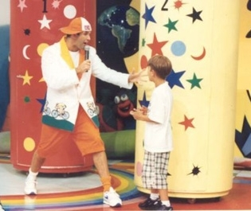
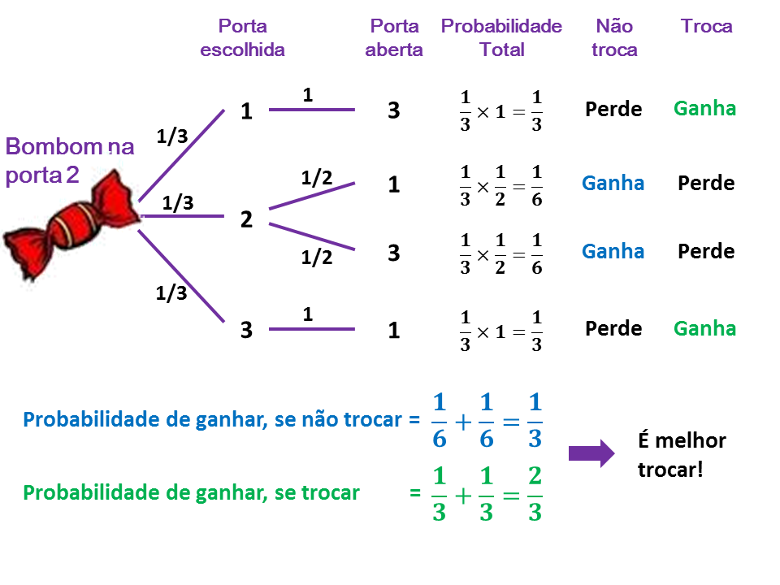
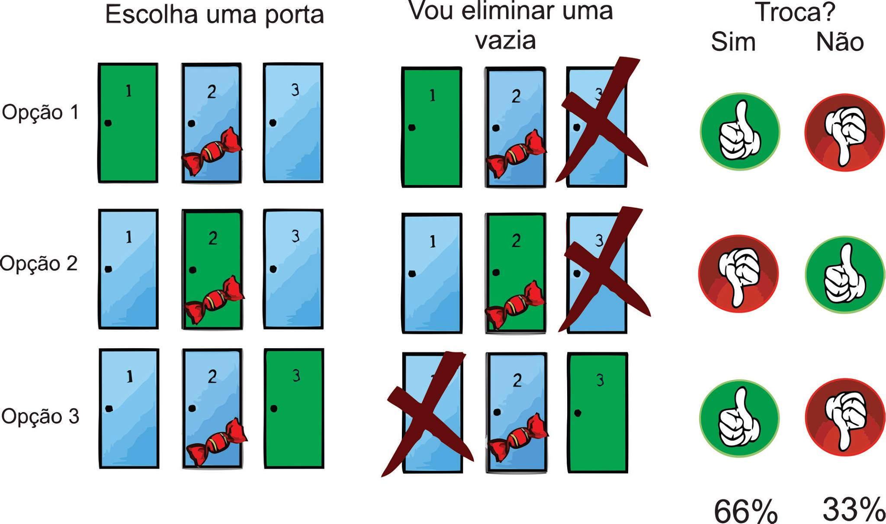
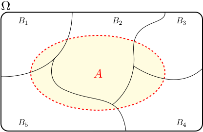

```{r,echo=FALSE,eval=FALSE}
# gerar onde estará o bombom (rodar 1 vez)

#set.seed(2015)
#tmp <- sample(1:3,200,replace=TRUE)

#dados <- data.frame(Experimento=1:length(tmp),Premio=tmp)
#write.csv(dados,file="dadosOrdem.csv")
```


## Porta dos Desesperados {.build}

<center></center>

> * Imagine-se em um [programa de auditório](https://www.youtube.com/watch?v=VCPBvKYqm5U) em que 3 portas são colocadas à sua frente. 

> * Atrás de uma delas há um bom prêmio e atrás das outras duas não há nada. 

> * O apresentador pede que você escolha uma das 3 portas.

> *  Após a sua escolha, ele mostra uma porta que está vazia pra você. Então ele pergunta se você quer trocar a sua porta pela outra que restou.


## Porta dos Desesperados {.build}

> Qual a melhor estratégia? 

> Trocar ou ficar com a primeira escolha? 

> Há alguma diferença?

# Comparando as duas estratégias através da repetição do experimento aleatório

## Experimentos 2S - 2015 - ME414C

```{r,echo=FALSE}
dados <- read.csv("dados.csv", sep=",", header = T)
dados <- dados[complete.cases(dados),]
```

A seguir apresentamos os resultados obtidos durante a aula:
```{r,echo=FALSE}
#instale o pacote, para isso, retire # do início da primeira linha, rode uma vez e volte a incluir #
#install.packages('printr',type = 'source',repos = c('http://yihui.name/xran', 'http://cran.rstudio.com'))
library(printr)
table(dados$Trocou, dados$Ganhou, dnn = c("Trocou?", "Ganhou?"))
```


$$ P(ganhou|troucou) = `r round(mean(dados$Trocou=="s" & dados$Ganhou=="s")/(mean(dados$Trocou=="s")),2)`$$

$$ P(ganhou|naotrocou) = `r round(mean(dados$Trocou=="n" & dados$Ganhou=="s")/(mean(dados$Trocou=="n")),2)`$$


Entre os participantes que escolheram a **estratégia de trocar de porta**, temos que `r round(mean(dados$Trocou=="s" & dados$Ganhou=="s")/(mean(dados$Trocou=="s")),2)*100`% saíram vencedores. 

Já entre os que escolheram **não trocar**, temos que `r round(mean(dados$Trocou=="n" & dados$Ganhou=="s")/(mean(dados$Trocou=="n")),2)*100`% venceram.


## Simulação computacional: comparando as duas estratégias

O experimento foi repetido poucas vezes. 

O ideal seria repetirmos muitas vezes e observarmos a proporção de vencedores para cada estratégia ao final das repetições. Quanto seria "muitas vezes"? 

Algo perto de infinito! 

Como temos tempo e bombons finitos, podemos fazer uma simulação da "Porta dos Desesperados", através de um programa de computador.

## {.smaller}
O código a seguir apresenta a simulação de 10000 programas da "Porta dos Desesperados".

```{r,echo=TRUE}
n=10000
resultadoQuandoNaoTroca <- c()
resultadoQuandoTroca <- c()
portas <- c("A","B","C")
for (i in 1:n)
  {
  portapremio <- sample(portas,size=1) # número da porta com o prêmio, escolhida ao acaso pela produção do programa
  portaescolhida <- sample(portas,size=1) # número da porta escolhida ao acaso pelo participante
  portaslivres <- portas[portas != portaescolhida & portas !=portapremio]
  ApresentadorMostra <- sample(portaslivres,size=1) # porta mostrada pelo apresentador, escolhida ao acaso entre as portas vazias disponíveis.
  trocouPorta <- portas[portas != portaescolhida & portas !=ApresentadorMostra] # indica a porta escolhida após a troca
  resultadoQuandoNaoTroca[i] <- ifelse(portaescolhida==portapremio,"ganhou","perdeu")
  resultadoQuandoTroca[i] <- ifelse(trocouPorta==portapremio,"ganhou","perdeu")
  }

proporcaoManteveGanhou <- mean(resultadoQuandoNaoTroca=="ganhou")
proporcaoTrocouGanhou <- mean(resultadoQuandoTroca=="ganhou")
```

## Resultados da simulação

Em `r n` vezes: 

Estratégia não trocar de porta: ganha `r 100*proporcaoManteveGanhou`\% das vezes.

Estratégia trocar de porta:     ganha `r 100*proporcaoTrocouGanhou`\% das vezes.

Portanto, a estratégia trocar de porta é a que tem maior chance de ganhar.


# Comparando as duas estratégias através da Teoria da Probabilidade


##

<center></center>


##

<center></center>


# Comparando as duas estratégias através do Teorema de Bayes


## Relembrando: partição do espaço amostral {.smaller}

Dizemos que os eventos $B_1, B_2, \ldots, B_k$ formam um partição do espaço amostral $\Omega$ se 
 são mutuamente exclusivos e a união é $\Omega$.

<center></center>

**Teorema das probabilidades totais:**
   
   $$P(A)=\sum_{i=1}^kP(A\mid B_i)P(B_i)$$
   
**Teorema de Bayes:**
   
   $$P(B_i\mid A)=\frac{P(A\mid B_i)P(B_i)}{\sum_{i=1}^kP(A\mid B_i)P(B_i)}$$

   
## {.smaller}
Para avaliar qual a melhor estratégia, temos também a opção de fazer os cálculos através do Teorema de Bayes.

Suponha o seguinte cenário (sem perda de generalidade): o jogador escolhe a porta número 1. Considere os eventos:

* $A_1$: prêmio está na porta 1.
* $A_2$: prêmio está na porta 2.
* $A_3$: prêmio está na porta 3.
* $O$: apresentador abre a porta 3.

Temos que:

* $P(A_1)=P(A_2)=P(A_3)=\frac{1}{3}$.

* $P(O\mid A_1)=\frac{1}{2}$.

* $P(O\mid A_2)=1$.

* $P(O\mid A_3)=0$.

##

A probabilidade do prêmio estar na porta 1 (porta escolhida pelo jogador), dado que o apresentador mostra a porta 3:

$P(A_1 \mid O)=\frac{P(O\mid A_1)P(A_1)}{P(O\mid A_1)P(A_1)+P(O\mid A_2)P(A_2)+P(O\mid A_3)P(A_3)}=\frac{\frac{1}{2}\times \frac{1}{3}}{\frac{1}{2}\times\frac{1}{3}+1\times\frac{1}{3}+0\times\frac{1}{3}}$


A probabilidade do prêmio estar na porta 2 (ou seja, se o jogador trocasse do porta, venceria), dado que o apresentador mostra a porta 3:

$P(A_2 \mid O)=\frac{P(O\mid A_2)P(A_2)}{P(O\mid A_1)P(A_1)+P(O\mid A_2)P(A_2)+P(O\mid A_3)P(A_3)}=\frac{1\times \frac{1}{3}}{\frac{1}{2}\times\frac{1}{3}+1\times\frac{1}{3}+0\times\frac{2}{3}}$


Portanto, se o jogador escolhe a porta 1 e não troca, a probabilidade de vencer o prêmio é $1/3$. Se o jogador escolhe a porta 1 e troca, a probabilidade de vencer o prêmio é $2/3$.


##

Slides produzidos pelos professores:

* Samara Kiihl

* Tatiana Benaglia

* Benilton Carvalho
