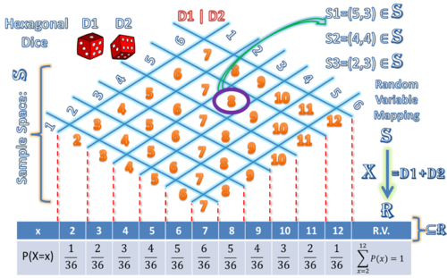
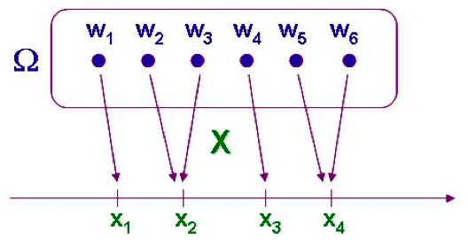
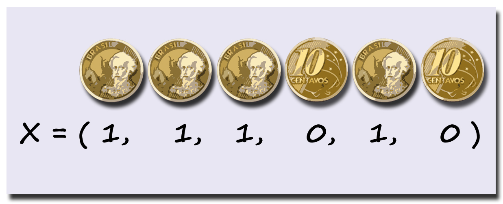
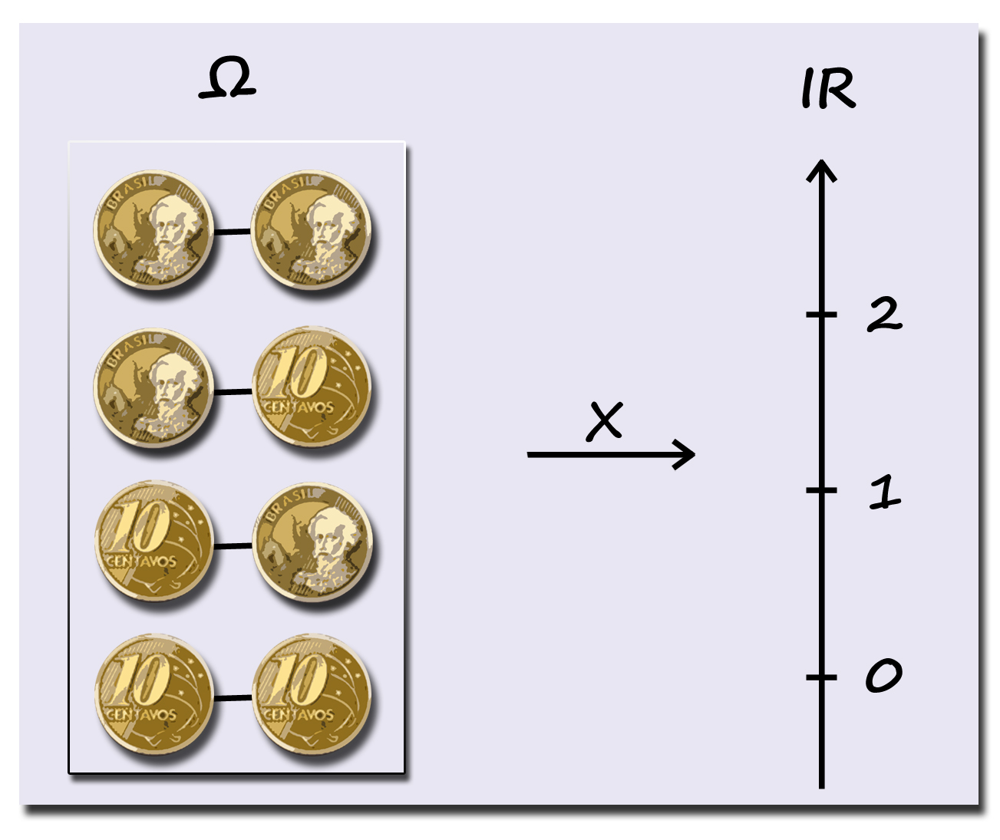
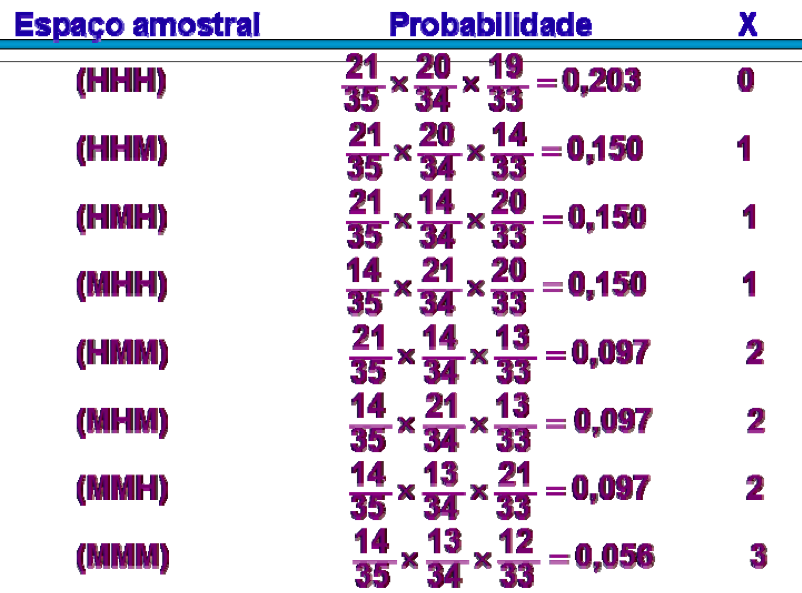
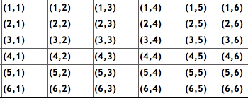

# Variável Aleatória Discreta

## Variável Aleatória {.build}

> *  Em um experimento aleatório, muitas vezes não estamos interessados nos detalhes do resultado do evento, mas sim em alguma quantidade numérica obtida a partir do experimento.
 
> *  Ex: lançamento de dois dados. O interesse pode estar apenas na soma, não nos resultados individuais dos dados.
 
> *  Quantidades de interesse que são determinadas a partir do resultado de experimento aleatório são denominadas **variáveis aleatórias**.

> *  Cada resultado possível de uma variável aleatória (v.a.) tem associado uma probabilidade. O conjunto de todos os resultados possíveis e as respectivas probabilidades é denominado **distribuição de probabilidade**.


## Exemplo: Lançamento de dois dados

Estamos interessados na soma dos resultados.

<center></center>

## Definição: Variável Aleatória Discreta

Uma **função** $X$ que associa a cada elemento do espaço amostral um valor num conjunto enumerável de pontos da reta é denominada **variável aleatória discreta**.

<center></center>

## Exemplo: Lançamento de uma moeda

$X=1$ se cara e $X=0$ se coroa

<center></center>


## Exemplo: Lançamento de uma moeda duas vezes

$X$ é a soma dos resultados (coroa é 0 e cara é 1).

<center></center>

# Distribuição de Probabilidade

## Distribuição de probabilidade para variável aleatória discreta {.build}

> *  Quando a v.a. assume valores inteiros: v.a. **discreta**. 

> *  A distribuição de probabilidade associa uma probabilidade $P(X=x)$ para cada valor possível, $x$, da variável aleatória $X$. 

> *  Para cada valor de $x$, $0\leq P(X=x)\leq 1$. 

> *  Soma das probabilidades de todos os valores possíveis de $X$ é igual a 1.

## Distribuição de probabilidade para variável aleatória discreta {.build}

> *  Seja $X$ uma v.a. discreta com $n$ valores possíveis denotados por $x_1,x_2,\ldots,x_n$. 

> *  $P(X=x_i)$ denota a probabilidade de que a v.a. $X$ assuma o valor $x_i$. 

> *  O conjunto de todas essas probabilidades (para cada $x_i$) representa a **distribruição de probabilidade** de $X$. 

> *  Como $X$ só pode assumir valores entre $x_1,x_2,\ldots,x_n$ (são os valores possíveis), temos que:
$$\sum_{i=1}^n P(X=x_i) =1$$

## Exemplo {.build}

> Suponha que $X$ seja uma v.a. discreta que assume os valores $1$, $2$ e $3$. 

> Se $P(X=1)=0.4$ e $P(X=2)=0.1$, qual o valor de $P(X=3)$? 

> $$\sum_{i=1}^nP(X=x_i)=1$$ 

> $$P(X=1)+P(X=2)+P(X=3)=1$$ 

> $$0.4+0.1+P(X=3)=1$$ 

> $$P(X=3)=0.5$$ 

## Distribuição de Probabilidade

Podemos representar a distribuição de probabilidade com o seguinte gráfico:

<center>
```{r, echo=FALSE, fig.height=4, fig.width=5}
x <- 1:3
p <- c(0.4, 0.1, 0.5)
par(mar=c(c(5, 4, 2, 1) + 0.1))
barplot(p, space=2, names.arg=x, las=1, cex.lab=1.2, cex.axis=1.2, cex=1.2, ylab="P(X=x)", col="blue")
abline(h=0)
```
</center>

A altura de cada barra representa a probabilidade daquele valor.

## Exemplo: Vendedor {.build}

<center></center>


Um vendedor de enciclopédias visita cada casa duas vezes.   

> Com anos de experiência, ele acredita que a probabilidade de uma venda logo na primeira visita é 0.3.   

> Já na segunda visita, ele acredita que a probabilidade de venda seja 0.6.   Ele acredita também que o resultado em cada visita seja independente.   

> Qual é a distribuição de probabilidade da v.a. $X$: número de vendas feitas em uma casa?

## {.build}

*  Espaço amostral do fenômeno aleatório: 

> $\Omega=\{$"venda na primeira e venda na segunda", "venda na primeira e sem venda na segunda", "sem venda na primeira e venda na segunda","sem venda na primeira e sem venda na segunda"$\}$.

> *  A v.a. $X$ pode assumir os valores   $0$, $1$ ou $2$. 

> *  Se nenhuma venda ocorrer nas duas visitas, $X= 0$. 

> $$P(X=0)=P(\mbox{sem venda na primeira e sem venda na segunda})$$ 

> $$\overset{ind}{=}P(\mbox{sem venda na primeira})\times P(\mbox{sem venda na segunda})$$ 

> $$=\left[1-P(\mbox{venda na primeira})\right]\times \left[1-P(\mbox{venda na segunda})\right]$$ 

> $$=(1-0.3)\times(1-0.6)=0.28$$


## {.build}

> *  $X=1$ quando ocorre uma venda apenas na primeira visita **ou** uma venda apenas segunda visita. 

> $$P(X=1)=P(\mbox{venda na primeira e sem venda na segunda})$$

> $$ + P(\mbox{sem venda na primeira e venda na segunda})$$

> $$\overset{ind}{=}P(\mbox{venda na primeira})\times P(\mbox{sem venda na segunda})$$

> $$ + P(\mbox{sem venda na primeira})\times P(\mbox{venda na segunda})$$

> $$=0.3\times(1-0.6)+(1-0.3)\times0.6$$

> $$=0.54$$

## {.build}

> *  $X=2$ quando   ocorre uma venda nas duas visitas. 

> $$P(X=2)=P(\mbox{venda na primeira e venda na segunda})$$

> $$\overset{ind}{=}P(\mbox{venda na primeira})\times P(\mbox{venda na segunda})$$

> $$=0.3\times0.6$$ 

>$$=0.18$$ 

> Satisfaz a propriedade:

$$\begin{aligned}
\sum_{i=0}^2 P(X=i) &= P(X=0)+P(X=1)+P(X=2) \\
&=0.28+0.54+0.18=1
\end{aligned}
$$

## Exemplo: Comissão {.build}

O Departamento de Estatística é formado por 35 professores, sendo 21 homens e 14 mulheres. 

> Uma comissão de 3 professores será constituída sorteando, ao acaso, três membros do departamento. 

> Qual é a probabilidade da comissão ser formada por pelo menos duas mulheres?
 
> Seja $X$ o número de mulheres na comissão. $X$ pode assumir os valores:   0, 1, 2 e 3.

## {.build .smaller}

> Seja $X$ o número de mulheres na comissão. $X$ pode assumir os valores:   0, 1, 2 e 3.

> $$P(X=0)=\frac{\binom{21}{3}\binom{14}{0}}{\binom{35}{3}}=0.203$$ 

> $$P(X=1)=\frac{\binom{21}{2}\binom{14}{1}}{\binom{35}{3}}=0.450$$ 

> $$P(X=2)=\frac{\binom{21}{1}\binom{14}{2}}{\binom{35}{3}}=0.291$$ 

> $$P(X=3)=\frac{\binom{21}{0}\binom{14}{3}}{\binom{35}{3}}=0.056$$

> $$\sum_{i=0}^3P(X=i)=1$$

> Probabilidade da comissão ter pelo menos duas mulheres: $P(X\geq2)=P(X=2)+P(X=3)=0.347$

## Exemplo: Comissão

A distribuição de probabilidade de $X$ é dada por: 

$X$ | 0 | 1 | 2 | 3 
----|:---:|:---:|:---:|:---:
$P(X=x)$| 0.203 | 0.450 | 0.291 | 0.056

<center>
```{r, echo=FALSE, fig.height=4, fig.width=5}
x <- 0:3
p <- c(0.203, 0.450, 0.291, 0.056)
par(mar=c(c(5, 4, 2, 1) + 0.1))
barplot(p, space=2, names.arg=x, las=1, cex.lab=1.2, cex.axis=1.2, cex=1.2, ylab="P(X=x)", col="blue")
abline(h=0)
```
</center>

## Exemplo: Comissão

Outra maneira para calcular as probabilidades:

<center></center>

## Exemplo: Lançamento de dois dados {.build} 

Qual a probabilidade da soma ser menor do que 6?

<center></center>

$X$: soma dos dados.

$P(X<6) =  P(X=5)+P(X=4)+P(X=3)+P(X=2)=\frac{10}{36}$

## Exemplo: Lançamento de dois dados {.build} 

$Y$: máximo resultado no lançamento de 2 dados.

<center></center>


$Y$ | 1 | 2 | 3 | 4 | 5 | 6
----|:---:|:---:|:---:|:---:|:---:|:---:
$P(Y=y)$| 1/36 | 3/36 | 5/36 | 7/36 | 9/36 | 11/36


## Exemplo: Lançamento de dois dados {.build} 

$Z$: diferença entre os pontos do segundo e do primeiro lançamento.

<center></center>


$Z$ | -5 | -4 | -3 | -1 | -1 | 0 | 1 | 2 | 3 | 4 | 5
----|:---:|:---:|:---:|:---:|:---:|:----:|:---:|:---:|:---:|:---:|:---:|:---:
$P(Z=z)$| 1/36 | 2/36 | 3/36 | 4/36 | 5/36 | 6/36 | 5/36 | 4/36 | 3/36 | 2/36 | 1/16

## Exemplo: Construção {.build}

Na construção de um certo prédio, as fundações devem atingir 15 metros de profundidade, e para cada 5 metros de estacas colocadas, o operador anota se houve alteração no ritmo de perfuração previamente estabelecido.   

Essa alteração é resultado de mudanças para mais ou para menos na resistência do subsolo.   

Nos dois casos, medidas corretivas serão necessárias, encarecendo o custo da obra.

> *  com base em avaliações geológicas, admite-se que a probabilidade de ocorrência de alterações é de 0.1 para cada 5 metros.  

> *  o custo básico inicial é de 100 UPCs (Unidades Padrão de Construção) e será acrescido de 50k, com k representando o número de alterações observadas.

## Exemplo: Construção {.build}

> *  Como se comporta a variável Custo de Obra de fundações?  

> *  Assumimos que as alterações ocorrem independentemente entre cada um dos três intervalos de 5 metros.  

> *  $A=$ ocorrência de alterações em cada intervalo.  

> *  3 etapas $\Rightarrow$ $2^{3}=8$ possibilidades. 

> * Espaço Amostral

$$\Omega = \{AAA, AAA^{C}, AA^{C}A, A^{C}AA, AA^{C}A^{C}, A^{C}AA^{C}, A^{C}A^{C}A, A^{C}A^{C}A^{C} \}$$

##

Evento | Probabilidade | Custo 
:---------------:|---------------|:---------------:
$AAA$ | $(0.1)^{3}=0.001$ | 250 
$AAA^{C}$ | $(0.1)^{2}(0.9)=0.009$ | 200 
$AA^{C}A$ | $(0.1)^{2}(0.9)=0.009$ | 200 
$A^{C}AA$ | $(0.1)^{2}(0.9)=0.009$ | 200 
$AA^{C}A^{C}$ | $(0.1)(0.9)^{2}=0.081$ | 150 
$A^{C}AA^{C}$ | $(0.1)(0.9)^{2}=0.081$ | 150 
$A^{C}A^{C}A$ | $(0.1)(0.9)^{2}=0.081$ | 150 
$A^{C}A^{C}A^{C}$ | $(0.9)^{3}=0.729$ | 100 

## {.build}

Note que associamos a cada evento do espaço amostral um valor da variável $C$ (custo), e eventos diferentes podem corresponder ao mesmo valor de $C$. 

> $c_{1}=100$, $c_{2}=150$, $c_{3}=200$, $c_{4}=250$.

> *  $P\left(C=c_{1}\right)=P\left(A^{C}A^{C}A^{C}\right)=0.729$  
> *  $P\left(C=c_{2}\right)=P\left(AA^{C}A^{C} \cup A^{C}AA^{C} \cup A^{C}A^{C}A\right)=3\times 0.081=0.243$ 
> *  $P\left(C=c_{3}\right)=P\left(AAA^{C} \cup AA^{C}A \cup A^{C}AA\right)=3 \times 0.009=0.027$ 
> *  $P\left(C=c_{4}\right)=P\left(AAA\right)=0.001$

O comportamento de $C$ estudado através da probabilidade de ocorrência pode auxiliar na previsão de gastos e na elaboração de orçamentos: 

$C$ | 100 | 150 | 200 | 250
--- |:-----:|:-----:|:-----:|:-------:
$P(C=c)$ | 0.729 | 0.243 | 0.027 | 0.001


## Exemplo: Lançamento de uma moeda duas vezes {.build}

> *  $\Omega=\{CC, CX, XC, XX\}$, em que $C=$ cara e $X=$ coroa.  

> *  Seja a v.a. $N=$ número de caras em dois lançamentos.


$N$ | 0 | 1 | 2
--|:--:|:--:|:--:
$P(N=n)$ | $P\left(XX\right)=\frac{1}{4}$ | $P\left(CX \cup XC\right)=\frac{2}{4}=\frac{1}{2}$ | $P\left(CC\right)=\frac{1}{4}$


# Função de Distribuição Acumulada

## Exemplo: Vacina {.build}

> *  Um grupo de 1000 crianças foi analisado para determinar a efetividade de uma vacina contra um tipo de alergia.   As crianças recebiam uma dose de vacina e após um mês passavam por um novo teste.   Caso ainda tivessem tido alguma reação alérgica, recebiam outra dose.  

> *  Variável de interesse: X = número de doses.  

Doses ($X$) | 1 | 2 | 3 | 4 | 5 
--------- |:---:|:---:|:---:|:---:|:---:
Frequência | 245 | 288 | 256 | 145 | 66 

 
> *  Uma criança é sorteada ao acaso, qual será a probabilidade dela ter recebido 2 doses?  

> $$P(X=2) = \frac{288}{1000}=0.288$$

## Exemplo: Vacina {.build}

Distribuição de Probabilidade de $X$

Doses ($X$) | 1 | 2 | 3 | 4 | 5 
--------- |:---:|:---:|:---:|:---:|:---:
$P(X=x)$ | 0.245 | 0.288 | 0.256 | 0.145 | 0.066 


> Qual a probabilidade da criança ter recebido até duas doses?  

$$ \begin{aligned}
P\left(X \leq 2\right) &= P\left(X=1\right)+P\left(X=2\right) \\
&=0.245+0.288\\
&=0.533
\end{aligned}
$$


## Função de Distribuição Acumulada {.build}

> A função de distribuição acumulada (f.d.a.) de uma variável aleatória $X$ é definida por $$F\left(x\right)=P\left(X \leq x\right), \quad x\in\mathbb{R}$$ 

> Assim, se $X$ assume os valores em $\{x_{1},x_{2},...,x_{n}\}$, em que $x_1 < x_2 < \ldots < x_n$:

$F\left(x_{1}\right)=P\left(X=x_{1}\right)$ 

$F\left(x_{2}\right)=P\left(X=x_{1}\right) + P\left(X=x_{2}\right)$ 

$\vdots$ 

$F\left(x_{n}\right)=P\left(X=x_{1}\right) + ... + P\left(X=x_{n}\right)$


## Exemplo: Vacina {.build}

Doses ($X$) | 1 | 2 | 3 | 4 | 5 
--------- |:---:|:---:|:---:|:---:|:---:
$P(X=x)$ | 0.245 | 0.288 | 0.256 | 0.145 | 0.066 


> Note que a f.d.a. de $X=$ número de doses é definida para qualquer valor real, logo: 

$$ F(x) = 
\begin{cases}
0     & x < 1 \\
0.245 & 1 \leq x < 2 \\
0.533 & 2 \leq x < 3 \\
0.789 & 3 \leq x < 4 \\
0.934 & 4 \leq x < 5 \\
1     & x \geq 5 \\
\end{cases}
$$

## Exemplo: Vacina
Função de distribuição acumulada (f.d.a.) do número de doses ($X$)

<center>
```{r, echo=FALSE, fig.height=5, fig.width=7}
source("../functions/plotcdf.R")
x <- 1:5
p <- c(0.245, 0.288, 0.256, 0.145, 0.066)
plotcdf(x, p, atcdf=TRUE)
```
</center>

## Exemplo: Comissão {.build}

O Departamento de Estatística é formado por 35 professores, sendo 21 homens e 14 mulheres. Uma comissão de 3 professores será constituída sorteando, ao acaso, três membros do departamento. 

> Seja $X$ o número de mulheres na comissão.  $X$ pode ser 0, 1, 2 e 3.
  
$X$ | 0 | 1 | 2 | 3 
--------- |:---:|:---:|:---:|:---:
$P(X=x)$ | 0.203 | 0.450 | 0.291 | 0.056

$$
F(x) = P(X \leq x) = \begin{cases} 
0, & \mbox{se } x<0 \\ 
0.203 & \mbox{se } 0\leq x<1\\
0.653 & \mbox{se } 1\leq x<2\\
0.944 & \mbox{se } 2\leq x<3\\
1 & \mbox{se } x\geq3
\end{cases}
$$

## Exemplo: Comissão {.build .smaller}

$$
F(x) = \begin{cases} 
0, & \mbox{se } x<0 \\ 
0.203 & \mbox{se } 0\leq x<1\\
0.653 & \mbox{se } 1\leq x<2\\
0.944 & \mbox{se } 2\leq x<3\\
1 & \mbox{se } x\geq3
\end{cases}
$$

<center>
```{r, echo=FALSE, fig.height=4, fig.width=5}
source("../functions/plotcdf.R")
x <- 0:3
p <- c(0.203, 0.450, 0.291, 0.056)
plotcdf(x, p, atcdf=TRUE)
```
</center>

# Esperança

## Esperança: variável aleatória discreta {.build}

Seja $X$ uma v.a. discreta assumindo os valores $x_1,\ldots, x_n$.  

A **esperança** (ou valor esperado) da variável $X$ é dada por:
$$\mathbb E(X)=\sum_{i=1}^n x_i P(X=x_i)$$  

> A esperança de $X$ é a média ponderada de todos os valores possíveis de $X$, onde o peso de cada valor é a probabilidade.

## Esperança - Exemplos {.build}

* Suponha que $X$ assuma os valores 0 ou 1 com igual probabilidade, ou seja,

$$P(X=0)=P(X=1)=\frac{1}{2}$$ 

> $$\mathbb E(X)=  0\times P(X=0)+1\times P(X=1)=\frac{1}{2}$$

* Suponha que $X$ assuma os valores 0 ou 1 com as seguintes probabilidades,

$$P(X=0)=\frac{2}{3} \quad \mbox{e} \quad P(X=1)=\frac{1}{3}$$

> $$\mathbb E(X)=  0\times P(X=0)+1\times P(X=1)= 0\times\frac{2}{3}+1\times\frac{1}{3}=\frac{1}{3}$$

## Exemplo: Lançamento de um dado {.build}

> $X$ é a v.a. representando o resultado do lançamento. 

> $$P(X=i)=\frac{1}{6}, \qquad i=1,2,3,4,5,6$$ 

> $$\mathbb E(X)= 1\times \frac{1}{6} + 2\times \frac{1}{6}+3\times \frac{1}{6}+4\times \frac{1}{6}+5\times \frac{1}{6}+6\times \frac{1}{6}=3.5$$ 

> Neste caso, a esperança de $X$ não é igual a nenhum dos valores possíveis de $X$.  

> Não podemos interpretar $\mathbb E(X)$ como o valor que esperamos que $X$ irá assumir, mas sim como uma média dos valores observados de $X$ ao longo de muitas repetições do experimento aleatório.  

> Se jogarmos o dado muitas vezes e calcularmos uma média de todos os resultados obtidos, essa média será aproximadamente 3.5. 


## Exemplo: Seguros {.build}

Uma companhia de seguros determina o [prêmio](http://pt.wikipedia.org/wiki/Prêmio_de_seguro) anual do seguro de vida de maneira a obter um lucro esperado de 1\% do valor que o segurado recebe em caso de morte.  

Encontre o valor do prêmio anual para um seguro de vida no valor de 200 mil reais assumindo que a probabilidade do cliente morrer naquele ano é 0.02. 

*  $A$: prêmio anual

*  $X$: lucro da companhia no ano para o cliente

* Então, 

> $$X = \begin{cases}
A, & \mbox{se o cliente sobrevive} \\
A-200000, & \mbox{se o cliente morre}
\end{cases}
$$

## Exemplo: Seguros {.build}

>  $\mathbb E(X)=  A\times P(viver) + (A-200000)\times P(morrer)$  

> $\mathbb E(X)=A\times 0.98 +(A-200000)\times 0.02$ 

> $\mathbb E(X)=A-4000$  

> Companhia quer lucro esperado de 1\% do valor recebido em caso de morte: 2000 reais. 

> $\mathbb E(X)=2000=A-4000$

Portanto, $A=6000$ é o valor do prêmio anual.

## Exemplo: Montagem {.build}

Um empresário pretende estabelecer uma firma para montagem de um componente mecânico. Cada peça é composta de duas partes, $A$ e $B$,   cada uma com uma chance específica de ser defeituosa. Só é possível verificar a qualidade das peças depois que elas são montadas.  

> Se ambas são defeituosas, a peça é descartada e dá um prejuízo de $\$5$.   

> Se a peça $B$ é defeituosa, ainda é possível reparar a peça e obter um lucro de $\$5$.   

> De maneira semelhante, se $A$ é defeituosa, o reparo permite vender a peça inteira com um lucro de $\$10$.   

> Se as duas peças são boas, o lucro é de $\$15$.

## Exemplo: Montagem {.build}

Seja $A$ o evento indicando que a peça A está perfeita. 

> Então $A^c$ indica que a peça A está com defeito. 

> Seja $B$ o evento indicando que a peça B está perfeita. 

> Então $B^c$ indica que a peça B está com defeito. 

Cada uma das configurações está associada a uma probabilidade:

$$P(A \cap B)=0.56 \qquad P(A^c \cap B)=0.23$$ 

$$P(A \cap B^c)=0.02 \qquad P(A^c \cap B^c)=0.19$$ 

> Como podemos descrever a distribuição do lucro por componente?   

> Qual o lucro esperado por peça produzida?  


## Exemplo: Montagem {.build}

$P(A \cap B)=0.56 \quad P(A^c \cap B)=0.23 \quad P(A \cap B^c)=0.02 \quad P(A^c \cap B^c)=0.19$ 

Seja $X$ a variável indicando o lucro na produção de um componente.  

> *  $X$ assume o valor 15 se as peças A e B estão ok, o que ocorre com probabilidade   0.56.  

> *  $X$ assume o valor 10 se apenas A apresentar defeito, o que ocorre com probabilidade   0.23.  

> *  $X$ assume o valor 5 se apenas B apresentar defeito, o que ocorre com probabilidade   0.02.  

> *  $X$ assume o valor $-5$ se tanto A quanto B apresentarem defeito, o que ocorre com probabilidade   0.19.  

## Exemplo: Montagem

Distribuição de probabilidade para a variável aleatória $X$:

$X$  | $-5$ | $5$ | $10$ | $15$
---- |:----:|:----:|:----:|:----:
$P(X=x)$ | 0.19 | 0.02 | 0.23 | 0.56

<center>
```{r, echo=FALSE, fig.height=4, fig.width=5}
x <- c(-5, 0, 5, 10, 15)
p <- c(.19, 0, .02, .23, .56)
par(mar=c(c(5, 4, 2, 1) + 0.1))
barplot(p, space=5, names.arg=x, las=1, cex.lab=1.2, cex.axis=1.2, cex=1.2, ylab="P(X=x)", col="blue")
abline(h=0)
```
</center>


## Exemplo: Montagem

$X$  | $-5$ | $5$ | $10$ | $15$
---- |:----:|:----:|:----:|:----:
$P(X=x)$ | 0.19 | 0.02 | 0.23 | 0.56

Função de Distribuição Acumulada:

$$
F(x) = 
\begin{cases}
0 & \mbox{se} & x < -5\\
0.19 & \mbox{se} & -5 \leq x < 5\\
0.21 & \mbox{se} & 5 \leq x < 10\\
0.44 & \mbox{se} & 10 \leq x < 15\\
1 & \mbox{se} & x \geq 15\\
\end{cases}
$$

## Exemplo: Montagem {.smaller}
$$
F(x) = 
\begin{cases}
0 & \mbox{se} & x < -5\\
0.19 & \mbox{se} & -5 \leq x < 5\\
0.21 & \mbox{se} & 5 \leq x < 10\\
0.44 & \mbox{se} & 10 \leq x < 15\\
1 & \mbox{se} & x \geq 15\\
\end{cases}
$$

<center>
```{r, echo=FALSE, fig.height=4, fig.width=5}
source("../functions/plotcdf.R")
x <- c(-5, 5, 10, 15)
p <- c(.19, .02, .23, .56)
plotcdf(x, p, atcdf=TRUE)
```
</center>


## Exemplo: Montagem {.build}

Suponha que o empresário faça a seguinte pergunta: *Qual o lucro médio por conjunto
montado que espero conseguir?* 

> Lembrem-se que a esperança de uma v.a. $X$ com valores $x_1, x_2, \ldots, x_n$ é:

$$\mathbb E\left( X \right) = \sum_{i=1}^n x_i P(X=x_i)$$

> Para saber o lucro esperado, basta aplicar a fórmula:

 $$\begin{aligned}
 \mathbb E \left( X \right) &= (-5)\times P(X=-5) + 5\times P(X=5) + \\
 & + 10\times P(X=10) + 15\times P(X=15) \\
 & = -5\times0.19 + 5\times0.02 + 10\times0.23 + 15\times0.56 \\
 & = 9.85
 \end{aligned}$$

## Exemplo: Pedágio

Você, cansado de esperar em filas de pedágio com frequência, está considerando assinar o serviço de pagamento eletrônico.
Dentre as opções oferecidas, você se interessa pelas duas abaixo:

<center></center>

## {.build}

<center></center>


Plano Clássico: obrigatório fazer adesão novamente após 5 anos.  

Plano Clássico: em caso de perda/roubo/troca é preciso pagar a taxa de substituição.


> Assumindo que não há roubo/perda, mas apenas troca do veículo e que não há o desconto na adesão para renovar após 5 anos, como decidir?  

> Podemos fazer um exemplo de acordo com o período em que vamos assinar o plano escolhido.


## Exemplo: Pedágio

Seja a v.a. $T$: idade do veículo até a troca. 

E a função de distribuição acumulada dada por:

$$
F(t) = 
\begin{cases}
0 & \mbox{se} & t < 2\\
0.1 & \mbox{se} & 2 \leq t < 3\\
0.2 & \mbox{se} & 3 \leq t < 4\\
0.5 & \mbox{se} & 4 \leq t < 5\\
0.7 & \mbox{se} & 5 \leq t < 6\\
0.9 & \mbox{se} & 6 \leq t < 7\\
1 & \mbox{se} & t \geq 7 \\
\end{cases}
$$

## Exemplo: Pedágio 
$T$: idade do veículo até a troca. 

<center>
```{r, echo=FALSE, fig.height=5, fig.width=5}
source("../functions/plotcdf.R")
x <- 2:7
p <- c(.1, .1, .3, .2, .2, .1)
plotcdf(x, p, atcdf=TRUE)
```
</center>


## {.build}

Assumindo que você queira assinar por um período de 3 anos. Vamos definir:

> * $C_1$: custo do plano 1 por 3 anos.  

Probabilidade de trocar de carro em até 3 anos: $0.2$  

Portanto, $C_1$ assume os valores: 

$$ C1 = \begin{cases}
73.16+13.05\times 12 \times 3 = 542.96, & \mbox{com probabilidade 0.8} \\
73.16+13.05\times 12 \times 3+43.83=586.79, & \mbox{com probabilidade 0.2}
\end{cases}
$$

> $$\mathbb E(C_1)=542.96\times 0.8+586.79\times 0.2=551.726$$ 

> * $C_2$: custo do plano 2 por 3 anos. 

$C_2$ assume o valor $17.28\times 12 \times 3 = 622.08$, com probabilidade 1

$$\mathbb E(C_2)=622.08$$

## {.build}

Assumindo que você queira assinar por um período de 6 anos. Vamos definir:

> *  $C_1$: custo do plano 1 por 6 anos.  

Probabilidade de trocar de carro em até 6 anos: $0.9$.   

> Portanto, $C_1$ assume os valores:

$$ C1 = \begin{cases}
2\times73.16+13.05\times 12 \times 6 = 1085.92, & \mbox{com prob. 0.1} \\
2\times73.16+13.05\times 12 \times 6+43.83=1129.75, & \mbox{com prob. 0.9}
\end{cases}
$$

> $$\mathbb E(C_1)=1085.92\times 0.1+1129.75\times 0.9=1125.367$$ 

> *  $C_2$: custo do plano 2 por 6 anos. 
 
 $C_2$ assume o valor $17.28\times 12 \times 6= 1244.16$, com probabilidade 1 

> $$\mathbb E(C_2)=1244.16$$

##

Slides produzidos pelos professores:

* Samara Kiihl

* Tatiana Benaglia

* Benilton Carvalho
