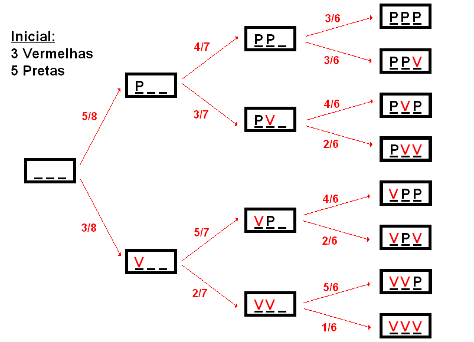

# Esperança e Variância - variável aleatória discreta

## Variância: variável aleatória discreta {.build}

* Vimos que a esperança nos dá a média ponderada de todos os resultados possíveis de uma v.a..

> * No entanto, a esperança não descreve a dispersão dos dados. 

> * Considere as seguintes v.a.'s:

> $$U=0, \mbox{ com probabilidade 1}$$
$$ V=  \begin{cases} 
-1, & \mbox{com prob. 1/2} \\
\;\; 1, & \mbox{com prob. 1/2}
\end{cases}
\quad \mbox{e} \quad W=  \begin{cases} 
-10, & \mbox{com prob. 1/2} \\
\;\; 10, & \mbox{com prob. 1/2}
\end{cases}
$$

> $$\mathbb E(U)=\mathbb E(V)=\mathbb E(W)=0$$

> No entanto, claramente a dispersão é bem diferente para as três variáveis.

## Variância: variável aleatória discreta {.build}

Queremos uma medida para quantificar quão distantes os valores da v.a. $X$ estão da sua esperança.
  
> **Definição:** Se $X$ é uma v.a. com esperança $\mathbb E(X)=\mu$, então a variância de $X$ é:
>  $$Var(X)=\mathbb E[(X-\mu)^2]$$
  
> **Notação:** $\sigma^2 = Var(X)$ 

> * Se $X$ é uma v.a. discreta assumindo valores $x_1, x_2, \ldots, x_n$ com respectivas probabilidades $P(X=x_i) = p_i$, então:

> $$Var(X) = \sum_{i=1}^n (x_i - \mu)^2 p_i$$


## Propriedade Geral da Variância {.build}

**Definição:** $Var(X)=\mathbb E([X-\mathbb E(X)]^{2})$

> Uma forma alternativa de calcular a variância é usando a fórmula:
>  $$Var(X) = \mathbb E(X^{2}) - [\mathbb E(X)]^{2}$$

> **Demonstração:**
> $$ \begin{aligned}
\mathbb E([X-\mathbb E(X)]^{2}) &= \mathbb E([X-\mu]^{2})  \\
& = \mathbb E(X^{2}-2X\mu+\mu^{2}) = \mathbb E(X^{2}) - 2\mu \mathbb E(X) + \mu^{2} \\
& = \mathbb E(X^2) - 2\mu\mu + \mu^2 = \mathbb E(X^2)- 2\mu^{2} + \mu^{2} \\
& = \mathbb E(X^2) - \mu^{2} \\
& = \mathbb E(X^{2}) - [\mathbb E(X)]^2 
\end{aligned}
$$


## Exemplo {.build}
 
Encontre $Var(X)$, onde $X$ é uma v.a. tal que:

> $$ X=  \begin{cases} 
1, & \mbox{com probabilidade } p \\
0, & \mbox{com probabilidade } 1-p
\end{cases}$$

> $$
\begin{aligned}
\mathbb E(X) &= 1\times p +0\times (1-p) = p \\
Var(X) & =\mathbb E(X^2)-p^2
\end{aligned} 
$$
 
> $$ X^2=  \begin{cases} 
1^2, & \mbox{com probabilidade } p \\
0^2, & \mbox{com probabilidade } 1-p
\end{cases}
$$

> $$
\begin{aligned}
\mathbb E(X^2) &= 1\times p +0\times (1-p) = p \\
Var(X) & = p-p^2=p(1-p)
\end{aligned} 
$$

## Propriedades da Esperança {.build}
 
1. Para qualquer v.a. $X$ e constantes $a$ e $b$:
    $$\mathbb E(aX + b) = a \mathbb E(X) + b$$
    
    Casos particulares:
    + $\mathbb E(X+b) = \mathbb E(X) + b$
    + $\mathbb E(aX) = a \mathbb E(X)$

2. Se $X_1, X_2, \ldots, X_n$ são variáveis aleatórias:
 $$ \mathbb E\left(\sum_{i=1}^n X_i \right) = \sum_{i=1}^n \mathbb E(X_i)$$

## Propriedades da Esperança {.build}

**Proposição:** Se $X$ é uma v.a. discreta com valores $x_i$ e função de massa $p(x_i)$, então para qualquer função $g$:
$$ \mathbb E[g(X)] = \sum_{i} g(x_i)p(x_i) $$

**Exemplo:** Seja $X$ uma v.a. tal que:

$$ X=  \begin{cases} 
1, & \mbox{com probabilidade } p \\
0, & \mbox{com probabilidade } 1-p
\end{cases}$$

$$\mathbb E(X^2) = 1^2 \times p + 0^2 \times (1-p) = p$$

## Propriedades da Variância {.build}
 
1. Para qualquer v.a. $X$ e constantes $a$ e $b$:
 $$Var(aX + b) = a^2Var(X)$$

    Casos particulares:
    + $Var(X+b) = Var(X)$
    + $Var(aX) = a^2 Var(X)$
  
2. Se $X_1, X_2, \ldots, X_n$ são variáveis aleatórias independentes:
$$ Var \left(\sum_{i=1}^n X_i \right) = \sum_{i=1}^n Var(X_i)$$ 


## Medidas de posição para v.a.'s discretas {.build}

* A **média, valor esperado ou esperança** de uma variável aleatória discreta $X$, cuja f.d.p. é dada por $P\left(X=x_{i}\right)=p_i$ é dada pela expressão: 

$$\mu_{X}=\mathbb E\left(X\right)=\sum_{i\geq 1}x_ip_i$$

* A **mediana** (Md) é o valor que satisfaz:

$$P\left(X \geq Md\right)\geq \frac{1}{2} \quad \mbox{e} \quad P\left(X \leq Md\right)\geq \frac{1}{2}$$

* A **moda** (Mo) é o valor da variével $X$ que tem maior probabilidade de ocorrência: 

$$P\left(X=Mo\right)=\max\{p_{1},p_{2},\ldots \}$$

## Medidas de posição para v.a.'s discretas {.build}

**Exemplo:** considere a v.a. discreta $X$, tal que:

$X$ | -5 | 10 | 15 | 20 
- | :--: | :--: | :--: | :--:
$P(X=x)$ | 0.3 | 0.2 | 0.4 | 0.1 

> * $\mu_{X}=\mathbb E(X)=(-5)\times 0.3 + 10 \times 0.2 + 15 \times 0.4 + 20 \times 0.1=8.5$

> * $Mo(X)=15$

> * $P(X \leq 10)= P(X \geq 15)=0.5$, então a mediana é $Md(X)=\frac{10+15}{2}=12.5$

> * Obs: note que nem a média (8.5) nem a mediana (12.5) são valores assumidos pela variável $X$.

## Medidas de posição para v.a.'s discretas {.build}

**Exemplo:** considere a v.a. $X$ tal que:

X | 2 | 5 | 8 | 15 | 20 
- | :--: | :--: | :--: | :--: | :--:
$P(X=x)$ | 0.1 | 0.3 | 0.2 | 0.2 | 0.2 

> $$\mu_{X}=10.3$$

> $$Mo(X)=5$$

> $$Md(X)=8$$

## Medidas de posição para v.a.'s discretas {.build}

**Exemplo:** Considere a v.a. $X$ do slide anterior e seja $Y = 5X - 10$ 

$Y$ | 0 | 15 | 30 | 65 | 90 
--- | :-: | :--: | :--: | :--: | :--:
$P(Y=y)$ | 0.1 | 0.3 | 0.2 | 0.2 | 0.2 

$$\mu_{Y}=41.5, \qquad Mo(Y)=15 \qquad \mbox{e} \qquad Md(Y)=30$$ 

Note que, como $Y = 5X - 10$:

$$\mu_{Y}=5\mu_{X}-10 = 5\times 10.3 - 10 = 41.5$$

$$Mo(Y)=5Mo(X)-10 = 5 \times 5 - 10 = 15$$ 

$$Md(Y)=5Md(X)-10 = 5 \times 8 = 10= 30$$

## Exemplo {.build}

Considere uma urna contendo três bolas vermelhas e cinco pretas. 

> Retire três bolas, sem reposição, e defina a variável aleatória $X$ igual ao número de bolas pretas. 

> Obtenha a distribuição de $X$. Calcule a esperança e a variância.

> *Fonte*: Morettin | Bussab, Estatística Básica $5^a$ edição, pág 135.

> Repare que não há reposição: 

> - a primeira extração tem 5 possibilidades em 8 de ser uma bola preta; 

> - a segunda terá 5 em 7 se a primeira for vermelha, ou 4 em 7 se a primeira foi preta, e assim por diante.

## Exemplo (continuação) 

Retirar 3 bolas, sem reposição, de uma urna com 3 bolas vermelhas e 5 pretas

<center></center>

## Exemplo (continuação) {.smaller}

A partir do gráfico, podemos construir uma tabela com os eventos do espaço amostral:

Extrações | Probabilidade 
:---------: | -------------
PPP | $5/8\times 4/7\times3/6 = 5/28$ 
PPV | $5/8\times4/7\times3/6 = 5/28$ 
PVP | $5/8\times3/7\times4/6 = 5/28$ 
VPP | $3/8\times5/7\times4/6 = 5/28$ 
PVV | $5/8\times3/7\times2/6 = 5/56$ 
VPV | $3/8\times5/7\times2/6 = 5/56$ 
VVP | $3/8\times2/7\times5/6 = 5/56$ 
VVV | $3/8\times2/7\times1/6 = 1/56$

## Exemplo (continuação) {.build}

Como $X$ é o número de bolas pretas, temos que:

> Somando as probabilidades dos eventos, encontradas anteriormente, obtemos a função de distribuição de $X$, $p_X(x)$.

> 
Eventos | $X=x$ | $p_X(x) = P(X=x)$
------- | ----- | --------
$\{VVV\}$ | 0 | $0.02$
$\{VVP\} \cup \{VPV\} \cup \{PVV\}$ | 1 | 0.27
$\{PPV\} \cup \{PVP\} \cup \{VPP\}$ | 2 | 0.53
$\{PPP\}$ | 3 | 0.18

## Exemplo (continuação) {.build}

Podemos calcular a esperança e a variância de $X$ a partir de sua função de probabilidade:

> $$ 
\begin{aligned} 
\mu &= \mathbb E (X ) =  \sum_{x=0}^3 xp_X (x) \\
    & = 0 \times 0.02 + 1 \times 0.27 + 2 \times 0.53 + 3 \times 0.18 = 1.87 \\
\\ 
Var(X) & = \mathbb E[(X-\mu)^2] = \sum_{x=0}^3 (x-\mu)^2 p_X(x) \\
  & = (0-1.87)^2 \times 0.02 + (1-1.87)^2 \times 0.27 + \\
  & + (2-1.87)^2\times 0.53 + (3-1.87)^2 \times 0.18= 0.51 
\end{aligned} 
$$
  
## Exemplo {.build}

O tempo $T$, em minutos, necessário para um operário processar certa peça é uma v.a. com a seguinte distribuição de probabilidade:

>
$T$ | 2 | 3 | 4 | 5 | 6 | 7
--- | :-: | :-: | :-: | :-: | :-: | :-:
$P(T=t)$ | $0.1$ | $0.1$ | $0.3$ | $0.2$ | $0.2$ | $0.1$

1. Calcule o tempo médio de processamento. 

2. Cada peça processada paga ao operador $\$2.00$ mas, se ele processa a peça em menos de 6 minutos, ganha $\$0.50$ por minuto poupado. Por exemplo, se ele processa a peça em 4 minutos, ganha um bônus de $\$1.00$. Encontre a distribuição, a média e a variância da v.a. $S$: quantia paga por peça.

*Fonte: Morettin & Bussab*, Estatística Básica $5^a$ edição, pág 140.

## Exemplo (continuação) {.build}

1. Tempo médio de processamento
$$ 
\begin{aligned}
\mathbb E (T) & = \displaystyle \sum_{t=2}^7 t P(T=t) \\
& = 2\times 0.1 + 3\times 0.1 + 4\times 0.3 + 5\times 0.2 + 6\times 0.2 + 7\times 0.1 = 4.6
\end{aligned} 
$$

2. Podemos trocar os valores na tabela do tempo, pelo total ganho por peça. Note, contudo, que o operário receberá $\$ 2.00$ no evento $\{T=6\} \cup \{T=7\}$, logo somamos suas probabilidades. Seja $S$ a v.a. "ganho final".

$S$ |  $\$4.00$ | $\$3.50$ | $\$3.00$ | $\$2.50$ | $\$2.00$
--- | :-----: | :----: | :----: | :----: | :----:
$P(S=s)$ | $0.1$ | $0.1$ | $0.3$ | $0.2$ | $0.3$

## Exemplo (continuação) {.build}

Obtemos a média e a variância de $S$ através da definição:

$$
\begin{aligned}
\mathbb E (S) &= \displaystyle \sum_{s} s P(S=s) \\
&= 4\times 0.1 + 3.5\times 0.1 + 3\times 0.3 + 2.5 \times 0.2 + 2\times 0.3 = 2.75 \\
\\
\mathbb E (S^2) & = \displaystyle \sum_{s} s^2 P(S=s) \\
&= 16\times 0.1 + 12.25 \times 0.1 + 9\times 0.3 + 6.25\times 0.2 + 4\times 0.3 = 7.975
\end{aligned}
$$

Então, $$\mbox{Var} (S) = 7.975 - (2.75)^2 = 0.4125$$

# Principais Modelos Discretos

## Uniforme Discreta {.build}

**Exemplo:** Uma rifa tem 100 bilhetes numerados de 1 a 100. Tenho 5 bilhetes consecutivos numerados de 21 a 25, e meu colega tem outros 5 bilhetes, com os números 1, 11, 29, 68 e 93.  

Quem tem maior probabilidade de ser sorteado? 

>  + espalhar os números é a melhor forma de ganhar o sorteio? 
  
>  + assumindo honestidade da rifa, todos os números têm a mesma probabilidade de ocorrência, com $\frac{1}{100}$ para cada um.
  
>  + como eu e meu colega temos 5 bilhetes, temos a mesma probabilidade de ganhar a rifa: $\frac{5}{100}=\frac{1}{20}$.
   
>  + assim, a probabilidade de ganhar depende somente da quantidade de bilhetes que se tem na mão, independente da numeração.
  
## Uniforme Discreta {.build}

* A v.a. discreta $X$, assumindo valores $x_{1},x_{2},...,x_{k}$, segue uma distribuição uniforme discreta se, e somente se, cada valor possível tem a mesma probabilidade de ocorrer, isto é,

> $$P(X=x_i) = p(x_i) = \frac{1}{k}, \quad \forall \; 1\leq i \leq k$$

> **Exemplo:** lançamento de um dado honesto de 6 faces

$X$ | 1 | 2 | 3 | 4 | 5 | 6 
-- | :-: | :-: | :-: | :-: | :-: | :-: 
$p(x)$ | $\frac{1}{6}$ | $\frac{1}{6}$ | $\frac{1}{6}$ | $\frac{1}{6}$ | $\frac{1}{6}$ | $\frac{1}{6}$ 


## Uniforme Discreta {.build}
A média e a variância são dadas por:

$\mathbb E(X)=\displaystyle \sum_{i=1}^k x_iP(X=x_i)= \frac{1}{k}\sum_{i=1}^k x_i$

$Var(X) = \displaystyle \sum_{i=1}^k (x_i - \mathbb E(X))^2 P(X=x_i) = \frac{1}{k} \sum_{i=1}^k (x_i - \mathbb E(X))^2$

ou

$Var(X) = \mathbb E(X^2) - [\mathbb E(X)]^2 = \displaystyle \frac{1}{k} \left[\sum_{j=1}^{k}x_{j}^{2} - \frac{1}{k} \left ( \displaystyle\sum_{j=1}^{k}x_{j} \right)^{2} \right]$

## Uniforme Discreta {.build}

> **Exemplo:** lançamento de um dado honesto de 6 faces

$X$ | 1 | 2 | 3 | 4 | 5 | 6 
-- | :-: | :-: | :-: | :-: | :-: | :-: 
$p(x)$ | $\frac{1}{6}$ | $\frac{1}{6}$ | $\frac{1}{6}$ | $\frac{1}{6}$ | $\frac{1}{6}$ | $\frac{1}{6}$ 

Calculando a esperança e a variância de $X$:

$\mathbb E(X) = \frac{1}{6} (1+2+3+4+5+6)= \frac{21}{6} = 3.5$

$Var(X) = \displaystyle \frac{1}{6} \left[(1 + 4 + 9 + 16 + 25 + 36) - \frac{1}{6} (21)^{2} \right] = \frac{1}{6} \times \frac{35}{2} = 2.92$

## Uniforme Discreta {.build}

Cálculo da função de distribuição acumulada (f.d.a.) de uma variável uniforme discreta:

$$F(x)= P(X\leq x)= \sum_{x_i \leq x} \frac{1}{k} = \frac{\#(x_i \leq x)}{k}$$

> **Exemplo:** voltando ao exemplo do lançamento de um dado honesto de 6 faces

* $F(2)= P(X\leq2)=P(X=1)+P(X=2)=\frac{2}{6}$

* $F(2.5)= P(X\leq2.5)= P(X=1)+P(X=2)=\frac{2}{6}$

## Uniforme Discreta - f.d.a

$X$ |$p(x)$ | $F(x)$ 
:--: | :-: | :-: 
1 | $\frac{1}{6}$ | $\frac{1}{6}$ 
2 | $\frac{1}{6}$ | $\frac{2}{6}$  
3 | $\frac{1}{6}$ | $\frac{3}{6}$ 
4 | $\frac{1}{6}$ | $\frac{4}{6}$ 
5 | $\frac{1}{6}$ | $\frac{5}{6}$  
6 | $\frac{1}{6}$ | $\frac{6}{6}$ 

## Uniforme Discreta - Gráficos

<center>
```{r, echo=FALSE, fig.height=5, fig.width=5}
library(RColorBrewer)
mycol <- brewer.pal(8,"Dark2")

p <- rep(1/6, 6)
par(mar=c(5, 4, 1, 2) + .1)
barplot(p, names.arg=1:6, col="blue", ylim=c(0, .25), ylab="p(x)", xlab="x", main="Distribuição de Probabilidade", cex.lab=1.5, cex.axis=1, cex.names=1, las=1)
box(bty="l", lwd=2)

source("../functions/plotcdf.R")
x <- 1:6
p <- rep(1/6, 6)
plotcdf(x, p)
```
</center>

## Bernoulli {.build}
Em muitas aplicações, cada observação de um experimento aleatório é **binária**: tem apenas dois resultados possíveis.  

> Por exemplo, uma pessoa pode:

>  + aceitar ou recusar uma oferta de cartão de crédito de seu banco.
   
>  + votar sim ou não em uma assembléia.


## Modelo Bernoulli {.build}

> * Considere um experimento aleatório com dois resultados possíveis: **sucesso** e **fracasso**.

> * Seja $p$ a probabilidade de sucesso.

> * **Exemplo:** lançar uma moeda e verificar se cai cara ou coroa. Consideramos como sucesso, a obtenção de cara. Se a moeda é honesta, $p=1/2$.

> * Esse tipo de experimento é conhecido como **Ensaio de Bernoulli**.

## Modelo Bernoulli {.build}

* **Exemplo:** lançar um dado, sendo "sucesso" o obtenção da face 6. Se o dado é honesto, a probabilidade de sucesso é $p=1/6$.

> * **Exemplo:** Uma pessoa é escolhida ao acaso entre os moradores de uma cidade, e é perguntado a ela se concorda com um projeto. 

> * As possíveis respostas são apenas "Sim"  ou "Não". 
$$\Omega=\{\mbox{Sim},\mbox{Não}\}$$

>
$$ X = \begin{cases}
1, & \mbox{se a pessoa respondeu sim } (sucesso) \\
0, & \mbox{caso contrário } (fracasso) \\
\end{cases}
$$

> $$P(X=1)=P(sucesso)=p  \;\; \rightarrow \;\; P(X=0)=P(fracasso)=1-p$$

## Modelo Bernoulli {.build}

Seja $X$ uma v.a. discreta assumindo apenas valores 0 e 1, onde $X=1$ corresponde a sucesso e seja $p$ a probabilidade de sucesso. 

A distribuição de probabilidade de $X$ é dada por:

$$ P(X=x) = \begin{cases}
p & \mbox{se } x=1 \\
1-p & \mbox{se } x=0 \\
\end{cases}
$$

Ou de forma equivalente, podemos escrever como:
$$P(X=x) = p^{x}(1-p)^{1-x},  \quad \mbox{para } x=0,1$$ 

**Notação:** $X \sim b(p)$

## Bernoulli - Esperança e Variância {.build}

Se $X$ é um v.a. Bernoulli, $X \sim b(p)$, então:

> $$\mathbb E(X) = p \quad \mbox{e} \quad Var(X)=p(1-p)$$

> **Demonstração:** 

> * **Esperança:** $\mathbb E(X)= 0\times(1-p) + 1\times p = p$

> * $\mathbb E(X^{2})= 0^{2}\times(1-p) + 1^{2}\times p = p$

> * **Variância:** 
$$\begin{aligned}
Var(X) &= \mathbb E(X^{2})-[\mathbb E(X)]^{2}  \\
& = p-p^{2} =p(1-p)
\end{aligned}
$$

## Bernoulli {.smaller}

A função de distribuição acumulada de uma v.a. Bernoulli é:
$$ F(x) = \begin{cases}
0, & x < 0 \\
1-p, & 0 \leq x < 1 \\
1, & x \geq 1
\end{cases}
$$

```{r, echo=FALSE, fig.height=3.5, fig.width=4.5}
p <- c(.3, .7)

## Função de Massa
par(mar=c(c(5, 4, 2, 1) + 0.1))
barplot(p, names.arg=0:1, col="blue", ylim=c(0, 1.1), ylab="p(x)", xlab="x",  
        cex.lab=1.5, cex.axis=1.2, cex.names=1.5, yaxt="n", main="Distribuição de Probabilidade")
box(bty="l", lwd=2)
axis(2, at= c(0, p, 1), labels=c(0, "1-p", "p", 1), cex.axis=1.5, las=1)

## CDF
cdf <- c(0, cumsum(p))
par(mar=c(c(5, 4, 2, 1) + 0.1))
plot(0:1, cumsum(p), pch=20, ylim=c(0,1.1), xlim=c(-.5,1.5), xlab="x", ylab="F(x)",
     cex.lab=1.5, cex.axis=1.2, axes=FALSE, main="Função de Distribuição Acumulada")
box(bty="l", lwd=2)
axis(1, at=c(0,1), cex.axis=1.5)
axis(2, at=cdf, labels=c(0, "1-p", 1), cex.axis=1.5, las=1)
abline(h=1, lty=2, col=2, lwd=2)
segments(-1:1, cdf, x1=0:2-.01, col="blue", lwd=3)
points(0:1, cdf[-1], pch=19)
points(0:1, cdf[-length(cdf)], lwd=1)
arrows(x0=0:1, y0=c(0, p[1])+.03, y1=c(p[1],1)-.03, length=.1, code=3, col="red")
text(c(0.2, 1.1), c(0.15, 0.7), labels=c("1-p", "p"), cex=1.2)
```

## Bernoulli {.build}

**Exemplo:** lançamos um dado e consideramos sucesso a obtenção da face 5

> Supondo que o dado seja honesto, a probabilidade de sucesso é $p = 1/6$. Então:

> $$ \begin{aligned} P(X=x) &= \left(\frac{1}{6} \right)^x \left(\frac{5}{6} \right)^{1-x} \qquad \mbox{para } x=0,1 \\
&= \begin{cases}
5/6 & \mbox{se } x=0 \\
1/6 & \mbox{se } x=1 \\
\end{cases}
\end{aligned}
$$

> * Encontre a esperança e variância de X.

>  $\qquad \mathbb E(X)=\frac{1}{6} \qquad \qquad \mathbb E(X^2)=\frac{1}{6}$

>  $\qquad Var(X)=\frac{1}{6}-\frac{1}{36}=\frac{6-1}{36}=\frac{5}{36}$ 
  
## Modelo Binomial {.build}

Ao obtermos uma amostra do experimento/fenômeno aleatório com observações binárias, podemos resumir os resultados usando o número ou a proporção de observações com o resultado de interesse.

> Sob certas condições, a v.a. $X$ que conta o número de vezes que um resultado específico ocorreu, dentre dois possíveis, tem uma distribuição de probabilidade chamada **Binomial**. 


* Considere um experimento aleatório com espaço amostral $\Omega$ e o evento $A$. 

> * Vamos dizer que ocorreu sucesso se o evento $A$ aconteceu. Se $A$ não aconteceu ocorreu fracasso. 

> * Repetimos o experimento $n$ vezes, de forma independente.

> * Seja $X$ o número de sucessos nos $n$ experimentos.


## Exemplo: vacinas {.build}

Sabe-se que a eficiência de uma vacina é de $80\%$.  

Um grupo de 3 indivíduos é sorteado, dentre a população vacinada, e cada um é submetido a testes para averiguar se está imunizado. 

Nesse caso, consideramos como sucesso a imunização.

>
$$ X_i = \begin{cases}
1, & \mbox{indivíduo i está imunizado} \\
0, & \mbox{caso contrário}
\end{cases}
$$

>  Pelo enunciado, sabe-se que $P(X_{i}=1)=p=0.8$.

## Exemplo: vacinas {.build}

* Os indivíduos 1, 2 e 3 são independentes.  

> * As v.a.'s $X_1$, $X_2$ e $X_3$ são Bernoulli. 

> * Se o interesse está em estudar $X=$ número de indivíduos imunizados no grupo, $X$ poderá assumir valores $\{0,1,2,3\}$. 

> * Note que $X=X_{1}+X_{2}+X_{3}$.

## Exemplo: vacinas {.smaller}

evento | P(evento) | X 
:------: | --------- | :-:
$X_{1}=0$, $X_{2}=0$, $X_{3}=0$ | $(0.2)^{3}$ | 0 
$X_{1}=1$, $X_{2}=0$, $X_{3}=0$ | $0.8\times(0.2)^{2}$ | 1 
$X_{1}=0$, $X_{2}=1$, $X_{3}=0$ | $0.8\times(0.2)^{2}$ | 1 
$X_{1}=0$, $X_{2}=0$, $X_{3}=1$ | $0.8\times(0.2)^{2}$ | 1 
$X_{1}=1$, $X_{2}=1$, $X_{3}=0$ | $(0.8)^{2}\times0.2$ | 2 
$X_{1}=1$, $X_{2}=0$, $X_{3}=1$ | $(0.8)^{2}\times0.2$ | 2 
$X_{1}=0$, $X_{2}=1$, $X_{3}=1$ | $(0.8)^{2}\times0.2$ | 2 
$X_{1}=1$, $X_{2}=1$, $X_{3}=1$ | $(0.8)^{3}$ | 3 

## Modelo Binomial {.build}
* Assim, as probabilidades de cada valor possível de $X$ são:

>
$X$ | 0 | 1 | 2 | 3 
--- | :-: | :-: | :-: | :-:
$P(X=x)$ | $(0.2)^{3}$ | $3\times0.8\times(0.2)^{2}$ | $3\times(0.8)^{2}\times0.2$ | $(0.8)^{3}$ 

> * E o comportamento de $X$ é completamente determinado pela função: 

> $$P(X=x)={3\choose x}(0.8)^{x}(0.2)^{3-x}, \qquad x=0,1,2,3$$

## Binomial {.build}
**Modelo Geral:** Considere a repetição de $n$ ensaios $X_i$ Bernoulli independentes e todos com a mesma probabilidade de sucesso $p$.  

> A variável aleatória $X=X_{1}+...+X_{n}$ representa o total de sucessos e corresponde ao modelo Binomial com parâmetros $n$ e $p$, ou seja, $X\sim Bin(n,p)$.

> A probabilidade de se observar $x$ é dada pela expressão geral: 
> $$P(X=x)={n\choose x}p^{x}(1-p)^{n-x}, \qquad x=0,1,...,n$$

> A esperança e variância de uma v.a. Binomial são dadas por:
> $$\mathbb E(X)=np \qquad \mbox{e} \qquad Var(X)=np(1-p)$$

## Modelo Binomial
Distribuição de probabilidade de uma $Bin(3, p)$, com $p=0.2, 0.5$ e $0.8$.

<center>
```{r, echo=FALSE, fig.height=4, fig.width=9}
binomial <- function(n, ...){
  ps <- c(.2,.5,.8)
  x <- 0:n
  par(mfrow=c(1,3))
  for(i in 1:3){
    px <- dbinom(x, size=n, prob=ps[i])
    barplot(px, names.arg=0:n, col="blue", main=paste("Bin(", n, ",",  ps[i], ")", sep=""), 
            cex.lab=2, cex.axis=1.5, cex.names=1.5, las=1, ...)
    box(bty="l", lwd=2)
  }
}
binomial(3, ylim=c(0, .5))
## binomial(10)
## binomial(30)
```
</center>

## Modelo Binomial
Distribuição de probabilidade de uma $Bin(10, p)$, com $p=0.2, 0.5$ e $0.8$.
<center>
```{r, echo=FALSE, fig.height=4.5, fig.width=9}
binomial(10, ylim=c(0, .3))
```
</center>

## Exemplo: Vacina {.build}

* No exemplo da vacina, temos então que o número de indíviduos imunizados segue uma distribuição Binomial com $n=3$ e $p=0.8$

> $$X\sim Bin(3,0.8)$$

> * Qual a probabilidade de que dentre os 3 indíviduos, nenhum tenha sido imunizado?
> $$ P(X=0) = {3 \choose 0} 0.8^0 0.2^3 = `r dbinom(0, 3, .8)`$$

> * Encontre a esperança e variância:

> $$\mathbb E(X)=3\times 0.8 = `r 3 * 0.8` \qquad \mbox{e} \qquad Var(X)=3\times0.8\times0.2 = `r 3*.8*.2`$$

## Exemplo: Inspeção {.build}

Um inspetor de qualidade extrai uma amostra aleatória de 10 tubos armazenados num depósito onde, de acordo com os padrões de produção, se espera um total de $20\%$ de tubos defeituosos. 

> Qual é a probabilidade de que não mais do que $2$ tubos extraídos sejam defeituosos? 

> Se $X$ denotar a variável "número de tubos defeituosos em 10 extrações independentes e aleatórias", qual o seu valor esperado? Qual a variância?

## Exemplo: Inspeção {.build}

Note que a variável aleatória $X$ = número de tubos defeituosos em 10 extrações tem distribuição binomial, com parâmetros $n=10$ e $p=0.2$.

> Então, "não mais do que dois tubos defeituosos" é o evento $\{X\leq2\}$. 

> Sabemos que, para $X \sim Bin(10, 0.2)$ 
> $$P(X=x) = { 10\choose x } 0.2^x (1-0.2)^{10-x}, \qquad x=0,1, \ldots, 10$$ 

> e que 
$$\begin{aligned}
P(X\leq2) &=  P(X=0) + P(X=1) + P(X=2) \\
&=(1-0.2)^{10} + 10 \times 0.2 (1-0.2)^{9} + 45 \times 0.2^2 (1-0.2)^8 = 0.6778
\end{aligned}
$$

## Exemplo: Inspeção {.build}

Se $X \sim Bin(n,p)$, então $\mathbb E(X) = np$ e $Var(X) = np(1-p)$ 

> Então:

> $\mathbb E(X) = 10 (0.2) = 2$

> $Var(X) = 10 (0.2)(0.8) = 1.6$

> Quando se encontram quatro ou mais tubos defeituosos, o processo de produção é interrompido para revisão. Qual é a probabilidade que isto aconteça?

>
$$ \begin{aligned}
P(X\geq 4) &=  1 - P(X < 4) \\
&= 1 - P(X \leq 3) \\
&= 1-0.879 = 0.121
\end{aligned} $$

## Exemplo: Comprador A ou B? {.build}

**Exemplo:** Um industrial fabrica peças, das quais 1/5 são defeituosas.  Dois compradores **A** e **B** classificaram um grande lote de peças adquiridas em categorias $I$ e $II$, pagando $\$ 1.20$ e $\$ 0.80$ por peça, respectivamente, do seguinte modo: 

* **Comprador A**: retira uma amostra de cinco peças; se encontrar mais que uma defeituosa, classifica como $II$. 

> * **Comprador B**: retira uma amostra de dez peças; se encontrar mais que duas defeituosas, classifica como $II$. 

> Em média, qual comprador oferece mais lucro?

> *Fonte: Morettin \& Bussab*, Estatística Básica $5^a$ edição, pág 159.


## Exemplo: Comprador A ou B? {.build}

Sabemos que 1/5 das peças são defeituosas.  

Podemos nos concentrar na probabilidade dos vendedores julgarem um lote como tipo $I$ ou $II$. 

Seja $X$ o número de peças defeituosas em $n$ testes. 

O experimento do **comprador A** tem distribuição $X_A \sim Bin(5, 1/5)$  enquanto o experimento do **comprador B** tem distribuição $X_B \sim Bin(10, 1/5)$. 

Para o **comprador A**, temos que: 
$$ \begin{aligned}
P(X_A > 1 ) &= 1 - P(X_A = 0 ) - P(X_A = 1 ) \\
&= 1 - {5 \choose 0} \left (1-\frac{1}{5} \right)^5- {5 \choose 1} \left( \frac{1}{5} \right) \left (1-\frac{1}{5} \right)^4 = 0.2627
\end{aligned}$$ 

## Exemplo: Comprador A ou B? {.build}

De modo similar, para o **comprador B** temos:
$$\begin{aligned}
P(X_B > 2 ) &= 1 - {10 \choose 0} \left (1-\frac{1}{5} \right )^{10} - {10 \choose 1} \frac{1}{5} \left (1-\frac{1}{5} \right )^9 \\
&- {10 \choose 2} \left( \frac{1}{5} \right)^2 \left (1-\frac{1}{5} \right )^8 = 0.3222
\end{aligned}$$ 

Como o segundo comprador irá classificar o lote como $II$ com maior probabilidade que o primeiro, ele é o que oferece menor lucro para o fornecedor. 

Mas podemos verificar o lucro esperado do vendedor. 


## Exemplo: Comprador A ou B? {.build}

Preço por peça na categoria $I$: \$1.20. Preço por peça na categoria $II$: \$0.80.

Se o industrial decidir vender o lote para o **comprador A**, temos que  

$$\mathbb E(\mbox{lucro A}) = 1.20 \times 0.7373 + 0.80 \times 0.2627 \approx 1.09$$ 

Ou seja, ele irá lucrar em média $\$ 1.09$ por peça. 
 
Já se ele vender para o **comprador B**, temos que 
 
$$\mathbb E(\mbox{lucro B}) =  1.20 \times 0.6778 + 0.80 \times 0.3222 \approx 1.07$$ 
 
que é um lucro dois centavos inferior. 
 
Portanto, é mais interessante ao industrial que o comprador A examine mais peças.

## Leituras

* [Ross](http://www.sciencedirect.com/science/book/9780123743886): capítulo 5
* Magalhães: capítulo 3

##

Slides produzidos pelos professores:

* Samara Kiihl

* Tatiana Benaglia

* Benilton Carvalho