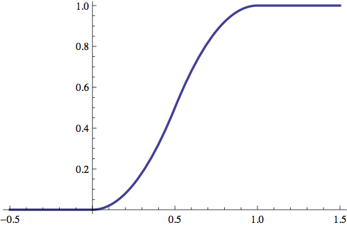
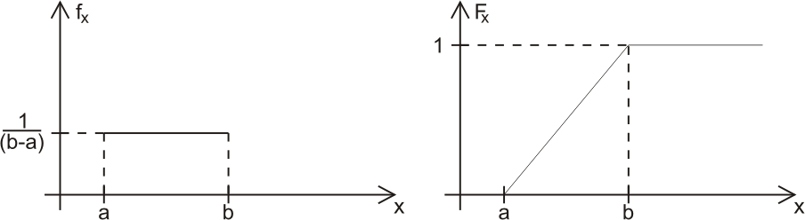

# Variáveis Aleatórias Contínuas

## Variáveis Aleatórias Contínuas {.build}
 
> * Variáveis aleatórias discretas: v.a. com valores possíveis enumeráveis.   Soma das probabilidades de todos os valores possíveis igual a $1$.  

> * Variáveis aleatórias contínuas:   v.a. com valores possíveis em um intervalo no conjunto de números reais.  

> * Exemplo: tempo para finalizar um experimento,   peso de uma pessoa,   duração de uma chamada telefônica,   tempo de vida de uma lâmpada, etc...  

> * Para esses tipos de quantidades, não é possível associar frequências pontuais tais que a soma de todas seja igual a 1.  

> * Surge então o conceito de "função de densidade de probabilidade" (f.d.p.).  

> * Para cada v.a. contínua, associamos uma função de densidade de probabilidade.
 

## Exemplo: v.a. discreta

Distribuição de probabilidade de uma $Bin(10, p)$, com $p=0.2, 0.5$ e $0.8$.

<center>
```{r, echo=FALSE, fig.height=4, fig.width=9}
binomial <- function(n, ...){
  ps <- c(.2,.5,.8)
  x <- 0:n
  par(mfrow=c(1,3))
  for(i in 1:3){
    px <- dbinom(x, size=n, prob=ps[i])
    barplot(px, names.arg=0:n, col="blue", main=paste("Bin(", n, ",",  ps[i], ")", sep=""), 
            cex.lab=2, cex.axis=1.5, cex.names=1.5, las=1, ...)
    box(bty="l", lwd=2)
  }
}
binomial(10, ylim=c(0, .3))
## binomial(10)
## binomial(30)
```
</center>


## Exemplo: v.a. discreta

<center>
```{r, echo=FALSE, fig.height=5, fig.width=5}
library(RColorBrewer)
mycol <- brewer.pal(8,"Dark2")

p <- c(.4,.1,.5)
par(mar=c(5, 4, 1, 2) + .1)
barplot(p, names.arg=1:3, col="blue", ylim=c(0, .6), ylab="p(x)", xlab="x", main="Distribuição de Probabilidade", cex.lab=1.5, cex.axis=1, cex.names=1, las=1)
box(bty="l", lwd=2)
```
</center>


## Exemplo: v.a. contínua

$\mu=2$ e $\sigma=2$
<center>
```{r,echo=FALSE, fig.height=5.5, fig.width=6}
# http://rgraphgallery.blogspot.com.br/2013/04/shaded-normal-curve.html
 curve(dnorm(x,mean=2,sd=2),xlim=c(-9,13),ylim=c(0,.2),main=' ',ylab=" ",lwd=2,col="blue")
```
</center>

## Exemplo: v.a. contínua

$\mu=2$ e $\sigma=4$
<center>
```{r,echo=FALSE, fig.height=5.5, fig.width=6}
# http://rgraphgallery.blogspot.com.br/2013/04/shaded-normal-curve.html
 curve(dnorm(x,mean=2,sd=4),xlim=c(-9,13),ylim=c(0,.2),main=' ',ylab=" ",lwd=2,col="blue")
```
</center>


## Variáveis Aleatórias Contínuas {.build}
 
**Definição:** a função de densidade de probabilidade de uma v.a. $X$ é uma função $f$ que verifica:  
 
> * $f(x)\geq0 \quad \forall x\in \mathbb{R}$  

> * $\int_{-\infty}^{\infty}f(x)dx=1$ ($f$ é integrável)  
 
> Toda v.a. $X$ à qual seja possível associar uma função de densidade de probabilidade será chamada de v.a. contínua.  
 
 
## Variáveis Aleatórias Contínuas {.build .smaller}
 
A probabilidade de que uma v.a. $X$ contínua pertença a um intervalo da reta (a,b], $a<b$ é dada por:  
$$P(a<X\leq b)=\int_{a}^{b}f(x)dx$$  
 
<center> 
```{r,echo=FALSE,fig.height=3.5, fig.width=4}
a=1
b=4
codx <- c(a,seq(a,b,0.01),b)
cody <- c(0,dchisq(seq(a,b,0.01),df=3),0)
curve(dchisq(x,df=3),xlim=c(0,10),main=' ',ylab="f(x)",xlab="x",xaxt='n',yaxt='n')
axis(1, at=c(a,b), labels=c(letters[1:2])) 
polygon(codx,cody,col='lightblue')
```
</center>

Obs: $P(a<X\leq b)=P(a\leq X\leq b)=P(a<X< b)=P(a\leq X <b)$ quando $X$ é v.a. contínua.

 
 

## Variáveis Aleatórias Contínuas{.build}
 
**Notação:** se $X$ v.a. contínua com função de densidade de probabilidade $f$, no lugar de $f$ denotaremos $f_{X}$.  

> À probabilidade de que uma v.a. $X$ contínua pertença ao intervalo da reta ($-\infty,x$] daremos o nome de **função de distribuição acumulada** (f.d.a.), e a denotaremos por $F_{X}$
$$F_{X}(x)=\int_{-\infty}^{x}f(u)du=P(X\leq x)$$
 


## Variáveis Aleatórias Contínuas {.build}
 
Exemplo: $X$ v.a. contínua com função de densidade: 

$$ f_{X}(x) = \left\{
\begin{array}{ll}
x, & 0\leq x < 1 \\
2-x, & 1 \leq x \leq 2 \\
0, & \mbox{caso contrário} \\
\end{array}
\right.$$

> Pela definição de função de densidade:  
 
> * $f(x)\geq0\quad \forall\, x\in \mathbb{R}$  

> * $\int_{0}^{2}f(x)dx=  \int_{0}^{1}xdx + \int_{1}^{2}(2-x)dx =1$  
 
> * Podemos também calcular $P(0<X\leq 0.8)=  \int_{0}^{0.8}xdx=0.32$
 


## Variáveis Aleatórias Contínuas {.build}
 
**Propriedade:** toda v.a. $X$ contínua (ou seja, que possui $f_{X}$ como função de densidade) tem probabilidade pontual nula: $P(X=x)=0$.  

> Resumindo: $F(x)=P(X\leq x)$  
 
* caso discreto: $F(x)=P(X \leq x)=\sum_{x_{i}\leq x}P(X=x_{i})$  
* caso contínuo: $F(x)=P(X \leq x)=\int_{-\infty}^{x}f_{X}(u)du$
 
## Exemplo

Dada a função

$$
f(x) = \left\{
\begin{array}{rcl}
0 & \mbox{se} & x < 0\\
2e^{-2x} & \mbox{se} & x \geq 0 \\
\end{array}
\right.
$$

 
a. Mostre que esta é uma função de densidade de probabilidade.

b. Calcule a probabilidade de $X>10$.  
 

*Fonte: Morettin \& Bussab*, Estatística Básica $5^a$ edição, pág 166.

## Exemplo (solução - item 1) {.build}

Uma função de densidade de probabilidade deve satisfazer as seguintes propriedades:  

   
1. $f(x)\geq0$ para todo $x \in \mathbb{R}$.  

2. $\displaystyle\int_{-\infty}^{\infty} f(x) dx = 1$.  
	 

> Note que $e^{-x}$ é positiva para qualquer $x$ e, consequentemente, $2e^{-2x}$ também.   

> Resta mostrar que sua integral é 1:  

$$ \int 2e^{-2x} dx   = -e^{-2x}$$

## Exemplo (solução - item 1) {.build}

Note que a função está definida nesta forma para $x \geq 0$; para $x<0$, ela é 0. 

> Então a integral é:

$$ \int_{-\infty}^{\infty} f(x) dx =   \int_{-\infty}^0 0 dx +   \int_0^{\infty} 2e^{-2x} dx = $$  

$$ = \left [  -e^{-2x} \right ] _{0}^{\infty}   = \lim_{x\rightarrow \infty} -e^{-2x} - \left ( -e^{-0} \right) = 1 $$ 

## Exemplo (solução - item 2) {.build}


A probabilidade é dada por: $$P(X>10) = \int_{10}^{\infty} 2e^{-2x} dx  = \lim_{x\rightarrow \infty} -e^{-2x} - \left ( -e^{-2\cdot10} \right) = \frac{1}{e^{20}}$$
 
 

## Esperança {.build}

**Definição:** seja $X$ uma v.a. contínua com densidade $f_{X}$, a **esperança** de $X$ é dada por:
$$E(X)= \int_{-\infty}^{\infty}x\,f_{X}(x)dx\,.$$

  
> **Definição:** seja $X$ uma v.a. contínua com densidade $f_{X}$, o **$k$-ésimo momento** de $X$ é dado por:

$$E(X^k)= \int_{-\infty}^{\infty}x^k\,f_{X}(x)dx\,.$$


## Variância {.build}
 
**Definição:** seja $X$ v.a. com valor esperado $E(X)$, definimos por **variância**, a quantidade:

$$Var(X)=  E([X-E(X)]^2)=  E(X^2)-[E(X)]^2\,.$$  

> E definimos como **desvio padrão**:
$$\sigma(X)=  \sqrt{Var(X)}$$  

> Note que assim como no caso discreto, ambas as quantidades oferecem medidas de dispersão da variável $X$ em relação ao valor esperado $E(X)$.
 


## Exemplo

Para a função $f_{X}$, calcular:
 
* $E(X)$
* $Var(X)$ 

$$ f_{X}(x) = \left\{
\begin{array}{ll}
x, & 0\leq x < 1 \\
2-x, & 1 \leq x \leq 2 \\
0, & \mbox{caso contrário} \\
\end{array}
\right.$$
 

## Exemplo 

$$ f_{X}(x) = \left\{
\begin{array}{ll}
x, & 0\leq x < 1 \\
2-x, & 1 \leq x \leq 2 \\
0, & \mbox{caso contrário} \\
\end{array}
\right.$$


$$E(X)= \int_{-\infty}^{\infty}xf_{X}(x)dx= \int_{0}^{1}x^{2}dx+ \int_{1}^{2}x(2-x)dx= 1$$

$$Var(X)= \int_{-\infty}^{\infty}[x-E(X)]^{2}f_{X}(x)dx= \int_{-\infty}^{\infty}[x-1]^{2}f_{X}(x)dx =\frac{1}{6}$$
 
 


## Exemplo

Uma variável aleatória $X$ tem distribuição triangular no intervalo $[0,1]$ se sua f.d.p. for dada por

$$
f(x) = \left\{
\begin{array}{rcl}
0 & \mbox{se} & x < 0\\
Cx & \mbox{se} & 0 \leq x \leq 1/2 \\
C(1-x) & \mbox{se} & 1/2 \leq x \leq 1 \\
0 & \mbox{se} & x > 1\\
\end{array}
\right.
$$
 
  
a. Qual valor deve ter a constante C?  
b. Faça o gráfico de $f(x)$.  
c. Determine $P(X \leq 1/2)$, $P(X > 1/2)$ e $P(1/4 \leq X \leq 3/4)$.
 

*Fonte:* Morettin \& Bussab, Estatística Básica $5^a$ edição, pág 166.

## Exemplo {.smaller .build}

Item 1 -  Devemos escolher $C$ de modo que $f(x)$ satisfaça:
	 
   + $f(x)\geq0$ para todo $x \in \mathbb{R}$.

   +  $\int_{-\infty}^{\infty} f(x) dx = 1$.
	   
> Pela primeira condição, temos que $C>0$.   Agora, para que $C$ satisfaça a segunda condição, devemos integrar $f(x)$:  
$$
\begin{aligned}
\int_{-\infty}^{\infty} f(x) dx &=   \int_{-\infty}^{0}\!\! 0 dx +  \int_0^{1/2}\!\! Cx dx +   \int_{1/2}^1\!\! C(1-x) dx +   \int_{1}^{\infty}\!\! 0 dx\\  
& = C \int_0^{1/2}\!\! x dx +   C \int_{1/2}^1\!\! (1-x) dx =   C \left ( \left[ \frac{x^2}{2} \right]_0^{1/2} +   \left[ x- \frac{x^2}{2} \right]_{1/2}^1  \right )\\
& = C \left( \frac{1}{8} +1 - \frac{1}{2} - \frac{1}{2} + \frac{1}{8}  \right) = C \cdot \frac{1}{4} \Rightarrow C \mbox{ deve ser igual a 4.} 
\end{aligned}
$$

## Exemplo

Item 2 - 

<center> 
```{r,echo=FALSE,fig.height=5, fig.width=5}

tri <- function(x,a=0,b=1,C=4)
{
  m <- 1/2
  tmp1 <- ifelse(x>=a & x<m , C*x, 0)
  tmp2 <- ifelse(x >=m & x <=1,C*(1-x),0)
  fx <- tmp1+tmp2
  return(fx)
}
x <- seq(from = -.2, to = 1.2, by = 0.001)
plot(x, tri(x), type = "l", lty = 1,col="blue" ,ylab = expression(f(x)))
```
<\center> 

## Exemplo {.smaller .build}

Item 3 - Para encontrarmos as probabilidades dos eventos, basta integrar nas regiões correspondentes: $$P(X\leq 1/2) =   \int_0 ^{1/2} f(x)dx = \int_0 ^{1/2} 4x dx =   1/2 \,. $$  

<center>
```{r,echo=FALSE,fig.width=4,fig.height=3}
plot(x, tri(x), type = "l", lty = 1,col="blue" ,ylab = expression(f(x)))
a=0
b=1/2
codx <- c(a,seq(a,b,0.01),b)
cody <- c(0,tri(seq(a,b,0.01)),0)
#axis(1, at=c(a,b)) 
polygon(codx,cody,col='lightblue')
```
</center>

> Note que $P(X>1/2) = 1-P(X\leq 1/2) = 1-1/2 = 1/2$.  


## Exemplo

$$P(1/4 \leq X \leq 3/4) =   \int_{1/4} ^{3/4} f(x)dx = \int_{1/4} ^{1/2} 4xdx +   \int_{1/2} ^{3/4} 4(1-x)dx =   \frac{3}{4}\,.$$
 
<center>
```{r,echo=FALSE,fig.width=5,fig.height=4}
plot(x, tri(x), type = "l", lty = 1,col="blue" ,ylab = expression(f(x)))
a=1/4
b=3/4
codx <- c(a,seq(a,b,0.01),b)
cody <- c(0,tri(seq(a,b,0.01)),0)
#axis(1, at=c(a,b)) 
polygon(codx,cody,col='lightblue')
```
</center>

## Exemplo

Calcule a esperança, a variância e a f.d.a. da variável aleatória $X$ com a densidade triangular em $[0,1]$.

*Fonte:* Morettin \& Bussab, Estatística Básica $5^a$ edição, pág 171.


## Exemplo

$$
\begin{aligned}
\mathbb{E}(X) &= \int_{-\infty}^{\infty} \!\! x f(x) dx =  \int_0^{1/2} \! 4x^2dx +  \int_{1/2}^{1} \! 4x(1-x)dx\\ 
& = \left[ \frac{4x^3}{3} \right]_0^{1/2} +  \left[ \frac{2}{3} x^2(3-2x) \right]_{1/2}^{1} =  \frac{1}{2}
\end{aligned}
$$

## Exemplo

$$
\begin{aligned}
\mbox{Var}(X)& = \int_{-\infty}^{\infty} \!\! (x-\mathbb{E}(X))^2 f(x) dx \\
&=  \int_0^{1/2} \! 4 \left(x-\frac{1}{2}\right)^2 \! xdx +   \int_{1/2}^{1} \! 4 \left(x-\frac{1}{2}\right)^2 \! (1-x)dx\\
&=  \left[ x^4-\frac{4}{3}x^3 +  \frac{1}{2}x^2 \right]_0^{1/2} +   \left[ -x^4+\frac{8}{3}^3-\frac{5}{2}x^2 +x \right]_{1/2}^{1}\\
&=  \frac{1}{24}
\end{aligned}
$$


## Exemplo {.build}

A função de distribuição acumulada de uma variável aleatória contínua é dada por $$F(x) = \int_{-\infty}^x f(t) dt$$
  
> Temos que para $x \in [0,1/2)$, $F(x)$ é dada por $$F(x) = \int_0^x 4t dt = 2x^2$$
 

> Para $x \in [1/2,1]$, a acumulada é dada por $$F(x) = \int_0^{1/2} 4t dt + \int_{1/2}^x 4(1-t)dt = -2x^2 + 4x -1$$


## Exemplo

Para valores de $x \geq 1$, a acumulada assume valor 1. O gráfico de $F(x)$ é dado por:

<center></center>


 

# Distribuição Uniforme

## Uniforme {.build}

*  Dizemos que a v.a. $X$ tem distribuição Uniforme no intervalo $[a,b]$, $a<b$ se a função de densidade de probabilidade $f_{X}$ é dada por:

$$ f_{X}(x) = \left\{
\begin{array}{ll}
\frac{1}{b-a}, & a \leq x \leq b \\
0, & \mbox{caso contrário} \\
\end{array}
\right.$$  

*  Notação: $X \sim U[a,b]$ ou $X \sim U(a,b)$.  

*  Cálculo da função de distribuição acumulada:

$$ F_{X}(x) = \left\{
\begin{array}{ll}
0, & x < a \\
\int_{a}^{x}\frac{1}{b-a}dt=\frac{x-a}{b-a}, & a \leq x \leq b \\
1, & x > b \\
\end{array}
\right.$$

## Uniforme

Gráficos da função de densidade de probabilidade e da função de distribuição acumulada:

<center></center>


## Esperança de Variância {.build}

*  Cálculo da $E(X)$:

$$E(X)= \int_{a}^{b}x\frac{1}{(b-a)}dx=\frac{(b+a)}{2}$$

> *  Cálculo da $Var(X)$: 

$$E(X^{2})= \int_{a}^{b}x^{2}\frac{1}{(b-a)}dx= \frac{(a^{2}+ab+b^{2})}{3}$$ 

$$Var(X)=E(X^{2})-[E(X)]^{2}= \frac{(a^{2}+ab+b^{2})}{3}-\frac{(b+a)^{2}}{4}= \frac{(b-a)^{2}}{12}$$

## Exemplo: peça de aço

A dureza $H$ de uma peça de aço pode ser pensada como uma v.a. com distribuição uniforme no intervalo $[50,70]$ da escala de Rockwel. Calcule a probabilidade de que uma peça tenha dureza entre 55 e 60. 

$$ f_{H}(h) = \left\{
\begin{array}{ll}
\frac{1}{70-50}=\frac{1}{20}, & 50 \leq x \leq 70 \\
0, & \mbox{caso contrário} \\
\end{array}
\right.$$
 
$$P(55<H<60)= \int_{55}^{60}\frac{1}{20}dh= \frac{1}{20}(60-55)= \frac{1}{4}\,.$$


## Exemplo

Seja $X$ uma variável aleatória distribuída uniformemente, com média 15 e variância 25/3. 


* Encontre a função de densidade de $X$.  

* Qual é a probabilidade que $X > 14$?  

## Exemplo {.build}

Lembre-se que a esperança de uma v.a. uniforme em $[a,b]$ é dada por $$E(X) = \frac{a+b}{2}$$ e sua variância por $$\mbox{Var}(X) = \frac{(b-a)^2}{12}$$ 

> Temos o seguinte sistema, portanto: 

$$
\left\{
\begin{array}{lcr}
\frac{a+b}{2} &=& 15 \\
\frac{(b-a)^2}{12} &=& \frac{25}{3} \\
\end{array}
\right.
$$

## Exemplo {.build}

$$
\left\{
\begin{array}{lcr}
a+b &=& 30 \\
(b-a)^2 &=& 100 \\
\end{array}
\right.
$$

> Ou simplesmente (você é capaz de dizer por que tomamos a raiz positiva apenas, neste sistema não-linear?) 

$$
\left\{
\begin{array}{ccr}
a  +  b & = & 30 \\
b  -  a & = & 10 \\
\end{array}
\right.
$$   


> O sistema tem solução $a=10$, $b=20$,   o que nos mostra que $X \sim U[10,20]$ e

$$ f_{X}(x) = \left\{
\begin{array}{ll}
\frac{1}{10}, & 10 \leq x \leq 20 \\
0, & \mbox{caso contrário} \\
\end{array}
\right.$$  

## Exemplo

A probabilidade de que $X>14$ é dada por $$P(X>14) =   \int_{14}^{20}\frac{1}{10}dx =  \frac{(20-14)}{10} = 0.6$$


# Distribuição Exponencial

## Exponencial {.build}

> *  Dizemos que uma v.a. $X$ possui distribuição exponencial com parâmetro $\lambda$ ($\lambda>0$) se a função de densidade de probabilidade $f_{X}$ é dada por:

$$ f_{X}(x) = \left\{
\begin{array}{ll}
\lambda e^{-\lambda x}, & x \geq 0 \\
0, & \mbox{caso contrário} \\
\end{array}
\right.$$  

> *  Notação: $X \sim exp(\lambda)$.  

> *  Cálculo da função de distribuição acumulada:

$$ F_{X}(x) = \left\{
\begin{array}{ll}
\int_{0}^{x}\lambda e^{-\lambda t}dt=1-e^{-\lambda x}, & x \geq 0 \\
0, & \mbox{caso contrário} \\
\end{array}
\right.$$


## Distribuição Exponencial 

Gráficos da  função de densidade de probabilidade (esquerda) e da função de distribuição acumulada (direita) de $X \sim Exp(0.5)$:

<center>
```{r, echo=FALSE, fig.width=4.5, fig.height=4}
lambda = .5
maxi = qexp(rate=lambda,.999)
par(mar=c(5, 4, 2, 2) + .1)
curve(exp(-lambda*x), 0, maxi, xlab = "x", ylab = "f(x)", type = "l", bty="l", las=1, col="blue", lwd=3, cex.lab=1.3, main="Função de Densidade de Probabilidade")

par(mar=c(5, 4, 2, 2) + .1)
curve(1-exp(-lambda*x), 0, maxi, xlab = "x", ylab = "F(x)", type = "l", bty="l", las=1, col="blue", lwd=3, cex.lab=1.3, main="Função de Distribuição Acumulada")
```
</center>


## Esperança de Variância {.build}

*  Cálculo da $E(X)$:

$$E(X)=\int_{0}^{\infty}x\lambda e^{-\lambda x}dx=\frac{1}{\lambda}$$

> *  Cálculo da $Var(X)$:

$$E(X^{2})=\int_{0}^{\infty}x^{2}\lambda e^{-\lambda x}dx=\frac{2}{\lambda^{2}}$$

> $$Var(X)=E(X^{2})-[E(X)]^{2}=\frac{2}{\lambda^{2}}-\frac{1}{\lambda^{2}}=\frac{1}{\lambda^{2}}$$


## Exemplo: componente eletrônico

O tempo de vida, $X$, em horas, de um componente eletrônico segue uma distribuição exponencial de tal forma que $P(X\leq 1000) = 0.75$. 

Qual é o tempo médio de vida do componente?

## Exemplo: componente eletrônico {.build}

Sabemos que se $X \sim exp(\lambda)$, então $F(x) = P(X \leq x) = 1-e^{-\lambda x}$ e   $\mathbb{E}(X) = \lambda^{-1}$.   

> Basta então observarmos que 

$$P(X \leq 1000) = 1 - e^{-\lambda 1000} = 0.75 \Leftrightarrow   \lambda = \frac{\ln(4)}{1000} = 0.0013863$$   

> Concluimos então que o tempo médio de vida, $\mathbb{E}(X)$, é igual a $1/0.0013863 = 721.3475$ horas,   e que $75\%$ dos componentes duram 1000 horas ou menos.

## Exemplo: tubos de TV {.build}

Um antiga fábrica de tubos de TV determinou que a vida média dos tubos de sua fabricação é de $800$ horas de uso contínuo e segue uma distribuição exponencial.   

> Qual a probabilidade de que a fábrica tenha que substituir um tubo gratuitamente, se oferece uma garantia de $300$ horas de uso?  

## Exemplo: tubos de TV {.build .smaller}

$X$: vida útil do tubo de TV.   

> $E[X]=  800$. Como $X$ tem distribuição exponencial com parâmetro $\lambda$, $E[X]= \frac{1}{\lambda}=800$, portanto $\lambda= \frac{1}{800}$.  

$$ f_{X}(x) = \left\{
\begin{array}{ll}
\lambda e^{-\lambda x}, & x \geq 0 \\
0, & \mbox{caso contrário} \\
\end{array}
\right.$$
 
> 

$$ f_{X}(x) = \left\{
\begin{array}{ll}
\frac{1}{800} e^{-\frac{x}{800}}, & x \geq 0 \\
0, & \mbox{caso contrário} \\
\end{array}
\right.$$  

> Se $X<300$, a fábrica tem que substituir gratuitamente.

$$P(X<300)= \int_0^{300}\frac{1}{800}e^{-\frac{x}{800}}dx =\left[-e^{-\frac{x}{800}} \right]_0^{300}= 0.3127\,.$$


## Exemplo: produto alimentício {.build}

A f.d.p. $$ f_{X}(x) = \left\{
\begin{array}{ll}
2 e^{-2 x}, & x \geq 0 \\
0, & \mbox{caso contrário} \\
\end{array}
\right.$$   

representa a distribuição do índice de acidez ($X$) de um determinado produto alimentício.   

> O produto é consumível se este índice for menor do que $2$.   

> O setor de fiscalização apreendeu $30$ unidades do produto.   Qual a probabilidade de que pelo menos $10\%$ da amostra seja imprópria para consumo?

## Exemplo: produto alimentício {.build .smaller}

Produto liberado para consumo se: $P(X<2)= \int_0^22 e^{-2 x}dx= \left[-e^{-2x} \right]_0^{2}=0.98$.  

> Produto não consumível com probabilidade   $1-P(X<2)= 0.02=  p$.  

> $Y$: número de unidades impróprias para consumo na amostra de 30.  

> $Y\sim \mbox{Bin}(30,0.02)$.

Probabilidade de que pelo menos 10\% de uma amostra de 30 unidades seja imprópria:  


$$
\begin{aligned}
P(Y\geq3)&= 1-P(Y<3)=1-[P(Y=0)+P(Y=1)+P(Y=2)]\\
&= 1-\left[\binom{30}{0}(0.02)^0(0.98)^{30} + \binom{30}{1}(0.02)^1(0.98)^{29}+\binom{30}{2}(0.02)^2(0.98)^{28} \right]\\
&= 0.022\,.
\end{aligned}
$$


## Leituras

* [Ross](http://www.sciencedirect.com/science/article/pii/B9780123743886000065): seções 6.1 e 6.2.
* Magalhães: capítulo 6.


##

Slides produzidos pelos professores:

* Samara Kiihl

* Tatiana Benaglia

* Benilton Carvalho
