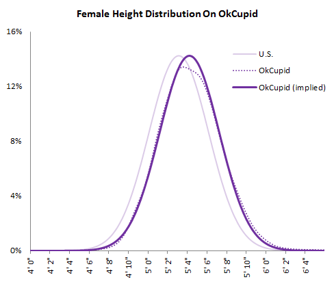
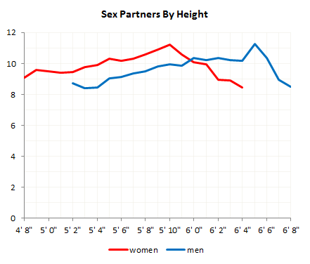
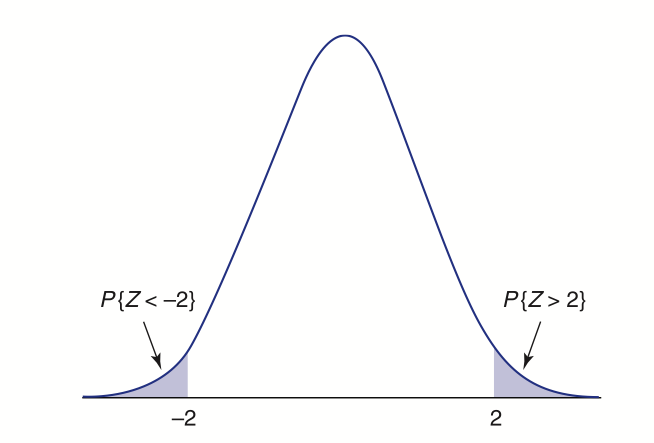
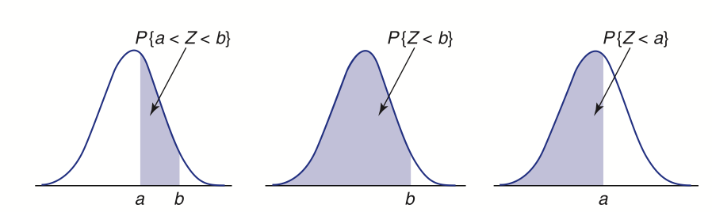
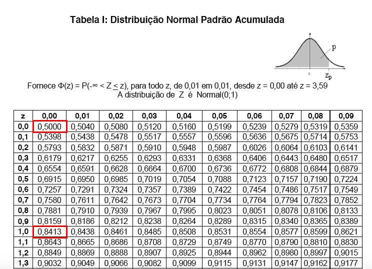
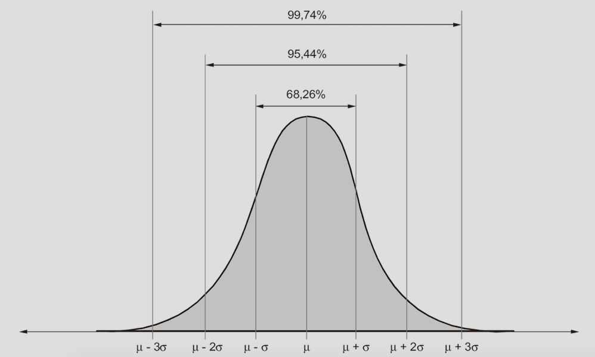
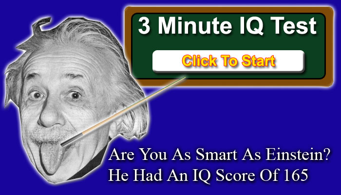
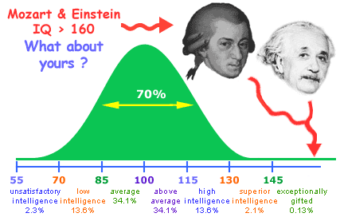
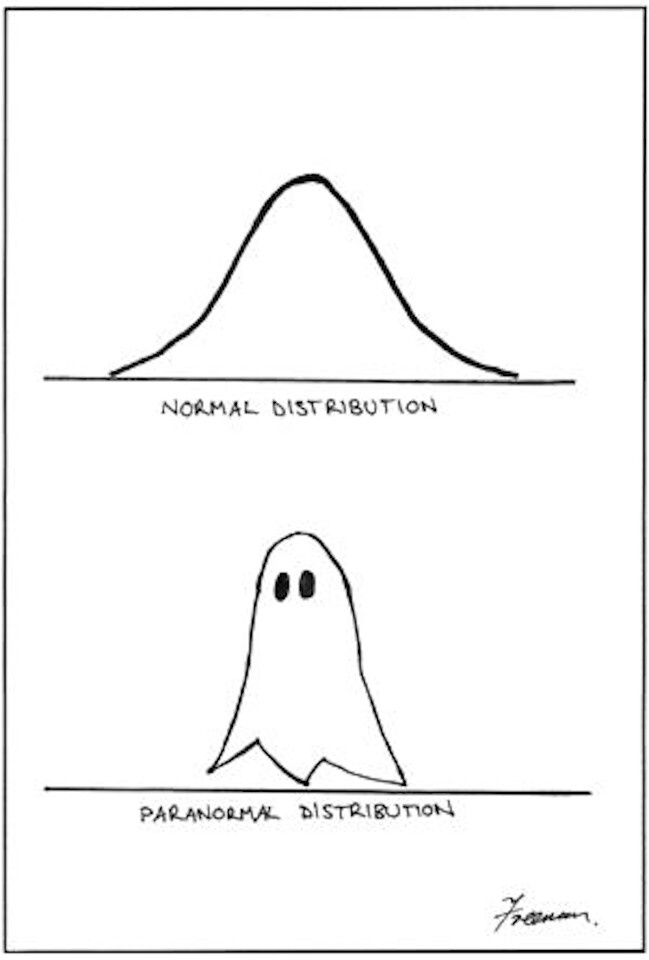

# Distribuição Normal

## Distribuição Normal {.build}

Dizemos que uma v.a. $X$ possui distribuição normal com parâmetros $\mu$ e $\sigma^{2}$, $\mu \in \mathbb{R}$ e $\sigma^{2}>0$, se a f.d.p. $f_{X}$ é dada por: 

$$f_{X}(x)=\frac{1}{\sqrt{2\pi\sigma^{2}}}exp\left[-\frac{(x-\mu)^{2}}{2\sigma^{2}}\right],  \qquad  -\infty < x < \infty$$ 

**Notação:** $X\sim N(\mu,\sigma^{2})$

Distribuição mais importante da Estatística. Também conhecida como distribuição Gaussiana.

A esperança e variância de uma v.a. $X\sim N(\mu,\sigma^{2})$ são:

$$\mathbb E(X)=\mu \qquad \mbox{e} \qquad Var(X)=\sigma^2$$

## Distribuição Normal - Esperança e Variância 

**Esperança:**
$$\mathbb E(X)=\int_{-\infty}^{\infty}x\frac{1}{\sqrt{2\pi\sigma^{2}}}exp\left[-\frac{(x-\mu)^{2}}{2\sigma^{2}}\right]dx=\mu$$

**Variância**
$$
\begin{aligned}
Var(X) & = \mathbb E([X-\mathbb E(X)]^{2}) \\
& = \int_{-\infty}^{\infty}(x-\mu)^{2}\frac{1}{\sqrt{2\pi\sigma^{2}}}exp\left[-\frac{(x-\mu)^{2}}{2\sigma^{2}}\right]dx \\
&=\sigma^{2} 
\end{aligned}
$$

## Distribuição Normal
 Gráfico da função de densidade de probabilidade de uma v.a. $X \sim N(\mu,\sigma^{2})$

<center>
```{r, echo=FALSE, fig.height=4.2, fig.width=6}
library(RColorBrewer)
mycol <- brewer.pal(8,"Dark2")

par(mar=c(4, 4, 1, 2) + .1)
curve(dnorm(x, mean=0, sd=1), -5, 5, bty="l", ylim=c(0, 0.85), yaxs = "i", xaxs="i", 
      main="", ylab="f(x)", cex.lab=1.3, cex.axis=1.3, 
      cex.main=1.3, col=1, lwd=3, las=1)
curve(dnorm(x, mean=0, sd=1/2), -5, 5, n=1000, col=mycol[4], lwd=3, add=TRUE)
curve(dnorm(x, mean=2, sd=1), -5, 5, col=mycol[3], lwd=3, add=TRUE)
curve(dnorm(x, mean=-2, sd=1), -5, 5, col=mycol[1], lwd=3, add=TRUE)
curve(dnorm(x, mean=0, sd=2), -5, 5, col=mycol[6], lwd=3, add=TRUE)
legend("topright", legend=expression(mu==0 ~~ sigma == 1, mu==0 ~~ sigma == 0.5,
                                     mu==2 ~~ sigma == 1, mu==-2 ~~ sigma == 1,
                                     mu==0 ~~ sigma == 2),
       lwd=2, col=c(1, mycol[c(4,3,1,6)]), cex=1, bty="n")
```
</center>

**Função Densidade:** "Forma de sino", centrada em $\mu$ e escala  controlada por $\sigma^2$


## Exemplo: OkCupid {.build}

[OkCupid](https://en.wikipedia.org/wiki/OkCupid) é uma rede social para relacionamentos.

> Usuários devem colocar características pessoais como, por exemplo, altura.

> Será que são sinceros?

<center></center>

## Exemplo: OkCupid {.build}


Comparação da distribuição das alturas da população adulta norte-americana e a distribuição das alturas dos usuários do site:

<center></center>


*Fonte: [http://blog.okcupid.com/index.php/the-biggest-lies-in-online-dating/](http://blog.okcupid.com/index.php/the-biggest-lies-in-online-dating/)*

## Exemplo: OkCupid


Comparação da distribuição das alturas da população adulta norte-americana e a distribuição das alturas dos usuários do site:

<center></center>


*Fonte: [http://blog.okcupid.com/index.php/the-biggest-lies-in-online-dating/](http://blog.okcupid.com/index.php/the-biggest-lies-in-online-dating/)*


## Exemplo: OkCupid

<center></center>

*Fonte: [http://blog.okcupid.com/index.php/the-biggest-lies-in-online-dating/](http://blog.okcupid.com/index.php/the-biggest-lies-in-online-dating/)*


## Distribuição Normal Padrão {.build}

**Propriedade**: Se $X \sim N(\mu, \sigma^{2})$, então 
$$Z=\frac{X-\mu}{\sigma} \sim N(0,1)$$

Dizemos que $Z$ tem distribuição **Normal Padrão** e sua densidade se reduz a:
$$\phi(z)=\frac{1}{\sqrt{2\pi}}e^{-z^2/2},  \qquad  -\infty < z < \infty$$ 


A f.d.a. de uma Normal padrão, que denotaremos por $\Phi$, é:
$$\Phi(t)=P(Z\leq t)=\int_{-\infty}^{t}\frac{1}{\sqrt{2\pi}}e^{-z^2/2}dz$$

## Distribuição Normal Padrão
<center>
```{r, echo=FALSE, fig.height=4, fig.width=5}
par(mar=c(5, 4, 3, 2) + .1)
curve(dnorm(x, mean=0, sd=1), -3, 3, bty="l", ylim=c(0,.45), yaxs = "i", xaxs="i", 
      main="Densidade N(0,1)", ylab=expression(phi(z)), xlab="z", cex.lab=1.2, cex.axis=1.2, cex.main=1.2, col="blue", lwd=3, las=1)

curve(pnorm(x, mean=0, sd=1), -3, 3, bty="l", ylim=c(0, 1.05), yaxs = "i", xaxs="i", 
      main="Distribuição Acumulada N(0,1)", ylab=expression(Phi(z)), xlab="z", cex.lab=1.2, 
      cex.axis=1.2, cex.main=1.2, col="blue", lwd=3, las=1)
```
</center>

## Exemplo: SAT e ACT {.build}

<center></center>

Uma universidade americana recebeu inscrição de dois alunos (Pam e Jim) com os respectivos históricos escolares. No entanto, Pam realizou o [SAT](https://pt.wikipedia.org/wiki/SAT) e tirou 1800, enquanto que o Jim fez o [ACT](https://en.wikipedia.org/wiki/ACT_(test)) e tirou 24. Como a universidade pode comparar os dois alunos, baseando-se nesses testes?

> Precisamos avaliar quão melhor (ou pior) a Pam foi em relação aos demais alunos que realizaram o SAT.

> Precisamos avaliar quão melhor (ou pior) o Jim foi em relação aos demais alunos que realizaram o ACT.

## Exemplo: SAT e ACT {.build}

> A universidade tem acesso à média (1500) e ao desvio-padrão (300) das notas de todos os alunos que realizaram o SAT juntamente com a Pam.

> A universidade tem acesso à média (21) e ao desvio-padrão (5) das notas de todos os alunos que realizaram o ACT juntamente com a Jim.

> Assumindo que as notas dos dois testes seguem uma distribuição normal:

Seja $X$ uma v.a. representando a nota no SAT: $X\sim N(\mu=1500,\sigma=300)$.

Seja $Y$ uma v.a. representando a nota no ACT: $X\sim N(\mu=21,\sigma=5)$.

## Exemplo: SAT e ACT

<center>
```{r, echo=FALSE, fig.height=4.5, fig.width=5}
par(mar=c(5, 4, 3, 2) + .1)
curve(dnorm(x, mean=1500, sd=300), 500, 2500, bty="l", yaxs = "i", xaxs="i", 
      main="Pam", ylab=expression(phi(x)), xlab="x", cex.lab=1.2, cex.axis=1.2, cex.main=1.2, col="blue", lwd=3, las=1)
abline(v=1800,col="red")

curve(dnorm(x, mean=21, sd=5), 5, 37, bty="l", yaxs = "i", xaxs="i", 
      main="Jim", ylab=expression(phi(y)), xlab="y", cex.lab=1.2, 
      cex.axis=1.2, cex.main=1.2, col="blue", lwd=3, las=1)
abline(v=24,col="red")

```
</center>

## Exemplo: SAT e ACT {.build}

Seja $X$ uma v.a. representando a nota no SAT: $X\sim N(\mu=1500,\sigma=300)$.

> Padronizando a v.a. das notas do SAT:
$Z_1=\frac{X-1500}{300}\sim N(0,1)$.

> Padronizando a nota da Pam:

$\frac{1800-1500}{300}=1$

> Seja $Y$ uma v.a. representando a nota no ACT: $X\sim N(\mu=21,\sigma=5)$.

> Padronizando a v.a. das notas do ACT:
$Z_2=\frac{X-21}{5}\sim N(0,1)$.

> Padronizando a nota do Jim:

$\frac{24-21}{5}=0.6$

## Exemplo: SAT e ACT

<center>
```{r, echo=FALSE, fig.height=4.5, fig.width=5}
curve(dnorm(x, mean=0, sd=1), -3, 3, bty="l", yaxs = "i", xaxs="i", 
      main="Notas Padronizadas", ylab=expression(phi(z)), xlab="z", cex.lab=1.2, cex.axis=1.2, cex.main=1.2, col="blue", lwd=3, las=1)
abline(v=1,col="red")
abline(v=.6,col="blue")
```
</center>


## Distribuição Normal {.build}

* Para calcular as probabilidades, precisamos usar a f.d.a. de $Z \sim N(0,1)$ 

$$\Phi(t)=P(Z\leq t)=\int_{-\infty}^{t}\frac{1}{\sqrt{2\pi}}e^{-z^2/2}dz,$$
que não tem forma fechada, pois $e^{-z^2}$ não tem antiderivada.  

> * Contudo, os valores para $Z \sim N(0,1)$ e $\phi(z)$ encontram-se tabelados.

> * Tudo o que precisamos fazer é transformar a variável em $N(0,1)$ e usar os valores tabelados. Ou seja, para $X \sim N(\mu, \sigma^{2})$, temos:
> $$F_X(a)=P(X \leq a)= P\left(\underbrace{\frac{X-\mu}{\sigma}}_{Z} \leq \frac{a-\mu}{\sigma}\right) = \Phi\left(\frac{a-\mu}{\sigma}\right)$$

## Distribuição Normal
<center>
```{r, echo=FALSE, fig.height=4.2, fig.width=6}
par(mar=c(4, 5, 3, 2) + .1)
curve(pnorm(x, mean=0, sd=1), -6, 6, bty="l", ylim=c(0,1.1), yaxs = "i", xaxs="i", 
      main="Função de Distribuição Acumulada", ylab=expression(Phi(x)), cex.lab=1.3, 
      cex.axis=1.3, cex.main=1.3, col=1, lwd=3, las=1)
curve(pnorm(x, mean=0, sd=1/2), -6, 6, col=mycol[4], lwd=3, add=TRUE)
curve(pnorm(x, mean=2, sd=1), -5, 5, col=mycol[3], lwd=3, add=TRUE)
curve(pnorm(x, mean=-2, sd=1), -5, 5, col=mycol[1], lwd=3, add=TRUE)
curve(pnorm(x, mean=0, sd=2), -5, 5, col=mycol[6], lwd=3, add=TRUE)
legend("topleft", legend=expression(mu==0 ~~ sigma == 1, mu==0 ~~ sigma == 0.5,
                                     mu==2 ~~ sigma == 1, mu==-2 ~~ sigma == 1,
                                     mu==0 ~~ sigma == 2),
       lwd=2, col=c(1, mycol[c(4,3,1,6)]), cex=1, bty="n")
```
</center>

## Distribuição Normal - Simetria

A distribuição normal é simétrica, portanto
$$P(Z<-z)=P(Z>z)$$
<center></center>

## Distribuição Normal {.build}

* $Z\sim\mbox{Normal}(0,1)$, com f.d.a. $\Phi$:
$$\Phi(t)=P(Z\leq t)=\int_{-\infty}^{t}\frac{1}{\sqrt{2\pi}}e^{-z^2/2}dz$$ 

> * $\Phi(0)=0.5$ 

> * $\Phi(-\infty)=0$ 

> * $\Phi(\infty)=1$ 

> * Por simetria:
> $$\begin{aligned}
\Phi(x)&=P(Z< x)=1-P(Z>x) \\
&=1-P(Z<-x)=1-\Phi(-x)= P(Z>-x)
\end{aligned}$$

## Distribuição Normal
A probabilidade de um intervalo é dada por:
$$
\begin{aligned}
P(a<Z<b) &= P(Z<b)-P(Z<a) \\
&= P(Z \leq b) - P(Z \leq a) \\
&=\Phi(b)-\Phi(a)
\end{aligned}
$$

<center></center>

## Tabela Normal

<center></center>


## Distribuição Normal {.build}

Exercitando com a tabela da Normal:

> * $\Phi(0.2)=0.5793$ 

> * $\Phi(0.45)=0.6736$ 

> * $\Phi(1.28)= 0.8997$ 

> * $\Phi(-0.45)= 1-\Phi(0.45) =0.3264$


## Distribuição Normal

**Exemplo**: Se $X \sim N(10, 4)$, calcular:

1. $P(8<X<10)$

2. $P(9 \leq X \leq 12)$

3. $P(X>10)$

4. $P(X<8 \mbox{ ou } X>11)$

*Fonte: Morettin \& Bussab*, Estatística Básica $5^a$ edição, pág 182.


## Distribuição Normal {.build}

Recorde que se $X \sim N(\mu, \sigma^2)$, então $X - \mu \sim  N(0, \sigma^2)$ e $(X-\mu)/\sigma  \sim N(0,1)$.  

Neste problema, sabemos que $\mu = 10$ e  $\sigma^2 = 4$, logo $\sigma = 2$. Então 
$$Z=\frac{(X-10)}{2} \sim N(0,1)$$ 

Devemos transformar $X$ de modo que o evento $8<X<10$ permaneça inalterado. Fazemos isso transformando todos os lados da inequação: 

$$\begin{aligned}
8<X<10 &\Leftrightarrow 8-10 < X-10 < 10-10 \\
& \Leftrightarrow \frac{8-10}{2} < \frac{X-10}{2} < \frac{10-10}{2} \\
&\Leftrightarrow -1 < Z < 0
\end{aligned}
$$

## Distribuição Normal {.build}
Então, $P(8<X<10) = P(-1 < Z < 0)$

O valor $\varPhi(0)$ está disponível na tabela, e é igual a $0.5$. 

Para obtermos $\varPhi(-1)$, devemos usar a simetria da função $\varPhi$ em torno do zero: $$\varPhi(-x) = 1-\varPhi(x)$$

A tabela nos dá $\varPhi(1) = 0.8413 \quad \rightarrow \quad \varPhi(-1) = 1-0.8413 = 0.1587$

Concluimos portanto que 
 $$
 \begin{aligned}
 P(8<X<10) &= P(-1<Z<0) \\
 &= \varPhi(0)-\varPhi(-1) \\
 &= 0.5 - 0.1587 = 0.3413
 \end{aligned}
 $$


## Distribuição Normal

Esta é a tabela da normal, com os valores de $\varPhi(1)$ e $\varPhi(0)$ destacados:

<center></center>

## Distribuição Normal

Este é o gráfico da curva $N(10,4)$, com a região $[8,10]$ correspondente ao item 1. em destaque:

<center> 
```{r, echo=FALSE, fig.height=4, fig.width=6}
a <- 8
b <- 10
codx <- c(a, seq(a, b, 0.01), b)
cody <- c(0, dnorm(seq(a, b, 0.01), mean=10, sd=2), 0)
par(mar=c(4, 4, 1, 2) + .1)
curve(dnorm(x, mean=10, sd=2), xlim=c(4, 16), ylim=c(0, .2), main="", ylab="f(x)", xlab="x", 
      xaxs="i", yaxs="i", bty="l", col="blue", lwd=2, las=1)
axis(1, at=c(a,b)) 
polygon(codx, cody, col="lightblue", border=NA)
curve(dnorm(x, mean=10, sd=2), add = TRUE, col="blue", lwd=2)
```
</center>

## Distribuição Normal {.build}

$$
\begin{aligned}
P(9 \leq X \leq 12) &= P\left(\frac{9-10}{2} \leq \frac{X-10}{2} \leq \frac{12-10}{2}\right) \\
&= P(-1/2 \leq Z \leq 1) = 0.5328
\end{aligned}
$$


$$P(X>10) = P\left(\frac{X-10}{2} > \frac{10-10}{2}\right) = P(Z>0) = 0.5$$


$$
\begin{aligned}
P(X<8 \mbox{ ou } X>11) &= P(X<8) + P(X>11) \\
&= P\left(\frac{X-10}{2} < \frac{8-10}{2}\right) + P\left(\frac{X-10}{2} > \frac{11-10}{2}\right) \\
&= P(Z<-1) + P(Z>1/2) \\
&= 0.1586 + 0.3085 = 0.4671
\end{aligned}
$$

## Distribuição Normal {.build}
**Exemplo**: Se $X \sim N(4,3^{2})$, calcule $P(X \leq 7)$ e $P(1 < X \leq 7)$. 

$$\begin{aligned}
F_X(7)= P(X \leq 7) &= P\left(\frac{X-4}{3} \leq \frac{7-4}{3}\right) \\
&= P(Z\leq 1)= \Phi(1)=0.8413
\end{aligned}$$

$$
\begin{aligned}
P(1 < X \leq 7) &= P\left(\frac{1-4}{3}<\frac{X-4}{3}\leq \frac{7-4}{3}\right) \\
&=P(-1<Z\leq 1) \\
&=\Phi(1)-\Phi(-1) \\
&=\Phi(1)-[1-\Phi(1)] \\
&=2\Phi(1)-1=2\times0.8413-1=0.6826
\end{aligned}
$$

## Distribuição Normal
**Exemplo**: $X \sim N(4,3^{2})$ e a região correspondente a $P(1 < X \leq 7)$ em destaque no gráfico

<center> 
```{r, echo=FALSE, fig.height=4, fig.width=7}
mu <- 4
sigma <- 3
a <- 1
b <- 7
codx <- c(a, seq(a, b, 0.01), b)
cody <- c(0, dnorm(seq(a, b, 0.01), mean=mu, sd=sigma), 0)
par(mar=c(4, 4, 1, 2) + .1)
curve(dnorm(x, mean=mu, sd=sigma), xlim=c(mu-3*sigma, mu+3*sigma), ylim=c(0, .14), main="",
      ylab="f(x)", xlab="x", xaxt="n", yaxs="i", bty="l", col="blue", lwd=2, las=1)
axis(1, at=seq(mu-3*sigma, mu+3*sigma, by=2)) 
polygon(codx, cody, col="lightblue", border=NA)
curve(dnorm(x, mean=mu, sd=sigma), add = TRUE, col="blue", lwd=2)
abline(v=4, lty=2)
arrows(x0=1, y0=0.08, x1=4, code=3, col = "red", length=0.1, lwd=2)
text(2.5, 0.07, expression(sigma == 3), cex=1.3, col="red")
```
</center>


## Regra Empírica 
Em uma distribuição normal $X \sim N(\mu, \sigma^{2})$, temos o seguinte:

<center></center>

## Regra Empírica

**Exemplo:** Suponha que o $QI$ da população mundial segue uma distribuição normal com média $100$ e desvio padrão de $15$

Encontre um intervalo que englobe os $QI$’s de $68.3\%$ da população?

E se quisermos $95\%$? E $99.7\%$?

<center></center>

## Regra Empírica {.build .smaller}

<center></center>

Como $QI \sim N(100, 15)$, pela regra empírica:

$68.3\%$ da população: $85 \leq QI \leq 115$ 

$95\%$ da população: $70 \leq QI \leq 130$ 

$99.7\%$ da população: $55 \leq QI \leq 145$

## Aproximação Normal para uma Binomial

Seja $X \sim Bin(n, p)$

O que acontece quando o número de ensaios $n$ aumenta?

<center>
```{r, echo=FALSE, fig.height=3.5, fig.width=10}
p <- 0.7
ns <- c(10, 30, 100)

par(mfrow=c(1,3), mar=c(4, 4, 3, 2) + .1)
for(n in ns){
  x <- 0:n
  px <- dbinom(x, size=n, prob=p)
  barplot(px, names.arg=0:n, col=mycol[1], main=paste("Bin(", n, ",",  p, ")", sep=""), 
          cex.lab=2, cex.axis=1.5, cex.names=1.5, las=1)
  box(bty="l", lwd=2)
}
```
</center>
    
## Aproximação Normal para uma Binomial {.build}

Seja $X \sim Bin(n, p)$. Se $n$ é suficientemente grande, a distribuição de $X$ pode ser aproximada pela distribuição normal, isto é,

> $$X \sim N(np, np(1-p))$$

> **Exemplo:** Se $X \sim Bin(100, 0.7)$, podemos usar a aproximação $X \sim N(70, 21)$
<center>
```{r, echo=FALSE, fig.height=3.5, fig.width=4}
n <- 100
p <- 0.7
mu <- n*p
sigma <- sqrt(n*p*(1-p))
par(mar=c(4, 4, 3, 2) + .1)
a <- round(mu-3*sigma)
b <- round(mu+3*sigma)
px <- dbinom(a:b, size=n, prob=p)
barplot(px, names.arg=a:b, space=0, col=mycol[1], main=paste("Bin(", n, ",",  p, ") e N(", mu, ",", round(sigma,2), ")", sep=""), cex.lab=1.2, cex.axis=1.2, cex.names=1.2, las=1)
lines(0:(length(a:b)-1), dnorm(c(a:b-.5), mean=mu, sd=sigma), lwd=3, col="red")
```
</center>

## Aproximação Normal para uma Binomial {.build}

**Exemplo:** Seja $X$ o número de vezes que uma moeda honesta resulta em cara quando é lançada $40$ vezes. Então
$$X \sim Bin(40, 0.5)$$

Encontre $P(X=20)$ usando a fórmula exata e a aproximação normal

* Binomial

$$P(X=20) = {40 \choose 20}(0.5)^{20}(0.5)^{20}  = 0.125$$

* Normal

$$P(X=20) \approx P(19.5 < X \leq 20.5)  = 0.1256$$


## Aproximação Normal para uma Binomial {.build}

**Exemplo:** $X \sim Bin(40, 0.5)$

<center>
```{r, echo=FALSE, fig.height=4, fig.width=6}
n <- 40
p <- 0.5
mu <- n*p
sigma <- sqrt(n*p*(1-p))
a <- round(mu-3*sigma)
b <- round(mu+3*sigma)
px <- dbinom(a:b, size=n, prob=p)
par(mar=c(4, 4, 3, 2) + .1)
barplot(px, names.arg=a:b, space=0, col=mycol[1], main=paste("Bin(", n, ",",  p, ") e N(", mu, ",", round(sigma,2), ")", sep=""), cex.lab=1.2, cex.axis=1.2, cex.names=1.2, ylim=c(0, .14),
        las=1)
lines(0:(length(a:b)-1), dnorm(c(a:b-.5), mean=mu, sd=sigma), lwd=3, col="red")
```
</center>

## Aproximação Normal para uma Binomial 

Em geral, para que a aproximação para a normal seja utilizada:

$$n\times p \geq 10$$

$$n\times (1-p) \geq 10$$

pelo menos 10 sucessos e pelo menos 10 fracassos na amostra.


## Relembrando: Propriedades da Esperança {.build}
 
1. Para qualquer v.a. $X$ e constantes $a$ e $b$:
    $$\mathbb E(aX + b) = a \mathbb E(X) + b$$
    
    Casos particulares:
    + $\mathbb E(X+b) = \mathbb E(X) + b$
    + $\mathbb E(aX) = a \mathbb E(X)$

2. Se $X_1, X_2, \ldots, X_n$ são variáveis aleatórias:
 $$ \mathbb E\left(\sum_{i=1}^n X_i \right) = \sum_{i=1}^n \mathbb E(X_i)$$

## Relembrando: Propriedades da Variância {.build}
 
1. Para qualquer v.a. $X$ e constantes $a$ e $b$:
 $$Var(aX + b) = a^2Var(X)$$

    Casos particulares:
    + $Var(X+b) = Var(X)$
    + $Var(aX) = a^2 Var(X)$
  
2. Se $X_1, X_2, \ldots, X_n$ são variáveis aleatórias independentes:
$$ Var \left(\sum_{i=1}^n X_i \right) = \sum_{i=1}^n Var(X_i)$$ 


## Propriedade Aditiva da Normal {.build}

> * Se adicionarmos ou multiplicarmos uma constante a uma v.a. com distribuição Normal, a v.a. resultante continua tendo distribuição normal.

> * Portanto, se $X\sim N(\mu,\sigma^2)$, então $Z=\frac{X-\mu}{\sigma}\sim N(0,1)$.

> * Se $X\sim N(\mu_x,\sigma_x^2)$ e $Y\sim N(\mu_y,\sigma_y^2)$:

$$X+Y\sim N(\mu_x+\mu_y,\sigma_x^2+\sigma_y^2)$$

## Leituras

<center></center>


* [Ross](http://www.sciencedirect.com/science/article/pii/B9780123743886000065): seções 6.3 a 6.7.
* [OpenIntro](https://www.openintro.org/stat/textbook.php): seções 3.1, 3.2, 3.4.2
* Magalhães: capítulo 6.

##

Slides produzidos pelos professores:

* Samara Kiihl

* Tatiana Benaglia

* Benilton Carvalho