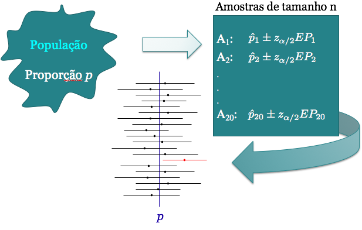
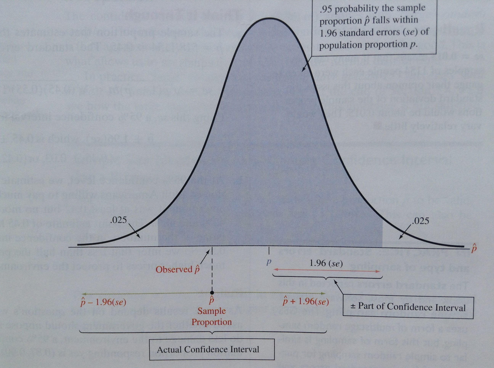

# Intervalo de Confiança

## Introdução {.build}

> * Vimos que podemos utilizar uma estatística, como $\bar{X}$, para estimar um parâmetro populacional, como a média populacional $\mu$.

> * Após coletarmos uma amostra aleatória calculamos $\bar{x}$, que é a nossa estimativa para $\mu$. Chamamos esta estimativa de **estimativa pontual**.

> * Uma estimativa pontual fornece apenas um único valor plausível para o parâmetro. E sabemos que ela pode ser diferente para cada amostra obtida: distribuição amostral.

> * O ideal é que se reporte não só a estimativa, mas também a sua imprecisão.

> * Duas maneiras: fornecer a estimativa juntamente com o seu **erro-padrão** ou fornecer um intervalo de valores plausíveis para o parâmetro de interesse (**intervalo de confiança**).

## Introdução {.build}

Suponha que queremos estimar o parâmetro populacional $\theta$ através de um intervalo.

Um intervalo de confiança (IC) para $\theta$ é sempre da forma:

$$ \mbox{estimativa} \pm \mbox{margem de erro}$$

$$\hat \theta \pm \mbox{margem de erro}$$

Sendo:

> * $\hat \theta$ uma estimativa pontual de $\theta$

> * **margem de erro:** quantidade que depende da distribuição amostral do estimador pontual de $\theta$, do grau de confiança pré-estabelecido e do erro padrão da estimativa


## Intervalo de Confiança como Estimativa de p {.build}

* Seja $X_i \sim Bernoulli(p)$, $i=1, \ldots, n$. 

> * Se $n$ suficientemente grande, $$S_n=\sum_{i=1}^nX_i\approx N\left(np,np(1-p)\right)$$ 

> * E então $Z=\frac{S_n-np}{\sqrt{np(1-p)}}\approx N(0,1)$ 

> * Seja $1-\alpha$ o grau de confiança do intervalo

> * Geralmente usamos $\alpha=0.05$, então o grau de confiança é $95\%$.

> * Queremos encontrar um intervalo tal que a probabilidade do intervalo conter o verdadeiro valor de $p$ seja $(1-\alpha)\times 100 \%$

## Intervalo de Confiança como Estimativa de p
$$ \begin{aligned}
0.95 & =  P\left(-1.96\leq Z \leq 1.96\right) \\
& = P\left(-1.96\leq \frac{S_n-np}{\sqrt{np(1-p)}} \leq 1.96\right) \\
& = P\left(-1.96\sqrt{np(1-p)}\leq S_n-np \leq 1.96\sqrt{np(1-p)}\right) \\
& = P\left(\frac{-1.96\sqrt{np(1-p)}}{n}\leq \frac{S_n-np}{n} \leq \frac{1.96\sqrt{np(1-p)}}{n}\right) \\
& = P\left(\hat{p}-1.96\sqrt{\frac{p(1-p)}{n}}\leq p \leq \hat{p}+1.96\sqrt{\frac{p(1-p)}{n}}\right) 
\end{aligned}
$$ 

$$\hat{p}=\frac{S_n}{n}=\bar{X}_n$$


## Intervalo de Confiança como Estimativa de p {.build}

Note que $p$ é desconhecido, mas a variância depende da função de $p(1-p)$, dada no seguinte gráfico: 

<center>
```{r, echo=FALSE, fig.width=4.5, fig.height=3.5}
maxp = 1
par(mar=c(5, 4, 2, 2) + .1)
curve(x*(1-x), 0, maxp, xlab = "p", ylab = "p(1-p)", type = "l", bty="l", las=1, col="blue", lwd=3, cex.lab=1.3, main=" ")
```
</center>

A função $p(1-p)$ atinge o valor máximo quando $p=1/2$, ou seja, $p(1-p) \leq \frac{1}{4}$.


## Intervalo de Confiança como Estimativa de p {.build}

Vimos que $p(1-p)\leq \frac{1}{4}$, então erro-padrão é maximizado por: 

$$\sqrt{\frac{p(1-p)}{n}}\leq \sqrt{\frac{1}{4n}} \quad \Longleftrightarrow \quad -\sqrt{\frac{p(1-p)}{n}}\geq -\sqrt{\frac{1}{4n}}$$ 

Portanto, $0.95 \leq P\left(\hat{p}-1.96\sqrt{\frac{1}{4n}}\leq p \leq \hat{p}+1.96\sqrt{\frac{1}{4n}}\right)$. 
 
> Caso geral (conservador): Um IC de $100(1-\alpha)\%$ para $p$ é dado por

<center>
$IC(p, 1-\alpha) = \left[\hat{p}-z_{\alpha/2}\sqrt{\frac{1}{4n}};\hat{p}+z_{\alpha/2}\sqrt{\frac{1}{4n}}\right]$
</center>

Veja que tivemos que escolher as quantidades $z_{\alpha/2}$ tal que:

$$P(-z_{\alpha/2}<Z<z_{\alpha/2})=1-\alpha$$


## Como encontrar $z_{\alpha/2}$

$$P(|Z|\leq z_{\alpha/2})=P(-z_{\alpha/2}\leq Z \leq z_{\alpha/2})=1-\alpha$$
<center>
```{r, echo=FALSE, fig.height=5, fig.width=7, message=FALSE, results='hide'}
library(openintro, verbose=FALSE)
data(COL)
par(mar=c(5, 4, 1, 1) + 0.1)
normTail(M = c(-2.58, 2.58),
         df = 10,
         col = COL[1],
         xlim = 3.3 * c(-1, 1),
         ylim = c(0, 0.8),
         xlab='Desvios-padrão a partir da média')
X <- rev(seq(-4, 4, 0.025))
Y <- dt(X, 10) # makes better visual

yMax <- 0.60

lines(1.96*c(-1,1), rep(yMax,2), lwd=2)
lines(rep(-1.96,2), c(0,yMax), lty=2)
lines(rep( 1.96,2), c(0,yMax), lty=2)
text(0, yMax, '95%: de -1.96 a 1.96', pos=3)

yMax <- 0.73
lines(2.58*c(-1,1), rep(yMax,2), lwd=2)
lines(rep(-2.58,2), c(0,yMax), lty=2)
lines(rep( 2.58,2), c(0,yMax), lty=2)
text(0, yMax, '99%: de -2.58 a 2.58', pos=3)


yMax <- 0.41
lines(1.645*c(-1,1), rep(yMax,2), lwd=2)
lines(rep(-1.645,2), c(0,yMax), lty=2)
lines(rep( 1.645,2), c(0,yMax), lty=2)
text(0, yMax, '90%: de -1.64 a 1.64', pos=3)
```
</center>

## Como encontrar $z_{\alpha/2}$

$$P(|Z|\leq z_{\alpha/2})=P(-z_{\alpha/2}\leq Z \leq z_{\alpha/2})=1-\alpha$$

<center>
```{r, echo=FALSE, results='hide', fig.height=5, fig.width=7}
par(mar=c(5, 4, 1, 1) + 0.1)
normTail(U = 2,L=-2,
         col = COL[1],
         xlim = c(-3, 3),
         axes  =  FALSE,
         lwd  =  2)
at <- c(-2, 0,2)
labels <- expression(-z[alpha/2], 0,z[alpha/2])
axis(1, at, labels, cex.axis = 1)
yMax <- 0.4

text(0, yMax * 0.4, labels= expression('área '* 1-alpha), cex = 1.2)
arrows(2.5, yMax / 2,
       2.5, yMax / 10,
       length = 0.1,
       col = COL[1],
       lwd = 1.5)
text(2.5, yMax / 2, labels= expression('área '* alpha/2),
     pos = 3,
     cex = 1.2,
     col = COL[1])


arrows(-2.5, yMax / 2,
       -2.5, yMax / 10,
       length = 0.1,
       col = COL[1],
       lwd = 1.5)
text(-2.5, yMax / 2, labels= expression('área '* alpha/2),
     pos = 3,
     cex = 1.2,
     col = COL[1])
```
</center>

## Como encontrar $z_{\alpha/2}$

* Seja $Z\sim N(0,1)$. O percentil $z_{\alpha/2}$  é tal que $1-\alpha = P\left(-z_{\alpha/2}\leq Z\leq z_{\alpha/2}\right)$ 

* Como determinar $z_{\alpha/2}$?

$$
\begin{aligned}
1-\alpha = P\left(-z_{\alpha/2}\leq Z\leq z_{\alpha/2}\right) & =  P(Z \leq z_{\alpha/2}) - P(Z \leq -z_{\alpha/2})  \\ 
& = P(Z \leq z_{\alpha/2}) - P(Z \geq z_{\alpha/2}) \\
& = P(Z \leq z_{\alpha/2}) - \left[1-P(Z \leq z_{\alpha/2})\right]  \\
& = 2P(Z \leq z_{\alpha/2}) - 1 \\
& =  2\Phi(z_{\alpha/2}) - 1 
\end{aligned}
$$

Portanto, $1-\frac{\alpha}{2} = \Phi(z_{\alpha/2}) \quad  \Rightarrow \quad \Phi^{-1}\left(1- \frac{\alpha}{2}\right) = z_{\alpha/2}$

Procure na tabela o valor de $z$ tal que a probabilidade acumulada até o valor de $z$, isto é $P(Z\leq z)=\Phi(z)$, seja $1-\alpha/2$.

## Exemplo {.build}

Encontrar $z_{0.05}$ tal que $0.90 = P\left(-z_{0.05}\leq Z\leq z_{0.05}\right)$.

<center></center>

<center>Pela tabela, $z_{0.05} = 1.64$</center>

## Exemplo {.build}

Numa pesquisa de mercado, $n=400$ pessoas foram entrevistadas (usando amostra aleatória) sobre preferência do produto da marca A,  e $60\%$ destas pessoas preferiam a marca A. 

Encontre um $IC$ de $95\%$ para a proporção de pessoas que preferem a marca A.

Pelo resultado da pesquisa, $\hat{p}=0.6$.

Logo, o $IC$ com grau de confiança $1-\alpha=0.95$ é dado por: 

$$\begin{aligned}
IC(p, 0.95) &= \left[0.6 - 1.96\frac{1}{\sqrt{1600}};0.6 + 1.96\frac{1}{\sqrt{1600}}\right] \\
&=\left[0.551;0.649\right]
\end{aligned}
$$

## Exemplo {.build}

Suponha que em $n=400$ entrevistados, tivéssemos obtido $k=80$ respostas de pessoas que preferem a marca A.  

Vamos obter um intervalo de confiança para $p$, com grau de confiança de $90\%$:

>  + $\hat{p}=\frac{80}{400}=0.2$ 

>  + $1-\alpha=0.90$. Então $\alpha=0.10$ e $\alpha/2=0.05$

>  + $z_{\alpha/2}=z_{0.05}=1.64$ 

$$
\begin{aligned}
IC_1(p, 0.90) &= \left[0.2 - 1.64\frac{1}{\sqrt{1600}};0.2 + 1.64\frac{1}{\sqrt{1600}}\right] \\
&=[0.159; 0.241]
\end{aligned}
$$ 

## Exemplo {.build}

E se usarmos a estimativa $\hat{p}$ para também estimar o erro-padrão $\sqrt{\frac{p(1-p)}{n}}$?

> Podemos construir o seguinte $IC$ de  $100(1-\alpha)\%$

$$IC(p, 1-\alpha)= \left[\hat{p}-z_{\alpha/2}\sqrt{\frac{\hat{p}(1-\hat{p})}{n}};\hat{p}+z_{\alpha/2}\sqrt{\frac{\hat{p}(1-\hat{p})}{n}}\right]$$

> * No exemplo anterior, 

$$
\begin{aligned}
IC_2(p, 0.90) &= \left[0.2 - 1.64\sqrt{\frac{(0.2)(0.8)}{400}}; 0.2 + 1.64 \sqrt{\frac{(0.2)(0.8)}{400}} \right] \\
&=[0.167; 0.233]
\end{aligned}
$$ 

## Exemplo {.build}
O intervalo que utiliza $\hat{p}$ também para estimar o erro-padrão tem menor amplitude do que o intervalo que utiliza o fato de $p(1-p) \leq \frac{1}{4}$. Por isso esse último é chamado de **conservador**. 

Veja as amplitudes dos $IC$'s que encontramos no exemplo anterior:

* $IC_1(p, 0.90) = [0.159;0.241] \quad \Rightarrow \quad A_1=0.241-0.159=0.082$ 

* $IC_2(p, 0.90) = [0.167;0.233] \quad \Rightarrow \quad A_2=0.233-0.167=0.066$


## Intervalo de Confiança para p {.build}

Em resumo, os intervalos de $100 (1-\alpha)\%$ de confiança para $p$ podem então ser de duas formas: 

1) Método Conservador
$$IC_1(p, 1-\alpha)=\left[\hat{p}-z_{\alpha/2}\sqrt{\frac{1}{4n}};\hat{p}+z_{\alpha/2}\sqrt{\frac{1}{4n}}\right]$$ 

2) Usando $\hat p$ para estimar o erro-padrão
$$IC_2(p, 1-\alpha)=\left[\hat{p}-z_{\alpha/2}\sqrt{\frac{\hat{p}(1-\hat{p})}{n}};\hat{p}+z_{\alpha/2}\sqrt{\frac{\hat{p}(1-\hat{p})}{n}}\right]$$

Veja que nos dois casos, os $IC$'s são da forma $\hat p \pm \mbox{margem de erro}$


## Resumo {.build}

* Coletamos uma amostra aleatória $X_1, X_2, \ldots, X_n$ de uma população com distribuição de Bernoulli com probabilidade de sucesso igual a $p$, portanto com média $p$ e a variância $p(1-p)$ e usamos $\bar{X}_n=\hat{p}$ para estimar $p$.

* Pelo TCL: $$\hat{p} \sim N\left(p,\frac{p(1-p)}{n}\right)$$

* Propriedade da Normal: $$Z=\frac{\hat{p}-p}{\sqrt{p(1-p)/n}} \sim N(0,1)$$
$$P(-z_{\alpha/2}<Z<z_{\alpha/2})=1-\alpha$$


## Intervalo de Confiança para $p$ {.build}

Então, um intervalo de $100(1-\alpha)\%$ de confiança para $p$:

$$IC(p, 1-\alpha)=\left[ \hat{p} -z_{\alpha/2}\sqrt{\frac{p(1-p)}{n}}\,;\,  \hat{p} +z_{\alpha/2}\sqrt{\frac{p(1-p)}{n}}\right]$$

**Problema:** não conhecemos $p$. Portanto, usamos:

$$IC(p, 1-\alpha) = \left[ \hat{p} -z_{\alpha/2}\sqrt{\frac{\hat{p}(1-\hat{p})}{n}}\,;\,  \hat{p} +z_{\alpha/2}\sqrt{\frac{\hat{p}(1-\hat{p})}{n}}\right]$$
ou, pelo método conservador,
$$IC(p, 1-\alpha) = \left[ \hat{p} -z_{\alpha/2}\sqrt{\frac{1}{4n}}\,;\,  \hat{p} +z_{\alpha/2}\sqrt{\frac{1}{4n}}\right]$$

## Exemplo: Universitários Não Fumantes {.build}

De uma amostra aleatória de 100 alunos de uma universidade, 82 afirmaram ser não fumantes. 

Construa um intervalo de confiança de 99\% para a proporção de não fumantes entre todos os alunos da universidade.

> $\hat{p}=0.82, n=100, \alpha=0.01,$ e $z_{0.005}=2.58$

> $$
\begin{aligned}
IC_1(p, 0.99) &= \left[\hat{p} - z_{0.005}\sqrt{\frac{\hat{p}(1-\hat{p})}{n}}; \hat{p} + z_{0.005}\sqrt{\frac{\hat{p}(1-\hat{p})}{n}}\right] \\
&= \left[ 0.82 -2.58\sqrt{\frac{(0.82)(0.18)}{100}} ; 0.82 + 2.58\sqrt{\frac{(0.82)(0.18)}{100}}\right] \\
&= [0.72; 0.92]
\end{aligned}
$$

## Exemplo: Universitários Não Fumantes {.build}

Podemos também calcular o $IC$ de 99\% pelo método conversador:
$$
\begin{aligned}
IC_2(p, 0.99) &= \left[\hat{p} - z_{\alpha/2}\sqrt{\frac{1}{4n}}; \hat{p} + z_{\alpha/2}\sqrt{\frac{1}{4n}}\right] \\
&=  \left[0.82 - 2.58\sqrt{\frac{1}{400}}; 0.82 + 2.58\sqrt{\frac{1}{400}}\right] \\
&= [0.69; 0.95]
\end{aligned}
$$

**Interpretação:** Com um grau de confiança de 99\%, estimamos que a proporção de não fumantes entre os alunos está entre 72\% e 92\% (resultado do slide anterior).

E pelo método conservador, com um grau de confiança de 99\%, estimamos que a proporção de não fumantes entre os alunos está entre 69\% e 95\%.


## Exemplo: A esposa deve sacrificar a carreira? {.build}

Pesquisa do GSS. Você concorda ou não com a seguinte frase: "é mais importante para um esposa ajudar a carreira do marido do que ter uma carreira própria."  

A última vez que esta pergunta foi incluída no GSS foi em 1998 onde 1823 pessoas responderam e 19\% concordaram. 

> * Calcule e interprete o $IC$ de 95\% para a proporção na população que concorda com a frase. 

> * Encontre e interprete a margem de erro do $IC$ de 95\%. 


## Exemplo: A esposa deve sacrificar a carreira? {.build}

Calcule e interprete o $IC$ de 95\% para a proporção na população que concorda com a frase. 

> $\hat{p}=0.19, n=1823, \alpha=0.05,$ e $z_{0.025}=1.96$

Então,

$$
\begin{aligned}
IC(p, 0.95) &= \left[\hat{p}-1.96 \sqrt{\frac{\hat{p}(1-\hat{p})}{n}} ; \hat{p}+1.96 \sqrt{\frac{\hat{p}(1-\hat{p})}{n}}\right] \\
&= \left[0.19-1.96 \sqrt{\frac{0.19(1-0.19)}{1823}}; 0.19+1.96 \sqrt{\frac{0.19(1-0.19)}{1823}}\right] \\
&= [0.17; 0.21]
\end{aligned}
$$


## Interpretação do Intervalo de Confiança {.build}

**Interpretação:** Se várias amostras forem retiradas da população e calcularmos um $IC$ de 95\% para cada amostra, cerca de 95\% desses intervalos irão conter a verdadeira proporção na população, $p$. 

**INCORRETO:** Dizer que "a probabilidade de que $p$ esteja dentro do intervalo é 95\%"

Por que incorreto? $p$ é uma constante, não é variável aleatória. Ou $p$ está no intervalo ou não está. O intervalo é que é aleatório.

## Interpretação do Intervalo de Confiança {.build}

<center></center>

## 

<center></center>

## 

<center></center>


## Exemplo (continuação) {.build}

Um $IC$ de 95\% para $p$ é: $[0.17; 0.21]$  

> A margem de erro (metade do comprimento do IC) é:

$$ME=1.96\sqrt{\frac{0.19(1-0.19)}{1823}}=0.02$$ 

$$P(|\hat{p}-p|<0.02)=0.95$$ 

> **Interpretação:** Com probabilidade 0.95, o erro ao usar a proporção amostral para estimar a proporção populacional não excede 0.02.

> Curiosidade: em 1977 a pergunta foi feita pela primeira vez no GSS. $\hat{p}=0.57$ e $IC$ de 95\% foi $[0.55; 0.59]$.


## Você pagaria mais para um produto em favor ao meio-ambiente? {.build}

**Exemplo:** Na teoria, muita gente se considera "*eco-friendly*".  Mas e na prática?  

Em 2000, GSS perguntou: "Você estaria disposto a pagar mais pela gasolina para proteger o ambiente?"

Entre $n=1154$ participantes, 518 responderam que sim. 

* Encontre IC 95\% para a proporção da população que concorda.

* Interprete.

## Exemplo (continuação) {.build}

Estimativa: $\hat{p}=518/1154=0.45$

Desvio padrão da estimativa (erro padrão): $\sqrt{\frac{0.45(1-0.45)}{1154}}=0.015$ 

$$\begin{aligned}
IC(p, 0.95) &= \left[0.45-1.96 \sqrt{\frac{(0.45)(0.55)}{1154}}; 0.45+1.96 \sqrt{\frac{(0.45)(0.55)}{1154}}\right] \\
&= \left[0.45-1.96\times0.015; 0.45+1.96\times0.015\right] \\ 
&= [0.42; 0.48]
\end{aligned}
$$ 

**Interpretação:** Com grau de confiança de 95\%, estimamos que a proporção populacional que concorda em pagar mais está entre 0.42 e 0.48. A estimativa pontual, 0.45, tem margem de erro de 3\%.


## Exemplo (continuação) {.build}

E se estivéssemos interessados na proporção que não pagaria mais? 

Estimativa: $\hat{p}=1-518/1154=0.55$ 

Desvio padrão da estimativa (erro padrão): $\sqrt{\frac{0.55(1-0.55)}{1184}}=0.015$ 

$$\begin{aligned}
IC(p, 0.95) &= \left[0.55-1.96 \sqrt{\frac{(0.55)(0.45)}{1154}}; 0.55+1.96 \sqrt{\frac{(0.55)(0.45)}{1154}}\right] \\
&= \left[0.55-1.96\times0.015; 0.55+1.96\times0.015\right] \\ 
&= [0.52; 0.58]
\end{aligned}
$$ 

**Interpretação:** Com grau de confiança de 95\%, estimamos que a proporção populacional que não pagaria mais está entre 0.52 e 0.58. A estimativa pontual, 0.55, tem margem de erro de 3\%.

## Exemplo: Se a esposa quer ter um filho, mas o marido não, é justo que ele se recuse a ter um filho? {.build}

GSS: 598 responderam, 366 acham justo.  Encontre um $IC$ de 99\%. 

Estimativa: $\hat{p}=366/598=0.61$

Desvio padrão da estimativa (erro padrão): $\sqrt{\frac{\hat{p}(1-\hat{p})}{n}}=0.02$ 

$$\begin{aligned}
IC(p, 0.99) &= \left[0.61-2.58\times0.02\,;\,0.55+2.58\times0.02\right]= \left[0.56\,;\,0.66\right]
\end{aligned}
$$ 

Com grau de confiança igual a 99\%, estimamos que a proporção populacional que concorda está entre 0.56 e 0.66.  A estimativa pontual, 0.61, tem margem de erro de 5\%. 

## Exemplo (continuação) {.build}

E o $IC$ de 95\%? 

$$\begin{aligned}
IC(p, 0.95) &= \left[0.61 - 1.96\times0.02\,;\,0.55 + 1.96 \times 0.02\right] \\ 
&= \left[0.57\,;\,0.65\right]
\end{aligned}
$$ 

Com grau de confiança igual a 95\%, estimamos que a proporção populacional que concorda está entre 0.57 e 0.65.  A estimativa pontual, 0.61, tem margem de erro de 4\%.

Com maior grau de confiança, temos uma margem de erro um pouco maior.

# Tamanho da amostra para estimar $p$

##Exemplo {.build}

A Datafolha quer fazer uma pesquisa de boca-de-urna para predizer o resultado de uma eleição com apenas dois candidatos.  

Seleciona então uma a.a. de eleitores e pergunta em quem cada um votou. Para esta pesquisa, o Datafolha quer uma margem de erro de 4\%. Qual o tamanho de amostra necessário?

* O grau de confiança  é 95\% e $IC(p, 0.95) = \hat{p} \pm 1.96\times EP(\hat{p})$

> * Erro padrão de $\hat{p}$ é $EP(\hat p) = \sqrt{p(1-p)/n}$

> * Margem de erro:  $1.96 \times EP(\hat{p})=1.96\sqrt{p(1-p)/n}$

> * Margem de erro desejada é 0.04. Então, o tamanho amostral necessário $n$ é:

> $$1.96\sqrt{\frac{p(1-p)}{n}}=0.04 \quad \Rightarrow \quad n=\frac{1.96^2p(1-p)}{0.04^2}$$


## Exemplo {.build}

Problema  é que não conhecemos $p$.

Assim como para encontrar os $IC$'s, podemos usar o método conservador ou então usar informações obtidas em pesquisas anteriores (caso existam).

**Método Conservador:**

> * Lembre que $p(1-p)/n$ é a variância da  estimativa $\hat{p}$ e já vimos anteriormente que $p(1-p)\leq 1/4$. 

> * Então, $$n=\frac{1.96^2\times (1/4)}{0.04^2}=600$$


##Exemplo {.build}

**Outra alternativa**

* O Datafolha fez uma pesquisa na semana passada e o resultado foi 58\% votariam no candidato $A$ e 42\% no $B$.  

> * Podemos usar então estas estimativas: 
$$n=\frac{1.96^2\hat{p}(1-\hat{p})}{0.04^2}=\frac{1.96^2(0.58)(0.42)}{0.04^2}=585$$

> * Uma a.a. de tamanho 585 deverá resultar numa margem de erro de 4\% para um IC de 95\% para a proporção da população que vota no candidato $A$.


## Exemplo {.build}

Uma firma de propaganda está interessada em estimar a proporção de domicílios que estão assistindo a final do campeonato brasileiro de futebol. Para isso, está planejando ligar para os domicílios selecionados aleatoriamente a partir de uma lista. Qual o tamanho da amostra necessário se a firma quer 90\% de confiança de que a estimativa obtida tenha uma margem de erro igual a 0.02?


## Exemplo - Solução {.build}

$$IC(p, 1-\alpha) = \left[ \hat{p} -z_{\alpha/2}\sqrt{\frac{1}{4n}}\,;\,  \hat{p} +z_{\alpha/2}\sqrt{\frac{1}{4n}}\right]$$

> Margem de erro 0.02:$\quad z_{\alpha/2}\sqrt{\frac{1}{4n}}=0.02$ 

> Como eles querem 90\% de confiança, $\alpha=0.10$ e $z_{0.05}=1.645$

> $$1.645\sqrt{1/4n}=0.02 \quad \Longleftrightarrow \quad 1/4n=(0.02/1.645)^2 \quad \Rightarrow \quad n=1691.3$$

> Tamanho amostral: 1692.

> Em geral, para uma margem de erro $m$:
$$n=\left(\frac{z_{\alpha/2}}{2m}\right)^2$$


## Exemplo {.build}

Suponha que $p=30\%$ dos estudantes de uma escola sejam mulheres. 

Coletamos uma amostra aleatória simples de $n=10$ estudantes e calculamos a proporção de mulheres na amostra, ou seja, $\hat{p}$.  

Qual a probabilidade de que $\hat{p}$ difira de $p$ em menos de $0.01$?  E se $n=50$? 

*Adaptado de: Morettin \& Bussab*, Estatística Básica $5^a$ edição, pág 276.

**Solução:** Temos que a probabilidade que desejamos encontrar é dada por

$$P \left( |\hat{p}-p| < 0.01 \right) =  P \left( -0.01 < \hat{p} - p < 0.01 \right )$$

onde $p$ é o valor verdadeiro da proporção de mulheres, e $\hat{p}$ a proporção observada na amostra. 

## Exemplo - Solução {.build}

Seja $X_i$ a v.a. indicando se a pessoa $i$ é mulher ou não. Temos que $X_i\sim\mbox{Bernoulli}(p)$, com $p=0.3$.  

Então sabemos que $\mathbb E(X_i)=p$ e  $Var(X_i)=p(1-p)$. 

Coletamos uma amostra de tamanho $n$: $X_1,\ldots,X_n$.  Calculamos a proporção de mulheres na amostra: $$\bar{X}_n=\frac{S_n}{n}=\frac{X_1+\ldots+X_n}{n}$$

## Exemplo - Solução {.build}

Sabemos que $\mathbb E(\bar{X}_n)= \mathbb E(X_i)=p$ e   $Var(\bar{X}_n)=\frac{Var(X_i)}{n}=\frac{p(1-p)}{n}$. 

> Sabemos também, pelo TCL, que se $n$ é grande, a distribuição de $\bar{X}_n=\hat{p}$ pode ser aproximada por uma normal $N \left( p, p(1-p)/n \right)$.  

> Como $p=0.3$ e $n=10$, temos que:  $$\mbox{Var}\left( \hat{p} \right) = \frac{0.3 \times 0.7}{10} = 0.021$$


## Exemplo - Solução {.build}

$$P \left( |\hat{p}-p| < 0.01 \right) =  P \left( -0.01 < \hat{p} - p < 0.01 \right )$$

> $$P \left( -\frac{0.01}{\sqrt{Var(\hat{p})}} < \frac{\hat{p} - p}{Var(\hat{p})} < \frac{0.01}{Var(\hat{p})} \right )$$

> $$P \left( \frac{-0.01}{\sqrt{0.021}} < Z < \frac{0.01}{\sqrt{0.021}} \right) = P(-0.07 < Z < 0.07) =  0.056\,.$$ 

> Mas $n=10$ é grande? Podemos comparar essa probabilidade com o resultado exato. 


## Exemplo - Solução {.build}

Não sabemos a distribuição de $\hat{p}$, mas o evento $\hat{p}=\gamma$, onde $\hat{p}=\frac{1}{n}\sum_{i=1}^nX_i$, é igual ao evento $\sum_{i=1}^n X_i = n \gamma$, onde $X_i$ são v.a. independentes e identicamente distribuidas Bernoulli$(0.3)$.  

> A soma é portanto  Binomial$(10,0.3)$.


> O evento $\{|\hat{p}-p| < 0.01 \}$ é igual ao evento $\{|\sum X_i-10 \cdot 0.3| < 0.1 \}$. 


> Como $\sum X_i$ assume somente valores inteiros, temos que $$ \left\{ \left |\sum_{i=1}^{10} X_i-10 \cdot 0.3 \right| < 0.1 \right \} = \left \{ \sum_{i=1}^{10} X_i = 3 \right \}.$$ 


## Exemplo - Solução {.build}

Portanto, $$P \left( \left \{ \sum_{i=1}^{10} X_i = 3 \right \} \right) = {\binom{10}{3}}0.3^3 0.7^7  = 0.267.$$ 

Temos uma probabilidade que é 5 vezes maior que a aproximação.


## Exemplo - Solução {.build}

Tome $n=50$, agora.  Podemos modificar rapidamente as contas da aproximação normal.  A variância agora é $\frac{p(1-p)}{n}=0.0042$, e portanto a probabilidade aproximada é:

> $$P \left( \frac{-0.01}{\sqrt{0.0042}} < Z < \frac{0.01}{\sqrt{0.0042}} \right) = P(-0.154 < Z < 0.154) = 0.12239$$ 

> A probabilidade exata agora é dada pelo evento $|\sum X_i-50 \cdot 0.3| < 0.5$, ou simplesmente $\sum_{i=1}^{50} X_i = 15$.


## Intervalo de Confiança para proporções

Observe agora que $$P \left( \sum_{i=1}^{50} X_i = 15 \right) = {\binom{50}{15}}0.3^{15} 0.7^{50-15} = 0.12237$$

> A diferença agora é muito menor e, à medida que $n \rightarrow \infty$ ela tende a 0, pelo TCL. 

 é preciso contudo ter em mente que a aproximação só é válida para grandes tamanhos de amostra.


## Intervalo de Confiança para proporções

**Exercício**

Suponha que estejamos interessados em estimar a porcentagem de consumidores de um certo produto. Se a amostra de tamanho 300 forneceu 100 indivíduos que consomem o dado produto, determine:

* a) O intervalo de confiança de $p$, com i.c. de $95\%$; interprete o resultado.

* b) O tamanho da amostra para que o erro da estimativa não exceda 0.02 unidades com probabilidade de $95\%$; interprete o resultado.


*Fonte: Morettin \& Bussab*, Estatística Básica $5^a$ edição, pág 309.


## Intervalo de Confiança para proporções

* a) O intervalo de confiança de $95\%$ é dado por: $$ \mbox{IC}(p;0.95) = 0.333 \pm 1.96 \sqrt{\frac{0.333 \cdot 0.667}{300}} = 0.333 \pm 0.053$$ Ou simplesmente $(0.280 ; 0.387)$. 

**Interpretação:** Se pudéssemos construir um grande número de intervalos aleatórios para $p$, todos baseados em amostras de tamanho n, $95\%$ deles conteriam o parâmetro $p$.

## Intervalo de Confiança para proporções

* b) Utilizando a estimativa da amostra observada ($\hat{p}=0.333$), temos que $n$ é dado por $$ n= \left( \frac{1.96}{0.02} \right)^2 \times 0.333 \times 0.667 \cong 2134.$$ Contudo, frequentemente devemos determinar o tamanho da amostra antes de realizar qualquer experimento, isto é, sem nenhuma informação prévia de $p$. Se esse for o caso, devemos considerar o caso em que a variância da amostra é a pior possível.


## Intervalo de Confiança para proporções

* b) Utilizando o valor máximo de $p(1-p)$, isto é, $1/4$, obtemos $$ n= \left( \frac{1.96}{0.02} \right)^2 \times \frac{1}{4} \! \cong 2401 $$


**Interpretação:** Utilizando o tamanho amostral encontrado, teremos uma probabilidade de $95\%$ de que a proporção amostral não difira do verdadeiro valor de $p$ em menos que $2\%$. 


Note que a prática de obter amostras pequenas para examinar $p$, e aí determinar o tamanho amostral sem utilizar o "pior caso", é no que consiste a idéia de *amostras piloto*.


## Leituras

<center></center>


* [Ross](http://www.sciencedirect.com/science/article/pii/B9780123743886000089): capítulo 8. 
* [OpenIntro](https://drive.google.com/file/d/0B-DHaDEbiOGkY1FCdEJFNGV1Ym8/view): seção 4.2.
* Magalhães: seção 7.4.

##

Slides produzidos pelos professores:

* Samara Kiihl

* Tatiana Benaglia

* Benilton Carvalho


