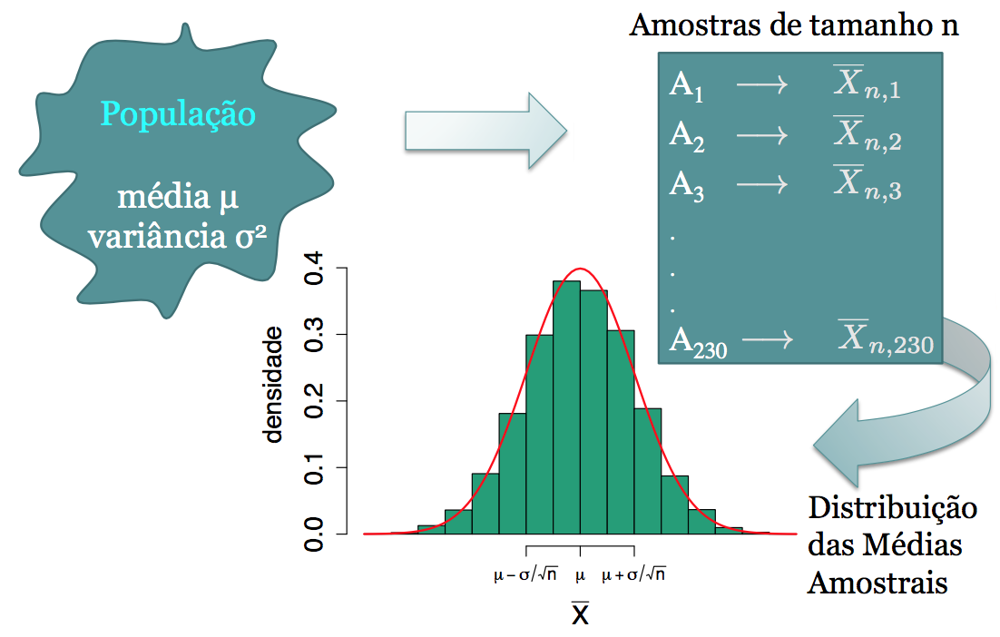
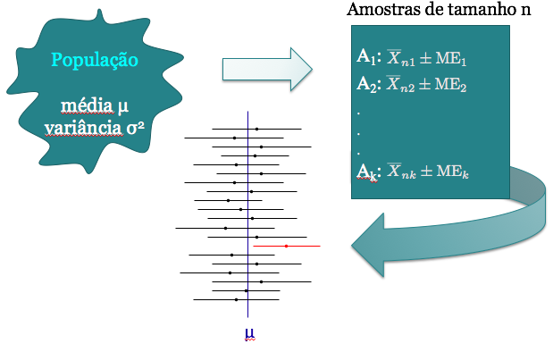
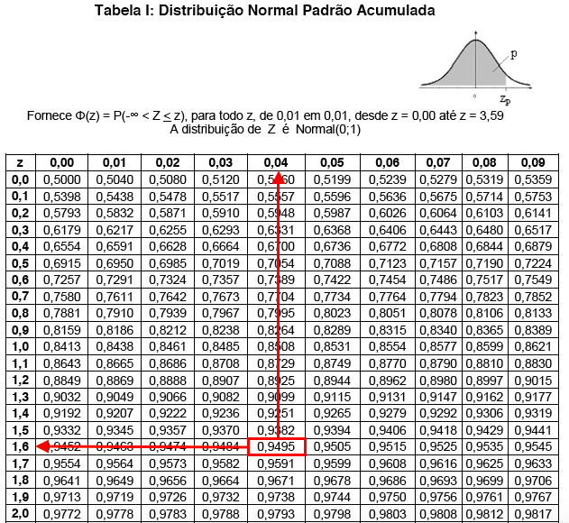

# Intervalo de confiança para a média populacional

## Revisão {.build}

* Vimos que podemos usar uma estatística para estimar um parâmetro de uma distribuição que temos interesse.

> * Por ex: podemos usar a proporção amostral ($\hat{p}$), obtida a partir de um amostra aleatória, se estamos interessados na proporção populacional ($p$). 

> * Por ex: podemos usar a média amostral ($\bar{x}$), obtida a partir de um amostra aleatória, se estamos interessados na média populacional ($\mu$).


> * **Resultado:** Se $X$ tem $\mathbb E(X)=\mu$ e $Var(X)=\sigma^2$, então a distribuição da média amostral,  $\bar{X}_n$, tem 
$$\mathbb E(\bar{X}_n)=\mu \quad \mbox{e} \quad Var(\bar{X}_n)=\frac{\sigma^2}{n}$$


## Distribuição da Média Amostral {.build}

A média amostral, $\bar{X}_n$, tem em geral valores diferentes para diferentes amostras aleatórias obtidas: é uma variável aleatória.

> Para obtermos a distribuição da média amostral:

> * Coletar uma a.a. de tamanho $n$ a partir da população com distribuição $X$ e guardar o valor da média desta amostra.

> * Coletar outra a.a. de tamanho $n$ a partir da população com distribuição $X$ e guardo o valor da média desta amostra.  Repetir isso várias vezes. 

> * Construir um histograma com todas as médias obtidas para estudar o comportamento de $\bar{X}_n$: avaliando a média, a dispersão e a distribuição.


## Teorema Central do Limite

<center></center>


## Teorema Central do Limite {.build}

* Na prática: iremos coletar somente uma amostra de tamanho $n$, não faremos inúmeras vezes esse processo. Teremos apenas 1 valor: $\bar{x}$.

> * Então como saberemos as propriedades deste estimador? Quão útil ele é?

> **Resultado (TCL):**

Para amostras aleatórias simples $X_{1},...,X_{n}$ coletadas de uma população com média $\mu$ e variância $\sigma^{2}$, a distribuição amostral de $\bar{X}_{n}$ aproxima-se de uma distribuição Normal de média $\mu$ e variância $\frac{\sigma^{2}}{n}$, quando $n$ for suficientemente grande, isto é,
$$ \bar{X}_{n} \sim N\left(\mu, \frac{\sigma^{2}}{n} \right)$$


## Teorema Central do Limite


<center>
```{r, echo=FALSE, fig.height=5.5, fig.width=6}
library(RColorBrewer)
mycol <- brewer.pal(8,"Dark2")

n <- 20
k = 4 # df da qui-quadrado

maxy <- qchisq(.99,df=k)

par(mar=c(4, 4, 1, 2) + .1)
curve(dnorm(x, mean=k, sd=sqrt(2*k/n)), 0, maxy, bty="l", yaxs = "i", xaxs="i", 
      main=" ", ylab=" ", cex.lab=1.3, cex.axis=1.3, 
      cex.main=1.3, col=mycol[3], lwd=3, las=1,xaxt='n',axes=FALSE,xlab=" ")
#Axis(x=(0:maxy),side=1,at=k,labels= expression(mu))
curve(dchisq(x, df=k), 0, maxy, n=1000, col=mycol[4], lwd=3, add=TRUE)
abline(v=k,lty=2,col=mycol[3])
axis(side=1, at=k, labels= expression(mu))

legend("topright", legend=c("Distribuição População","Distribuição Média Amostral"),
       lwd=2, col=mycol[c(4,3)], cex=1, bty="n")
```
</center>


## Usando o TCL para construir um IC

* Temos uma amostra aleatoria $X_1,\ldots,X_n$ e estamos usando a média amostral $\bar{X}_n$ para estimar $\mu$, a média populacional. 
* Quão boa é esta estimativa?  Ela tem boa precisão?  Qual o grau de confiança? 

* Em geral: queremos alto grau de confiança, por exemplo, $1-\alpha=0.95$. 

* Imagine que seja possível coletar uma amostra de tamanho $n$ da população várias vezes.  Para cada vez, você calcula $\bar{x}$ é constrói um IC de 95\% para $\mu$.  Imagine também que você conhece $\mu$  e conte quantos dos intervalos contêm $\mu$.  A proporção de intervalos que contem $\mu$ será próxima a 0.95.

## Interpretação do Intervalo de Confiança para $\mu$ {.build}

<center></center>


## Exemplo

Uma variável aleatória $X$ tem distribução normal, com média 100 e desvio padrão 10.

* Qual a $P(90 < X < 110)$? 

* Se $\bar{X}$ for a média de uma amostra de 16 elementos retirados dessa popula\c cão, calcule $P(90 < \bar{X} < 110)$. 

* Represente, num único gráfico, as distribuições de $X$ e $\bar{X}$. 

* Que tamanho deveria ter a amostra para que $P(90 < \bar{X} < 110) = 0.95$? 


*Fonte: Morettin \& Bussab*, Estatística Básica $5^a$ edição, pág 274.


## Exemplo {.build}

Qual a $P(90 < X < 110)$? 

> Devemos padronizar o evento, para usar a distribuição normal padrão. 

> $$P(90 < X < 110) =  P\left( \frac{90-100}{10} < \frac{X-100}{10} < \frac{110-100}{10} \right) $$  

$$= P(-1 < Z < 1) =  P(Z<1) - P(Z<-1) = \Phi(1) - \Phi(-1)$$

> Consultando a tabela Normal disponível na página da disciplina, vemos que $\Phi(1) = 0.8413$  

> Por simetria, $\Phi(-1) = 1-\Phi(1) = 0.1569$ e portanto 
$$P(90 < X < 110) = \Phi(1) - \Phi(-1) = 0.6844$$

## Exemplo {.build .smaller}

Calcule $P(90 < \bar{X} < 110)$, sendo $\bar{X}$ for a média de uma amostra de 16 elementos dessa população

> Sabemos que $\mathbb E(\bar{X})=100$ e $Var(\bar{X}) = \sigma^2/n=100/16$. 

> Consequentemente, o desvio padrão de $\bar{X}$ será $\sigma/ \sqrt{n}=10/4$.  

> Temos então que 
$$\begin{aligned}
P(90 < \bar{X} < 110) &= P\left( \frac{90-100}{10/4} < \frac{\bar{X}-100}{10/4} < \frac{110-100}{10/4} \right) \\
& = P ( -4 < Z < 4) \\
&=  P(Z<4) - P(Z<-4) \\
&=  \Phi(4) - \Phi(-4)
\end{aligned}$$ 

> Se consultarmos a tabela agora, veremos que a probabilidade $P(Z<4)$ é tão grande nem está listada. Ela então pode ser considerada como aproximadamente igual a 1. De fato, com a ajuda de algum método de integração numérica, podemos verificar que $\Phi(4) - \Phi(-4)$ é igual a $0.9999367$.


## Exemplo {.build}

Distribuições de $X$ e $\bar{X}$:

<center>
```{r, echo=FALSE, fig.height=4.2, fig.width=6}
library(RColorBrewer)
mycol <- brewer.pal(8,"Dark2")

par(mar=c(4, 4, 1, 2) + .1)
curve(dnorm(x, mean=100, sd=10), 80, 120, bty="l", ylim=c(0, 0.2), yaxs = "i", xaxs="i", 
      main="", ylab="f(x)", cex.lab=1.3, cex.axis=1.3, 
      cex.main=1.3, col=mycol[4], lwd=3, las=1)
curve(dnorm(x, mean=100, sd=2.5), 80, 120, n=1000, col=mycol[3], lwd=3, add=TRUE)

legend("topright", legend=c("Distribuição População","Distribuição Média Amostral"),
       lwd=2, col=mycol[c(4,3)], cex=1, bty="n")
```
</center>

## Exemplo {.build}

Que tamanho deveria ter a amostra para que $P(90 < \bar{X} < 110) = 0.95$? 

> Queremos resolver a seguinte equação:

$$P\left( \frac{90-100}{10/\sqrt{n}} < \frac{\bar{X}-100}{10/\sqrt{n}} < \frac{110-100}{10/\sqrt{n}} \right) = 0.95$$ 

> Consultando a tabela, vemos que $P(-z_{0.025}<Z<z_{0.025})=0.95$ se $z_{0.025} = 1.96$.  
> Então a equação que queremos resolver pode ser reescrita como: 

$$ \frac{110-100}{10/\sqrt{n}} = 1.96   \quad \Leftrightarrow  \quad \sqrt{n}\frac{110-100}{10} = 1.96   \quad \Leftrightarrow \quad n = 1.96^2$$

> Portanto, $n=4$ é suficiente para obtermos a confiança desejada.


##Intervalo de Confiança para $\mu$ {.build}

> * Coletamos uma amostra aleatória $X_1,X_2,\ldots,X_n$ de uma população com média $\mu$ e a variância $\sigma^2$ e usamos $\bar{X}_n$ para estimar $\mu$.

> * Pelo TCL: $$\bar{X}_n \sim N(\mu,\sigma^2/n)$$

> * Propriedade da Normal: $$Z=\frac{\bar{X}_n-\mu}{\sqrt{\sigma^2/n}} \sim N(0,1)$$

$$P(-z_{\alpha/2}<Z<z_{\alpha/2})=1-\alpha$$

## Como encontrar $z_{\alpha/2}$

$$P(|Z|\leq z_{\alpha/2})=P(-z_{\alpha/2}\leq Z \leq z_{\alpha/2})=1-\alpha$$
<center>
```{r, echo=FALSE, fig.height=5, fig.width=7, message=FALSE, results='hide'}
library(openintro, verbose=FALSE)
data(COL)
par(mar=c(5, 4, 1, 1) + 0.1)
normTail(M = c(-2.58, 2.58),
         df = 10,
         col = COL[1],
         xlim = 3.3 * c(-1, 1),
         ylim = c(0, 0.8),
         xlab='Desvios-padrão a partir da média')
X <- rev(seq(-4, 4, 0.025))
Y <- dt(X, 10) # makes better visual

yMax <- 0.60

lines(1.96*c(-1,1), rep(yMax,2), lwd=2)
lines(rep(-1.96,2), c(0,yMax), lty=2)
lines(rep( 1.96,2), c(0,yMax), lty=2)
text(0, yMax, '95%: de -1.96 a 1.96', pos=3)

yMax <- 0.73
lines(2.58*c(-1,1), rep(yMax,2), lwd=2)
lines(rep(-2.58,2), c(0,yMax), lty=2)
lines(rep( 2.58,2), c(0,yMax), lty=2)
text(0, yMax, '99%: de -2.58 a 2.58', pos=3)


yMax <- 0.41
lines(1.645*c(-1,1), rep(yMax,2), lwd=2)
lines(rep(-1.645,2), c(0,yMax), lty=2)
lines(rep( 1.645,2), c(0,yMax), lty=2)
text(0, yMax, '90%: de -1.64 a 1.64', pos=3)
```
</center>

## Como encontrar $z_{\alpha/2}$

$$P(|Z|\leq z_{\alpha/2})=P(-z_{\alpha/2}\leq Z \leq z_{\alpha/2})=1-\alpha$$

<center>
```{r, echo=FALSE, results='hide', fig.height=3.5, fig.width=5}
par(mar=c(2, 4, 1, 1) + 0.1)
normTail(U = 2,L=-2,
         col = COL[1],
         xlim = c(-3, 3),
         axes  =  FALSE,
         lwd  =  2)
at <- c(-2, 0,2)
labels <- expression(-z[alpha/2], 0,z[alpha/2])
axis(1, at, labels, cex.axis = 1)
yMax <- 0.4

text(0, yMax * 0.4, labels= expression('área '* 1-alpha), cex = 1.2)
arrows(2.5, yMax / 2,
       2.5, yMax / 10,
       length = 0.1,
       col = COL[1],
       lwd = 1.5)
text(2.5, yMax / 2, labels= expression('área '* alpha/2),
     pos = 3,
     cex = 1.2,
     col = COL[1])


arrows(-2.5, yMax / 2,
       -2.5, yMax / 10,
       length = 0.1,
       col = COL[1],
       lwd = 1.5)
text(-2.5, yMax / 2, labels= expression('área '* alpha/2),
     pos = 3,
     cex = 1.2,
     col = COL[1])
```
</center>

Procure na tabela o valor de $z$ tal que a probabilidade acumulada até o valor de $z$, isto é $P(Z\leq z)=\Phi(z)$, seja $1-\alpha/2$.

## Exemplo {.build}

Encontrar $z_{0.05}$ tal que $0.90 = P\left(-z_{0.05}\leq Z\leq z_{0.05}\right)$.

<center></center>

<center>Pela tabela, $z_{0.05} = 1.64$</center>


## Intervalo de Confiança para $\mu$: $\sigma$ conhecido {.build}

Seja $X_1,\ldots, X_n$ uma a.a. de uma população com média $\mu$ e variância $\sigma^2$  conhecida. Então,

$$Z=\frac{\bar{X}_n-\mu}{\sqrt{\sigma^2/n}} \sim N(0,1)$$

$$P(-z_{\alpha/2}<Z<z_{\alpha/2})=1-\alpha$$

Um Intervalo de $100(1-\alpha)\%$ de confiança para $\mu$ é dado por:
$$IC(\mu, 1-\alpha) = \left[ \bar{x} - z_{\alpha/2} \frac{\sigma}{\sqrt{n}}\,;\,\bar{x} +z_{\alpha/2}\frac{\sigma}{\sqrt{n}}\right]$$

## Exemplo: Café {.build}
Uma máquina enche pacotes de café com variância igual a 100$g^2$. Ela estava regulada para encher os pacotes com uma média de 500g. Mas o fabricante desconfia que a máquina está desregulada e quer então estimar a nova média $\mu$.

Uma amostra de 25 pacotes apresentou uma média de 485g. Encontre um $IC$ de $95\%$ para a verdadeira média $\mu$.

$\bar x = 485, n=25, \sigma=10, \alpha=0.05, z_{0.025}=1.96$

$$
\begin{aligned}
IC(\mu, 0.95) &= \left[ \bar{x} - z_{0.025} \frac{\sigma}{\sqrt{n}};\,\bar{x} +z_{0.025}\frac{\sigma}{\sqrt{n}}\right] \\
&= \left[485 - 1.96 \frac{10}{5}; 485 + 1.96 \frac{10}{5} \right] \\
&=[481.08; 488.92]
\end{aligned}
$$


## Tamanho da Amostra {.build}

**Exemplo:** Por experiência, sabe-se que o peso de um salmão de certo criatório segue uma distribuição normal com uma média que varia a cada estação, mas com desvio padrão sempre igual a 0.3 libras.  

> Se quisermos estimar o peso médio dos peixes de maneira que nossa estimativa seja diferente da verdadeira média em no máximo 0.1 libras para mais ou para menos com probabilidade igual a 0.9, qual o tamanho amostral necessário?

**Solução**
$$IC(\mu, 1-\alpha) = \left[ \bar{x} -z_{\alpha/2}\frac{\sigma}{\sqrt{n}}\,;\,  \bar{x} +z_{\alpha/2}\frac{\sigma}{\sqrt{n}}\right]$$

Margem de erro: $z_{\alpha/2}\frac{\sigma}{\sqrt{n}}$

## Tamanho da Amostra {.build}

Margem de erro 0.1, isto é, 
$$z_{\alpha/2}\frac{\sigma}{\sqrt{n}}=0.1$$

$\alpha=0.1$ (90\% de confiança) e $z_{0.05}=1.645$. 

$$1.645\frac{0.3}{\sqrt{n}}=0.1 \quad \Rightarrow \quad n=24.35$$

Tamanho amostral: 25

Em geral, para uma margem de erro $m$ e confiança $100(1-\alpha)\%$:

$$n=\left( \frac{z_{\alpha/2}}{m}\right)^2\sigma^2$$


## Intervalo de Confiança para $\mu$: $\sigma$ desconhecido {.build .smaller}

Seja $X_1, \ldots, X_n$ uma a.a. de uma população com média $\mu$, mas com variância $\sigma^2$ desconhecida

Nesse caso, usaremos a variância amostral ($s^2$) como uma estimativa de $\sigma^2$: 
$$s^2=\frac{1}{n-1}\sum_{i=1}^n(x_i-\bar{x})^2$$

> Como consequência, não temos mais distribuição Normal, mas sim a **distribuição $t$-student** com $n-1$ graus de liberdade:

$$T=\frac{\bar{X}_n-\mu}{\sqrt{s^2/n}}\sim t_{n-1}$$

$$P(-t_{n-1,\alpha/2}<T<t_{n-1,\alpha/2})=1-\alpha$$

Um intervalo de $100(1-\alpha)\%$ de confiança para $\mu$ é dado por:
$$IC(\mu, 1-\alpha) = \left[ \bar{x} -t_{n-1,\alpha/2}\frac{s}{\sqrt{n}};\,  \bar{x} +t_{n-1,\alpha/2}\frac{s}{\sqrt{n}}\right]$$


## Como encontrar $t_{n-1,\alpha/2}$

$$P(-t_{n-1,\alpha/2} < T < t_{n-1,\alpha/2}) = 1-\alpha$$

<center>
```{r, echo=FALSE, results='hide', fig.height=4, fig.width=6}
par(mar=c(2, 4, 1, 1) + 0.1)
normTail(U = 2,L=-2,
         col = COL[1],
         xlim = c(-3, 3),
         axes  =  FALSE,
         lwd  =  2)
at <- c(-2, 0,2)
labels <- expression(-t[alpha/2], 0,t[alpha/2])
axis(1, at, labels, cex.axis = 1)
yMax <- 0.4

text(0, yMax * 0.4, labels= expression('área '* 1-alpha), cex = 1.2)
arrows(2.5, yMax / 2,
       2.5, yMax / 10,
       length = 0.1,
       col = COL[1],
       lwd = 1.5)
text(2.5, yMax / 2, labels= expression('área '* alpha/2),
     pos = 3,
     cex = 1.2,
     col = COL[1])


arrows(-2.5, yMax / 2,
       -2.5, yMax / 10,
       length = 0.1,
       col = COL[1],
       lwd = 1.5)
text(-2.5, yMax / 2, labels= expression('área '* alpha/2),
     pos = 3,
     cex = 1.2,
     col = COL[1])
```
</center>

Os valores da distribuição $t$-student também encontram-se tabelados.

## Distribuição $t$-student e Normal Padrão

Para $n$ grande a distribuição $t$-student se aproxima da normal padrão $N(0,1)$.

<center>
```{r, echo=FALSE, fig.height=4.5, fig.width=6}
library(RColorBrewer)
mycol <- brewer.pal(8,"Dark2")

par(mar=c(4, 4, 1, 2) + .1)
curve(dnorm(x, mean=0, sd=1), -5, 5, bty="l", ylim=c(0, 0.4), yaxs = "i", xaxs="i", 
      main="", ylab="f(x)", cex.lab=1.3, cex.axis=1.3, 
      cex.main=1.3, col=1, lwd=2, las=1)
curve(dt(x, df=3), -5, 5, n=1000, col=mycol[4], lwd=2, add=TRUE)
curve(dt(x, df=5), -5, 5, col=mycol[3], lwd=2, add=TRUE)
curve(dt(x, df=10), -5, 5, col=mycol[1], lwd=2, add=TRUE)
legend("topright", legend=c("N(0,1)","t(n=3)","t(n=5)","t(n=10)"),
       lwd=2, col=c(1, mycol[c(4,3,1,6)]), cex=1, bty="n")
```
</center>

## Exemplo: Café {.build}

No exemplo da máquina que enche pacotes de café, suponha agora que a variância é **desconhecida**.

Lembre-se que uma amostra de $25$ pacotes apresentou uma média de 485g. Observou-se um desvio padrão na amostra de 7.1g 

Encontre um IC de 95% para a verdadeira média $\mu$

$$
\begin{aligned}
IC(\mu, 0.95) &= \left[ \bar{x} - t_{24, 0.025} \frac{s}{\sqrt{n}};\,\bar{x} +t_{24, 0.025}\frac{s}{\sqrt{n}}\right] \\
&= \left [485 - 2.06 \frac{7.1}{5}; 485 + 2.06 \frac{7.1}{5} \right] \\
&=[482.07; 487.93]
\end{aligned}
$$


## Exemplo: Quantas horas de TV você assiste por dia?

O histograma a seguir apresenta a distribuição do número de horas de TV por dia entre os participantes de um estudo em que se coletou uma amostra aleatória.

<center>
```{r, echo=FALSE, fig.height=3.5, fig.width=6}
set.seed(2015)
n=905
alpha=0.05
horas <- rexp(905,rate=1)+.5
par(mar=c(5, 4, 1, 1) + 0.1)
hist(horas, breaks=50, col="lightblue", freq=FALSE, main=" ", xlab="Horas assistindo TV por dia", ylab="probabilidade", las=1)
xbar <- round(mean(horas),2)
s <- round(sd(horas),2)
erropadrao <- round(s/sqrt(n),2)
zalpha <- round(qnorm(1-alpha/2),2)
LI <- round(xbar-zalpha*erropadrao,2)
LS <- round(xbar+zalpha*erropadrao,2)

```
</center>

## Exemplo: horas de TV por dia {.build}

Encontre um IC de $95\%$ para a média de horas que uma pessoa assiste por dia.

* $n=`r n`$ pessoas responderam. 

> * $x_i$ é o número de horas de TV que a pessoa $i$ da amostra assiste. 

> * $\bar{x}=`r xbar`$ e  $s=`r s`$ 

> * Erro padrão da média amostral: $s/\sqrt{n}=`r erropadrao`$ 

## Exemplo: horas de TV por dia {.build}

> Utilizamos a distribuição Normal e não a distribuição t, pois $n$ é grande.

> * Pelo TCL: $\bar{X}_n \sim N(\mu,\sigma^2/n)$

> *  O IC `r (1-alpha)*100`\% para $\mu$ fica:

> $$IC(\mu, 0.95) = \left[\bar{x}-1.96 \frac{s}{\sqrt{n}};\,\bar{x}+1.96\frac{s}{\sqrt{n}} \right]= [`r LI`\,;\,`r LS`]$$ 

> Com grau de confiança igual a `r (1-alpha)*100`\%, estimamos que a média populacional de horas de TV está entre `r LI` e `r LS` horas. 


## Exemplo - Leite materno {.build}

O Ministério da Saúde está preocupado com quantidade de um certo componente tóxico no leite materno. 

> Em uma amostra de 20 mulheres, a quantidade do componente para cada uma foi:

```{r,echo=FALSE}
alpha=0.05
dados <- c(16,0,0,2,3,6,8,2,5,0,12,10,5,7,2,3,8,17,9,1)
write.table(matrix(dados,nrow=1),col.names = FALSE,row.names = FALSE)
xbar<- round(mean(dados),2)
s <- round(sd(dados),2)
n <- length(dados)
erropadrao <- round(s/sqrt(n),2)
zalpha <- round(qnorm(1-alpha/2),2)
LI <- round(xbar-zalpha*erropadrao,2)
LS <- round(xbar+zalpha*erropadrao,2)
talpha <- round(qt(1-alpha/2,df=n-1),3)
LI <- round(xbar-talpha*erropadrao,2)
LS <- round(xbar+talpha*erropadrao,2)
```


Obtenha um intervalo de confiança de `r (1-alpha)*100`\% para a quantidade média do componente  no leite materno.


##
##Exemplo - Solução {.build}
$\bar{x}=`r xbar`$

$s=`r s`$

$n=`r n`$

$t_{`r n-1`,`r alpha/2`}= `r talpha`$


$$IC(\mu, 0.95) = \left[ \bar{x} -t_{n-1,\alpha/2}\frac{s}{\sqrt{n}}\,;\,  \bar{x} +t_{n-1,\alpha/2}\frac{s}{\sqrt{n}}\right]$$

$$=\left[`r LI`,;\, `r LS`\right]$$

Com grau de confiança igual a `r (1-alpha)*100`\%, estimamos que a média da quantidade do componente entre  as mulheres está entre  `r LI` e `r LS`.


## Exemplo - Exame {.build}

O desvio padrão da pontuação em um certo exame é 11.3. Uma amostra aleatória de 81 estudantes que fizeram o exame foi coletada e a nota de cada estudantes foi anotada. A pontuação média entre os estudantes amostrados foi 74.6. 

Encontre um intervalo de 90\% de confiança para a pontuação média entre todos os estudantes que fizeram o exame.

> $\bar{x}=74.6$, $\sigma=11.3$, $n=81$, $\alpha=0.10$ e $z_{0.05}=1.645$

> $$
\begin{aligned}
IC(\mu, 0.90) &= \left[ 74.6 - 1.645 \frac{11.3}{9};\,  74.6 + 1.645\frac{11.3}{9}\right] \\
&= [72.53;\, 76.67]
\end{aligned}
$$

> Com grau de confiança igual a 90\%, estimamos que a pontuação média entre os estudantes está entre  72.53 e 76.67.


## Exemplo: precisão e tamanho amostral {.build}

Qual deve ser o tamanho de uma amostra cuja população da qual ela será sorteada possui um desvio-padrão igual a 10, para que a diferença da média amostral para a média da população, em valor absoluto, seja menor que 1, com coeficiente de confiança igual a:

> * $95\%$

> * $99\%$

*Fonte: Morettin \& Bussab*, Estatística Básica $5^a$ edição, pág 308.


## Exemplo: precisão e tamanho amostral {.build}

Pelo TCL: $\bar{X}_n \sim N(\mu, 10^2/n)$ 

> Queremos $P(|\bar{X}-\mu|<1) = 0.95$ 

> $$P(-1<\bar{X}-\mu<1) = 0.95$$ 

> $$P\left(-\frac{1}{10/\sqrt{n}}<\frac{\bar{X}-\mu}{10/\sqrt{n}}<\frac{1}{10/\sqrt{n}}\right) = 0.95$$ 

> O que é equivalente a $$P \left( -\sqrt{n}/10 < Z < \sqrt{n}/10 \right)=0.95$$ 

> Como $P(-1.96 < Z < 1.96) = 0.95$,  então 
$$\frac{\sqrt{n}}{10} = 1.96 \quad \Rightarrow  \quad n \approx 385$$

## Exemplo: precisão e tamanho amostral

De modo análogo, para um grau de confiança de $99\%$, temos que 
$$P(-2.58 < Z < 2.58) = 0.99$$

Então, $$\sqrt{n}/10 = 2.58 \quad \Rightarrow  \quad n \approx 665$$

Em geral, como já dissemos anteriormente, para uma margem de erro $m$:
$$n=\left(\frac{z_{\alpha/2}}{m}\right)^2 \sigma^2$$


## Leituras

<center>

</center>


* [Ross](http://www.sciencedirect.com/science/article/pii/B9780123743886000089): capítulo 8. 
* [OpenIntro](https://www.openintro.org/stat/textbook.php): seção 4.2.
* Magalhães: capítulo 7.

##

Slides produzidos pelos professores:

* Samara Kiihl

* Tatiana Benaglia

* Benilton Carvalho