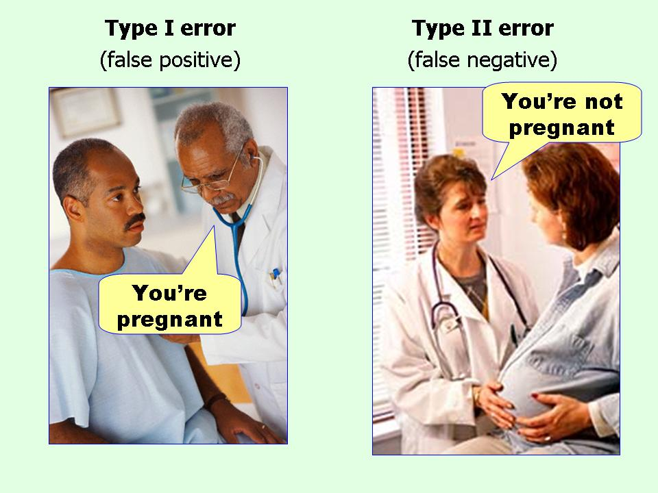
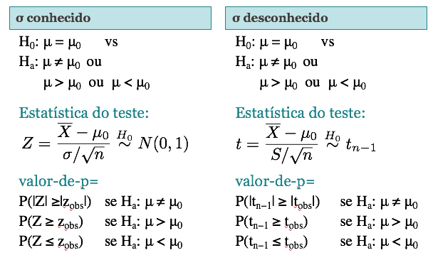

# Teste de Hipóteses

## Relembrando: Teste de Hipóteses Passo-a-Passo {.build}

* **Passo 1**: Suposições

> * **Passo 2**: Hipóteses

> * **Passo 3**: Estatística do Teste

> * **Passo 4**: Valor-de-p

> * **Passo 5**: Conclusões

## Teste de Hipótese para uma proporção {.build}

Suponha que temos uma população e uma hipótese sobre a proporção $p$ de indíviduos  com certa característica

**Hipóteses:**   	
$$ \begin{aligned} H_0:  p = p_0	 \quad \mbox{vs} \quad    	   
H_a: & p \neq p_0 \mbox{ (bilateral)} \\
		& p < p_0 \mbox{ (unilateral à esquerda)} \\
		&  p > p_0 \mbox{ (unilateral à direita)}	
\end{aligned}
$$

**Estatística do teste:** Baseada na distribuição amostral de $\hat p$
$$Z=\frac{\hat{p}-p_0}{\sqrt{\frac{p_0(1-p_0)}{n}}} \overset{H_0}{\sim} N(0,1)$$

**Condição:** $np_0 ≥ 10$ e $n(1−p_0) ≥ 10$ para aproximação normal


## Teste de Hipótese para uma proporção {.build}

**valor-de-p** 

* $H_a: p \neq p_0$  (bilateral): valor-de-p=$P(|Z| ≥|z_{obs}|)$

> * $H_a: p < p_0$ (unilateral à esquerda): valor-de-p=$P(Z \leq z_{obs})$

> * $H_a: p > p_0$ (unilateral à direita): valor-de-p=$P(Z \geq z_{obs})$

**Conclusão**: Para um nível de significância $\alpha$

> * Se valor-de-p $\leq \alpha$: rejeitamos $H_0$

> * Se valor-de-p > $\alpha$: não rejeitamos $H_0$

## Valor-de-p Teste Bilateral
$H_a: p \neq p_0$  (bilateral) $\quad \Rightarrow \quad$ valor-de-p=$P(|Z| ≥|z_{obs}|)$

<center></center>

## Valor-de-p Teste Unilateral

$H_a: p > p_0$ (unilateral à direita) $\quad \Rightarrow \quad$ valor-de-p=$P(Z \geq z_{obs})$

<center></center>

## Coca vs Coca Zero - você consegue distinguir?

<center></center>

## Experimento da Coca vs Coca Zero {.build}
```{r,echo=FALSE}
n <- 20
alpha <- 0.05
p0 <- 0.5

acertos <- 19
phat <- acertos/20

#abline(v=acertos,col="red")

valorp <- sum(dbinom(acertos:n, n, p0))

zobs <- round((acertos/n-p0)/sqrt(p0*(1-p0)/n), 2)

valorpn <- pnorm(zobs, lower.tail=FALSE)

dec <- ifelse(valorp < alpha, "rejeitamos", "não rejeitamos")
```

Em sala de aula, vários alunos disseram que conseguem distinguir entre Coca-Cola normal e Coca-Cola Zero.

Fizemos então o teste para comprovar se a afirmação é verdadeira.

Um dos alunos experimentou, em ordem aleatória, 20 amostras (ao acaso era Coca-cola normal ou zero) e anotamos a quantidade de acertos.

> Cada tentativa, $X_i$, é uma Bernoulli$(p)$, em que $p$ é a probabilidade de acerto.

Veja que $T=\sum_{i=1}^{20}X_i \sim Bin(20, p)$, onde $T$ é o número de acertos.

Do total de 20 testes, o aluno acertou `r acertos`! Temos então uma proporção amostral de acertos $\hat p = `r acertos`/`r n`=`r phat`$. Isso mostra que o aluno realmente sabe a diferença?


## Experimento da Coca vs Coca Zero {.build}
Vamos testar o seguinte:
$$H_0: p = 0.50	\quad \mbox{vs} \quad H_a: p > 0.50$$

Podemos testar essas hipóteses de duas maneiras:

* Usando a aproximação normal para a proporção de acertos, como vimos na última aula, já que as condições $np_0 \geq 10$ e $n(1-p_0) \geq 10$ são satisfeitas.

> * Usando a distribuição exata do número total de acertos

Vamos revisar o que vimos na aula passada e também fazer o teste com a distribuição exata de $T$.


## Experimento da Coca vs Coca Zero {.build}

Usando a aproximação normal.

> **Hipóteses:**  $H_0: p = 0.50	\quad \mbox{vs} \quad H_a: p > 0.50$
	
> A proporção amostral de acertos $\hat p = \frac{T}{20}= `r acertos`/`r n`=`r acertos/n`$

> **Estatística do teste:**
> $$z_{obs} = \frac{\hat p - p_0}{\sqrt{\frac{p_0(1-p_0)}{n}}} = \frac{`r phat`- `r p0`}{\sqrt{\frac{(`r p0`)(`r 1-p0`)}{`r n`}}} = `r zobs`$$

> **valor-de-p** = $P(Z \geq `r zobs`) = `r format(valorpn, digits=1,scientific=FALSE)`$

> **Conclusão:** Fixando $\alpha=0.05$, rejeitamos a hipótese de que $p=0.5$ e, portanto, acreditamos que a probabilidade de acertos é maior que 50%.

## Experimento da Coca vs Coca Zero

<center>
```{r, echo=FALSE, results='hide', fig.height=4.5, fig.width=7, message=FALSE}
library(openintro)

xmax <- qnorm(.999999,mean=0,sd=1)

par(mar=c(2, 4, 1, 1) + 0.1)
normTail(m=0,s=1, U=zobs,
         col = COL[1],
         axes  =  FALSE,
         lwd  =  2,xlim=c(-xmax,xmax))
axis(1, c(-zobs, 0,zobs), cex.axis = 1)
abline(v=0, lty=2)

yMax = dnorm(0, mean=0, sd=1)

arrows(3.5, yMax / 2,
       3.5, yMax / 10,
       length = 0.1,
       col = COL[1],
       lwd = 1.5)
text(3.5, yMax / 2, labels= paste0("valor-de-p = ", format(valorpn,digits=1,scientific=FALSE)),
     pos = 3,
     cex = 1.2,
     col = COL[1])
```
</center>


## Experimento da Coca vs Coca Zero {.build}
Usando a distribuição exata do número de acertos em 20 tentativas.

**Hipóteses:**  $H_0: p = 0.50	\quad \mbox{vs} \quad H_a: p > 0.50$

**Hipóteses:**  $H_0: Acertos = 10	\quad \mbox{vs} \quad H_a: Acertos > 10$
		
**Estatística do teste:** $T= \sum_{i=1}^{20}X_i \overset{H_0}{\sim} Bin(20, 0.5)$

O valor observado da estatística do teste é $t_{obs}=`r acertos`$, ou seja, o número total de acertos.

**valor-de-p** = $P(T\geq `r acertos`)=`r format(valorp, digits=1,scientific=FALSE)`$

**Conclusão:** Fixando $\alpha=0.05$, `r dec` a hipótese de que $p=0.5$ e, portanto, acreditamos que a probabilidade de acertos é maior que 50%.

## Experimento da Coca vs Coca Zero {.build .smaller}

<center>
```{r, echo=FALSE, fig.height=5, fig.width=6}

binomshade <- function(n, p, a, b){
  ## gráfico da função de massa de uma Bin(n, p) e colore os pontos de a até b
  library(RColorBrewer)
  mycol <- brewer.pal(8,"Dark2")

  x <- 0:n
  cores <- rep(mycol[1], n+1)
  cores[a:b + 1] <- "red"
  
  px <- dbinom(x, size=n, prob=p)
  barplot(px, names.arg=x, xlab="número de acertos", ylab="probabilidade", col=cores,
          main=paste("Bin(", n, ", ",  p, ")", sep=""), 
          cex.lab=1.2, cex.axis=1.2, cex.names=1.2, cex.main=1.3, las=1)
  box(bty="l", lwd=2)
  prob <- round(sum(dbinom(a:b, n, p)), 4)
  expr <- bquote(P( {.(a) <= X} <= .(b)) == .(prob))
  title(expr, cex.main=0.95, line=0.5)
}

binomshade(n, p0, acertos, n)
```
</center>


## Tipos de Erro {.build}

Quando realizamos um teste de hipóteses, podemos cometer 2 tipos de erros:

> 1). Erro Tipo I: Rejeitar a hipótese $H_0$, quando tal hipótese é verdadeira

> 2). Erro Tipo II: Não rejeitar a hipótese $H_0$, quando tal hipótese é falsa

<center></center>

**Erro Tipo I:** erro mais grave


## Tipos de Erro 
$H_0: \mbox{você não está grávida(o)} \quad \mbox{vs} \quad H_a: \mbox{você está grávida(o)}$

<center></center>


## Tipos de Erro {.build}

Podemos calcular a probabilidade dos dois tipos de erro, que chamamos de $\alpha$ e $\beta$:

$\alpha = P(\mbox{Erro Tipo I}) = P(\mbox{Rejeitar } H_0| H_0 \mbox{ verdadeira})$

$\beta = P(\mbox{Erro Tipo II}) = P(\mbox{Não Rejeitar } H_0| H_0 \mbox{ falsa})$

Na situação ideal, ambas as probabilidades de erro, $\alpha$ e $\beta$, seriam próximas de zero. Entretanto, à medida que diminuímos $\alpha$, a probabilidade $\beta$ tende a aumentar.

Levando isso em conta, em teste de hipóteses tentamos controlar a probabilidade do erro do tipo I, já que esse é o erro mais grave.

A probabilidade $\alpha$ é chamada de **nível de significância**, que geralmente fixamos em $5\%$.


## Tipos de Erro {.build}

No experimento da Coca-Cola tivemos `r acertos` acertos em 20 tentativas e decidimos rejeitar $H_0$. 

Mas e se tivéssemos observado 14 acertos? Ou 12? 

Existe um valor, $t_c$, de maneira que se observarmos algo igual ou maior que ele decidimos rejeitar $H_0$?

Esse valor é chamado de **valor crítico** e vamos denotá-lo por $t_c$. 


## Tipos de Erro {.build}
No experimento da Coca-Cola:
$H_{0}: p=0.5 \quad  \mbox{vs} \quad  H_a: p>0.5$ 

Seja $T$ o número de acertos em uma amostra de tamanho $n=20$. Então $T \sim Bin(20,p)$. 

Vamos considerar o seguinte valor crítico: $t_c=12$. 

Lembrando que $T$ pode assumir os valores $0,1,2,...,20$. 

O valor crítico $t_c$ determina as probabilidades de cometer os erros tipo I e II.


## Tipos de Erro {.build}
Considerando $t_c=12$

$$\begin{aligned}
P(\mbox{Erro Tipo I}) & =  P(\mbox{Rejeitar }H_{0}|H_{0}\mbox{ verdadeira})  \\ 
& =  P(T \geq t_c|p=0.5) \\
& =  \sum_{x=12}^{20}P(T=x|p=0.5)  \approx 0.25 
\end{aligned}
$$

$$\begin{aligned}
P(\mbox{Erro Tipo II}) & =  P(\mbox{Não Rejeitar }H_{0}|H_{0}\mbox{ falsa})  \\ 
& =  P(T < t_c|p=0.7) \\
& =  \sum_{x=0}^{11}P(T=x|p=0.7)  \approx 0.11
\end{aligned}
$$


## Tipos de Erro {.build}

Observando a relação entre os erros tipo I e II, e $t_c$: 
$H_{0}: p=0.5 \quad \mbox{vs} \quad H_a: p=0.7$


$t_c$ | P(Erro Tipo I) | P(Erro Tipo II)  
----- | -------------- | --------------
$12$ | 0.25 | 0.11  
$13$ | 0.13 | 0.23  
$14$ | 0.06 | 0.39  

Veja que à medida que tentamos diminuir $\alpha=$P(Erro Tipo I) diminui, $\beta=$P(Erro Tipo II) aumenta.

Então, optamos por controlar $\alpha=$P(Erro Tipo I), que é considerado o erro mais grave. Geralmente fixamos $\alpha=0.05$ e rejeitamos $H_0$ se valor-de-p $<\alpha$.


# Teste de hipóteses para média ($\sigma$ conhecido)

## Exemplo {.build}

Vamos voltar no problema da máquina que enche pacotes de café. Digamos que o peso nominal do pacote de café seja de 500g. Assume-se que o desvio-padrão é conhecido ($\sigma = 10$).

> Retiraram uma amostra de 25 pacotes e observaram um peso médio de 485g.

> Isso nos traz evidência de que os pacotes têm menos de 500g?

> Já calculamos o IC de 95% para esse problema:
	$$IC(\mu, 0.95) = [481.08; 488.92]$$

> Vamos agora testar as hipóteses:
			$$H_0: \mu = 500 \quad \mbox{vs} \quad H_a: \mu \neq 500$$


## Exemplo {.build}

**Suposições:** Seja $X_i$ o peso do $i$-ésimo pacote de café. Sabemos que $\mathbb E(X_i)=\mu$ e $Var(X_i)=\sigma^2$. Coletou-se uma amostra de tamanho $n=25$. Pelo TCL: $$\bar{X}\sim N(\mu,\sigma^2/n)$$ 

**Hipóteses:** $H_0: \mu = \mu_0 = 500 \quad \mbox{vs} \quad H_a: \mu \neq \mu_0 = 500$

**Estatística do teste**: 
$$Z = \frac{\bar{X}-\mu_0}{\sigma/\sqrt{n}} \overset{H_0}{\sim} N(0,1)$$

Considerando a amostra obtida:
$$z_{obs} = \frac{485-500}{10/5}=-7.5$$


## Teste de hipóteses para média ($\sigma$ conhecido) {.build}

Como medir se $-7.5$ é evidência contra $H_0$?

O teste é bilateral, portanto o valor-de-p é calculado como:

**Valor-de-p**: $P(|Z| \geq 7.5) = 2P(Z \geq 7.5) \approx 0$


**Conclusão:** Como o valor-de-p é praticamente zero, rejeitamos $H_0$, ou seja, rejeitamos a hipótese de que a média é 500g.

## Região Crítica (Região de Rejeição) {.build}

Outra forma de decidirmos se a evidência encontrada nos dados é forte o suficiente para rejeitar $H_0$ é determinando a **região crítica** ou **região de rejeição**.

**Região Crítica:** conjunto de valores da estatística do teste para os quais a hipótese nula é rejeitada.

## Região crítica: teste bilateral

$H_0: \mu=\mu_0$ vs $H_a: \mu \neq \mu_0$ e um nível de significância $\alpha$, definimos a região crítica do teste:

<center>
```{r,echo=FALSE,fig.height=4,fig.width=7,results='hide'}
source("../functions/BuildNullX.R")

BuildNullX()
segments(2 * c(-1, 1), rep(0, 2), y1 = rep(0.15, 2),
         col = COL[4], lty = 3, lwd = 3)
segments(2 * c(-1, 1), rep(0, 2), y1 = rep(0.15, 2),
         col = COL[4], lty = 3, lwd = 1.5)
text(c(-6, 0, 0, 6), c(0.07, 0.09, 0.05, 0.07),
     c(expression("Rejeita " * H[0]),
       "Não",
       expression("rejeita " * H[0]),
       expression("Rejeita " * H[0])),
     col = COL[4])
```
</center>


## Região crítica: teste unilateral à direita

$H_0: \mu=\mu_0$ vs $H_a: \mu > \mu_0$ e um nível de significância $\alpha$, definimos a região crítica do teste:

<center>
```{r,echo=FALSE,fig.height=4,fig.width=7,results='hide'}
source("../functions/BuildNullXuni.R")

BuildNullXuni()
segments(2 , rep(0, 2), y1 = rep(0.15, 2),
         col = COL[4], lty = 3, lwd = 3)
segments(2 , rep(0, 2), y1 = rep(0.15, 2),
         col = COL[4], lty = 3, lwd = 1.5)
text(c(0, 0, 6), c( 0.09, 0.05, 0.07),
     c("Não",
       expression("rejeita " * H[0]),
       expression("Rejeita " * H[0])),
     col = COL[4])
```
</center>


## Região crítica: teste unilateral à esquerda

$H_0: \mu=\mu_0$ vs $H_a: \mu < \mu_0$ e um nível de significância $\alpha$, definimos a região crítica do teste:

<center>
```{r,echo=FALSE,fig.height=4,fig.width=7,results='hide'}

BuildNullXuni()
segments(-2 , rep(0, 2), y1 = rep(0.15, 2),
         col = COL[4], lty = 3, lwd = 3)
segments(-2 , rep(0, 2), y1 = rep(0.15, 2),
         col = COL[4], lty = 3, lwd = 1.5)
text(c(-6, 0, 0), c(0.07, 0.09, 0.05),
     c(expression("Rejeita " * H[0]),
       "Não",
       expression("rejeita " * H[0])),
     col = COL[4])
```
</center>


## Região Crítica: Teste Bilateral {.build}

Quando o teste for bilateral: $H_0: \mu = 500 \quad \mbox{vs} \quad H_a: \mu \neq 500$

A região critíca, para $\alpha=0.05$, é a área em azul na figura abaixo:

<center>
```{r, echo=FALSE, results='hide', fig.height=3, fig.width=5}
library(openintro)
par(mar=c(2, 4, 1, 1) + 0.1)
normTail(U = 2,L=-2,
         col = COL[1],
         xlim = c(-3, 3),
         axes  =  FALSE,
         lwd  =  2)
axis(1, c(-1.96, 0, 1.96), cex.axis = 1)
yMax <- 0.4

text(0, yMax * 0.4, labels= expression('área '* 0.95), cex = 1.2)
arrows(2.5, yMax / 2,
       2.5, yMax / 10,
       length = 0.1,
       col = COL[1],
       lwd = 1.5)
text(2.3, yMax / 2, labels= expression('área '* 0.025),
     pos = 3,
     cex = 1.2,
     col = COL[1])
arrows(-2.5, yMax / 2,
       -2.5, yMax / 10,
       length = 0.1,
       col = COL[1],
       lwd = 1.5)
text(-2.3, yMax / 2, labels= expression('área '* 0.025),
     pos = 3,
     cex = 1.2,
     col = COL[1])
```
</center>

**Decisão:** Rejeitamos $H_0$ se $z_{obs} < -1.96$ ou $z_{obs} > 1.96$.

No nosso exemplo, $z_{obs}=-7.5$. Portanto, rejeitamos $H_0$.

## Região Crítica: Teste Unilateral à esquerda {.build}
Quando o teste for unilateral à esquerda: $H_0: \mu = \mu_0 \quad \mbox{vs} \quad H_a: \mu < \mu_0$

A região critíca, para $\alpha=0.05$, é a área em azul na figura:

<center>
```{r, echo=FALSE, results='hide', fig.height=3.5, fig.width=6}
library(openintro)
par(mar=c(3, 4, 1, 1) + 0.1)
normTail(L=-1.645,
         col = COL[1],
         xlim = c(-3, 3),
         axes  =  FALSE,
         lwd  =  2)
axis(1, c(-1.645, 0, 1.645), cex.axis = 1)
yMax <- 0.4

text(0, yMax * 0.4, labels= expression('área '* 0.95), cex = 1.2)
arrows(-2.5, yMax / 2,
       -2.5, yMax / 10,
       length = 0.1,
       col = COL[1],
       lwd = 1.5)
text(-2.5, yMax / 2, labels= expression('área '* 0.05),
     pos = 3,
     cex = 1.2,
     col = COL[1])
```
</center>

**Decisão:** Rejeitamos $H_0$ se $z_{obs} < -1.645$.


## Região Crítica: Teste Unilateral à direita {.build}
Quando o teste for unilateral à direita: $H_0: \mu = \mu_0 \quad \mbox{vs} \quad H_a: \mu > \mu_0$

A região critíca, para $\alpha=0.05$, é a área em azul na figura:

<center>
```{r, echo=FALSE, results='hide', fig.height=3.5, fig.width=6}
library(openintro)
par(mar=c(3, 4, 1, 1) + 0.1)
normTail(U=1.645,
         col = COL[1],
         xlim = c(-3, 3),
         axes  =  FALSE,
         lwd  =  2)
axis(1, c(-1.645, 0, 1.645), cex.axis = 1)
yMax <- 0.4

text(0, yMax * 0.4, labels= expression('área '* 0.95), cex = 1.2)
arrows(2.5, yMax / 2,
       2.5, yMax / 10,
       length = 0.1,
       col = COL[1],
       lwd = 1.5)
text(2.5, yMax / 2, labels= expression('área '* 0.05),
     pos = 3,
     cex = 1.2,
     col = COL[1])
```
</center>

**Decisão:** Rejeitamos $H_0$ se $z_{obs} > 1.645$.

# Teste de hipóteses para média ($\sigma$ desconhecido)


## Teste de hipóteses para média ($\sigma$ desconhecido) {.build}
No caso de testar $$H_0: \mu = \mu_0 \quad \mbox{vs} \quad H_a: \mu \neq \mu_0$$
quando $\sigma$ é desconhecido e a amostra é pequena ($n<30$) devemos utilizar a distribuição $t$.

**Estatística do teste**: 
$$t = \frac{\bar{X}-\mu_0}{s/\sqrt{n}} \overset{H_0}{\sim} t_{n-1}$$

**valor-de-p:** $P(|t_{n−1}| ≥ |t_{obs}|) = 2P(t_{n−1} ≥ t_{obs})$

Para as hipóteses unilaterais, o raciocínio é semelhante ao que foi feito anteriormente quando $\sigma$ é conhecido.


## Teste de hipóteses para média ($\sigma$ desconhecido) {.build}

No nosso exemplo, suponha que não sabemos o valor de $\sigma$, mas o desvio padrão da amostra é 7.1g. Queremos testar
 $$H_0: \mu = 500 \quad \mbox{vs} \quad H_a: \mu \neq 500$$

**Estatística do teste:**
$$t_{obs} = \frac{\bar{X}-\mu_0}{s/\sqrt{n}} = \frac{485-500}{7.1/5} = -10.56$$

**valor-de-p:** $P(|t_{24}| ≥ 10.56) = 2P(t_{24} ≥ 10.56) \approx 0$

**Conclusão:** Rejeitamos a hipótese de que a média é 500g.


## Exemplo: Dieta com poucos carboidratos {.build}

> * 41 pacientes obesos, selecionados aleatoriamente, foram submetidos a uma dieta com baixa quantidade de carboidratos.

> * Pesquisadores responsáveis pelo estudo acreditam que essa dieta faz com que os pacientes apresentem uma redução de peso. 

> * Após 16 semanas, a diferença média de peso foi $-9.7$kg, com desvio padrão $3.4$ kg. 

> * O que podemos concluir deste estudo? 

> Detalhes do estudo podem ser encontrados no artigo: [Effect of 6-month adherence to a very low carbohydrate diet program](http://www.amjmed.com/article/S0002-9343(02)01129-4/abstract).


## Teste de hipóteses para média {.build}

**Suposições**: $X_i$ é a diferença entre peso inicial e final do $i$-ésimo obeso.  Sabemos que $\mathbb E(X_i)=\mu$ e $Var(X_i)=\sigma^2$. Coletou-se uma amostra de tamanho $n=41$. Pelo TCL: $$\bar{X}\sim N(\mu,\sigma^2/n)$$ 

**Hipóteses**: $H_0: \mu= 0 \quad \mbox{vs} \quad H_a:\mu <  0$

Ou seja, estamos testando se não há diferença no peso após a dieta versus a hipótese que há redução no peso após a dieta. 

**Estatística do teste**: Como $n=41$, podemos usar a aproximação normal $$z_{obs}=\frac{\bar{X}-\mu_0}{s/\sqrt{n}}=\frac{-9.7-0}{3.4/\sqrt{41}}=-18.3$$

## Teste de hipóteses para média {.build}

**Valor-de-p**: Como o teste é unilateral à esquerda
$$\mbox{valor-de-p}=P(Z<-18.3) \approx 0$$

**Conclusão:** Como o valor-de-p é bem pequeno (<0.05) rejeitamos $H_0$, ou seja, rejeitamos a hipótese de que a dieta não produz diferença no peso.

## Exemplo: Acidentes de trabalho {.build}

A associação dos proprietários de indústrias metalúrgicas está muito preocupada com o tempo perdido com acidentes de trabalho, cuja média, nos últimos tempos, tem sido da ordem de 60 horas/homem por ano e desvio padrão de 20 horas/homem.  

Tentou-se um programa de prevenção de acidentes, após o qual foi tomada uma amostra de nove indústrias e medido o número de horas/homens perdidos por acidentes, que foi de 50 horas.  

Você diria, no nível de $5\%$, que há evidência de melhoria?

*Fonte: Morettin \& Bussab*, Estatística Básica $5^a$ edição, pág 334.


## Exemplo: Acidentes de trabalho {.build}

Queremos testar a hipótese que $\mu$, o número médio de horas perdidas com acidentes de trabalho, tenha permanecido o mesmo. Ou seja, 
$$H_0: \mu = 60 \quad \mbox{vs} \quad H_a: \mu < 60$$ 

**Estatística do teste:**
$$z_{obs} = \frac{\bar{X}-\mu_0}{\sigma/\sqrt{n}} = \frac{50-60}{20/3} = -1.5 $$

**valor-de-p:** $P(Z \leq -1.5) = 0.067$

**Conclusão:** Como o valor-de-p é maior que 0.05, não rejeitamos a hipótese de que a média é 60. Ou seja, não há evidência contra da hipótese de que o número médio de horas perdidas tenha se mantido o mesmo.

## Exemplo: Acidentes de trabalho {.build}

Podemos também determinar a região crítica. 

Como temos um teste unilateral à esquerda, para um nível de significância de $5\%$, rejeitamos $H_0$ se $z_{obs} < -z_{0.05} = -1.645$. 

<center>
```{r, echo=FALSE, results='hide', fig.height=3, fig.width=5}
library(openintro)
par(mar=c(3, 4, 1, 1) + 0.1)
normTail(L=-1.645,
         col = COL[1],
         xlim = c(-3, 3),
         axes  =  FALSE,
         lwd  =  2)
axis(1, c(-1.645, 0, 1.645), cex.axis = 1)
yMax <- 0.4

text(0, yMax * 0.4, labels= expression('área '* 0.95), cex = 1.2)
arrows(-2.5, yMax / 2,
       -2.5, yMax / 10,
       length = 0.1,
       col = COL[1],
       lwd = 1.5)
text(-2.5, yMax / 2, labels= expression('área '* 0.05),
     pos = 3,
     cex = 1.2,
     col = COL[1])
arrows(-1.5, 0.3,
       -1.5, 0,
       length = 0.1,
       col = "red",
       lwd = 1.5)
text(-1.5, .3, labels= expression('zobs= '* -1.5),
     pos = 3,
     cex = 1.2,
     col = "red")
```
</center>

Como $z_{obs}=-1.5 > -1.645$, então não rejeitamos $H_0$.


## Resumo: Teste de hipóteses para média {.build}
<center></center>


## Leituras

* [Ross](http://www.sciencedirect.com/science/article/pii/B9780123743886000090): capítulo 9. 
* [OpenIntro](https://www.openintro.org/stat/textbook.php): seção 5.1.
* Magalhães: capítulo 8.


##

Slides produzidos pelos professores:

* Samara Kiihl

* Tatiana Benaglia

* Benilton Carvalho