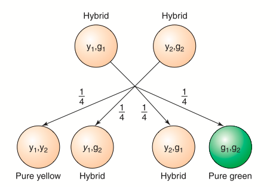

# Testes Chi-Quadrado: Aderência e Independência

## Introdução {.build}

Muitas vezes, a informação da amostra coletada tem a estrutura de dados categorizados, ou seja, cada membro da população pode assumir um entre $k$ valores de uma ou mais características estudadas. 

Dessa forma, o conjunto de dados consiste em frequências de contagens para essas categorias. 

Esse tipo de dados ocorre com frequência nas áreas sociais e biomédicas.

O objetivo aqui é estudar dados agrupados em categorias múltiplas e veremos isso através de dois tipos de testes: 

* Teste de Aderência (ou Bondade de Ajuste)

* Teste de Independência


## Introdução {.build}

**Teste de Aderência:** considere uma população na qual cada membro assume qualquer um de $k$ possíveis valores. Iremos verificar quão adequado uma amostra obtida dessa população se ajusta a um modelo de probabilidade proposto.

**Teste de Independência:** considere uma população na qual cada membro é classificado de acordo com duas características distintas. Com os dados de uma amostra dessa população, iremos verificar se essas duas características podem ser consideradas independentes. 

Duas características serão independentes se a classificação de um membro da população de acordo com uma característica não interfere na probabilidade de classificação em relação à segunda característica desse mesmo membro.

Na aula de hoje iremos focar em Testes de Aderência.


## Exemplo: Cores de Geladeira {.build}

Uma determinada marca de geladeira é vendida em cinco cores diferentes e uma pesquisa de mercado quer avaliar a popularidade das várias cores.  

As frequências abaixo são observadas para uma amostra de 300 vendas feitas num semestre.  

Suponha que seja de interesse testar a hipótese das cinco cores serem igualmente populares. 

<center>Vendas das cinco cores das geladeiras da marca W</center>

Cor | marrom | creme | vermelho | azul | branco | total
---:|:------:|:-----:|:--------:|:----:|:------:|:-----
Frequência  | 88 | 65 | 52 | 40 | 55 | 300 


# Modelo Multinomial

## Distribuição Multinomial {.build}
Para acomodar dados como no Exemplo 1, precisamos estender o modelo Bernoulli de forma que os resultados possam ser classificados em mais de duas categorias.  Esse modelo é chamado de **distribuição multinomial**.

**Modelo Multinomial**

a) O resultado de cada amostra pode ser classificado em uma de $k$ respostas denotadas por $1, 2,\ldots, k$.

b) A probabilidade da amostra assumir o valor $i$ é $p_{i}$, $i=1, 2, \ldots,k$, com $$\sum_{i=1}^{k}p_{i}=1$$ 

c) As observações são independentes.


## Distribuição Multinomial {.build}
Considere uma amostra de uma população que consiste de elementos em diversas categorias, por exemplo, $k$ valores possíveis.  

Denotaremos por $n_1, n_2, \ldots , n_k$, com $\sum_{i=1}^{k}n_{i}=n$ as frequências e $p_1, p_2, \ldots , p_k$ as probabilidades.  

A distribuição conjunta de $n_1, n_2, \ldots , n_k$ é chamada de distribuição multinomial e tem função de probabilidade dada por:

$$f(n_1, n_2, \ldots , n_k)=\frac{n!}{n_1! \ldots n_k!}p_1^{n_1}p_2^{n_2} \ldots p_k^{n_k}$$

em que $\displaystyle \sum_{i=1}^{k}n_{i}=n$ e com $\displaystyle \sum_{i=1}^{k}p_{i}=1$.


## Distribuição Multinomial {.build}
Se designarmos a componente $n_1$ como "sucesso" e juntarmos as demais numa mesma que designamos "fracasso", a variável aleatória $n_1$ é o número de sucessos em $n$ ensaios de Bernoulli, ou seja,  $n_1 \sim Bin(n,p_1)$.  

Portanto, $\mathbb E(n_1)=np_1$, $Var(n_1)=np_1(1-p_1)$. 

Analogamente aplicando o mesmo argumento a cada $n_i$ temos: 
$$\mathbb E(n_i)=np_i \quad \mbox{e} \quad Var(n_i)=np_i(1-p_i)$$

Iremos usar o valor esperado de $n_i$ nos testes que veremos a seguir.


# Teste de Aderência

## Teste de Aderência {.build}

**Objetivo:** Testar quão adequado é assumir um modelo probabilístico para descrever um determinado conjunto de dados.

**Exemplo**: Vocês já devem ter visto em alguma aula de Biologia o seguinte:

<center></center>

3 genótipos (categorias): AA, Aa e aa


## Teste de Aderência {.build}
```{r genetica, echo=FALSE}
obs <- c(AA=26, Aa=45, aa=29)
n <- sum(obs)
p0 <- c(0.25, 0.5, 0.25)

xsq <- chisq.test(obs, p=p0)
esp <- xsq$expected
res <- round(xsq$residuals^2, 2)
stat <- round(xsq$statistic, 2)

alpha <- 0.05
df <- xsq$parameter
xcrit <- round(qchisq(1-alpha, df), 3)
```

Em uma certa população, `r n` descendentes foram estudados, fornecendo a tabela a seguir:

Genótipo | AA | Aa | aa | Total
-------- | -- | -- | -- | -----
Frequência Observada | `r obs[1]` | `r obs[2]` | `r obs[3]` | `r n`


$$ $$ 

**Objetivo:** Verificar se o modelo genético proposto (Equilíbrio de Hardy-Weinberg) é adequado para essa população.

## Teste de Aderência {.build}

Se o modelo teórico for adequado, a freqüência esperada de descendentes para o genótipo AA, dentre os 100 indivíduos, pode ser calculada por:
$$`r n` \times P(AA) = `r n` \times \frac{1}{4} = `r esp[1]`$$

Da mesma forma para o genótipo Aa:
$$`r n` \times P(Aa) = `r n` \times \frac{1}{2} = `r esp[2]`$$

E para o genótipo aa:
$$`r n` \times P(aa) = `r n` \times \frac{1}{4} = `r esp[3]`$$


## Teste de Aderência {.build}

Podemos expandir a tabela de frequências dada anteriormente com as frequências esperadas sob o modelo teórico:

Genótipo | AA | Aa | aa | Total
-------- | -- | -- | -- | -----
Frequência Observada | `r obs[1]` | `r obs[2]` | `r obs[3]` | `r n`
Frequência Esperada  | `r esp[1]` | `r esp[2]` | `r esp[3]` | `r n` 


**Pergunta:** Podemos afirmar que os valores observados estão suficientemente próximos dos
valores esperados, de tal forma que o modelo genético teórico é adequado a esta população?

O procedimento que responde esse tipo de pergunta é chamado de **teste de bondade de ajuste** ou **teste de aderência**.

## Teste de Aderência - Procedimento {.build}

Considere uma tabela de freqüências, com $k \geq 2$ categorias de resultados: 

Categorias | 1 | 2 | ... | k | Total
---------- | - | - | --- | - | -----
Frequência Observada | $O_1$ | $O_2$ | ... | $O_k$ | $n$

Sendo $O_i$ o total de indivíduos observados na categoria $i$, $i=1,2, \ldots, k$.

Seja $p_i$ a probabilidade associada à categoria $i$, $i=1,2, \ldots, k$.

O objetivo do teste de aderência é testar as hipóteses

$$\begin{aligned}
H_0: & p_1=p_{01}, \ldots , p_k= p_{0k} \\
H_a: & \mbox{existe pelo menos uma diferença}
\end{aligned}
$$
sendo $p_{0i}$ a probabilidade da categoria $i$ sob o modelo teórico e $\sum_{i=1}^k p_{0i} =1$

## Teste de Aderência - Procedimento {.build}

Se $E_i$ é o total de indivíduos esperados na categoria $i$, quando a hipótese nula $H_0$ é verdadeira, então:

$$E_i = n\times p_{0i}, \quad i=1,2, \ldots, k.$$

Então, expandindo a tabela de freqüências original, temos

Categorias | 1 | 2 | ... | k | Total
---------- | - | - | --- | - | -----
Frequência Observada | $O_1$ | $O_2$ | ... | $O_k$ | $n$
Frequência Esperada | $E_1$ | $E_2$ | ... | $E_k$ | $n$


## Teste de Aderência - Procedimento {.build}
Para quantificar quão distante os frequências observadas estão das frequências esperadas, usamos a seguinte estatística:

**Estatística do Teste**:
$$\chi^2=\sum_{i=1}^k \frac{(O_i-E_i)^2}{E_i} = \sum^{k}_{i=1}\frac{(n_i-np_{0i})^2}{np_{0i}}$$

Se $H_0$ é verdadeira: $\chi^2 \sim \chi^2_{k-1}$

Em outras palavras, se $H_0$ é verdadeira, a v.a. $\chi^2$ segue uma distribuição aproximadamente Qui-quadrado com $k-1$ graus de liberdade.

**Condição**: Este resultado é válido para $n$ grande e para frequências esperadas maiores ou iguais a 5.


## Teste de Aderência - Procedimento {.build}

Calcular o **valor-de-p** ou encontrar o **valor crítico**.

**Valor-de-p**: $P(\chi^2_{k-1} \geq \chi^2_{obs}),$ em que $\chi^2_{obs}$ é o valor da estatística do teste calculada a partir dos dados. 

<center>
```{r, echo=FALSE, fig.width=7, fig.height=4, message=FALSE}
library(openintro, verbose = FALSE)
data(COL)
df <- 4

ymax <- max(dchisq(0:16, df))/2

x <- seq(0, 18, length.out = 300)
y <- dchisq(x, df)

par(mar = c(4, 2, 2, 1))
plot(x, y, type = 'l', axes = FALSE, lwd=2, main = bquote("Distribuição "* chi[k-1]^2), 
     xlab="")
abline(h = 0)
axis(1)

xobs <- 11  
axis(1, at=xobs, label= bquote(chi[obs]^2))

these <- which(x >= xobs)
X <- x[c(these[1], these, rev(these)[1])]
Y <- c(0, y[these], 0)
polygon(X, Y, col = COL[1])

arrows(xobs, ymax, xobs, ymax/4, 0.1, col = COL[1])
text(xobs, ymax, labels= bquote(chi[obs]^2), pos = 3, cex = 1.2, col = COL[1])

text(xobs + 4, 0.035, labels= "valor-de-p =", pos = 3, cex = 1.2, col = COL[1])
text(xobs + 4, 0.01, labels= bquote('P('* chi[k-1]^2 >= chi[obs]^2 *')'), pos = 3, cex = 1.2, col = COL[1])
```
</center>


## Teste de Aderência - Procedimento {.build}

**Valor Crítico**: Para um nível de significância $\alpha$, encontrar o valor crítico $\chi^2_{crit}$ na tabela Chi-quadrado tal que $P(\chi^2_{k-1} \geq \chi^2_{crit}) = \alpha.$

<center>
```{r, echo=FALSE, fig.width=6.5, fig.height=3, message=FALSE}
library(openintro, verbose = FALSE)
data(COL)
alpha <- 0.10

par(mar = c(4, 2, 2, 1))
plot(x, y, type = 'l', axes = FALSE, lwd=2, main = bquote("Distribuição "* chi[k-1]^2), 
     xlab="")
abline(h = 0)
axis(1)

xcrit <- round(qchisq(1-alpha, df), 3)  
axis(1, at=xcrit, label= bquote(chi[crit]^2))

these <- which(x >= xcrit)
X <- x[c(these[1], these, rev(these)[1])]
Y <- c(0, y[these], 0)
polygon(X, Y, col = COL[1])

## arrows(xcrit, ymax, xcrit, ymax/2, 0.1, col = COL[1])
## text(xcrit, ymax, labels= bquote(chi[crit]^2), pos = 3, cex = 1.2, col = COL[1])

text(xcrit + 5, 0.02, labels= expression('área = P('* chi[k-1]^2 >= chi[crit]^2 *') = '* alpha), pos = 3, cex = 1.2, col = COL[1])
```
</center>

**Conclusão**: Rejeitamos $H_0$ se

$$\mbox{valor-de-p} \leq \alpha \quad \mbox{ou} \quad \chi_{obs}^2 \geq \chi^2_{crit}$$


## Tabela da Distribuição Chi-Quadrado

<center></center>


## Exemplo: Genética {.build}

Voltando no exemplo da Genética

**Hipóteses:**
$$\begin{aligned}
H_0: & \mbox{o modelo proposto é adequado} \\
H_a: & \mbox{o modelo proposto não é adequado}
\end{aligned}
$$

Que de forma equivalente, podem ser escritas como:
$$\begin{aligned}
H_0: & p_1=1/4, p_2=1/2 , p_3= 1/4 \\
H_a: & \mbox{ao menos umas das desigualdades não verifica}
\end{aligned}
$$
sendo $p_1=P(AA), p_2=P(Aa)$ e $p_3=P(aa)$.

## Exemplo: Genética  {.build}
```{r genetica, echo=FALSE}
```

A tabela seguinte apresenta os valores observados e esperados (calculados anteriormente).

Genótipo | AA | Aa | aa | Total
-------- | -- | -- | -- | -----
Frequência Observada | `r obs[1]` | `r obs[2]` | `r obs[3]` | `r n`
Frequência Esperada  | `r esp[1]` | `r esp[2]` | `r esp[3]` | `r n`


**Estatística do Teste**:
$$
\begin{aligned}
\chi^2_{obs} &= \sum_{i=1}^3 \frac{(O_i-E_i)^2}{E_i} = \frac{(26-25)^2}{25} + \frac{(45-50)^2}{50} + \frac{(29-25)^2}{25} \\
&= `r res[1]` + `r res[2]` + `r res[3]` = `r stat` 
\end{aligned}
$$


## Exemplo: Genética {.build}
Sob $H_0$, a estatística $\chi^2 \sim \chi^2_2$. Veja que os graus de liberdade é o número de categorias menos 1. Então o valor-de-p é dado por:

$$\mbox{valor-de-p} = P(\chi^2_2 \geq \chi^2_{obs}) = P(\chi^2_2 \geq `r stat`) = `r round(xsq$p.value, 3)`$$

Para um nível de significância $\alpha=`r alpha`$, olhando na Tabela Qui-Quadrado, o valor crítico é:
$\chi^2_{crit} = `r xcrit`$

**Conclusão:** Para $\alpha = `r alpha`$, como valor-de-p$= `r round(xsq$p.value, 3)` > `r alpha`$, não rejeitamos a hipótese
$H_0$, isto é, essa população segue o modelo genético proposto.

Ou como $\chi^2_{obs}=`r stat` < `r xcrit` = \chi^2_{crit},$ não rejeitamos a hipótese $H_0$.

## Exemplo: Genética
<center>
```{r, echo=FALSE, fig.width=7, fig.height=5}
library(openintro, verbose = FALSE)
data(COL)
source("../functions/ChiSquareTail.R")
## alpha <- 0.05
## df <- 2
## xcrit <- round(qchisq(1-alpha, df), 3)
xobs <- stat

ymax <- max(dchisq(0:10, df))/2

par(mar = c(4, 2, 3, 1))
ChiSquareTail(xcrit, df, c(0, 10), col = COL[1], xlab="")

arrows(xcrit, ymax, xcrit, ymax/4, 0.1, col = COL[1])
text(xcrit, ymax, labels= bquote(chi[.(paste0(df, ",", alpha))]^2 == .(xcrit)), pos = 3, cex = 1.2, col = COL[1])
text(xcrit + 2, 0.01, labels= bquote("área = "* .(alpha)), pos = 3, cex = 1.2, col = COL[1])

axis(1, at=xobs, label= bquote(chi[obs]^2 == .(xobs)))
```
</center>


## Exemplo: Cores de Geladeira {.build}
```{r geladeira, echo=FALSE}
obs <- c(G1=88, G2=65, G3=52, G4=40, G5=55)
n <- sum(obs)
p0 <- rep(1/5, 5)

xsq <- chisq.test(obs, p=p0)
esp <- xsq$expected
res <- round(xsq$residuals^2, 2)
stat <- round(xsq$statistic, 2)

alpha <- 0.05
df <- xsq$parameter
xcrit <- round(qchisq(1-alpha, df), 3)
```

Voltando aos dados do exemplo das cores da geladeira, cujas componentes têm frequências multinomiais, a hipótese nula especifica que as cinco cores são igualmente populares. Ou seja,  
$$\begin{aligned}
H_0: & p_1=p_2= \ldots = p_k= 1/5 \\
H_a: & \mbox{existe pelo menos uma diferença}
\end{aligned}
$$

Componente | marrom | creme | vermelho | azul | branco | total
----------:|:------:|:-----:|:--------:|:----:|:------:|:-----
Frequência Observada | `r obs[1]` | `r obs[2]` | `r obs[3]` | `r obs[4]` | `r obs[5]` | `r n`

Como as probabilidades das componentes na hipótese nula são todas iguais, as frequências esperadas também serão todas iguais, ou seja,
$$E_i = n\times \frac{1}{5} = `r n`\times \frac{1}{5} = `r esp[1]`, \quad i=1,2,3,4,5.$$

## Exemplo: Cores de Geladeira  {.build}

Componente | marrom | creme | vermelho | azul | branco | total
----------:|:------:|:-----:|:--------:|:----:|:------:|:-----
Frequência Observada | `r obs[1]` | `r obs[2]` | `r obs[3]` | `r obs[4]` | `r obs[5]` | `r n`
Frequência Esperada  | `r esp[1]` | `r esp[2]` | `r esp[3]` | `r esp[4]` | `r esp[5]` | `r n` 
$\displaystyle \frac{(O-E)^2}{E}$ | `r res[1]` | `r res[2]` | `r res[3]` | `r res[4]` | `r res[5]` | `r stat`

**Estatística do Teste:**
$$\begin{aligned}
\chi^2=\sum_{i=1}^5 \frac{(O_i-E_i)^2}{E_i} &= `r res[1]` + `r res[2]` + `r res[3]` + `r res[4]` + `r res[5]` \\ 
&= `r stat`
\end{aligned}
$$


## Exemplo: Cores de Geladeira {.build}
Olhando na tabela Qui-quadrado com `r df` graus de liberdade, para $\alpha=`r alpha`$, o valor crítico é $\chi^2_{crit} = \chi^2_{`r df`, `r alpha`} = `r xcrit`$.

<center>
```{r, echo=FALSE, fig.width=6, fig.height=3}
## alpha <- 0.05
## df <- 4
## xcrit <- round(qchisq(1-alpha, df), 3)

ymax <- max(dchisq(0:15, df))/2

par(mar = c(4, 2, 3, 1))
ChiSquareTail(xcrit, df, c(0, 15), col = COL[1], xlab="")

arrows(xcrit, ymax, xcrit, ymax/4, 0.1, col = COL[1])
text(xcrit, ymax, labels= bquote(chi[.(paste0(df, ",", alpha))]^2 == .(xcrit)), pos = 3, cex = 1.2, col = COL[1])

text(xcrit + 3, 0.01, labels= bquote("área = "* .(alpha)), pos = 3, cex = 1.2, col = COL[1])
```
</center>

**Conclusão:** Para $\alpha = `r alpha`$, como $\chi^2_{obs}= `r stat` > `r xcrit` = \chi^2_{crit},$ rejeitamos a hipótese de que as cinco cores são igualmente populares.


## Exemplo: Tipo Sanguíneo {.build}
```{r tiposangue, echo=FALSE}
obs <- c(A=92, B=20, AB=4, O=84)
n <- sum(obs)
p0 <- c(0.41, 0.09, 0.04, 0.46)

xsq <- chisq.test(obs, p=p0)
esp <- xsq$expected
res <- round(xsq$residuals^2, 2)
stat <- round(xsq$statistic, 2)

alpha <- 0.05
df <- xsq$parameter
xcrit <- round(qchisq(1-alpha, df), 3)
```

Entre os americanos, `r p0[1]*100`% tem sangue do tipo A, `r p0[2]*100`% tem sangue tipo B, `r p0[3]*100`% tipo AB e `r p0[4]*100`% tem sangue tipo O. 

Em uma amostra aleatória de `r n` pacientes americanos com câncer de estômago, `r obs[1]` pacientes têm sangue do tipo A, `r obs[2]` do tipo B, `r obs[3]` do tipo AB e `r obs[4]` do tipo O.  

Tipo | A | B | AB | O | total
---- | - | - | -- | - | ----
Frequência Observada | `r obs[1]` | `r obs[2]` | `r obs[3]` | `r obs[4]` | `r n` 

Essas frequências observadas trazem evidência contra a hipótese de que a distribuição do tipo sanguíneo dos pacientes é igual à distribuição dos tipos sanguíneos na população geral americana?  Use nível de significância $\alpha=`r alpha`$.


## Exemplo: Tipo Sanguíneo {.build}

$$\begin{aligned}
H_0: & p_1=`r p0[1]`, p_2=`r p0[2]`, p_3=`r p0[3]` , p_4=`r p0[4]` \\
H_a: & \mbox{existe pelo menos uma diferença}
\end{aligned}
$$


Tipo | A | B | AB | O | total
---- | - | - | -- | - | ----
Frequência Observada | `r obs[1]` | `r obs[2]` | `r obs[3]` | `r obs[4]` | `r n`
Frequência Esperada  | `r esp[1]` | `r esp[2]` | `r esp[3]` | `r esp[4]` | `r n` 
$\displaystyle \frac{(O-E)^2}{E}$ | `r res[1]` | `r res[2]` | `r res[3]` | `r res[4]` | `r stat`

**Estatística do Teste:** $\displaystyle \chi^2=\sum_{i=1}^4 \frac{(O_i-E_i)^2}{E_i} = `r stat`$


## Exemplo: Tipo Sanguíneo {.build}

<center>
```{r, echo=FALSE, fig.width=6, fig.height=3}
xobs <- stat
ymax <- max(dchisq(0:15, df))/2

par(mar = c(4, 2, 3, 1))
ChiSquareTail(xcrit, df, c(0, 15), col = COL[1])

arrows(xcrit, ymax, xcrit, ymax/4, 0.1, col = COL[1])
text(xcrit, ymax, labels= bquote(chi[.(paste0(df, ",", alpha))]^2 == .(xcrit)), pos = 3, cex = 1.2, col = COL[1])

axis(1, at=xobs, label= bquote(chi[obs]^2))
text(xcrit + 3, 0.01, labels= bquote("área = "* .(alpha)), pos = 3, cex = 1.2, col = COL[1])
```
</center>


**Conclusão**: Como $\chi^2_{obs} = `r stat` \leq `r xcrit`= \chi^2_{`r df`, `r alpha`}$, não temos evidência para rejeitar a  hipótese nula. 

Portanto, concluímos que não há discrepância significativa entre o que foi observado e a distribuição sanguínea da população americana.


## Exemplo: Ervilhas de Mendel
<center></center>


## Exemplo: Ervilhas de Mendel
<center></center>
*Figura: (Esquerda) Cruzamento de ervilhas puramente amarelas e puramente verdes e (Direta) cruzamento de ervilhas híbridas (Direita)*

## Exemplo: Ervilhas de Mendel {.build}
```{r mendel, echo=FALSE}
obs <- c(Amarelas=6022, Verdes=2001)
n <- sum(obs)
p0 <- c(3/4, 1/4)

xsq <- chisq.test(obs, p=p0)
esp <- xsq$expected
res <- round(xsq$residuals^2, 3)
stat <- round(xsq$statistic, 3)

alpha <- 0.05
df <- xsq$parameter
xcrit <- round(qchisq(1-alpha, df), 3)
```

Mendel fez o cruzamento de `r n` ervilhas híbridas e o resultado foram `r obs[1]` ervilhas amarelas e `r obs[2]` ervilhas verdes.  Teoricamente, cada cruzamento deve resultar em ervilha amarela com probabilidade $3/4$ e verde com probabilidade $1/4$. 

$$\begin{aligned}
H_0: & p_1=3/4 \; \mbox{ e } \; p_2=1/4 \\
H_a: & \mbox{existe pelo menos uma diferença}
\end{aligned}
$$

Tipo | Amarela | Verde | total
---- | - | - | -- | - | ----
Frequência Observada | `r obs[1]` | `r obs[2]` | `r n`
Frequência Esperada  | `r esp[1]` | `r esp[2]` | `r n` 
$\displaystyle \frac{(O-E)^2}{E}$ | `r res[1]` | `r res[2]` | `r stat`


## Exemplo: Ervilhas de Mendel {.build}
**Estatística do Teste:** $\displaystyle \chi^2=\sum_{i=1}^2 \frac{(O_i-E_i)^2}{E_i} = `r stat`$

<center>
```{r, echo=FALSE, fig.width=5, fig.height=3}
ymax <- max(dchisq(0.1:5, df))/2

par(mar = c(3, 2, 3, 1))
ChiSquareTail(xcrit, df, c(0, 5), col = COL[1], xlab="")

arrows(xcrit, ymax, xcrit, ymax/4, 0.1, col = COL[1])
text(xcrit, ymax, labels= bquote(chi[.(paste0(df, ",", alpha))]^2 == .(xcrit)), pos = 3, cex = 1.2, col = COL[1])
```
</center>

**Conclusão:** Como $\chi^2_{obs} = `r stat` \leq `r xcrit`= \chi^2_{`r df`, `r alpha`}$, não temos evidência para rejeitar a  hipótese nula.  Concluímos que não há discrepância significativa entre o que foi observado e a hipótese nula.


## Leituras

* [Ross](http://www.sciencedirect.com/science/article/pii/B9780123743886000132): capítulo 13. 
* [OpenIntro](https://www.openintro.org/stat/textbook.php): seção 6.3

<center></center>

##

Slides produzidos pelos professores:

* Samara Kiihl

* Tatiana Benaglia

* Benilton Carvalho