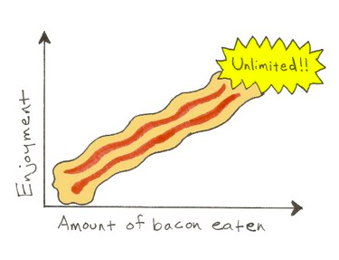

```{r setup, echo=FALSE}
library(knitr)
library(printr)
library(ggplot2)
library(MASS)
notas = read.csv("./dados/notas.csv", na.strings="-", header=TRUE)
notas = notas[complete.cases(notas),]
notas0 = notas
n0 = nrow(notas)
## Há um ponto de quebra neste conjunto de dados
## para aqueles com Moodle abaixo de 6.25, o
## comportamento é aproximadamente linear
notas = subset(notas, Moodle <= 6.25)
notas = notas[2:1]
rownames(notas) = NULL
```

# Correlação e Regressão Linear Simples

## Problema {.build}

Na última aula, trabalhamos com o conjunto de dados refere às notas do Moodle e da Prova P1 de `r n0` alunos matriculados em ME414 no 2S2015.

Hoje, focaremos nas observações referentes a `r nrow(notas)` alunos que obtiveram, no máximo, 6.25 pontos nas atividades do Moodle.

Nosso objetivo é inferir a respeito da associação das notas (absolutas) das atividades disponibilizadas no Moodle com aquelas da Prova P1.

## Moodle ($\leq 6.25$) e Notas da Prova P1

```{r show_data, echo=FALSE}
kable(head(notas)) 
```

## Como Explicar essa Associação?

```{r scatter_plot, echo=FALSE, fig.align='center', fig.width=5, fig.height=5}
sc1 = ggplot(notas, aes(Moodle, P1)) + geom_point(alpha=.7) + theme_bw()
sc2 = sc1 + geom_smooth(method='lm', se=FALSE)
sc2
```

## Explicando Associação Linear {.build}

- **Coeficiente de correlação**
    + Quantidade no intervalo $(-1, 1)$;
    + Mede a força da associação linear em função da dispersão dos dados;
- **Modelo de regressão linear simples**
    + Estima a forma $Y = \hat{\alpha} + \hat{\beta}X$;
    + O modelo é linear **nos parâmetros**
  

# Correlação Linear  
  
## Introdução à Correlação Linear {.build}

- Denotamos a correlação por $R$;
- $R = -1$, associação linear negativa entre X e Y;
- $R = 0$, ausência de associação linear entre X e Y;
- $R = +1$, associação linear positiva entre X e Y;

```{r scatter_plot2, echo=FALSE, fig.height=3, fig.width=4, fig.align='center'}
sc2
```

## Diferentes níveis de correlação 

```{r diff_cor, echo=FALSE, fig.align='center', fig.width=9}
set.seed(1)
mat2 = cbind(c(2, .1), c(.1, 2))
y2 = mvrnorm(100, rep(7, 2), mat2)
mat3 = cbind(c(2, 1), c(1, 2))
y3 = mvrnorm(100, rep(7, 2), mat3)
mat4 = cbind(c(2, 1.5), c(1.5, 2))
y4 = mvrnorm(100, rep(7, 2), mat4)
mat5 = cbind(c(2, 1.9), c(1.9, 2))
y5 = mvrnorm(100, rep(7, 2), mat5)

par(mar=c(2.5,2.5,1.6,1.1), mgp=c(1.5,.5,0))
par(mfrow=c(2, 4))
myplot = function(mat){
  r = sprintf('%0.2f', cor(mat)[2,1])
  plot(mat, pch=19, col=rgb(0,0,0,.7),
       ylim=c(2, 10), xlim=c(2, 10),
       main=paste('R =', r), xaxt='n', yaxt='n',
       ylab='', xlab='')
}
myplot(y2)
myplot(y3)
myplot(y4)
myplot(y5)

mat2 = cbind(c(2, -.1), c(-.1, 2))
y2 = mvrnorm(100, rep(7, 2), mat2)
mat3 = cbind(c(2, -1), c(-1, 2))
y3 = mvrnorm(100, rep(7, 2), mat3)
mat4 = cbind(c(2, -1.5), c(-1.5, 2))
y4 = mvrnorm(100, rep(7, 2), mat4)
mat5 = cbind(c(2, -1.9), c(-1.9, 2))
y5 = mvrnorm(100, rep(7, 2), mat5)

myplot(y2)
myplot(y3)
myplot(y4)
myplot(y5)


```

## Determinação do Coeficiente de Correlação {.build}

Hipóteses:

- Duas variáveis contínuas: $X$ e $Y$;
- $n$ pares de observações: ($X_i, Y_i$);

## Fórmula 1 {.build}

$$
\begin{aligned}
R & = \frac{\sum_{i=1}^n (X_i - \bar{X})(Y_i - \bar{Y})}{\sqrt{\sum_{i=1}^n (X_i-\bar{X})^2}\sqrt{\sum_{i=1}^n (Y_i-\bar{Y})^2}} \\
  & = \frac{S_{XY}}{\sqrt{S_{XX}^2 S_{YY}^2}} = \frac{S_{XY}}{S_{XX}S_{YY}} 
\end{aligned}
$$

Notem que $S_{XX}^2$ e $S_{YY}^2$ são as somas de quadrados de $X$ e $Y$ corrigida por suas respectivas médias.

```{r calc_cor1, echo=FALSE}
SXY = with(notas, sum((Moodle-mean(Moodle))*(P1-mean(P1))))
SXX = with(notas, sqrt(sum((Moodle-mean(Moodle))^2)))
SYY = with(notas, sqrt(sum((P1-mean(P1))^2)))
```

$$
\begin{aligned}
S_{XY} & = `r round(SXY, 2)` \\
S_{XX} & = `r round(SXX, 2)` \\
S_{XY} & = `r round(SYY, 2)` \\
R & = `r round(SXY/(SXX*SYY), 4)`
\end{aligned}
$$

## Fórmula 2 {.build}

$$
\begin{aligned}
R & = \frac{\sum_{i=1}^n (X_i - \bar{X})(Y_i - \bar{Y})}{\sqrt{\sum_{i=1}^n (X_i-\bar{X})^2}\sqrt{\sum_{i=1}^n (Y_i-\bar{Y})^2}} \\
  & = \frac{1}{n-1} \sum_{i=1}^n \frac{(X_i - \bar{X})}{s_X} \frac{(Y_i - \bar{Y})}{s_Y}
\end{aligned}
$$

Notem que $s_X$ e $s_Y$ representam os desvios-padrão amostrais de $X$ e $Y$, respectivamente.

```{r calc_cor2, echo=FALSE}
SXYP = with(notas, sum(((Moodle-mean(Moodle))/sd(Moodle))*((P1-mean(P1))/sd(P1))))
Nm1 = nrow(notas)-1
```

$$
\begin{aligned}
\sum_{i=1}^n \frac{(X_i - \bar{X})}{s_X} \frac{(Y_i - \bar{Y})}{s_Y} & = `r round(SXYP, 2)` \\
n-1 & = `r Nm1` \\
R & = `r round(SXYP/Nm1, 4)`
\end{aligned}
$$


## Fórmula 3 {.build}

$$
\begin{aligned}
R & = \frac{\sum_{i=1}^n (X_i - \bar{X})(Y_i - \bar{Y})}{\sqrt{\sum_{i=1}^n (X_i-\bar{X})^2}\sqrt{\sum_{i=1}^n (Y_i-\bar{Y})^2}} \\
  & = \frac{1}{n-1} \frac{\sum_{i=1}^n X_i Y_i -n \bar{X}\bar{Y}}{s_X s_Y}
\end{aligned}
$$

Observem que $\bar{X}$ e $\bar{Y}$ representam as médias amostrais de cada uma das variáveis;
e $s_X$ e $s_Y$ são os desvios-padrão amostrais de cada uma das variáveis.

```{r calc_cor3, echo=FALSE}
SXYU = with(notas, sum(Moodle*P1))
aveX  = mean(notas$Moodle)
aveY = mean(notas$P1)
Nm0 = nrow(notas)
SXYU = SXYU-Nm0*aveX*aveY
SXYU = SXYU/(sd(notas$Moodle)*sd(notas$P1))
```

$$
\begin{aligned}
\bar{X} = `r round(aveX, 2)` \quad
\bar{Y} = `r round(aveY, 2)` \quad
n-1 & = `r Nm1` \\
\frac{\sum_{i=1}^n X_i Y_i -n \bar{X}\bar{Y}}{s_X s_Y} & = `r round(SXYU, 2)` \\
R & = `r round((SXYU/Nm1), 4)`
\end{aligned}
$$


# Regressão Linear Simples

## Terminologia em Regressão Linear Simples {.build}

- Um modelo de regressão possui, pelo menos, duas variáveis:
    + Variável independente, variável exploratória, variável preditora, covariável: $x$;
    + Variável dependente, variável resposta: $y$;
- Para alunos com notas de atividades de no máximo 6.25, como as notas das atividades se associam com a nota da prova P1?
    + Variável dependente (resposta): nota da prova P1;
    + Variável independente: nota das atividades do Moodle;

## Forma do Modelo {.build}

- O modelo de regressão usual descreve associação linear: $$ Y= \alpha + \beta X + \epsilon. $$
- Neste modelo, os termos adicionais são:
    + $\alpha$: intercepto;
    + $\beta$: coeficiente angular;
    + $\epsilon$: erro observacional;
- Considerar o erro é necessário, pois associações perfeitas são improváveis;

## Forma do Modelo {.build}

<center></center>

## Hipóteses do Modelo de Regressão Linear

- Modelo de regressão linear assume:
    + Linearidade entre variáveis;
    + Erros aleatórios nas observações;
    + Erro tem média zero;
    + Variância constante do erro $\sigma^2$;
- Desta forma, a variável aleatória Y, $$Y = \alpha + \beta X + \epsilon, $$ possui as seguintes características:
    + $E(Y) = E( \alpha + \beta X + \epsilon) = \alpha + \beta X$
    + $\mbox{Var}(Y) = Var( \alpha + \beta X + \epsilon) = Var(\epsilon)  = \sigma^2$
    
## Como saber se a Regressão Linear é adequada? {.build}

- Utilizar diagramas de dispersão;
- Analisar visualmente a forma de associação entre X e Y;
- Buscar associação linear;
- Aferir a homogeneidade da variância;
- Buscar informação sobre independência das observações.

## Exemplo: Notas no Moodle e P1 

Na última aula, trabalhamos com o conjunto de dados refere às notas do Moodle e da Prova P1 de `r n0` alunos matriculados em ME414 no 2S2015.

Hoje, focaremos nas observações referentes a `r nrow(notas)` alunos que obtiveram, no máximo, 6.25 pontos nas atividades do Moodle.

Nosso objetivo é inferir a respeito da associação das notas (absolutas) das atividades disponibilizadas no Moodle com aquelas da Prova P1.

## Exemplo: Notas no Moodle e P1

```{r show_moodle_p1, echo=FALSE}
kable(head(notas))
```

## Exemplo: Notas no Moodle e P1

```{r dados_nota_rl, echo=FALSE, fig.align='center'}
sc2
```

## Escolha da Melhor Reta {.build}

Um modo de determinar a melhor reta é pelo meio da minimização da soma dos erros quadrados:

- Determinar a função a ser minimizada;
- Determinar a primeira derivada com respeito aos parâmetros de interesse;
- Igualar estas derivadas a zero;
- Verificar segundas derivadas;

## Escolha da Melhor Reta {.build}

$$
\begin{aligned}
Y_i & = \alpha + \beta X_i + \epsilon_i \\
f(\alpha, \beta) = \sum_{i=1}^n \epsilon_i^2 & = \sum_{i=1}^n (Y_i - \alpha - \beta X_i)^2 \\
\frac{\partial f(\alpha, \beta)}{\partial \alpha} & = -2 \sum_{i=1}^n (Y_i - \alpha - \beta X_i) \\
\frac{\partial f(\alpha, \beta)}{\partial \beta} & = -2 \sum_{i=1}^n X_i (Y_i - \alpha - \beta X_i) \\
\hat{\alpha} & = \bar{Y} - \hat{\beta} \bar{X} \\
\hat{\beta} & = \frac{\sum_{i=1}^n (X_i - \bar{X})(Y_i - \bar{Y})}{\sum_{i=1}^n (X_i-\bar{X})^2} = \frac{S_{XY}}{S_{XX}}
\end{aligned}
$$

```{r reg_formulas, echo=FALSE}
sxx = function(x) sum((x-mean(x))^2)
sxy = function(x, y) sum((x-mean(x))*(y-mean(y)))
```

## A Escolha da Melhor Reta

```{r diagpontos_notas, echo=FALSE, fig.align='center'}
sc2
```

## Exemplo: Moodle x P1 {.build}
```{r reta_notas, echo=FALSE}
sxxmark = with(notas, sxx(Moodle))
sxymark =  with(notas, sxy(Moodle, P1))
xmean = round(mean(notas$Moodle), 2)
hatb = round(sxymark/sxxmark, 2)
ymean = round(mean(notas$P1), 2)
hata = mean(notas$P1) - sxymark/sxxmark*mean(notas$Moodle)
```

$$
\begin{aligned}
\hat{\beta} = \frac{S_{XY}}{S_{XX}} & = `r ifelse(sxymark < 0, '-', '')` \frac{`r abs(sxymark)`}{`r format(sxxmark, digits=3)`} = `r hatb` \\
\hat{\alpha} = \bar{Y} - \hat{\beta} \bar{X} & = `r ymean` `r ifelse(hatb < 0, '+', '-')` `r abs(hatb)` \times `r xmean` = `r round(hata, 2)` \\
\mbox{P1} &= `r round(hata, 2)` `r ifelse( hatb < 0, '-', '+')` `r abs(hatb)` \times \mbox{Moodle}
\end{aligned}
$$

```{r reg1, echo=FALSE, fig.align='center', fig.height=3, fig.width=4}
sc2
```

## Interpretação dos Parâmetros {.build}

$$
\begin{aligned}
\hat{\alpha} & = `r round(hata, 2)` \\
\hat{\beta} & = `r round(hatb, 2)`
\end{aligned}
$$

- $\hat{\alpha}$ é a nota média na P1 para alunos com nota 0 no Moodle;
- $\hat{\beta}$ é o aumento médio na nota da P1 para cada ponto extra no Moodle.

```{r reg1_interpretacao, echo=FALSE, fig.align='center', fig.height=3, fig.width=4}
sc2
```

# Observações

## Erros na Interpretação de Correlação e Regressão {.build}

- Correlação e regressão apresentam **associação**;
- Associação não indica causalidade;
- Extrapolações não devem ser feitas;

## Associações

O gráfico abaixo apresenta o número de divórcios (por 1000 casamentos) no Maine/EUA e o consumo *per capita* de margarina (em libras) ao longo dos anos.
```{r assoc, echo=FALSE, fig.align='center', warning=FALSE, message=FALSE}
assoc = data.frame(ano=2000:2009,
                   margarina=c(8.2, 7, 6.5, 5.3, 5.2, 4, 4.6, 4.5, 4.2, 3.7),
                   divorcios=c(5, 4.7, 4.6, 4.4, 4.3, 4.1, 4.2, 4.2, 4.2, 4.1))
tmp0 = cbind(assoc[, 1:2], tipo='margarina')
colnames(tmp0)[2] = 'valor'
tmp1 = cbind(assoc[, -2], tipo='divorcio')
colnames(tmp1)[2] = 'valor'
assoc0 = rbind(tmp0, tmp1)
rm(tmp0, tmp1)
assoc_graph = ggplot(assoc0, aes(ano, valor, colour=tipo)) + geom_smooth(se=FALSE) + theme_bw()
assoc_graph
#plot(assoc$ano, assoc$margarina, type='l', col=1, lwd=3, xlab='Ano', ylab='')
#lines(assoc$ano, assoc$divorcios, col=2, lwd=3)
#legend('topright', c('Margarina', 'Divorcios'), lwd=3, col=1:2)
```

## Associações {.build}

A correlação entre estas duas variáveis (número de divórcios e consumo de margarina) é `r round(cor(assoc$margarina, assoc$divorcios), 4)`.

Considere o número de divórcios como variável resposta e o consumo de margarina como variável independente.

Temos o seguinte modelo de regressão linear:

```{r reg_assoc, echo=FALSE}
kable(summary(lm(divorcios~margarina, data=assoc))$coef, col.names = c("Estimativa", "Erro Padrão", "valor t", "valor-de-p"))
```

Ou seja,
$$\mbox{divórcios} = 3.30 + 0.20 \times \mbox{margarina}$$

## Associações

Importante lembrar que modelos de regressão descrevem associação, não causalidade.

```{r graf_reg_assoc, echo=FALSE, fig.align='center'}
ggplot(assoc, aes(margarina, divorcios)) + geom_point() + geom_smooth(method='lm', se=FALSE) + theme_bw()
```

## Extrapolações

Qual o consumo esperado de margarina em 2016?

```{r graf_extrapol, echo=FALSE, fig.align='center', warning=FALSE, message=FALSE}
assoc_graph
```

## Leituras

* [Ross](http://www.sciencedirect.com/science/article/pii/B9780123743886000132): capítulo 12 
* [OpenIntro](https://www.openintro.org/stat/textbook.php): seções 7.1 e 7.2
* Magalhães: seção 9.5

<center></center>


##

Slides produzidos pelos professores:

* Samara Kiihl

* Tatiana Benaglia

* Benilton Carvalho