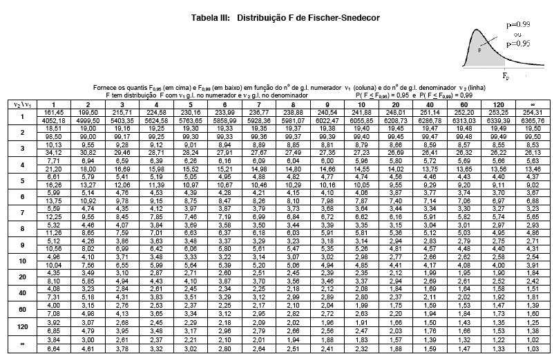

# Análise de Variância (ANOVA)

## Introdução {.build}

Já vimos anteriormente como testar se existe diferença entre duas médias $\mu_1$ e $\mu_2$ de duas populações independentes. Ou seja:

$$H_0: \mu_1=\mu_2 \quad \mbox{vs} \quad  H_a: \mu_1 \neq \mu_2$$

Considerando o caso das variâncias iguais e desconhecidas, usamos $s_p^2$ como estimador da variância $\sigma^2$ e temos a estatística do teste: 
$$T= \frac{\bar{X} - \bar{Y}}{ \sqrt{s_p^2 ( \frac{1}{n} + \frac{1}{m}} )} \stackrel{H_0}{\sim} t_{n+m-2}.$$

Mas e se quiséssemos comparar as médias de 3 ou mais populações (grupos)?


## Análise de Variância {.build}

**Exemplo:** O Departamento de Estatística oferece o curso ME414 todo semestre para várias turmas. Suponha que queremos saber se existe diferença significativa no desempenho na P1 entre as turmas A, B, C e I.

Poderíamos comparar as médias duas a duas, certo?

No entanto, isso não é muito viável quando temos muitos grupos.

A técnica estatística adequada para esse tipo de problema, com a qual pode-se comparar se as médias de várias populações (grupos) são todas iguais com um único teste é chamada de **Análise de Variância (ANOVA)**.


## Análise de Variância - ANOVA  {.build}
**Objetivo:** Comparar se as médias de 3 ou mais populações (grupos) são iguais.

**Hipóteses:**
$$\begin{aligned} 
H_0: &\mbox{as médias são as mesmas para todos os grupos} \\ 
H_a: & \mbox{pelo menos uma média é diferente das demais}
\end{aligned}
$$

Em termos estatísticos:
$$\begin{aligned} 
H_0: &\mu_1=\mu_2=\ldots=\mu_k \\ 
H_a: & \mbox{pelo menos uma média é diferente das demais}
\end{aligned}
$$

A **estatística do teste**, chamada de F, é conceitualmente o seguinte:
$$F = \frac{\mbox{Variação Entre as Médias Amostrais dos Grupos}}{\mbox{Variação Média Dentro dos Grupos}}$$


## ANOVA - Condições {.build}

Devemos checar três condições nos dados onde iremos realizar a ANOVA:

* as observações são independentes dentro dos grupos e entre os grupos;

* os dados dentro de cada grupo são aproximadamente normais; e 

* a variância é aproximadamente constante entre os grupos.


## Detalhes da ANOVA {.build}

Um conceito fundamental em Análise de Variância é que a variação total dos dados, considerando todas as amostras como vindas de uma única população, pode ser separadas em duas partes:

* variação devido às diferenças entre as médias dos grupos

* variação das observações dentro de cada grupo

Ou seja, escrevendo como uma equação:

$$\mbox{Variação Total = Variação Entre Grupos + Variação Dentro dos Grupos}$$

Iremos ver agora como medir cada uma dessas variações.


## Estrutura dos Dados {.build}

Grupos |  Observações |  Média
------ |:------------:|:------:
Grupo 1    | $X_{11}, X_{12}, X_{13}, \ldots, X_{1n}$ | $\bar{X}_1$
Grupo 2    | $X_{21}, X_{22}, X_{23}, \ldots, X_{2n}$ | $\bar{X}_2$
 $\vdots$  | $\vdots$ | $\vdots$
Grupo k    | $X_{k1}, X_{k2}, X_{k3}, \ldots, X_{kn}$ | $\bar{X}_k$

Veja que a média e variância amostral para cada grupo são calculadas como:
$$\bar{X}_i = \frac{1}{n} \sum_{j=1}^n X_{ij} \quad \mbox{e} \quad s_i^2 = \frac{1}{n-1}  \sum_{j=1}^n (X_{ij} - \bar{X}_i)^2$$


## Notação {.build}

Considere a seguinte notação:

$k$: número de populações ou grupos

$n$: tamanho de cada grupo

$X_{ij}$: a $j$-ésima observação dentro do $i$-ésimo grupo, $i=1, \ldots, k$ e $j=1,\ldots,n$

$\bar{X}_i$: média amostral do $i$-ésimo grupo

$\bar{X}$: média amostral considerando todas as observações como parte de um 
único grupo/população.

$s_i$: desvio padrão amostral do $i$-ésimo grupo


## Variação Total {.build}
A variação total das observações é chamada de **Soma de Quadrados Total** ou $SQ_T$ e é calculada como o numerador da variância amostral se todas as observações fossem combinadas em um único grupo. Ou seja,
$$SQ_T = \sum_{i=1}^k \sum_{j=1}^n (X_{ij} - \bar{X})^2$$

Analiticamente pode-se mostrar que:
$$\begin{aligned} SQ_T = \sum_{i=1}^k \sum_{j=1}^n (X_{ij} - \bar{X})^2  &= n \sum_{i=1}^k (\bar{X_i} - \bar X)^2 + \sum_{i=1}^k \sum_{j=1}^n (X_{ij} - \bar{X}_i)^2 \\
&= SQ_G + SQ_E
\end{aligned}
$$

Veremos agora o que são $SQ_G$ e $SQ_E$.


## Variação Entre Grupos {.build}

A variação entre as médias dos grupos é chamada de **Soma de Quadrados Entre Grupos** ou $SQ_G$ e é calculada da seguinte forma:

$$SQ_G = n \sum_{i=1}^k (\bar{X_i} - \bar X)^2 = n(\bar{X}_1 - \bar X)^2+ \ldots + n(\bar{X}_k - \bar X)^2$$

Veja que é a soma ponderada das diferenças entre as médias dos grupos $\bar{X}_i$ e a média geral $\bar X$ ao quadrado.

O numerador da estatística $F$ é chamado de **Quadrado Médio Entre Grupos** ou $QM_G$ e pode ser visto como sendo a variância amostral das médias dos grupos:
$$QM_G = \frac{SQ_G}{k-1}$$


## Variação Dentro dos Grupos {.build}
A variação das observações dentro dos grupos é chamada de **Soma de Quadrados do Erro** ou $SQ_E$ e é calculada da seguinte forma:
$$SQ_E = \sum_{i=1}^k \sum_{j=1}^n (X_{ij} - \bar{X}_i)^2 =  \sum_{i=1}^k (n-1) s^2_i$$

Ou seja, é a soma ponderada das variâncias amostrais para o $i$-ésimo grupo.

O denominador da estatística $F$ é chamado de **Quadrado Médio do Erro** ou $QM_E$ e é a estimativa da variância populacional para $k$ grupos:
$$QM_E = \frac{SQ_E}{k(n-1)} = \frac{(n-1) s^2_1  + \ldots + (n-1) s^2_k}{kn-k}$$


## Teste de Igualdade das Médias para $k$ Grupos {.build}

Resumindo, estamos interessados em testar as hipóteses:
$$\begin{aligned} 
H_0: &\mu_1=\mu_2=\ldots=\mu_k \\ 
H_a: & \mbox{pelo menos uma média é diferente das demais}
\end{aligned}
$$

A **estatística do teste** é dada por:
$$F = \frac{QM_G}{QM_E} = \frac{\frac{SQ_G}{k-1}}{\frac{SQ_E}{k(n-1)}}$$

Sob a hipótese $H_0$ de igualdade das médias, a estatística do teste segue uma distribuição $F$ com $k-1$ graus de liberdade no númerador e $k(n-1)$ graus de liberdade no denominador. Ou seja,
$$F \stackrel{H_0}{\sim} F_{k-1, k(n-1)}$$


## Tabela F {.smaller}
Os valores críticos da distribuição $F$ para $\alpha=0.05$ ou $\alpha=0.01$ estão na tabela abaixo. As linhas e colunas representam os graus de liberdade do denominador ($\nu_2$) e numerador ($\nu_1$), respectivamente.

<center></center>


## Teste de Igualdade das Médias para $k$ Grupos {.build}

**Valor Crítico**: Para um nível de significância $\alpha$, encontrar o valor crítico $F_{crit}$ na tabela $F$ com $k-1$ graus de liberdade no numerador e $k(n-1)$ graus de liberdade no denominador tal que $P(F_{k-1, k(n-1)} \geq F_{crit}) = \alpha.$


```{r, echo=FALSE, fig.align="center", fig.width=6.5, fig.height=3, message=FALSE}
library(openintro, verbose = FALSE)
data(COL)
alpha <- 0.10
df1 <- 3
df2 <- 18

ymax <- max(df(0:6, df1, df2))/2

x <- seq(0, 6, length.out = 300)
y <- df(x, df1, df2)

par(mar = c(4, 2, 2, 1))
dfs <- paste("k-1, k(n-1)")
plot(x, y, type = 'l', axes = FALSE, xlim = c(0, 5), lwd=2, 
       main = bquote("Distribuição "* F[.(dfs)]), xlab="", ylab="")
abline(h = 0)
axis(1)

fcrit <- round(qf(1-alpha, df1, df2), 3)  
axis(1, at=fcrit, label= bquote(F[crit]))

these <- which(x >= fcrit)
x <- x[c(these[1], these, rev(these)[1])]
y <- c(0, y[these], 0)
polygon(x, y, col = COL[1])

text(fcrit+1.5, ymax/2, labels= bquote("área = "* P(F[.(dfs)] >= F[crit]) == alpha), pos = 3, cex = 1.2, col = COL[1])
```


**Conclusão**: Rejeitamos $H_0$ se $F_{obs} \geq F_{crit} = F_{k-1, k(n-1), \alpha}$


## Tabela ANOVA {.build}

Tudo o que discutimos até agora pode ser resumido na tabela abaixo. Essa tabela é chamada de **Tabela ANOVA**

Fonte de Variação | Soma de Quadrados | Graus de Liberdade | Quadrado Médio | Estatística F
----------------- | -----------------:| ------------------:| --------------:| ------------:
Grupos (Entre) | $SQ_G$ | $k-1$    | $QM_G$ | $\displaystyle F = \frac{QM_G}{QM_E}$ 
Erro (Dentro)  | $SQ_E$ | $k(n-1)$ | $QM_E$ | 
Total          | $SQ_T$ | $kn-1$   |        |  

Na prática, basta calcular $SQ_T$ e $SQ_G$ e obter a $SQ_E$ por subtração:
$$SQ_T = SQ_G + SQ_E \qquad \Longrightarrow \qquad SQ_E = SQ_T - SQ_G$$


## Turmas de ME414 - Notas P1 {.build}

Voltando no exemplo das notas da P1 para as turmas A, B, C e I. Selecionamos ao acaso 15 alunos de cada turma e anotamos sua respectiva nota na P1. 

A tabela abaixo mostra as notas dos primeiros 5 alunos.

```{r, echo=FALSE}
library(knitr)
tmp <- read.table("dados/NotasP1_ABCI.txt", header = TRUE)
n <- nrow(tmp)
dados <- reshape(tmp, varying = list(colnames(tmp)[-1]), v.names="Notas", idvar = "aluno", times=c("ME414_A", "ME414_B", "ME414_C", "ME414_I"), timevar="Turma", direction = "long")
Notas <- dados$Notas
Turma <- dados$Turma
kable(tmp[1:5,], col.names = c("Aluno", "ME414_A", "ME414_B", "ME414_C", "ME414_I"))
```

## ME414 - Notas P1 {.build}
```{r, echo=FALSE, fig.align="center", fig.height=4.5, fig.width=7}
boxplot(Notas ~ Turma, col="lightblue", las=1, ylab="Notas P1", xlab="Turma", main="Notas P1 por Turma")
```

Existe diferença do desempenho na P1 entre as turmas?


## Estatísticas Descritivas

```{r, echo=FALSE}
stats <- aggregate(Notas ~ Turma, FUN=function(x) c(length(x), round(mean(x), 2), var(x), sd(x)))$Notas
rownames(stats) <- c("ME414_A", "ME414_B", "ME414_C", "ME414_I")

kable(stats, col.names = c("n", "Média", "Variância", "Desvio Padrão"), align=rep("c", ncol(stats)+2), digits=c(0, 2, 2, 2), caption="Resumo das Notas P1 por Turma")

muk <- round(stats[, 2], 2)
mu <- round(mean(stats[, 2]), 2)
```

A média geral, considerando todas as notas como sendo de uma única turma é $\bar X = `r mu$.

## Cálculo das Somas de Quadrados 
```{r, echo=FALSE}
out <- anova(lm(Notas ~ factor(Turma)))
sq <- round(c(out$`Sum Sq`, sum(out$`Sum Sq`)), 2)
df <- c(out$Df, sum(out$Df))
qm <- round(sq[1:2]/df[1:2], 2)
stat <- round(out$`F value`[1], 3)

alpha <- 0.05
fcrit <- round(qf(1-alpha, df1=df[1], df2=df[2]), 3) 
```

$$\begin{aligned} 
SQ_T &= \sum_{i=1}^4 \sum_{j=1}^{15} (X_{ij} - \bar{X})^2 = `r sq[3]` \\
\\
SQ_G &= n \sum_{i=1}^4 (\bar{X_i} - \bar X)^2 \\
&= 15\left[(`r muk[1]` - `r mu`)^2 + (`r muk[2]` - `r mu`)^2 + (`r muk[3]` - `r mu`)^2 + (`r muk[4]` - `r mu`)^2 \right] \\
&= `r sq[1]` \\
\\
SQ_E &= SQ_T - SQ_G \\
&= `r sq[3]` - `r sq[1]` = `r sq[3]- sq[1]`
\end{aligned}
$$


## ANOVA - Notas P1 por Turma {.build}

Fonte de Variação | Soma de Quadrados | Graus de Liberdade | Quadrado Médio | Estatística F
----------------- | -----------------:| ------------------:| --------------:| ------------:
Grupos (Turma) | $`r sq[1]`$ | $`r df[1]`$ | $`r qm[1]`$ | $\displaystyle F = \frac{`r qm[1]`}{`r qm[2]`} = `r stat`$ 
Erro  | $`r sq[2]`$ | $`r df[2]`$ | $`r qm[2]`$ | 
Total          | $`r sq[3]`$ | $`r df[3]`$ |        |  

Para $\alpha=`r alpha`$, olhando na tabela F com `r df[1]` e `r df[2]` graus de liberdadeo, o valor crítico é $F_{crit} = F_{`r df[1]`, `r df[2]`, `r alpha`} = `r fcrit`$.

**Conclusão:** Para $\alpha = `r alpha`$, como $F_{obs}= `r stat` > `r fcrit` = F_{crit},$ rejeitamos a hipótese de que as médias da P1 para todas as turmas são iguais.

## Notas P1 por Turma
```{r, echo=FALSE, fig.align="center", fig.width=7, fig.height=5}
library(openintro, verbose = FALSE)
data(COL)
source("../functions/FTail.R")
xobs <- stat

ymax <- max(df(0:6, df1=df[1], df2=df[2]))/2

par(mar = c(4, 2, 3, 1))
FTail(fcrit, df[1], df[2], c(0, 6), col = COL[1], xlab="")

arrows(fcrit, ymax, fcrit, ymax/3, 0.1, col = COL[1])
text(fcrit, ymax, labels= bquote(F[.(paste(df[1], df[2], alpha, sep=","))] == .(fcrit)), pos = 3, cex = 1.2, col = COL[1])
text(fcrit + 2, 0.01, labels= bquote("área = "* .(alpha)), pos = 3, cex = 1.2, col = COL[1])

axis(1, at=xobs, label= bquote(F[obs]))
```


## Exemplo: Qual dieta você faria? {.build}

Uma nutricionista quer comparar a perda de peso para três tipos diferentes de dieta. Ela selecionou 12 de seus pacientes e escolheu 4 ao acaso para fazer cada uma das dietas. Depois de um período de três meses os pacientes foram pesados e a perda de peso (em Kg) foi a seguinte:

```{r, echo=FALSE}
x <- matrix(c(1:4, 7, 9, 5, 7, 9, 11, 7, 10, 15, 12, 18, 16), nrow=4)
colnames(x) <- c("Paciente", "Dieta 1", "Dieta 2", "Dieta 3")
kable(x, align = c("c", "c", "c", "c"))

dieta <- rep(paste("Dieta", 1:3, sep=" "), each=4)
peso <- c(7, 9, 5, 7, 9, 11, 7, 10, 15, 12, 18, 16)
```


## Exemplo: Dieta {.build}

```{r, echo=FALSE}
stats <- aggregate(peso ~ dieta, FUN=function(x) c(length(x), mean(x), var(x), sd(x)))$peso
rownames(stats) <- paste("Dieta", 1:3, sep=" ")
kable(stats, col.names = c("n", "Média", "Variância", "Desvio Padrão"), align=rep("c", ncol(stats)+2), digits=c(0, 2, 2, 2), caption="Resumo das Perdas de Peso por Dieta")
```

## Exemplo: Dieta {.build}
```{r, echo=FALSE, fig.align="center", fig.height=5, fig.width=8}
stripchart(peso ~ dieta, method="stack", vertical=TRUE, jitter=1,
           ylab="Perda de Peso (kg)", cex.lab=1.2, cex.axis=1.2,
           pch=19, cex=1.2, col="green", las=1, bty="l")
muk <- aggregate(peso ~ dieta, FUN="mean")$peso
stripchart(muk ~ factor(sort(unique(dieta))), method="stack", vertical=TRUE, 
           pch=18, cex=1.2, add=TRUE)
```


## Exemplo: Dieta {.build}
```{r, echo=FALSE}
out <- anova(lm(peso ~ dieta))

sq <- round(c(out$`Sum Sq`, sum(out$`Sum Sq`)), 2)
df <- c(out$Df, sum(out$Df))
qm <- round(sq[1:2]/df[1:2], 2)
stat <- round(out$`F value`[1], 3)

alpha <- 0.05
fcrit <- round(qf(1-alpha, df1=df[1], df2=df[2]), 3) 
```

Fonte de Variação | Soma de Quadrados | Graus de Liberdade | Quadrado Médio | Estatística F
----------------- | -----------------:| ------------------:| --------------:| ------------:
Dieta | $`r sq[1]`$ | $`r df[1]`$ | $`r qm[1]`$ | $F = `r stat`$ 
Erro  | $`r sq[2]`$ | $`r df[2]`$ | $`r qm[2]`$ | 
Total          | $`r sq[3]`$ | $`r df[3]`$ |        |  

Para $\alpha=`r alpha`$, olhando na tabela F com `r df[1]` e `r df[2]` graus de liberdadeo, o valor crítico é $F_{crit} = F_{`r df[1]`, `r df[2]`, `r alpha`} = `r fcrit`$.

**Conclusão:** Para $\alpha = `r alpha`$, como $F_{obs}= `r stat` > `r fcrit` = F_{crit},$ rejeitamos a hipótese de que as perdas de peso médias para todas as dietas são iguais.


## Exemplo: Dieta
```{r, echo=FALSE, fig.align="center", fig.width=7, fig.height=5}
xobs <- stat

ymax <- max(df(0:6, df1=df[1], df2=df[2]))/2

par(mar = c(4, 2, 3, 1))
FTail(fcrit, df[1], df[2], c(0, 6), col = COL[1], xlab="")

arrows(fcrit, ymax, fcrit, ymax/4, 0.1, col = COL[1])
text(fcrit, ymax, labels= bquote(F[.(paste(df[1], df[2], alpha, sep=","))] == .(fcrit)), pos = 3, cex = 1.2, col = COL[1])
text(fcrit + 1, 0.01, labels= bquote("área = "* .(alpha)), pos = 3, cex = 1.2, col = COL[1])

axis(1, at=xobs, label= bquote(F[obs]))
```


## Leituras

* [OpenIntro](https://www.openintro.org/stat/textbook.php): seção 5.5
* Magalhães: seção 9.4


##

Slides produzidos pelos professores:

* Samara Kiihl

* Tatiana Benaglia

* Benilton Carvalho
